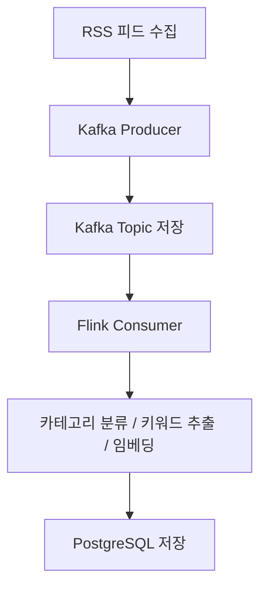
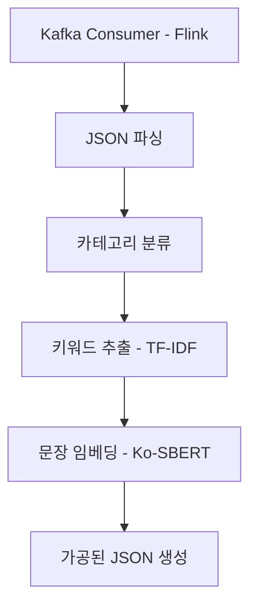
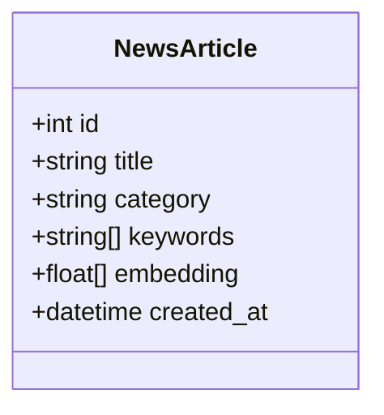
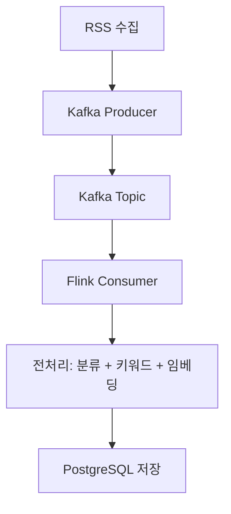
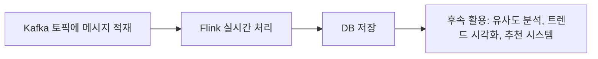

📡 스트리밍 데이터 파이프라인 구축: Kafka + Flink
===================================
**Abstract**

최근 뉴스, 금융, 사용자 로그 등 다양한 분야에서 실시간 데이터 처리의 수요가 급증하고 있다. 본 프로젝트는 실시간 뉴스 데이터를 효율적으로 수집, 처리, 저장하기 위한 데이터 파이프라인을 Apache Kafka와 Apache Flink를 활용하여 설계 및 구현하였다. Python 기반의 Kafka Producer는 뉴스 RSS 피드로부터 수집한 데이터를 Kafka의 토픽에 전송하며, Flink Consumer는 이 스트리밍 데이터를 실시간으로 소비하여 기사 분류, 핵심 키워드 추출, Ko-SBERT 기반 문장 임베딩 등의 전처리 과정을 수행한다. 처리된 데이터는 PostgreSQL 데이터베이스에 구조화된 형태로 저장되며, 향후 기사 유사도 분석, 트렌드 탐지, 추천 시스템 등 고급 분석에 활용 가능하도록 설계되었다. 본 프로젝트는 실시간 데이터의 생성부터 분석, 저장까지의 전 과정을 통합적으로 경험하며, 스트리밍 처리 환경에서의 기술적 확장성과 분석 활용 가능성을 동시에 입증한다.

<br>

1\. 개요 및 프로젝트의 의미
-----------------

데이터는 이제 더 이상 단순히 저장되고 가공되는 대상이 아니다. 우리가 살아가는 오늘날의 디지털 환경에서는 \*\*"데이터가 생성되는 즉시 처리하고 반응하는 능력"\*\*이 기업과 사회의 경쟁력을 결정짓는 요소가 되고 있다. 특히 뉴스, 금융 거래, 센서 데이터, 사용자 로그 등 **실시간으로 변화하는 데이터**는 더욱 중요하다. 이러한 데이터를 기존의 정적 방식이 아닌, **스트리밍 기반 처리 방식**으로 다루는 것이 현대 데이터 시스템에서 요구되고 있다.

이 프로젝트는 이러한 배경 아래, **Kafka**와 **Flink**라는 도구를 활용해 **실시간 데이터 수집 → 처리 → 저장**의 전 과정을 경험해보는 실습 중심의 프로젝트이다.

<br>

🎯 2. 프로젝트 목표
-------------

### 📌 2.1 실시간 데이터 파이프라인 구축

가장 핵심적인 목표는 실시간 스트리밍 데이터를 수집하고, 이를 분석 및 처리한 후 데이터베이스에 저장하는 일련의 과정을 하나의 \*\*통합된 파이프라인(Pipeline)\*\*으로 구축하는 것이다.

이 과정은 세 가지 주요 단계를 포함한다:

1.  **데이터 수집**: 외부에서 주기적으로 발생하는 데이터를 받아오기
    
2.  **데이터 처리**: 수집된 데이터를 분류하고 의미 있는 정보로 가공하기
    
3.  **데이터 저장**: 처리된 데이터를 향후 분석에 활용할 수 있도록 DB에 적재하기
    

### ⚙️ 2.2 Kafka + Flink 기술 체험

본 프로젝트는 그동안 이론적으로 접해왔던 Kafka와 Flink를 실제로 구현해보는 실습의 성격을 가진다.

*   **Kafka**: 데이터의 생산자(Producer)와 소비자(Consumer)를 분리하여 실시간 데이터 흐름을 안정적으로 전달해주는 분산 메시지 큐 시스템이다.
    
*   **Flink**: 수집된 데이터를 스트리밍 방식으로 처리할 수 있게 해주는 실시간 데이터 처리 엔진이다.
    

이 둘을 연동함으로써, **분산 환경에서 안정적이면서도 실시간 대응이 가능한 데이터 흐름 관리 시스템**을 직접 구성해볼 수 있다.

### 🔄 2.3 이전 프로젝트와의 연속성 확보

이전 주차에 수행한 RSS 기반 뉴스 수집 및 DB 연동 프로젝트에서 수집한 데이터를 이번 프로젝트에서도 **재활용**함으로써, 단절된 실습이 아닌 **연속된 데이터 생애주기(Lifecycle)를 구성**하게 된다.

이러한 연결 구조를 통해, **데이터가 어떻게 수집되어 활용되고, 분석을 통해 가치를 창출하며, 다시 시스템에 반영되는지**를 실제로 체감할 수 있다.

### 📚 2.4 학습 목표 요약
---------------

| 항목 | 세부 내용 |
| --- | --- |
| ✅ 실시간 처리 이해 | Kafka와 Flink를 이용한 실시간 데이터 흐름 구성 |
| ✅ 데이터 전처리 | 키워드 추출, 카테고리 분류, 문장 임베딩 실습 |
| ✅ 데이터베이스 연동 | PostgreSQL과 연동하여 구조화된 형태로 데이터 저장 |
| ✅ 고급 분석 기반 마련 | 기사 유사도 분석 등 추가 활용 가능성 고려 |

<br>
<br>

🛠️ 3. 사전 준비사항 및 기술 스택
======================

3.1 📦 사용 데이터
-------------

### 📰 뉴스 RSS 피드

이 프로젝트에서 다루는 데이터는 **뉴스 기사**다.  
우리는 이전 주차에서 `feedparser` 라이브러리를 통해 **뉴스 사이트의 RSS 피드**를 가져오는 경험을 했고, 해당 데이터를 PostgreSQL에 저장해봤다. 이번 프로젝트에서도 이 데이터를 그대로 사용하되, **"실시간"으로 수집하여 전송**한다는 점이 다르다.

> ✅ **RSS 피드란?**  
> RSS(Really Simple Syndication)는 뉴스 사이트, 블로그 등에서 새 글이 올라올 때 이를 **자동으로 배포**할 수 있도록 만든 XML 기반 데이터 포맷이다.

### 🗄 PostgreSQL 데이터베이스

수집한 데이터를 구조화된 형태로 저장하고, 나중에 조회하거나 분석에 사용할 수 있도록 하는 **관계형 데이터베이스**다.

*   **이전 주차 DB 구조를 그대로 활용 가능**
    
*   테이블에 새로운 컬럼(예: 키워드, 임베딩)을 추가하여 확장
    

3.2 💻 개발 환경 및 기술 스택
--------------------

이 프로젝트는 다양한 기술이 모여 하나의 파이프라인을 구성한다. 각 도구의 역할을 명확히 이해하면 흐름을 잡기 쉬워진다.

| 도구 | 역할 및 설명 |
| --- | --- |
| **Python** | 전체 로직 구현의 중심 언어. Kafka Producer와 Flink Consumer를 작성하는 데 사용 |
| **Kafka** | 데이터 송수신을 위한 메시지 큐 시스템. **Producer → Topic → Consumer** 구조로 실시간 데이터 전달 |
| **Flink** | Kafka로부터 데이터를 받아 실시간으로 처리하는 스트리밍 엔진. 키워드 추출, 카테고리 분류, 임베딩 등의 로직 수행 |
| **PostgreSQL** | 최종 처리된 데이터를 저장할 관계형 데이터베이스. 향후 쿼리나 분석, 대시보드 등에 활용 가능 |
| **feedparser** | RSS 피드를 쉽게 파싱하고 구조화된 데이터로 변환해주는 파이썬 라이브러리 |
| **BeautifulSoup** | 뉴스 기사 본문 및 기자명 등 HTML 요소를 크롤링할 때 사용 |
| **Requests** | 웹페이지에 HTTP 요청을 보내고 응답 데이터를 받아오는 역할 |


🧠 보충 설명: Kafka와 Flink의 차이점
---------------------------

> Kafka는 **데이터를 전달**하는 역할,  
> Flink는 **데이터를 처리**하는 역할이다.

| 항목 | Kafka | Flink |
| --- | --- | --- |
| 목적 | 메시지를 송수신하고, 로그처럼 저장 | 실시간으로 데이터를 처리 (필터링, 집계 등) |
| 상태 유지 | 없음 (단순히 데이터 전달) | 상태 저장 및 체크포인트 기능 제공 |
| 스토리지 | 내부 Topic에 데이터 저장 | 외부에서 저장소(DB 등)에 저장해야 함 |

<br>
<br>

🧩 4. 구현 구성도
============

4.1 전체 흐름 개요
------------

이번 프로젝트는 데이터를 수집하고 처리하고 저장하는 과정을 **Kafka와 Flink**를 중심으로 이어주는 파이프라인 구조를 갖는다. 전체 흐름을 단순화하면 다음과 같다:

```
RSS 피드 → Kafka Producer → Kafka Topic → Flink Consumer → 전처리/분석 → PostgreSQL 저장
```

4.2 시각화: 데이터 파이프라인 구성도
----------------------



이 다이어그램은 실제 시스템의 \*\*흐름(Flow)\*\*을 보여준다. 각 단계가 어떤 작업을 담당하는지 아래에서 구체적으로 설명할게.

* * *

4.3 구성 요소 설명
------------

### 📥 A. RSS 피드 수집

*   뉴스 사이트의 RSS 주소를 feedparser로 읽어옴
    
*   각 뉴스 아이템(제목, 본문 URL, 발행일 등)을 **데이터 객체로 변환**
    
*   Kafka Producer에 전달할 수 있는 형식으로 정리됨
    

### 🚀 B. Kafka Producer

*   위에서 수집한 뉴스 데이터를 Kafka에 보내는 역할
    
*   **Kafka의 특정 토픽(topic)에 데이터를 전송**
    
*   실시간 스트리밍 처리의 시작점
    

> 이 단계까지가 "데이터 수집" 파트이며, 이후부터는 Flink가 소비자로서 데이터를 받아 처리하게 된다.

### 📦 C. Kafka Topic 저장

*   Kafka 내부에서 메시지가 저장되는 공간
    
*   **생산자(Producer)와 소비자(Consumer)를 분리**시켜주는 핵심 구조
    
*   데이터를 일시적으로 보관하며 소비자의 연결을 기다림
    

> 예: `news_rss_topic`이라는 이름의 토픽을 생성해서 여기에 뉴스 기사들을 적재

### ⚙️ D. Flink Consumer

*   Kafka의 특정 토픽으로부터 메시지를 읽어들임
    
*   \*\*실시간 처리(Stream Processing)\*\*을 수행할 준비 단계
    
*   메시지를 한 줄씩 읽어오며 처리 로직을 수행함
    

### 🧠 E. 전처리 및 분석

Flink 내에서 실행되는 데이터 처리 로직:

*   **카테고리 분류**: 뉴스의 제목이나 본문에 따라 "경제", "사회", "정치" 등으로 분류
    
*   **키워드 추출**: TF-IDF 기반 또는 규칙 기반으로 주요 키워드를 추출
    
*   **임베딩 처리**: Ko-SBERT 등 모델을 활용하여 본문을 벡터화 (유사도 분석 등을 위한 기반 데이터)
    

### 🗄️ F. PostgreSQL 저장

*   처리된 결과를 데이터베이스에 저장
    
*   JSON 형태로 키워드 및 임베딩 벡터를 포함
    
*   이후 분석, 시각화, 유사도 계산 등에 재사용 가능
    

4.4 구성 흐름 요약표
-------------

| 단계 | 구성 요소 | 핵심 역할 |
| --- | --- | --- |
| 1 | RSS 수집 | 뉴스 데이터 수집 및 구조화 |
| 2 | Kafka Producer | Kafka에 메시지 전송 |
| 3 | Kafka Topic | 메시지 버퍼링 및 큐 역할 |
| 4 | Flink Consumer | 실시간 데이터 소비 및 처리 |
| 5 | 전처리 | 분류, 키워드 추출, 임베딩 수행 |
| 6 | PostgreSQL 저장 | 결과 데이터를 저장 및 재사용 |

<br>
<br>

🚀 5. 구현 단계
===========

🧩 5.1 전체 흐름
------------

```text
1. Kafka Producer로 데이터 수집 → 2. Kafka Topic에 적재 → 
2. Flink Consumer로 실시간 처리 → 4. 전처리(분류, 키워드, 임베딩) → 
3. PostgreSQL 저장
```

이 단계는 총 세 개의 핵심 파트로 나눌 수 있어:


📥 5.2 \[1단계\] 데이터 수집 및 Kafka Producer 구현
-----------------------------------------


### ✅ 목표

*   RSS 피드에서 실시간으로 뉴스 데이터를 가져와
    
*   Kafka의 특정 토픽(topic)에 데이터를 전송
    

### ✅ 주요 기능

*   `feedparser`를 통해 RSS 피드 읽기
    
*   기사 본문(URL 기준)을 `requests`, `BeautifulSoup`으로 크롤링
    
*   Kafka Producer를 사용하여 기사 데이터를 JSON 형태로 전송
    

### ✅ 출력 예시 (Kafka 메시지 형태)

```json
{
  "title": "한국 증시 강세…코스피 2600선 회복",
  "link": "https://www.mk.co.kr/news/economy/12345678",
  "pubDate": "2025-04-18T09:00:00",
  "category": "경제",
  "content": "한국 증시가 강세를 보이며 코스피가 2600선을 회복했다...",
  "reporter": "홍길동 기자"
}
```


⚙️ 5.3 \[2단계\] Flink를 통한 실시간 스트리밍 처리
------------------------------------


### ✅ 목표

*   Kafka Topic으로부터 메시지를 실시간으로 읽어들이고
    
*   데이터 전처리 후 저장 가능 상태로 변환
    

### ✅ 수행 작업

*   Flink Kafka Consumer 연결 설정
    
*   데이터 구조(JSON)를 파싱
    
*   본문 기반으로 **카테고리 분류**, **핵심 키워드 추출**
    
*   **Ko-SBERT 임베딩 모델**을 통해 문장 벡터화 수행
    

### ✅ 출력 예시 (가공된 데이터 구조)

```json
{
  "title": "한국 증시 강세…코스피 2600선 회복",
  "category": "경제",
  "keywords": ["증시", "코스피", "강세", "2600선"],
  "embedding": [0.12, -0.43, ..., 0.57]  // 약 384차원 벡터
}
```


🗄 5.4 \[3단계\] PostgreSQL DB 저장
-------------------------------


### ✅ 목표

*   가공된 데이터를 영속적으로 저장하여 추후 분석 가능하게 함
    

### ✅ 수행 작업

*   DB 연결 정보 설정 (환경 변수로 관리)
    
*   INSERT 쿼리를 통해 결과 적재
    
*   기존 테이블에 `keywords`, `embedding` 컬럼 추가
    

### ✅ 저장 구조 예시

| id | title | category | keywords | embedding | created\_at |
| --- | --- | --- | --- | --- | --- |
| 1 | 한국 증시... | 경제 | `["증시", "코스피"...]` | `[0.12, -0.43, ...]` | 2025-04-18 |


🎓 정리: 단계별 책임
-------------

| 단계 | 책임 주체 | 도구 | 핵심 로직 |
| --- | --- | --- | --- |
| 1단계 | Producer | Python + Kafka | RSS 수집, 본문 크롤링, 메시지 전송 |
| 2단계 | Consumer | Flink (PyFlink) | 데이터 파싱, 분류, 키워드, 임베딩 |
| 3단계 | DB Writer | Python (JDBC 또는 psycopg2) | PostgreSQL 저장 |

<br>
<br>

✅ 6. 요구 사항 정리
=============

6.1 파이프라인 구조
------------

### 📌 요구 사항

*   Kafka와 Flink를 활용한 **실시간 데이터 파이프라인 구성**
    
*   수집한 데이터를 Kafka에 전송하고, Flink가 이를 소비하여 분석 및 저장
    

### 📌 핵심 이유

*   Kafka는 **데이터 흐름의 비동기성과 확장성**을 제공
    
*   Flink는 **스트리밍 환경에서의 고속/고정밀 처리**를 가능하게 함
    

> 단순한 수집이 아니라, **수집 이후의 자동 분석과 적재까지** 포함되는 통합 파이프라인을 구축하는 것이 본 과제의 핵심이다.


6.2 데이터 흐름
----------

### 📌 요구 사항

*   뉴스 RSS → Kafka Producer → Kafka Topic → Flink Consumer → PostgreSQL


    

### 📌 핵심 이유

*   각 단계가 분리되어 있어 유연성과 재사용성이 높아짐
    
*   예외나 오류 상황에서도 **데이터 유실을 최소화**할 수 있는 구조
    

> 예를 들어, Kafka 토픽에 한 번 쌓인 데이터는 Flink가 일시적으로 중지되더라도 보존된다. 이는 "내결함성(fault tolerance)"을 구현하는 데 매우 중요하다.


6.3 전처리 로직 포함
-------------

### 📌 요구 사항

*   Flink Consumer 내에서 다음의 전처리 로직 수행:
    
    *   카테고리 분류
        
    *   키워드 추출
        
    *   문장 임베딩 처리
        

### 📌 핵심 이유

*   단순히 데이터를 저장하는 것이 아니라, **의미 있는 정보로 가공**하여 저장
    
*   저장된 데이터를 활용한 **유사도 비교, 클러스터링, 검색 엔진 구축 등** 다양한 확장 가능성 확보
    

> 이 과정은 AI 및 NLP 기술과의 연계를 위한 전초 작업이기도 하다.


6.4 DB 저장 조건
------------

### 📌 요구 사항

*   PostgreSQL에 다음 정보가 포함된 형태로 저장:
    
    *   제목, 본문, 카테고리
        
    *   키워드: `TEXT[]` 또는 `JSON` 형식
        
    *   임베딩: `FLOAT[]` 또는 `JSON` 형식
        

### 📌 핵심 이유

*   분석 가능한 형태로 데이터를 정규화해서 저장해야
    
*   추후 유사도 계산 등 **고급 분석 로직에 활용** 가능
    
*   JSON이나 배열 구조를 저장함으로써 NoSQL적 유연성도 일부 확보
    


6.5 요구사항 요약 표
-------------

| 구분 | 요구 내용 | 상세 설명 |
| --- | --- | --- |
| 파이프라인 구조 | Kafka → Flink → DB | 실시간 처리 파이프라인 전체 구현 |
| 데이터 흐름 | RSS → Producer → Topic → Consumer → DB | 각 단계별 명확한 연결 구조 |
| 전처리 포함 | 카테고리/키워드/임베딩 | Flink에서 실시간 전처리 수행 |
| DB 저장 조건 | 본문 + 키워드 + 임베딩 저장 | PostgreSQL에 JSON 또는 배열 형태로 저장 |


✅ 정리
----

이 요구사항들은 단순히 개발자의 입장에서 필요한 항목들이 아니라, **데이터가 생성된 순간부터 가치 있는 정보로 재탄생되기까지의 여정을 실현하는 설계 기준**이다.  
모든 구성요소는 이 흐름을 완성시키기 위해 상호 연결되어 있으며, **비즈니스 분석, 검색, 추천 시스템, 자동 분류 등**의 확장 방향을 고려한 설계로 이해되어야 한다.

<br>
<br>

📌 7. 기대 결과
===========


7.1 Kafka 토픽에 실시간 뉴스 데이터 적재
---------------------------

### ✅ 설명

*   RSS 피드에서 크롤링된 뉴스 기사가 Kafka Producer를 통해 **지속적으로 Kafka Topic에 전송됨**
    
*   Kafka 내부의 Topic(`news_rss_topic` 등)에 쌓인 데이터는 Consumer가 읽을 때까지 **일시 저장된 상태**로 존재
    

### ✅ 확인 방법

*   Kafka CLI 명령어나 Kafka Manager UI를 통해 토픽 상태를 확인할 수 있음
    
*   특정 Topic에 메시지가 **초당 몇 건씩 생산/소비되고 있는지**를 지표로 모니터링 가능
    

```bash
$ kafka-console-consumer.sh --bootstrap-server localhost:9092 --topic news_rss_topic --from-beginning
```


7.2 Flink 환경에서의 실시간 처리 로그 확인
----------------------------

### ✅ 설명

*   Flink Consumer가 Kafka 토픽을 구독하여 **실시간으로 기사 데이터를 읽고 처리**
    
*   각 기사는 Flink 내에서 전처리 과정을 거쳐 가공되며, 다음과 같은 작업들이 실시간으로 수행됨:
    
    *   본문 분석 → 카테고리 분류
        
    *   핵심 키워드 추출
        
    *   Ko-SBERT 기반 문장 임베딩
        

### ✅ 확인 방법

*   Flink 웹 UI (보통 `http://localhost:8081`)에서 Job 상태 확인
    
*   각 Task별 Throughput, Latency, Checkpoint 수행 여부 등 실시간 지표 확인 가능
    

```text
Flink Job: "Stream Processing of RSS News"
→ Source: Kafka Source
→ Operators: map → flatMap → filter → sink
```


7.3 PostgreSQL 테이블에 실시간 적재되는 데이터
--------------------------------

### ✅ 설명

*   최종적으로 처리된 뉴스 기사는 PostgreSQL의 `news_article` 테이블에 저장됨
    
*   이 테이블에는 기존에 저장하던 `title`, `content`, `date` 외에도 다음과 같은 필드가 추가되어 있음:
    
    *   `category`: 기사 분류 결과
        
    *   `keywords`: 기사 핵심 키워드 리스트
        
    *   `embedding`: 기사 내용 임베딩 벡터(JSON)
        

### ✅ 확인 방법

```sql
SELECT title, category, keywords, embedding
FROM news_article
ORDER BY created_at DESC
LIMIT 5;
```

### ✅ 예시 결과

| title | category | keywords | embedding |
| --- | --- | --- | --- |
| 한국 증시 강세... | 경제 | \["증시", "코스피", "강세"\] | \[0.12, -0.43, ..., 0.57\] |


7.4 확장 가능성 및 활용 방향
------------------

이 파이프라인은 단순한 실습을 넘어서 다양한 분석 기반으로 확장할 수 있는 기초 토대가 된다:

| 활용 사례 | 설명 |
| --- | --- |
| 🧠 기사 유사도 분석 | 두 기사 간 임베딩 벡터의 코사인 유사도를 통해 주제 유사성 분석 |
| 🔍 검색 최적화 | 키워드 및 카테고리를 기준으로 고속 검색 인덱스 생성 가능 |
| 🧭 자동 뉴스 분류 | ML/DL 기반 자동 라벨링 및 기사 추천 시스템 구축 |
| 📊 대시보드 시각화 | 실시간 키워드 트렌드, 카테고리별 뉴스 분포 등을 시각화 도구로 표현 |


🎯 정리
-----

이 프로젝트는 단순한 수집/저장 시스템이 아니라, **실시간 데이터 흐름을 분석 가능한 구조로 전환**하고, 이를 **다양한 고급 분석 및 비즈니스 응용**으로 이어갈 수 있는 구조를 경험하는 실습이다.

Kafka와 Flink를 연동해보며 데이터가 흘러가는 과정을 직접 구성해보고,  
"**데이터 파이프라인이란 실제로 어떻게 움직이고 어떤 역할을 하는가?**"에 대해 깊이 체험해볼 수 있었다면 이 수업의 목표는 성공적으로 달성된 것이다.

