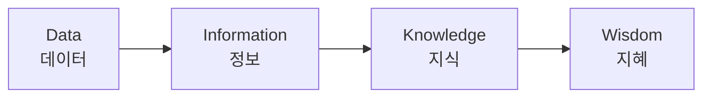
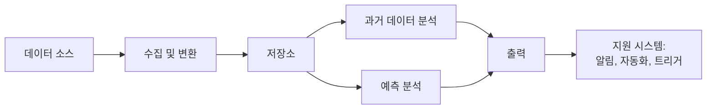
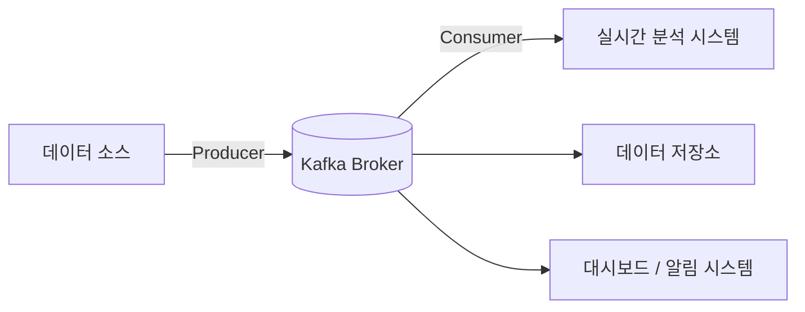
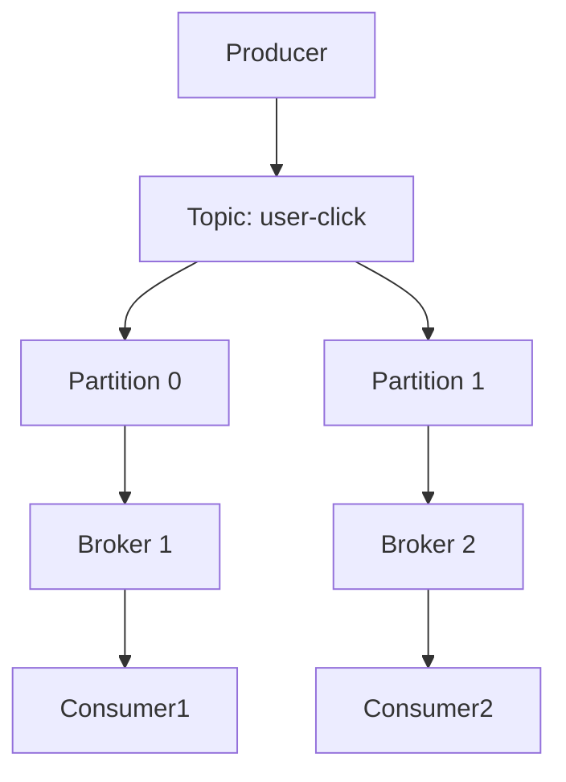
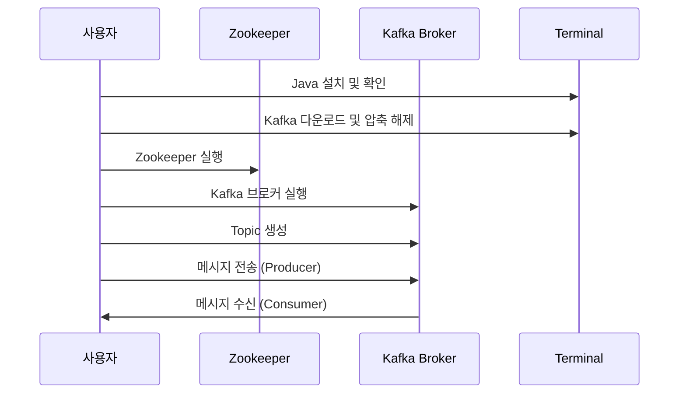

데이터 파이프라인 Kafka 설치
===================================
**Abstract**      
현대 사회는 데이터가 산업, 기술, 사회 전반의 의사결정과 가치 창출을 이끄는 핵심 자원으로 작용하는 "데이터 중심 시대"에 진입하였다. 본 문서에서는 데이터의 개념과 중요성을 시작으로, 방대한 데이터를 수집, 가공, 분석하여 활용 가능한 정보로 전환하는 과정인 데이터 파이프라인의 구조를 체계적으로 고찰한다. 특히 실시간 데이터 처리에 적합한 분산 메시징 시스템인 **Apache Kafka**의 등장 배경과 필요성, 그리고 내부 아키텍처에 주목하였다. Kafka는 대용량의 스트리밍 데이터를 안정적이고 효율적으로 전달하기 위한 플랫폼으로, 토픽(Topic), 파티션(Partition), 프로듀서(Producer), 컨슈머(Consumer), 브로커(Broker) 등의 핵심 요소로 구성되어 있다. 본 자료에서는 Kafka의 구조적 특징과 메시지 처리 방식, 장애 복구 메커니즘 등을 이론적으로 분석하고, 실습을 통해 실제 환경에서의 설치 및 기본 메시지 송수신 과정을 단계별로 설명하였다. 이를 통해 비전공자도 실시간 데이터 흐름의 전체 구조를 이해하고 Kafka 기반의 데이터 파이프라인을 설계 및 운영할 수 있는 기초 역량을 확보할 수 있도록 하였다.

<br>

🧩 Part 1. 정보와 데이터의 차이 – “정보는 해석된 데이터다”
=======================================



1\. 데이터(Data)란 무엇인가?
--------------------

데이터란 관측되거나 측정된 사실의 **가공되지 않은 원초적인 형태**를 말한다. 숫자, 문자, 이미지, 로그 등 **해석이 가해지지 않은 상태의 값들**이 모두 데이터다.  
예를 들어 다음과 같은 것들이다:

*   `2024.05.01`, `홍길동`, `1,000,000`, `서울`
    
*   서버의 접속 로그: `172.16.254.1 - - [01/May/2024:12:34:56] "GET /index.html HTTP/1.1" 200 1024`
    

이 자체로는 어떤 의미를 담고 있는지 알기 어렵고, **그저 존재하는 사실(fact)** 로 남아 있다.

<br>

2\. 정보(Information)란 무엇인가?
--------------------------

정보는 이러한 데이터를 **사람 혹은 시스템이 해석하여 의미를 부여한 것**이다.  
데이터를 목적에 맞게 가공하고, 상황과 맥락을 더해 **이해할 수 있는 형태로 만든 결과물**을 말한다.

예시:

*   `홍길동`이 `2024년 5월 1일`, `서울`에서 `1,000,000원`을 결제했다 → 이건 거래 내역이라는 `정보`가 된다.
    
*   위의 접속 로그들을 시간대별로 분석해서, 사용자가 **하루 평균 10번 접속하고, 주로 오전에 많이 활동한다**는 패턴을 뽑아낸다면 그것은 ‘정보’다.
    

<br>

3\. 지식(Knowledge)과 지혜(Wisdom)는 또 다른 차원
--------------------------------------

이를 한 단계 더 확장하면 **DIKW 피라미드**라고 불리는 구조로 설명할 수 있다:

> **D**ata → **I**nformation → **K**nowledge → **W**isdom

*   **Data**: 가공되지 않은 숫자, 텍스트, 로그 등
    
*   **Information**: 분석과 맥락을 더해 의미를 부여
    
*   **Knowledge**: 여러 정보를 종합해 개념/원리를 이해
    
*   **Wisdom**: 실제 문제 해결을 위한 통찰력으로 전환
    

이 구조는 우리가 데이터 기반의 판단을 내릴 때 어떤 단계로 사고가 이루어지는지를 잘 보여준다.

<br>

4\. 정형 데이터 vs 비정형 데이터
---------------------

데이터의 유형은 형태에 따라 나뉜다:

| 구분 | 설명 | 예시 |
| --- | --- | --- |
| **정형 데이터** | 구조화된 형태, 테이블에 들어갈 수 있음 | 엑셀 시트, DB 테이블, 고객명부 등 |
| **비정형 데이터** | 형태가 일정하지 않음, 자유로운 구조 | 텍스트, 이메일, 로그, 음성, 이미지 등 |

이 구분은 향후 데이터 수집, 저장, 분석 방법을 결정하는 데 있어 중요한 기준이 된다.

<br>

5\. 왜 이 구분이 중요한가?
-----------------

데이터를 다루는 입장에서는 이 차이를 명확히 이해해야 한다.  
이유는 다음과 같다:

*   **분석의 대상이 되는 것은 데이터가 아니라 정보**다.  
    데이터는 해석 전 단계일 뿐, 의미 있는 의사결정에는 정보를 만들어야 한다.
    
*   **데이터의 성격에 따라 사용하는 도구와 기술이 다르다.**  
    정형 데이터는 SQL 기반의 DB로 분석할 수 있지만, 비정형 데이터는 NLP, OCR, 이미지 분석 등이 필요하다.
    
*   **AI/ML 모델 학습에도 정보의 정제 수준이 성능을 좌우**한다.  
    가공되지 않은 데이터는 학습에 쓸 수 없고, 의미 있는 정보로 전처리하는 과정이 필요하다.
    

<br>

6\. 실무 예시: 로그 데이터에서 고객 행동 정보 도출
-------------------------------

```text
[로그 데이터] 2025-04-01 08:32:15 user123 접속
[로그 데이터] 2025-04-01 08:33:00 user123 상품A 클릭
[로그 데이터] 2025-04-01 08:34:45 user123 장바구니 담기
```

이 데이터를 단순히 수집하면 ‘로그 데이터’지만,  
이를 다음과 같이 분석하면 정보가 된다:

> user123은 아침 시간대에 상품A에 관심이 높고, 구매 전 장바구니를 선호하는 패턴을 보임.

이러한 정보는 마케팅 전략, UI 배치, 추천 시스템 등에 활용될 수 있다.

<br>
<br>


🌍 Part 2. 데이터의 중요성 – 왜 데이터가 핵심 자원이 되었는가?
=========================================


1\. 데이터는 ‘21세기의 원유’이다
---------------------

세계 최대 경제지인 <The Economist>는 2017년 커버 기사에서 “**Data is the new oil**”이라는 말을 남겼다.  
이 표현은 단순한 수사가 아니다. 데이터를 잘 활용하는 기업들이 산업을 선도하고, 그렇지 못한 기업은 도태되는 시대가 도래했기 때문이다.

**과거:** 생산설비, 자본, 노동력이 경쟁력  
**현재:** 데이터를 기반으로 한 통찰력, 자동화, 개인화가 경쟁력

<br>

2\. 왜 데이터가 중요해졌는가? (배경 요인 4가지)
------------------------------

### ① 디지털 전환 (Digital Transformation)의 가속화

*   오프라인 기반의 활동이 디지털 플랫폼으로 이동하면서, **사람과 시스템이 남기는 데이터의 양이 기하급수적으로 증가**
    
*   문서, 회의, 계약, 마케팅, 결제 등 모든 활동이 디지털로 기록됨
    

→ **“기록되지 않은 것은 존재하지 않는 것”이 되었다**

<br>

### ② 사물인터넷(IoT)과 센서의 대중화

*   냉장고, 자동차, 시계, 공장 설비 등 **모든 것이 데이터를 생성**
    
*   특히 산업 현장에서는 장비 상태, 온도, 진동 등 **실시간 모니터링을 통한 유지보수와 품질 향상** 가능
    

→ 이제 데이터는 단순 기록이 아니라 **현실을 실시간으로 반영하는 거울**이 되었다

<br>

### ③ 인공지능(AI)과 머신러닝(ML)의 핵심 연료

*   AI는 **‘패턴을 학습하는 기술’** 이고, 패턴을 만들려면 **데이터가 반드시 필요**
    
*   데이터가 충분하지 않으면 AI는 의미 있는 예측을 할 수 없다
    

> 예: 챗봇이 자연스럽게 말하려면 수백만 문장의 대화 데이터를 학습해야 함  
> 예: 자율주행차는 수천 시간의 도로 주행 데이터 없이는 위험

<br>

### ④ 맞춤형 서비스의 필요성

*   소비자는 **모두에게 똑같은 메시지**가 아니라, **나에게 꼭 맞는 추천, 광고, 콘텐츠**를 원함
    
*   이를 위해서는 고객의 행동/선호 데이터를 수집·분석해서 **퍼스널라이징**이 필수
    

> 유튜브, 넷플릭스, 쿠팡의 ‘추천 알고리즘’은 모두 데이터 기반

<br>

3\. 데이터는 어디에 활용되는가?
-------------------

| 분야 | 데이터의 활용 예시 |
| --- | --- |
| **비즈니스** | 고객 세분화, 구매 예측, 마케팅 전략 최적화 |
| **제조업** | 불량 예측, 설비 유지보수(Predictive Maintenance), 생산 최적화 |
| **의료** | 진단 보조, 치료 예측, 유전자 분석 |
| **금융** | 신용 평가, 이상 거래 탐지, 알고리즘 투자 |
| **공공기관** | 도시 교통 흐름 분석, 감염병 확산 예측, 정책 효과 분석 |
| **교육** | 학습 패턴 분석, 맞춤형 학습 경로 추천 |

<br>

4\. 실무 사례: 넷플릭스의 추천 시스템
-----------------------

넷플릭스는 사용자가 시청한 콘텐츠, 시청 시간, 일시정지 여부, 검색 기록 등 **세세한 행동 데이터를 분석**한다.  
이를 기반으로 각 사용자에게 가장 적합한 콘텐츠를 추천한다.  
이 시스템은 단순한 재미를 넘어서, 다음과 같은 **비즈니스 가치**를 만든다:

*   고객 이탈 방지 (re-subscription 증가)
    
*   신규 콘텐츠 투자 결정
    
*   시간대별 트래픽 최적화
    

> 실제로 넷플릭스는 **전체 트래픽의 80% 이상이 추천 시스템을 통해 소비**되는 것으로 알려져 있다.

<br>

5\. 그래서, 왜 지금 우리가 데이터 파이프라인을 배우는가?
----------------------------------

데이터는 많아졌지만, **제대로 수집하고, 정제하고, 분석해서 가치를 끌어내는 능력은 부족**하다.  
그리고 그 연결고리의 중심이 바로 **데이터 파이프라인**이다.

*   데이터를 단순히 모으는 것이 아니라, **의미 있는 정보로 변환**해야 한다
    
*   이 전환 과정이 없으면, **데이터는 무용지물**이 된다
    
*   그리고 그 과정을 실시간으로 자동화하기 위해 **Kafka 같은 기술이 사용된다**
    

<br>
<br>


🔁 Part 3. 데이터 파이프라인 개요 – 데이터는 어떻게 흘러가는가?
=========================================



1\. 데이터 파이프라인이란?
----------------

데이터 파이프라인(Data Pipeline)이란, 데이터를 **수집 → 전처리 → 저장 → 분석/활용**하는 모든 과정을 자동으로 이어주는 **데이터 처리 흐름의 경로**를 말한다.  
쉽게 말해, “데이터가 수영장에서 수도꼭지를 거쳐 정수기, 냉장고까지 도달하는 배관 시스템” 같은 것이다.

이 흐름은 단순히 데이터를 옮기는 것뿐만 아니라, **필터링, 변환, 분류, 집계** 등 실질적인 가공까지 포함한다.

<br>

2\. 데이터 파이프라인이 필요한 이유
---------------------

데이터의 양이 작고, 변화가 없던 시절에는 엑셀로 정리해도 충분했다.  
하지만 오늘날 데이터는 다음과 같은 특징을 가진다:

*   **규모가 크다 (Volume)**
    
*   **계속 생성된다 (Velocity)**
    
*   **형태가 다양하다 (Variety)**
    
*   **의미를 찾기 어렵다 (Veracity)**
    

이러한 데이터에서 가치를 얻으려면 사람이 직접 처리하기에는 한계가 있고, **자동화된 흐름(pipeline)이 반드시 필요**하다.

<br>

3\. 데이터 파이프라인의 전체 구조
--------------------

데이터 파이프라인은 아래의 6단계로 구성된다. 각 단계는 서로 유기적으로 연결되어 있다.


### ① 데이터 소스 (Data Source)

데이터가 처음 생성되는 곳이다. 다음과 같은 다양한 형태가 있다:

*   **웹 로그** (웹사이트 접속 기록)
    
*   **IoT 센서 데이터** (온도, 위치, 속도 등)
    
*   **모바일 앱 사용 기록**
    
*   **DB / ERP 시스템**
    
*   **SNS API, 뉴스 RSS 피드**
    

이처럼 소스는 기업의 운영 환경에 따라 매우 다양하며, 정형·비정형 데이터 모두 포함된다.

<br>

### ② 데이터 수집 및 변환 (Ingestion & Transformation)

수집(Ingestion)은 데이터를 소스로부터 **실시간 또는 일괄적으로 가져오는 과정**이다.  
변환(Transformation)은 수집한 데이터를 **정제하고 구조화하여 분석 가능한 형태로 바꾸는 과정**이다.

> 예:
> 
> *   센서 온도값 중 null 값 제거
>     
> *   시간 형식 통일 (2024/04/01 → 2024-04-01)
>     
> *   텍스트에서 불필요한 HTML 태그 제거
>     

이 과정은 **ETL (Extract, Transform, Load)** 또는 **ELT (Extract, Load, Transform)** 방식으로 수행된다.  
Kafka는 여기서 **스트리밍 기반 수집 및 전달 역할**을 맡는다 (이후 설명).

<br>

### ③ 데이터 저장 (Storage)

정제된 데이터를 보관하는 장소이다. 저장소는 목적에 따라 구분된다:

*   **관계형 데이터베이스 (PostgreSQL, MySQL 등)**
    
*   **데이터 웨어하우스 (BigQuery, Redshift 등)**
    
*   **데이터 레이크 (Hadoop HDFS, Amazon S3 등)**
    

데이터 저장소는 단순 저장소가 아니라, 분석 툴과 연계되는 **데이터의 허브** 역할을 한다.

<br>

### ④ 과거 데이터 분석 (Descriptive Analytics)

저장된 데이터를 조회하고 통계 분석하는 단계이다.  
주로 사용되는 분석 방식은 다음과 같다:

*   **집계 (Aggregation):** 일별, 주별 매출 합계
    
*   **분류 (Segmentation):** 고객 군집화
    
*   **시각화 (Visualization):** Tableau, Power BI 등의 도구 활용
    

이 분석은 과거에 어떤 일이 있었는지를 보여주며, 의사결정의 기반이 된다.

<br>

### ⑤ 예측 분석 (Predictive Analytics)

이전 데이터를 기반으로 **미래를 예측하거나 패턴을 탐지하는 단계**이다.  
여기에는 통계 모델 또는 머신러닝 모델이 사용된다:

*   **수요 예측**
    
*   **이탈 고객 예측**
    
*   **추천 시스템**
    
*   **이상 감지(Anomaly Detection)**
    

데이터 파이프라인은 이 분석이 가능한 수준까지 데이터를 지속적으로 공급해야 한다.

<br>

### ⑥ 출력(Output) 또는 활용(Serving)

분석 결과는 다양한 방식으로 활용된다:

*   **실시간 대시보드 출력**
    
*   **알림 또는 자동화 트리거**
    
*   **보고서 형태로 정리**
    
*   **또 다른 시스템에 전송**
    

중요한 건 이 단계가 **데이터로부터 실제 행동(액션)이 도출되는 구간**이라는 것이다.

<br>

4\. 데이터 파이프라인 설계 시 고려해야 할 점
---------------------------

*   **데이터 품질**: 신뢰할 수 있는 데이터를 지속적으로 유지할 수 있는가?
    
*   **지연 시간 (Latency)**: 실시간으로 전달해야 하는가, 일 단위면 되는가?
    
*   **확장성 (Scalability)**: 데이터량이 10배가 되어도 견딜 수 있는가?
    
*   **복원력 (Fault Tolerance)**: 중간에 장애가 나도 자동으로 복구되는가?
    

<br>

5\. 정리 – Kafka는 어디에 위치하는가?
--------------------------



Kafka는 위 구조 중에서 특히 **데이터 수집(Ingestion)과 전달(Streaming Transport)** 의 중추 역할을 한다.  
정적인 데이터 흐름이 아니라, **실시간으로 생성되는 이벤트**들을 끊김 없이 보내기 위해 Kafka 같은 **스트리밍 기반 메시지 브로커**가 필요해진다.

<br>
<br>


📨 Part 4. 메시징 시스템과 Kafka 개요 – 실시간 데이터 흐름의 중추
=============================================


1\. 메시징 시스템이란 무엇인가?
-------------------

### 정의:

메시징 시스템은 서로 다른 애플리케이션 간에 **데이터를 주고받을 수 있도록 중간에서 메시지를 중계해주는 시스템**이다.  
특징적으로 **비동기 처리**를 기반으로 하고 있으며, **프로듀서(보내는 쪽)** 와 **컨슈머(받는 쪽)** 사이의 결합도를 낮춰준다.

<br>

### 왜 필요한가?

과거에는 시스템 간에 데이터를 직접 주고받는 방식(REST API, 파일 저장 등)을 사용했지만, 아래와 같은 문제들이 있었다:

| 기존 방식의 한계 | 메시징 시스템이 해결하는 방식 |
| --- | --- |
| 송신자와 수신자의 타이밍이 맞아야 함 | 비동기 큐를 두어 타이밍 상관 없이 전송 가능 |
| 시스템 간 강한 결합 | 중간에 메시지 브로커를 둠으로써 느슨한 결합 유지 |
| 장애 발생 시 데이터 손실 위험 | 메시지 저장, 재시도, 복구 기능으로 보완 가능 |

즉, 메시징 시스템은 **유연성, 확장성, 안정성**을 동시에 제공한다.

<br>

2\. Kafka란 무엇인가?
----------------

Kafka는 Apache Software Foundation이 관리하는 **오픈소스 분산 메시징 플랫폼**으로,  
2010년 LinkedIn에서 처음 개발되었다. 이름은 프란츠 카프카(소설가)의 이름에서 따왔다.

<br>

### Kafka의 본질적 목적:

Kafka는 단순 메시지 큐가 아니다.  
Kafka는 **“대규모의 실시간 스트리밍 데이터를 빠르고, 안정적으로 전달하기 위한 분산형 로그 저장소”** 이다.

<br>

### 기존 메시징 시스템과의 차이점

| 항목 | Kafka | 기존 메시징 시스템 (예: RabbitMQ) |
| --- | --- | --- |
| 메시지 보존 방식 | 디스크에 로그로 영구 저장 | 소비되면 삭제되는 큐 기반 |
| 처리 모델 | Pull 기반 (Consumer가 가져감) | Push 기반 (Broker가 보내줌) |
| 처리량 | 수십만 TPS 이상 | 상대적으로 낮음 |
| 확장성 | 브로커와 파티션 단위로 수평 확장 가능 | 복잡하거나 제한적일 수 있음 |
| 사용 목적 | 빅데이터 파이프라인, 스트리밍 처리 | 업무 시스템 간 메시지 전달, 간단한 연동 등 |

<br>

3\. Kafka의 등장 배경 (왜 만들어졌는가?)
----------------------------

### 2009년 – LinkedIn의 문제

LinkedIn은 하루 수억 건에 달하는 사용자 로그, 클릭, 조회, 검색 데이터를 처리해야 했다.  
기존 시스템은 아래와 같은 한계를 가지고 있었다:

*   데이터 수집 도구가 시스템마다 다르다 (ETL 파이프라인의 중복)
    
*   실시간 처리가 어렵다
    
*   대용량 데이터를 효율적으로 **다른 시스템으로 전파하기 어려움**
    

이 문제를 해결하기 위해, “**중앙 집중식 실시간 로그 수집/전송 시스템**”이 필요했고, 그 해답이 Kafka였다.

<br>

### 2010년 – Kafka의 탄생

Kafka는 처음부터 다음을 목표로 설계되었다:

*   **실시간 처리 가능**
    
*   **장애에 강한 구조**
    
*   **다양한 시스템에 동일한 데이터 전송**
    
*   **분산 처리와 수평 확장 가능**
    

그리고 2011년, Kafka는 **Apache 프로젝트로 정식 채택**되면서 누구나 사용할 수 있는 오픈소스로 발전했다.

<br>

4\. Kafka가 데이터 파이프라인에서 맡는 역할
----------------------------

Kafka는 아래의 위치에서 핵심적인 역할을 수행한다:

```text
[데이터 소스] → [Kafka] → [실시간 분석 시스템] 또는 [저장소] 또는 [대시보드]
```

즉, Kafka는 다양한 소스에서 발생한 이벤트 데이터를 **중앙 허브처럼 받아서**,  
필요한 곳으로 **끊김 없이, 실시간으로** 흘려보내주는 **데이터 전송의 허리 역할**을 한다.

<br>

5\. Kafka를 사용하는 이유 요약
---------------------

*   **실시간 데이터 처리 가능**
    
*   **수평 확장성 확보**
    
*   **장애 발생 시에도 데이터 유실 방지**
    
*   **여러 시스템이 동시에 같은 데이터를 구독할 수 있음**
    
*   **메시지를 오래 저장할 수 있음 (디스크 기반 로그 저장)**
    

<br>
<br>


🏗️ Part 5. Kafka의 아키텍처 – 메시지가 흐르는 경로
=====================================


1\. Kafka의 기본 구성요소
------------------

Kafka는 크게 다음 5가지 요소로 구성되어 있다:

| 구성 요소 | 설명 |
| --- | --- |
| **Producer** | 메시지를 Kafka로 보내는 역할 (ex: 로그 수집기, 센서) |
| **Broker** | Kafka 서버, 메시지를 저장하고 관리 |
| **Consumer** | Kafka로부터 메시지를 읽는 역할 (ex: 분석 시스템, DB 적재기) |
| **Topic** | 메시지를 구분하는 논리적인 통로 (채널 같은 개념) |
| **Partition** | Topic을 물리적으로 나눈 단위 (병렬성과 확장성을 위한 구조) |

이 다섯 가지가 함께 Kafka 내에서 실시간 메시지 전송과 저장을 가능하게 만든다.

<br>

2\. Kafka의 동작 흐름 요약
-------------------

> 실시간 메시지가 Kafka를 통해 이동하는 기본 흐름은 다음과 같다:

```text
Producer → Topic → Partition → Broker → Consumer
```

### 예시 시나리오:

1.  **Producer**가 ‘user-log’라는 Topic으로 메시지 전송
    
2.  메시지는 ‘user-log’ Topic 내 **Partition 0, 1, 2 중 하나**에 저장
    
3.  Kafka의 **Broker**는 메시지를 디스크에 로그 형태로 저장
    
4.  **Consumer**는 각 Partition을 구독하여 메시지를 가져감 (pull 방식)
    

<br>

3\. 주요 개념 자세히 설명
----------------

### 🔹 Topic: 메시지의 이름표

*   메시지를 **범주(category)** 단위로 구분하는 논리적인 개념
    
*   ex: `user-click`, `sensor-data`, `payment-event` 등
    
*   Producer는 특정 Topic을 지정해서 메시지를 보냄
    
*   Consumer는 특정 Topic을 구독(subscribe)해서 메시지를 읽음
    

### 🔹 Partition: Topic의 물리적 단위

*   Topic은 하나 이상의 Partition으로 구성됨
    
*   Partition은 **Kafka의 병렬성과 확장성의 핵심**
    
*   각 Partition은 메시지를 순서대로 저장하는 **append-only 로그 구조**
    
*   메시지는 각 Partition에 **오프셋(offset)** 이라는 고유 번호로 저장됨
    

> 예: `user-click` Topic이 3개의 Partition으로 구성된 경우  
> → Consumer 3명이 각각 하나씩 맡아 병렬로 처리 가능

### 🔹 Offset: 메시지의 일련번호

*   Partition 내에서 메시지는 `0, 1, 2, 3...` 식의 **Offset**으로 관리됨
    
*   Consumer는 이 Offset을 기반으로 **어디까지 읽었는지 추적**함
    
*   Offset 정보를 바탕으로 **재처리, 재시작, 장애 복구**가 가능함
    

> 예: Consumer가 `Offset 10`까지 읽었다면, 다음 메시지는 `Offset 11`부터 읽게 됨

<br>

### 🔹 Producer: 메시지를 보내는 역할

*   Kafka에 데이터를 전송하는 주체
    
*   HTTP 로그, 사용자 행동, IoT 센서 등 모든 데이터 소스가 Producer가 될 수 있음
    
*   메시지를 어느 Partition에 보낼지 **직접 지정하거나 자동 분산**됨 (Round Robin, 해시 등)
    

<br>

### 🔹 Consumer: 메시지를 읽는 역할

*   Kafka에서 메시지를 구독하고 소비하는 주체
    
*   DB 저장, 실시간 분석, 알림 트리거 등 다양한 목적에 사용됨
    
*   **Consumer Group**으로 묶여 **병렬 처리** 가능
    

<br>

4\. Kafka의 분산 아키텍처와 확장성
-----------------------

Kafka는 단일 서버가 아닌 **분산 시스템**이다.

*   **여러 개의 Broker**가 하나의 Kafka Cluster를 구성함
    
*   각 Topic의 Partition은 Broker에 **분산 저장**
    
*   Partition 수를 늘리면 처리량도 자연스럽게 증가
    
*   Consumer 수와 Partition 수를 조정하면 **처리 병렬성 최적화** 가능
    

> 이 구조 덕분에 Kafka는 “실시간으로 수백만 건의 메시지를 유실 없이 처리”할 수 있음

<br>

5\. 내결함성과 복제 구조 (Replication)
-----------------------------

Kafka는 장애가 발생해도 데이터가 손실되지 않도록 **복제(replication)** 를 지원한다.

*   각 Partition은 **리더(Leader)** 와 **팔로워(Follower)** 로 구성
    
*   한 Partition을 여러 Broker에 복제하여 저장
    
*   리더 Broker가 다운되면, 팔로워가 새로운 리더로 승격되어 서비스 지속
    

> 예: Partition 0의 Leader가 Broker 1에 있고, Follower가 Broker 2와 3에 있으면  
> Broker 1이 장애나도 Broker 2가 자동으로 리더가 됨

<br>

6\. 시각화: Kafka 구조 한눈에 보기
------------------------



<br>

정리
--

Kafka는 단순한 메시지 큐가 아니라,  
**토픽-파티션-브로커-오프셋**으로 연결된 강력한 분산 스트리밍 플랫폼이다.  
이 구조를 이해하면, Kafka가 **어떻게 실시간성과 안정성, 확장성**을 동시에 제공하는지 명확히 보이게 된다.

<br>
<br>

⚙️ Part 6. Kafka 설치 및 실행 실습 – 처음부터 동작까지
=======================================



1\. Kafka 설치 전 환경 구성
--------------------

Kafka는 Java 기반으로 만들어졌기 때문에, 실행을 위해 **Java 실행 환경(JDK)** 이 반드시 필요하다.  
또한 Kafka는 단독으로 동작하지 않고, **Zookeeper**라는 별도의 분산 조정 시스템 위에서 동작한다.


### 🔹 Kafka 설치 전 필요한 구성 요소

| 구성 요소 | 설명 |
| --- | --- |
| **Java (JDK)** | Kafka 실행을 위한 필수 런타임 환경 |
| **Zookeeper** | Kafka 클러스터의 메타데이터 관리 시스템 |
| **Kafka** | 실제 데이터 송수신이 일어나는 분산 메시징 서버 |

<br>

2\. 설치 환경 설정
------------

이번 실습은 **Linux (Ubuntu 20.04 기준)** 환경에서 진행되는 것을 전제로 한다.  
macOS나 Windows에서도 Docker를 활용하면 동일하게 설정 가능하지만, 설치 경로가 다를 수 있다.

<br>

3\. Step 1 – Java 설치
--------------------

Kafka는 Java 기반으로 만들어졌기 때문에, JDK가 설치되어 있어야 한다.

```bash
sudo apt update
sudo apt install default-jdk -y
```

설치가 완료되면 버전 확인:

```bash
java -version
```

> ✅ 예상 출력:
> 
> ```bash
> openjdk version "11.0.22"
> ```

**만약 출력이 없다면?**  
→ 환경변수가 잘못 설정되었거나 설치가 누락되었을 수 있으므로 재확인 필요.

<br>

4\. Step 2 – Kafka 다운로드 및 압축 해제
-------------------------------

Apache Kafka는 공식 홈페이지에서 직접 다운로드할 수 있다.

```bash
wget https://downloads.apache.org/kafka/3.3.2/kafka_2.13-3.3.2.tgz
tar -xvzf kafka_2.13-3.3.2.tgz
sudo mv kafka_2.13-3.3.2 /usr/local/kafka
```

이제 Kafka 설치 폴더는 `/usr/local/kafka`가 된다.

<br>

5\. Step 3 – Zookeeper 실행
-------------------------

Zookeeper는 Kafka 클러스터의 **브로커 상태, Topic 정보, 리더 선출 등**을 관리하는 필수 구성 요소다.

Kafka는 Zookeeper를 내장하고 있기 때문에 별도 설치 없이 다음 명령어로 실행할 수 있다:

```bash
cd /usr/local/kafka
bin/zookeeper-server-start.sh config/zookeeper.properties
```

> ✅ 예상 출력:
> 
> ```
> binding to port 2181
> INFO binding to port: 0.0.0.0/0.0.0.0:2181
> ```

Zookeeper가 정상적으로 실행되었으면, 터미널은 해당 상태로 유지된다.  
→ 이 상태를 유지하면서 **새로운 터미널을 열고 Kafka를 실행**해야 한다.

<br>

6\. Step 4 – Kafka 브로커 실행
-------------------------

Kafka 서버 자체를 실행하려면 Kafka 브로커를 시작해야 한다.

```bash
bin/kafka-server-start.sh config/server.properties
```

> ✅ 예상 출력:
> 
> ```
> [KafkaServer id=0] started
> [SocketServer] Started processors for port 9092
> ```

이제 Kafka는 9092 포트에서 메시지를 송수신할 준비가 되었다.

<br>

7\. Step 5 – Kafka 토픽 생성
------------------------

Kafka에서 데이터를 송수신하려면 **먼저 토픽(Topic)** 을 생성해야 한다.

```bash
bin/kafka-topics.sh --create \
  --topic test-topic \
  --bootstrap-server localhost:9092 \
  --partitions 1 \
  --replication-factor 1
```

> ✅ 예상 출력:
> 
> ```
> Created topic test-topic.
> ```

이제 `test-topic`이라는 이름의 메시지 채널이 생성되었고, 메시지를 송수신할 수 있다.

<br>

8\. Step 6 – 메시지 전송 테스트
-----------------------

### (1) 메시지 보내기 – Producer 실행

```bash
bin/kafka-console-producer.sh --topic test-topic --bootstrap-server localhost:9092
```

실행 후, 입력한 메시지가 Kafka로 전송된다:

```text
> hello kafka
> this is a test message
```

<br>

### (2) 메시지 받기 – Consumer 실행

다른 터미널에서 Kafka Consumer를 실행한다:

```bash
bin/kafka-console-consumer.sh --topic test-topic --from-beginning --bootstrap-server localhost:9092
```

> ✅ 예상 출력:
> 
> ```text
> hello kafka
> this is a test message
> ```

**정상 출력되면 설치 및 실행 성공이다.**

<br>

9\. 실행 흐름 요약
------------

```text
[Producer 입력] → Kafka (test-topic) → Consumer 출력
```

*   메시지는 Topic 안의 Partition에 저장되고
    
*   Consumer가 Offset을 기준으로 데이터를 읽어감
    

<br>

10\. 설치 실습 마무리 정리
-----------------

| 단계 | 요약 설명 |
| --- | --- |
| Java 설치 | Kafka 실행 전 필수 |
| Kafka 다운로드 | 공식 소스에서 설치 |
| Zookeeper 실행 | 메타데이터 및 클러스터 상태 관리 |
| Kafka 브로커 실행 | 실제 메시지 송수신 서버 |
| Topic 생성 | 메시지를 보낼 논리 채널 준비 |
| Producer / Consumer 실행 | 메시지 전송 테스트 성공 시 완료 |
