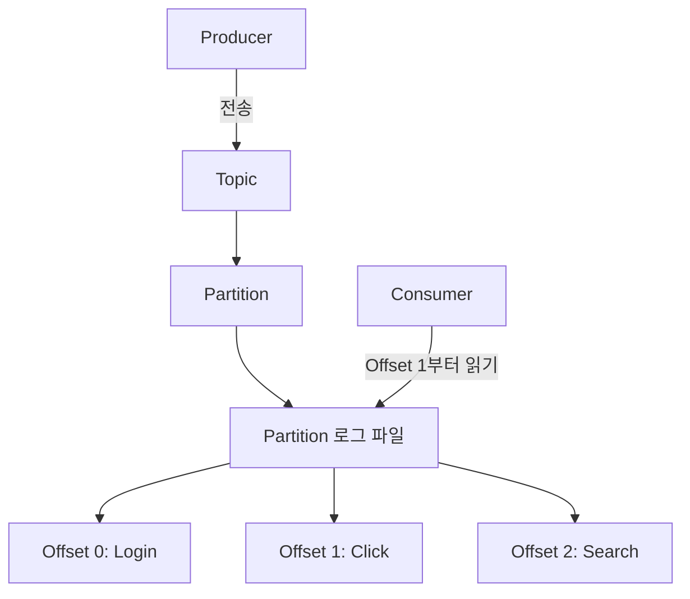
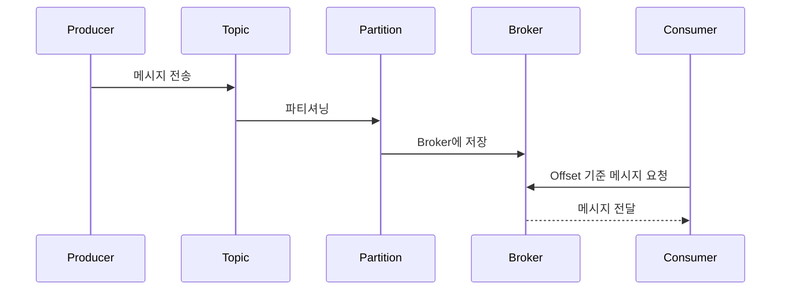
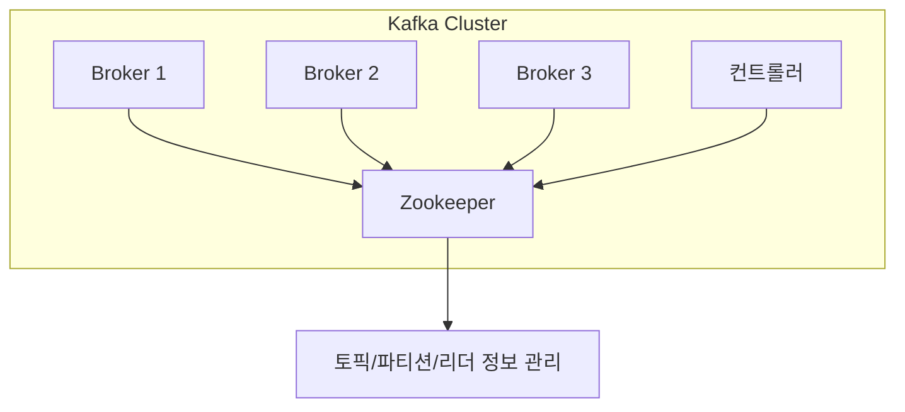

# Kafka 구조 목차 수정

📄 Abstract
----------------

본 정리본은 Apache Kafka의 핵심 구조와 동작 원리에 대한 전반적인 이해를 돕기 위해 작성되었다. Kafka는 대규모 데이터의 실시간 처리와 전송을 가능케 하는 분산 메시징 시스템으로, 현대 데이터 아키텍처에서 데이터 파이프라인의 중심 축 역할을 수행하고 있다. 본 문서에서는 Kafka의 핵심 구성 요소인 Producer, Consumer, Topic, Partition, Broker, Cluster의 개념을 명확히 설명하고, 이들이 어떻게 상호작용하여 데이터를 안정적으로 주고받는지를 체계적으로 정리하였다.  
특히 메시지의 흐름이 Topic과 Partition을 중심으로 어떻게 이동하고, 각 메시지가 Offset을 기준으로 관리되는지를 시각적 흐름과 함께 제시하였다. 또한 Kafka가 데이터를 디스크에 어떻게 저장하고, Segment 파일 구조와 Index 시스템을 통해 고성능을 유지하는 방식도 구체적으로 설명하였다.  
Kafka의 분산 클러스터 구조에서는 리더-팔로워 기반의 데이터 복제 메커니즘과 컨트롤러 선출 방식을 중심으로, 장애 상황에서도 데이터의 일관성과 가용성을 유지하는 원리를 분석하였다. 마지막으로, Kafka가 안정적으로 운영되기 위해 사용하는 외부 시스템인 Zookeeper의 역할과 저장 구조, 클러스터 감시 및 메타데이터 관리 기능까지 함께 정리함으로써, Kafka 시스템 전반에 대한 실무적이고 입체적인 이해를 가능하게 한다.  
해당 정리본은 Kafka를 처음 접하는 학습자뿐 아니라, 분산 메시징 시스템의 설계 철학과 운영 메커니즘에 대한 깊이 있는 이해를 원하는 이들에게 실질적인 도움을 줄 수 있을 것이다.

1\. Kafka란 무엇인가?
================


1.1 메시징 시스템이란?
--------------

정보 기술 시스템에서 데이터는 단순히 생성되는 것으로 끝나지 않는다.  
이 데이터가 실질적인 가치를 가지기 위해서는,  
**하나의 애플리케이션에서 생성된 데이터를 다른 애플리케이션이 전달받고 처리**해야 한다.  
이러한 데이터 흐름을 **신속하고 안정적으로 연결해주는 기술적 매개체**가 바로 **메시징 시스템(Messaging System)** 이다.

메시징 시스템은 다음과 같은 상황에서 핵심적인 역할을 한다.

*   **비동기 통신 지원**: 데이터를 보내는 애플리케이션(Producer)과 받는 애플리케이션(Consumer)이 동시에 동작하지 않아도 되도록 함.
    
*   **시스템 간 연결 분리**: 시스템 간 직접 연결을 최소화하여 유연한 구조 제공.
    
*   **데이터 버퍼링**: 단기간에 몰리는 데이터 트래픽을 일시 저장하여 처리 병목 현상을 방지.
    

> 예를 들어, 쇼핑몰 웹사이트에서 발생한 주문 데이터는 실시간 결제 시스템, 배송 관리 시스템, 재고 관리 시스템 등으로 전달되어야 하는데,  
> 이를 모두 동기적으로 연결하면 시스템 전체가 불안정해질 수 있다.  
> 메시징 시스템은 이를 **완충지대(buffer)** 로 완화시켜주는 역할을 한다.

<br>

1.2 Kafka의 등장 배경과 필요성
---------------------

2000년대 후반, 인터넷 서비스의 급성장과 함께 **데이터의 생성량이 폭발적으로 증가**하였다.  
특히 **LinkedIn**과 같은 소셜 네트워크 플랫폼에서는 유저의 클릭, 검색, 메시지 등  
**수십억 건에 달하는 이벤트 데이터를 실시간으로 처리**해야 했다.

이러한 데이터 흐름을 기존의 메시징 시스템(ex: JMS, RabbitMQ 등)으로는 감당하기 어려워졌고,  
결국 **LinkedIn은 자체적으로 고성능 분산 메시징 시스템인 Apache Kafka를 개발**하게 된다.

Kafka는 다음과 같은 문제를 해결하기 위해 만들어졌다:

*   실시간 데이터 스트림을 빠르게 수집하고 전달할 수 있어야 한다.
    
*   하루 수억 건 이상의 데이터를 **장기적으로 저장 및 재처리**할 수 있어야 한다.
    
*   장애 발생 시에도 데이터가 **유실되지 않고 복구**되어야 한다.
    
*   **확장성**이 높아야 한다. → 서버를 수평적으로 늘리기만 하면 처리량도 증가해야 한다.
    

<br>

1.3 Kafka의 특징과 장점
-----------------

Kafka는 오늘날 수많은 기업과 기관에서 사용되는 대표적인 메시징 시스템이다.  
그 이유는 다음과 같은 특징들 덕분이다:

| 특징 | 설명 |
| --- | --- |
| **고성능(High Throughput)** | 수백 MB ~ 수 GB 수준의 데이터를 초당 처리 가능 |
| **내구성(Durability)** | 디스크 기반 저장, 복제 구조로 인해 데이터 손실 방지 |
| **확장성(Scalability)** | 클러스터를 구성하면 노드 추가만으로 처리량 증가 가능 |
| **유연한 소비(Decoupled Consumption)** | 데이터를 소비하는 방식이 자유로우며, 다수의 Consumer 그룹이 독립적으로 처리 가능 |
| **리플레이 가능(Replayable)** | 과거 데이터도 오프셋 조작을 통해 재처리 가능 |
| **스트림 처리와의 통합** | Kafka Streams, Flink, Spark 등과 쉽게 연동 가능 |

<br>

### 🎯 핵심 요약: Kafka는 무엇을 위한 도구인가?

> **Kafka는 대용량 실시간 데이터 스트림을 안정적으로 수집, 저장, 분산, 전달**하는 데 최적화된 **분산형 메시징 시스템**이다.  
> 즉, '데이터의 파이프라인'을 구축하고자 할 때, Kafka는 중심축 역할을 수행한다.

<br>
<br>

2\. Kafka의 핵심 구성 요소
===================

Kafka는 단순한 메시징 시스템이 아니라, **대규모 데이터 흐름을 처리하는 분산 시스템**이다.  
이를 가능케 하는 여러 구성 요소들이 있으며, 각각의 역할을 명확히 이해하는 것이 중요하다.

<br>

2.1 Producer (생산자)
------------------

> **Producer는 Kafka에 데이터를 보내는 역할을 한다.**

*   애플리케이션 또는 시스템에서 발생한 데이터를 Kafka의 특정 **Topic**에 전송
    
*   Kafka는 데이터를 자동으로 **분산 저장**하므로, Producer는 데이터가 어느 Broker에 저장되는지 알 필요 없음
    
*   **전송 전략**: 라운드로빈, 키 기반 분산 등 다양한 방식으로 **Partition을 자동 지정**하거나 수동 지정 가능
    
*   일반적으로 실시간 로그 수집기, 사용자 이벤트 추적기 등이 Producer 역할을 수행
    

📌 예시  
사용자가 웹사이트에서 검색어를 입력할 때마다 로그를 Kafka에 보내는 웹서버 로직이 Producer가 될 수 있다.

<br>

2.2 Consumer (소비자)
------------------

> **Consumer는 Kafka로부터 데이터를 읽는 주체이다.**

*   Producer가 전송한 데이터를 **Topic의 Partition에서 읽어들임**
    
*   읽기 방식은 **Pull 기반**: 소비자가 직접 Kafka로부터 데이터를 요청
    
*   **Consumer Group** 개념 존재 → 다수의 Consumer가 하나의 Group을 형성해 **부하 분산** 가능
    
*   Kafka는 Consumer의 **Offset**을 기준으로 데이터 전달 시점을 조정 가능
    

📌 예시  
실시간 분석 시스템, 알림 시스템, 저장 로직 등이 Kafka의 Consumer가 될 수 있다.

<br>

2.3 Topic (토픽)
--------------

> **Kafka에서 데이터가 저장되고 전달되는 논리적 단위**  
> 일종의 **채널(channel)** 역할

*   모든 메시지는 특정 Topic에 속함
    
*   Producer는 메시지를 특정 Topic에 보내고, Consumer는 관심 있는 Topic을 구독함
    
*   하나의 Topic은 여러 개의 **Partition**으로 분할 가능 → 병렬 처리 가능
    

📌 예시  
`user-log`, `search-events`, `order-payments` 같은 명시적인 이름의 Topic을 사용하여 데이터 유형을 구분

<br>

2.4 Partition (파티션)
-------------------

> **Kafka가 고성능을 달성하는 핵심 단위**

*   Topic은 여러 개의 Partition으로 나뉠 수 있으며,  
    각 Partition은 독립적으로 데이터를 저장하고 처리함
    
*   각 Partition은 오직 하나의 **리더(Leader) 노드**에서 쓰기와 읽기를 담당하고,  
    나머지 노드는 \*\*팔로워(Follower)\*\*로 데이터를 복제함
    
*   이 구조 덕분에 **병렬 처리**, **부하 분산**, **복제 기반의 내구성 확보**가 가능함
    

📌 예시  
`user-log` Topic이 3개의 Partition으로 구성되어 있다면, 3개의 Consumer가 병렬적으로 데이터를 처리할 수 있음.

<br>

2.5 Offset (오프셋)
----------------

> **Kafka에서 메시지를 구분하는 고유한 번호**

*   각 Partition 내 메시지는 순차적으로 저장되며, 각 메시지는 고유한 번호(Offset)를 가짐
    
*   Consumer는 어떤 Offset부터 데이터를 읽을지 **직접 지정 가능**
    
*   이를 통해 **데이터 재처리**, **장애 복구**, **정확한 데이터 소비량 추적**이 가능함
    

📌 예시  
Consumer가 100번째 메시지까지 처리했을 경우, 다음 소비는 Offset 101부터 시작

<br>

2.6 Broker (브로커)
----------------

> **Kafka 서버 인스턴스 하나를 의미함**

*   메시지를 저장하고, Topic과 Partition을 관리하며, Consumer 요청을 처리
    
*   여러 개의 Broker가 모이면 **클러스터**를 형성하며, 각각 일부 Partition을 담당
    
*   Kafka는 일반적으로 **3개 이상의 Broker**로 구성된 클러스터에서 운영됨
    

📌 예시  
3대의 서버(Broker-0, Broker-1, Broker-2)가 6개의 Partition을 분산 저장하고 있다고 가정

<br>

2.7 Cluster (클러스터)
------------------

> **Kafka 시스템 전체를 아우르는 브로커 집합**

*   하나의 클러스터는 수십 개의 Broker로 구성될 수 있음
    
*   **데이터 분산 저장**, **복제**, **장애 복구** 등을 통해 **무중단 메시징 처리 가능**
    
*   Kafka는 고가용성과 확장성을 위해 클러스터 구조를 필수적으로 사용
    

📌 예시  
실제 운영 환경에서는 수백만 개의 메시지를 처리하기 위해 Kafka 클러스터가 수십~수백 개의 노드로 구성됨

<br>

이로써 Kafka의 구성 요소들은 다음과 같은 흐름으로 연결됩니다:



<br>
<br>

3\. Kafka의 데이터 처리 흐름
====================

Kafka는 "데이터가 생산된 그 순간부터, 최종 소비자에게 도달하기까지"의 **전체 흐름을 책임지는 파이프라인 시스템**이다.  
이 장에서는 Kafka가 데이터를 **어떻게 주고받고 저장하고 재처리할 수 있는지**에 대해 구조적으로 살펴본다.

<br>

3.1 메시지는 어떻게 이동하는가?
-------------------

Kafka의 기본 데이터 흐름은 다음과 같은 단계를 따른다:

```text
Producer → Topic → Partition → Broker 저장 → Offset 순번 → Consumer
```

이를 구성 요소별로 다시 정리하면 다음과 같다:

1.  **Producer**가 메시지를 특정 **Topic**으로 보낸다.
    
2.  해당 메시지는 Topic 내부의 여러 **Partition** 중 하나에 저장된다.
    
3.  각 Partition은 Kafka의 **Broker**에 저장되며, **Offset**을 기준으로 순차적으로 번호가 매겨진다.
    
4.  **Consumer**는 원하는 Topic/Partition을 구독하고, 특정 Offset부터 메시지를 읽어간다.
    

이 흐름은 Kafka가 **실시간 메시지 처리 시스템**이자 **장기 데이터 보관 시스템**으로 동시에 기능할 수 있는 이유이기도 하다.

<br>

3.2 Topic과 Partition의 구조
------------------------

### ✅ Topic이란?

Topic은 Kafka에서 **데이터의 논리적 분류 단위**로, 메시지가 모이는 ‘방’에 해당한다.  
하나의 서비스나 기능마다 Topic을 나눔으로써, 데이터의 구분과 관리가 쉬워진다.

예시:

| 서비스 | Topic 이름 예시 |
| --- | --- |
| 사용자 활동 로그 | `user-activity` |
| 검색 기록 | `search-log` |
| 결제 완료 내역 | `payment-success` |

### ✅ Partition이란?

Partition은 Topic의 물리적 단위이다.  
하나의 Topic은 여러 개의 Partition으로 나뉘어 데이터를 저장하며, 각 Partition은 하나의 **정렬된 로그 구조**를 가진다.

**Partition을 사용하는 이유:**

*   **병렬 처리**: 각 Partition은 독립적인 Consumer가 병렬로 처리 가능
    
*   **확장성 확보**: Partition 수를 늘리면 시스템 처리량 증가
    
*   **장애 대응**: Partition별 복제본 구성으로 내구성 향상
    

### 구조 예시:

```
Topic: user-activity
└── Partition 0 → Broker 1
└── Partition 1 → Broker 2
└── Partition 2 → Broker 3
```

<br>

3.3 Partition 내 메시지 정렬과 Offset 관리
---------------------------------

Kafka의 Partition은 **로그(log) 구조**로 되어 있다.  
이 말은 메시지가 시간 순서대로 쌓이며, 각 메시지에는 고유한 **Offset**이 붙는다는 뜻이다.

예시: Partition 1의 메시지 저장 형태

| Offset | 메시지 내용 |
| --- | --- |
| 0 | {"event": "login"} |
| 1 | {"event": "search"} |
| 2 | {"event": "click"} |
| 3 | {"event": "logout"} |

### ✅ Offset의 역할

*   **Consumer의 읽기 위치 추적**: Kafka는 메시지를 자동으로 삭제하지 않으며, Offset을 기준으로 어떤 시점부터 읽을지 결정한다.
    
*   **장애 복구**: Consumer가 장애로 중단되어도, 마지막 Offset부터 다시 읽기 가능
    
*   **재처리 기능**: 필요에 따라 과거 Offset으로 돌아가 재처리 가능 (예: 분석 시스템 리빌딩)
    

> Kafka는 기본적으로 **Consumer가 어떤 메시지를 읽었는지 기억하지 않는다.**  
> 대신, Consumer가 스스로 **Offset을 저장하거나** Kafka 내부에 저장하도록 설정한다.  
> 이 구조 덕분에 Kafka는 다양한 처리 시나리오를 유연하게 지원할 수 있다.

<br>

📌 전체 처리 흐름 요약 다이어그램 (Mermaid 사용)
---------------------------------



<br>

이로써 Kafka 내부의 데이터 흐름이 **"실시간 메시지 큐 + 로그 저장소"** 처럼 동작한다는 개념을 잡을 수 있다.  
이 구조는 단순한 실시간 전송뿐만 아니라 **데이터 분석**, **알림**, **모니터링**, **머신러닝 파이프라인 구축** 등 다양한 영역에 응용된다.

<br>
<br>

4\. Kafka의 저장 방식
================

Kafka는 **디스크 기반의 로그 저장소**를 기반으로 메시지를 저장한다.  
즉, Kafka는 단순히 메시지를 '전달'하는 것이 아니라, **일정 기간 동안 메시지를 보관**하며,  
필요할 경우 **다시 꺼내어 재전송하거나 재처리할 수 있는 시스템**이다.

<br>

4.1 Partition의 물리적 저장 위치
------------------------

Kafka는 각 **Topic의 Partition을 하나의 로그 파일**로 저장한다.  
각 Partition은 실제로는 **파일 시스템 상의 디렉토리로 구성되며**,  
해당 디렉토리 안에 여러 개의 **세그먼트(segment) 파일**이 존재한다.

### 저장 구조 예시 (Linux 기준 디렉토리 구조):

```
/tmp/kafka-logs/
└── user-activity-0/
    ├── 00000000000000000000.log
    ├── 00000000000000000000.index
    ├── 00000000000000000000.timeindex
    ├── 00000000000000001000.log
    └── ...
```

여기서 `user-activity-0`는  
Topic 이름: `user-activity`, Partition 번호: `0`을 의미한다.

<br>

4.2 세그먼트(Segment) 파일 구조
-----------------------

Kafka는 Partition에 저장되는 메시지를 일정 크기 단위로 나누어 **Segment 파일**에 기록한다.

### ✅ Segment 파일이란?

*   Kafka는 하나의 Partition 로그를 크기(예: 1GB) 또는 시간(예: 1시간) 단위로 나누어 저장한다.
    
*   이를 통해 **로그 압축**, **삭제**, **검색** 등의 작업을 효율적으로 수행할 수 있다.
    

각 Segment는 다음 세 가지 파일로 구성된다:

| 파일명 확장자 | 설명 |
| --- | --- |
| `.log` | 실제 메시지가 기록된 파일 |
| `.index` | 메시지 Offset → 바이트 위치로 매핑하는 인덱스 |
| `.timeindex` | 메시지 시간(timestamp) → 바이트 위치 매핑 (시간 기반 조회용) |

<br>

4.3 Kafka의 실제 데이터: 로그 저장 방식
---------------------------

Kafka의 메시지는 다음과 같은 구조로 디스크에 저장된다:

```text
[Offset][Message Size][Timestamp][Key][Value]
```

*   Offset: 각 메시지의 고유 위치 번호
    
*   Message Size: 메시지 전체의 바이트 크기
    
*   Timestamp: 메시지 생성 시간
    
*   Key: 파티셔닝 기준 또는 식별자 역할
    
*   Value: 실제 전송 데이터
    

이 구조는 단순하면서도 효율적이다.  
Kafka는 디스크에 연속적으로 메시지를 기록하고, 필요한 메시지를 빠르게 읽기 위해 **인덱스 파일**을 활용한다.

<br>

4.4 Kafka의 파일 타입 요약
-------------------

| 파일 타입 | 확장자 | 역할 |
| --- | --- | --- |
| 데이터 로그 파일 | `.log` | 메시지 저장 |
| 오프셋 인덱스 파일 | `.index` | Offset → 위치 매핑 |
| 시간 인덱스 파일 | `.timeindex` | Timestamp → 위치 매핑 |

> 이러한 구조 덕분에 Kafka는 **엄청난 데이터량을 디스크에 저장하면서도 매우 빠르게 읽기/쓰기**를 할 수 있다.

<br>

✅ Kafka 저장 방식 요약: 왜 디스크인데도 빠를까?
-------------------------------

Kafka는 디스크 기반임에도 불구하고 높은 성능을 유지한다. 그 이유는 다음과 같다:

*   **순차적 쓰기(Sequential Write)**: 디스크에 연속적으로 데이터를 쓰기 때문에 속도가 빠르다.
    
*   **Page Cache 활용**: 운영체제가 디스크 내용을 메모리에 미리 올려두므로 빠르게 읽을 수 있다.
    
*   **Batch 처리**: 여러 메시지를 한 번에 묶어서 저장함으로써 디스크 I/O 최소화
    
*   **Zero-copy 전송**: OS 커널 기능을 이용해 디스크 → 네트워크 전송 속도를 최적화
    

<br>

### 📌 Kafka 저장 방식 다이어그램

```mermaid
graph TD
    A[Kafka Partition 디렉토리] --> B[Segment 1.log]
    A --> C[Segment 1.index]
    A --> D[Segment 1.timeindex]
    A --> E[Segment 2.log]
    E --> F[...추가 메시지들]

    B --> G[Offset 0: "Login"]
    B --> H[Offset 1: "Click"]
```

<br>

Kafka의 저장 방식은 단순히 메시지를 ‘보관’하는 것을 넘어서  
**시간 기반 분석, 오류 복구, 재처리, 로그 관리** 등 다양한 활용 가능성을 만들어낸다.

<br>
<br>

5\. Kafka 클러스터와 데이터 분산
======================

Kafka는 기본적으로 **단일 서버에 의존하지 않는다.**  
수십 개 이상의 \*\*Broker(서버 인스턴스)\*\*가 모여 \*\*클러스터(Cluster)\*\*를 구성하고,  
각 Broker는 **토픽의 일부 Partition을 나누어 저장**하며 협력적으로 시스템을 유지한다.

이러한 구조 덕분에 Kafka는 **확장성**, **내구성**, **가용성**이라는 세 가지 장점을 획득한다.

<br>

5.1 클러스터를 구성하는 이유
-----------------

Kafka가 단일 서버 구조로 동작하지 않는 이유는 다음과 같다:

| 이유 | 설명 |
| --- | --- |
| **확장성** | 처리량이 증가할 경우, 새로운 Broker를 추가해 손쉽게 시스템 확장 가능 |
| **부하 분산** | 각 Broker가 일부 Partition만 담당함으로써 처리 효율 향상 |
| **장애 복구** | 일부 Broker가 장애를 일으켜도 다른 Broker가 데이터 유지 및 처리를 이어받음 |
| **병렬 처리** | 여러 Consumer가 각 Partition을 병렬로 처리 가능, 성능 극대화 |

<br>

5.2 Broker 간 역할 분담
------------------

Kafka 클러스터의 핵심 개념은 **Partition의 리더(Leader)와 팔로워(Follower)** 구조이다.

### ✅ 리더(Leader)

*   각 Partition에는 **하나의 리더가 존재**하며, 이 리더가 모든 읽기/쓰기 요청을 처리한다.
    
*   리더는 **자신의 Broker 서버에 실제 데이터를 저장**하며, 다른 팔로워들에게 복제를 지시한다.
    

### ✅ 팔로워(Follower)

*   팔로워는 리더의 데이터를 **동기화**하여 저장만 담당한다.
    
*   리더가 장애로 사라질 경우, **팔로워 중 하나가 새로운 리더로 승격된다.**
    

> 이 구조는 Kafka의 고가용성과 장애 복구 능력을 가능하게 한다.

<br>

5.3 리더 선출 과정
------------

Kafka는 **Partition별로 리더를 자동 선출**하며, 다음과 같은 방식으로 작동한다:

1.  Kafka는 각 Partition마다 리더 후보 목록(Replica 목록)을 가지고 있다.
    
2.  클러스터 내 컨트롤러(Controller)가 각 Partition의 리더를 지정한다.
    
3.  리더가 장애를 일으키면, 컨트롤러가 **ISR(In-Sync Replica) 목록** 중 하나를 선택하여 새 리더로 임명한다.
    

### ✅ ISR이란?

*   In-Sync Replica의 약자로, 리더와 **정상적으로 동기화되고 있는 팔로워 목록**
    
*   Kafka는 **ISR 내에서만** 리더를 선출하여 데이터 일관성을 보장한다.
    

<br>

5.4 컨트롤러의 역할
------------

Kafka 클러스터 내에는 특별한 역할을 하는 **Controller Broker**가 존재한다.

| 역할 | 설명 |
| --- | --- |
| **리더 선출 관리** | Partition별 리더를 정하고, 장애 발생 시 빠르게 교체 |
| **Broker 상태 감시** | 각 Broker의 연결 상태를 주기적으로 확인 |
| **메타데이터 갱신** | 토픽, Partition, Replica 정보 등을 관리하고 클러스터 전체에 전파 |

> 컨트롤러도 일반적인 Broker이지만, 하나의 Broker만이 컨트롤러 역할을 수행한다.  
> 만약 컨트롤러가 실패하면 다른 Broker가 자동으로 컨트롤러가 된다.

<br>

📌 데이터 분산 구조 다이어그램 (Mermaid)
----------------------------

```mermaid
graph LR
    A[Partition 0 (Topic A)] --> B[Broker 1 (Leader)]
    A --> C[Broker 2 (Follower)]
    A --> D[Broker 3 (Follower)]

    B --복제--> C
    B --복제--> D

    subgraph Cluster
        B
        C
        D
    end
```

<br>

💡 예시 시나리오
----------

> 예를 들어 Topic A가 3개의 Partition으로 구성되어 있고, Kafka 클러스터에 3개의 Broker가 있다면:

| Partition | Leader Broker | Follower Brokers |
| --- | --- | --- |
| A-0 | Broker 1 | Broker 2, 3 |
| A-1 | Broker 2 | Broker 1, 3 |
| A-2 | Broker 3 | Broker 1, 2 |

이 구조를 통해 Kafka는 **데이터 유실 없이**, **고성능 분산처리**가 가능하며, **장애 시 자동 복구**를 할 수 있다.

<br>
<br>

6\. Kafka와 Zookeeper
====================


6.1 Zookeeper란?
---------------

**Zookeeper**는 Apache에서 제공하는 **분산 코디네이션 시스템**이다.  
분산 시스템에서 여러 노드 간의 상태를 **일관성 있게 유지하고, 관리할 수 있도록 도와주는 중앙 관리자** 역할을 한다.

Kafka는 Zookeeper를 통해 다음과 같은 기능을 수행한다:

*   Kafka 클러스터 내 **Broker 등록 및 상태 감시**
    
*   **컨트롤러 선출**: 하나의 Broker를 클러스터 리더로 지정
    
*   **토픽, 파티션, ISR(In-Sync Replica) 정보 관리**
    

> ✅ Kafka 3.0 이후 Zookeeper 제거 옵션(KRaft 모드)이 도입되었지만, 현재까지도 실무와 교육에서는  
> **Zookeeper 기반 구조를 명확히 이해하는 것이 중요**하다.

<br>

6.2 Kafka에서 Zookeeper가 필요한 이유
-----------------------------

Kafka는 완전한 분산 시스템으로, 수많은 노드(Broker)가 상호작용한다.  
하지만 이러한 시스템에서는 다음과 같은 문제들이 발생할 수 있다:

| 문제 상황 | 필요성 |
| --- | --- |
| Broker가 중간에 다운되었을 때 | 누가 다운되었는지, 언제 다시 올라왔는지를 누가 감지할 것인가? |
| Partition의 리더가 사라졌을 때 | 누가 새로운 리더를 선출할 것인가? |
| 새로운 Topic이 생성되었을 때 | 어디에, 몇 개의 Partition으로 생성할 것인지 어디에 기록할 것인가? |

이러한 상황을 Kafka 단독으로 처리하기는 어렵기 때문에,  
Zookeeper가 **분산 환경의 메타데이터 관리와 감시자 역할**을 수행한다.

<br>

6.3 Zookeeper의 주요 역할
--------------------

Kafka는 Zookeeper를 통해 클러스터의 **전체 상태**를 파악하고,  
중앙에서 **제어 및 조율**할 수 있게 된다.

### 🔧 주요 기능 정리

| 기능 | 설명 |
| --- | --- |
| **Broker 등록 및 감시** | Zookeeper는 Kafka Broker의 목록과 상태를 지속적으로 감시 |
| **컨트롤러 선출** | 여러 Broker 중 하나를 Kafka 컨트롤러로 자동 지정 |
| **Partition 리더/팔로워 관리** | 각 Partition의 리더가 누구인지, ISR 목록은 무엇인지 관리 |
| **토픽 메타데이터 저장** | 토픽 생성/삭제, 파티션 수, 복제 수 등 관리 |

<br>

6.4 Zookeeper의 저장 구조
--------------------

Zookeeper는 내부적으로 데이터를 \*\*계층형 구조(znode 트리)\*\*로 저장한다.  
파일 시스템과 유사한 구조로, 각 znode는 다음과 같은 메타데이터를 저장한다.

### 예시 구조:

```
/
├── brokers/
│   ├── ids/
│   │   ├── 0  ← Broker 0 정보
│   │   └── 1  ← Broker 1 정보
│   └── topics/
│       ├── user-activity/
│       └── payment-log/
├── controller  ← 현재 컨트롤러 Broker ID
└── isr/        ← In-Sync Replica 정보
```

> 이 구조 덕분에 Kafka는 어떤 Broker가 리더인지, 어떤 Broker가 장애 상태인지 등을 빠르게 판단할 수 있다.

<br>

6.5 Zookeeper의 안정성: 왜 믿을 수 있을까?
-------------------------------

Zookeeper는 자체적으로도 **분산 시스템**이다.  
3개 이상의 노드(일반적으로 3, 5, 7개)를 구성하여 \*\*Quorum 기반 합의 알고리즘(Zab)\*\*을 사용해  
**높은 신뢰성과 내구성**을 보장한다.

### 안정성 요소:

*   **데이터 복제**: 모든 변경 사항은 다수의 서버에 복제됨
    
*   **리더-팔로워 구조**: 하나의 리더가 쓰기를 수행하고, 나머지는 복제
    
*   **Quorum(정족수)** 방식의 쓰기 적용 → 절반 이상 동의 시 커밋
    

> 예: 3개의 Zookeeper 노드 중 2개 이상이 응답해야 쓰기 커밋

<br>

📌 Kafka-Zookeeper 연동 구조 다이어그램
------------------------------



<br>

🧩 Kafka와 Zookeeper의 관계 요약
--------------------------

| Kafka 역할 | Zookeeper 의존 내용 |
| --- | --- |
| Broker 등록 | Zookeeper에 자신의 ID 등록 |
| 컨트롤러 선출 | Zookeeper에서 리더 Broker 결정 |
| 리더 변경 감지 | Zookeeper에서 ISR/리더 정보 감시 |
| 클러스터 전체 상태 추적 | Zookeeper가 Broker 상태를 실시간 추적 |


