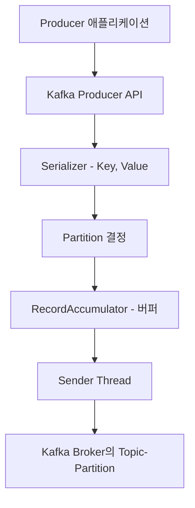
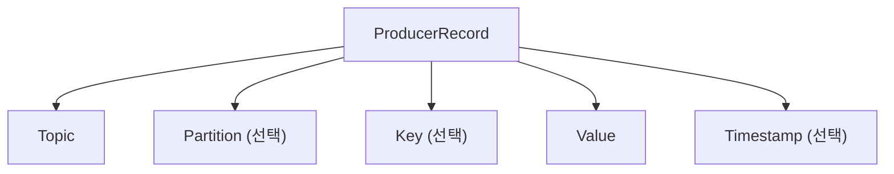
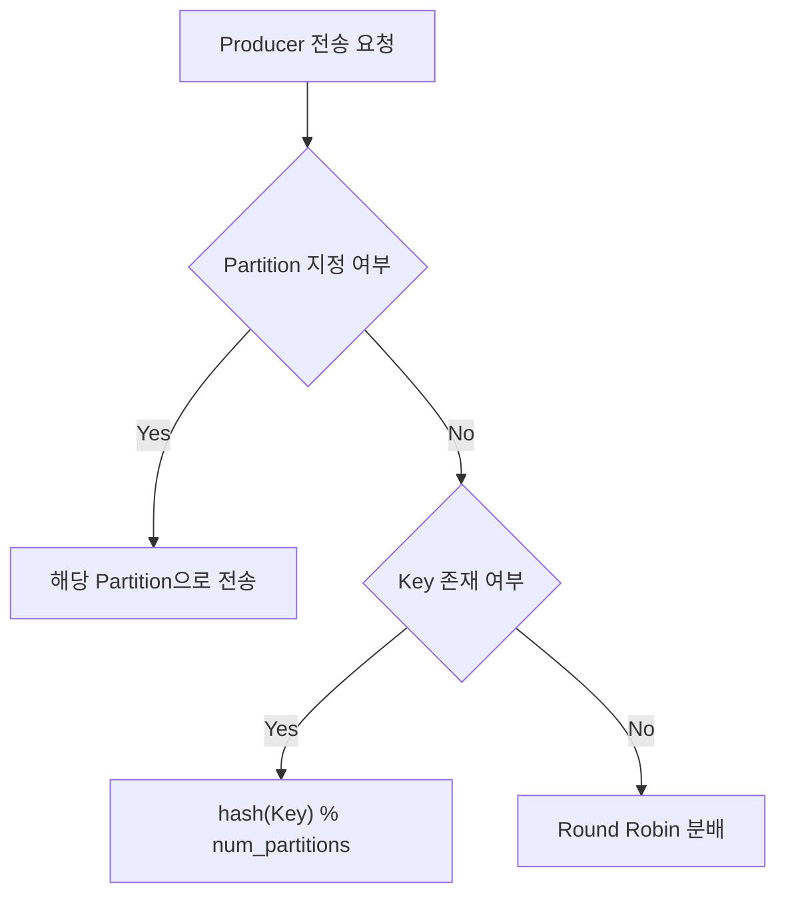
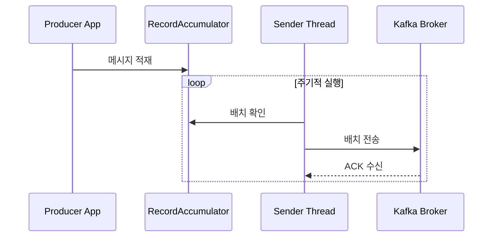
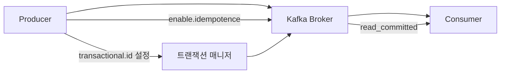
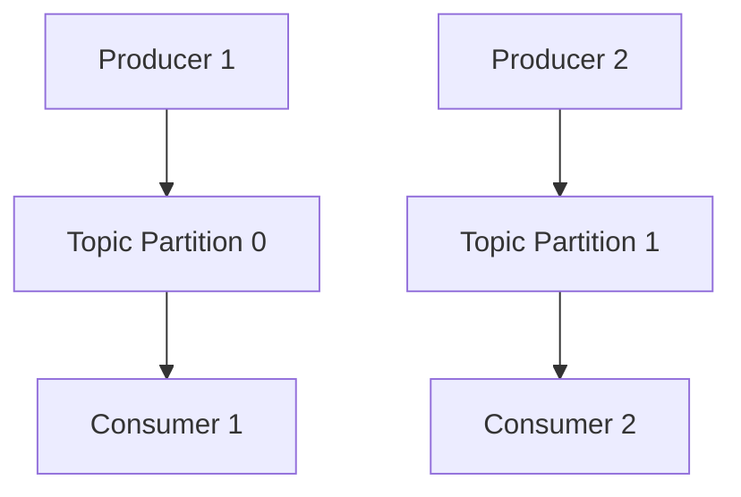
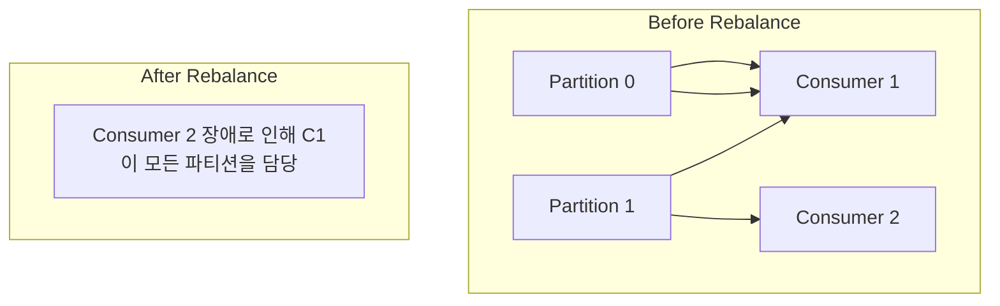
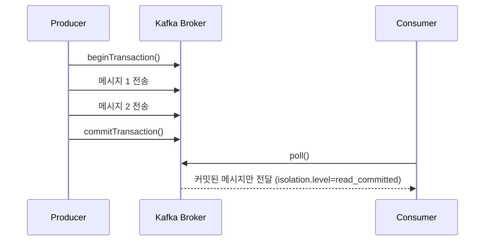

# Kafka Producer & Consumer

Abstract
--------

본 정리본은 Apache Kafka의 핵심 구성 요소인 **Producer**와 **Consumer**에 대한 개념적 이해와 실무 활용을 목표로 한다. Kafka는 대규모 데이터를 실시간으로 처리할 수 있는 분산형 메시징 시스템으로, 본 정리본은 비전공자를 대상으로 하여 개념 설명과 코드 실습을 병행하는 방식으로 구성되었다.

우선, **Kafka Producer**의 메시지 전송 구조를 중심으로 직렬화, 파티션 분배, 버퍼링, 전송 스레드, 멱등성(idempotence) 및 트랜잭션 처리에 대해 설명하였으며, 이를 통해 안정적인 메시지 송신 방식과 정확한 데이터 전송 보장 메커니즘을 다루었다. 이어서 **Kafka Consumer**의 구조와 동작 방식, Consumer Group을 통한 병렬 처리, Rebalance 과정 및 Offset 관리 전략을 상세히 분석하였고, 트랜잭션 기반 메시지 소비 방식과 Exactly Once Semantics 구현 방법까지 확장하여 정리하였다.

마지막으로 Producer와 Consumer 각각의 기본 예제를 제시함으로써 이론적 이해와 실습 간의 연결을 도모하였다. 본 정리본은 Kafka의 개념을 처음 접하는 독자도 분산 메시징 시스템의 기본 원리와 데이터 신뢰성 확보 전략을 체계적으로 이해할 수 있도록 설계되었으며, 실제 데이터 처리 환경에의 적용 가능성을 고려하여 작성되었다.

<br>

1\. Kafka Producer 이해하기
-----------------------

1.1 Producer란?
-----------------

**Kafka Producer는 대규모 데이터 시스템의 시작점**이라 할 수 있다. Producer는 외부 시스템에서 발생한 데이터를 Kafka 클러스터로 전송하는 역할을 하며, 이는 흔히 로그, 센서 데이터, 사용자 이벤트, 거래 기록 등 실시간 또는 비정기적으로 생성되는 모든 정보의 흐름에서 기인한다.

Kafka는 **분산 메시징 시스템**이다. Producer는 이러한 시스템 내에서 **"데이터 발신자"** 의 역할을 수행하며, 데이터를 Kafka 내 특정 토픽(Topic)에 전송함으로써 다양한 Consumer가 해당 데이터를 구독(subscribe)하여 처리할 수 있게 한다.

Producer는 단순히 데이터를 전달하는 데서 멈추지 않는다. 전송할 데이터를 가공하고(직렬화), 토픽 내에서 어떤 파티션으로 보낼지 결정하며, 네트워크나 서버 장애가 발생했을 때 재전송이나 중복 방지를 위한 설정도 함께 관리한다. 이를 통해 **신뢰성 있는 데이터 송신**이 가능해진다.

<br>

1.2 Producer의 메시지 전송 흐름
-----------------

Kafka Producer의 데이터 전송은 다음과 같은 단계로 구성된다.

1.  **메시지 생성**  
    사용자의 애플리케이션 혹은 서버로부터 전달된 데이터를 기반으로 메시지를 생성한다.
    
2.  **직렬화(Serialization)**  
    메시지 내 데이터는 Kafka 서버가 처리할 수 있도록 바이트(byte) 형태로 변환된다. 이를 직렬화라고 한다. 문자열, 정수, JSON 등 다양한 형식이 사용될 수 있다.
    
3.  **파티션 선택**  
    Kafka의 각 토픽은 하나 이상의 파티션으로 구성되어 있으며, Producer는 메시지를 어떤 파티션에 보낼지를 결정해야 한다. 이 과정은 해시 기반의 자동 분배 혹은 사용자 지정 로직에 따라 이뤄진다.
    
4.  **버퍼에 적재**  
    전송 직전, Producer는 데이터를 네트워크 전송을 위해 메모리 내 버퍼(RecordAccumulator)에 임시 저장한다. 이는 전송 효율을 높이기 위한 전략이다.
    
5.  **Sender Thread를 통한 전송**  
    백그라운드 스레드(Sender Thread)가 주기적으로 버퍼를 비우며 데이터를 Kafka Broker로 전송한다.
    
6.  **Acknowledge 수신**  
    Kafka는 메시지가 정상적으로 전달되었는지를 확인하기 위한 Acknowledge(ACK) 설정을 지원한다. ACK 설정에 따라 송신 안정성과 처리 성능이 결정된다.
    

이러한 전송 흐름은 단순한 API 호출 이상의 과정을 내포하고 있으며, **데이터 처리 시스템에서 신뢰성, 확장성, 지연시간 최적화**를 고려한 고급 설계의 핵심을 이룬다.



<br>

1.3 메시지 구조와 전송 방식
-----------------

### 1.3.1 Producer Record 구조

Kafka에서 Producer가 전송하는 기본 단위는 **ProducerRecord**라고 불린다. 이는 아래와 같은 필드들로 구성된다:

*   **Topic**: 메시지를 전송할 대상 토픽 이름
    
*   **Partition (선택)**: 메시지를 특정 파티션으로 보낼 경우 명시. 지정하지 않으면 Kafka가 내부 알고리즘에 따라 자동으로 분배
    
*   **Key (선택)**: 파티션 결정에 사용되는 기준. 동일한 Key는 항상 동일한 파티션으로 매핑된다
    
*   **Value**: 실제로 전송하고자 하는 데이터 내용
    
*   **Timestamp (선택)**: 메시지가 생성된 시각 정보
    

이러한 구조는 메시지를 단순히 전송하는 것을 넘어, **데이터 정렬, 파티션 유지, 시간 기반 분석**을 위한 기반 정보를 제공한다.

#### ✅ 예시 코드 (Java 기반)

```java
ProducerRecord<String, String> record = 
    new ProducerRecord<>("user-logs", "user123", "login_success");
```

이 코드는 "user-logs"라는 토픽에 `"user123"`이라는 키와 `"login_success"`라는 값을 갖는 메시지를 생성하는 예시이다. 이 키를 기준으로 Kafka는 파티션을 자동 선택하거나 지정된 로직을 적용한다.


<br>

### 1.3.2 메시지 직렬화 (Serialization)

Kafka는 내부적으로 바이트 배열(byte\[\]) 형태의 데이터를 주고받기 때문에, 사용자가 정의한 구조체나 문자열, JSON 등을 Kafka가 이해할 수 있는 형태로 변환해야 한다. 이 과정을 \*\*직렬화(Serialization)\*\*라고 한다.

Kafka Producer는 다음과 같은 직렬화 인터페이스를 제공한다:

*   **StringSerializer**: 문자열을 UTF-8 바이트 배열로 변환
    
*   **IntegerSerializer**: 정수를 바이트 배열로 변환
    
*   **ByteArraySerializer**: 이미 바이트로 준비된 데이터를 그대로 전송
    
*   **커스텀 Serializer**: JSON, Avro, Protocol Buffers 등 다양한 형식을 위한 사용자 정의 직렬화
    

Producer에서는 `key.serializer`와 `value.serializer` 설정을 통해 직렬화 방법을 명시한다.

#### ✅ 설정 예시 (Python에서는 confluent-kafka 기준)

```python
from confluent_kafka import Producer

p = Producer({'bootstrap.servers': 'localhost:9092',
              'key.serializer': str.encode,
              'value.serializer': str.encode})
```

직렬화가 잘못되면 데이터가 Kafka에 적재되지 않거나 Consumer가 데이터를 정상적으로 역직렬화(deserialize)하지 못하므로, **Producer-Consumer 간 직렬화 포맷 통일**은 매우 중요한 이슈다.

<br>

### 1.3.3 파티션 선택 알고리즘

Kafka는 토픽을 **파티션(Partition)** 단위로 나누어 데이터를 저장한다. 이 구조 덕분에 **병렬 처리, 부하 분산, 확장성 확보**가 가능해진다.

Producer는 다음 세 가지 방식 중 하나로 파티션을 선택한다:

1.  **명시적 지정**: ProducerRecord 생성 시 파티션 번호를 직접 지정
    
2.  **Key 기반 해싱**: Key가 존재할 경우 `hash(key) % partition 개수` 방식으로 파티션 결정
    
3.  **Round-Robin**: Key가 없을 경우, Producer 내부에서 순차적으로 파티션을 순환 선택
    

> **💡 실무 팁**: 동일한 고객 ID, 사용자 ID 등을 Key로 설정하면 관련 데이터가 동일 파티션에 모이게 되어 정렬 유지 및 분석 용이성이 높아진다.



<br>

1.4 전송 최적화 기술
-------------

Kafka는 단순히 데이터를 보내는 수준에서 그치지 않고, **수많은 메시지를 효율적으로 처리하고, 실패를 방지하며, 높은 처리량을 보장**하기 위해 여러 가지 최적화 전략을 적용한다. 이 항목에서는 Kafka Producer가 사용하는 핵심 최적화 기술을 세 가지로 나누어 설명한다.

<br>

### 1.4.1 버퍼와 RecordAccumulator

Kafka Producer는 메시지를 생성하자마자 곧바로 Kafka 서버에 전송하지 않는다. 그 대신, **RecordAccumulator**라는 메모리 내 버퍼에 잠시 저장한 후, 일정량이 모이거나 시간이 지나면 일괄 전송(batch)하는 방식으로 처리 효율을 극대화한다.

이 전략은 네트워크 전송 횟수를 줄여 성능을 높이기 위한 대표적인 방법이다. 사용자가 직접 지정할 수 있는 주요 설정값은 다음과 같다:

*   **`batch.size`**: 하나의 배치에 포함할 최대 바이트 수
    
*   **`linger.ms`**: 지정된 시간이 지나면 배치 크기가 충분하지 않아도 전송
    

#### ✅ 예시 (설정)

```python
{
  "batch.size": 16384,     # 16KB까지 묶어서 전송
  "linger.ms": 10          # 최대 10ms 기다렸다가 전송
}
```

> **이해 포인트**: `batch.size`가 크고 `linger.ms`가 길수록 묶음 전송 효과는 좋아지지만, 지연(latency)은 증가할 수 있다. 실시간성과 효율 사이의 균형이 중요하다.

<br>

### 1.4.2 Sender Thread의 역할

Kafka Producer는 백그라운드에서 작동하는 **Sender Thread**를 통해 실제 네트워크 전송을 수행한다. 이는 버퍼에 있는 메시지를 주기적으로 확인하고, 일괄 전송하는 작업을 담당한다.

이러한 비동기 전송 구조 덕분에 **애플리케이션은 메시지를 빠르게 전송하고 즉시 다음 작업으로 넘어갈 수 있으며**, 전송 자체는 별도의 스레드가 효율적으로 처리한다.

#### 주요 동작 흐름

1.  사용자가 Producer API로 메시지를 전송
    
2.  메시지는 버퍼에 적재됨
    
3.  Sender Thread가 주기적으로 버퍼를 확인하여 배치 전송
    
4.  Kafka Broker로부터 Acknowledge 응답을 수신
    


<br>

### 1.4.3 Acknowledge 설정 (acks 옵션)

Kafka는 메시지가 실제로 안전하게 도착했는지 확인하는 수단으로 **Acknowledge (acks)** 옵션을 제공한다. 이 설정은 데이터의 신뢰성과 처리 속도 간의 트레이드오프를 조절하는 핵심 요소이다.

| 설정 값 | 의미 | 신뢰성 | 성능 |
| --- | --- | --- | --- |
| **`acks=0`** | 응답 없이 전송 완료 처리 | 낮음 | 매우 빠름 |
| **`acks=1`** | 리더 브로커만 응답 시 성공 | 보통 | 빠름 |
| **`acks=all` (또는 -1)** | 모든 ISR(In-Sync Replica)이 응답해야 성공 | 매우 높음 | 느릴 수 있음 |

> ISR이란? 리더 브로커와 동기화된 팔로워 브로커들의 집합으로, `acks=all`은 장애 복구 상황에서도 데이터 유실을 방지한다.

#### ✅ 설정 예시 (Python)

```python
producer = Producer({
    'bootstrap.servers': 'localhost:9092',
    'acks': 'all'
})
```

이처럼 Kafka Producer는 다양한 내부 메커니즘을 통해 **처리량과 안정성을 조율**하고 있으며, 실제 서비스 환경에서는 목적에 따라 해당 설정을 조정하는 것이 필수적이다.

<br>

1.5 데이터 중복 방지와 안정성
------------------

### 1.5.1 멱등성 프로듀서 (Idempotent Producer)

Kafka는 네트워크 장애, 리더 브로커 변경 등의 상황에서도 메시지가 안전하게 도착했는지를 확인하는 기능을 제공하지만, 이러한 상황에서는 **중복 메시지 전송**이 발생할 수 있다.  
이때 Kafka는 **“멱등성 프로듀서”** 기능을 통해 메시지를 **한 번만 처리된 것처럼 보이게끔 보장**할 수 있다.

#### ✅ 멱등성(Idempotence)이란?

컴퓨팅에서 \*멱등성(idempotency)\*은 **같은 작업을 여러 번 수행해도 결과가 한 번 수행한 것과 같음**을 의미한다. Kafka에서는 이것이 **중복 메시지를 자동으로 제거**하는 기능으로 구현된다.

Kafka의 멱등성 기능은 아래의 두 가지 정보를 조합하여 중복 여부를 판단한다:

*   **Producer ID (PID)**: Producer에 고유하게 할당되는 식별자
    
*   **Sequence Number**: 각 메시지에 부여되는 일련 번호
    

이 정보를 통해 Kafka는 **이미 처리된 메시지를 식별**하고, 동일한 메시지가 다시 도착하면 무시한다.

#### ✅ 설정 방법

멱등성은 간단하게 다음과 같이 설정 가능하다:

```python
{
  "enable.idempotence": True
}
```

> 💡 Kafka 2.5 이상부터는 `acks=all`과 함께 사용 시 자동으로 멱등성이 활성화되며, 설정하지 않아도 기본적으로 사용 가능하도록 바뀌었다.

#### ✅ 멱등성의 한계

*   한 토픽의 하나의 파티션에 대해서만 정확히 한 번 보장이 가능하다
    
*   Consumer 레벨에서는 완전한 Exactly Once Semantics 보장이 불가 (이를 해결하기 위해 트랜잭션이 필요)
    

<br>

### 1.5.2 트랜잭션 프로듀서 (Transactional Producer)

Kafka는 멱등성에서 한 발 더 나아가, 복잡한 데이터 처리 환경에서도 \*\*완전한 "Exactly Once Semantics" (EOS)\*\*를 구현하기 위해 **트랜잭션** 기능을 제공한다.

#### ✅ Kafka 트랜잭션이란?

여러 개의 메시지를 **하나의 논리적 작업 단위**로 묶어 전송하고, 모두 성공하거나 모두 실패하게 만드는 기능이다. 이는 금융, 결제, 재고 등 **절대 중복 또는 누락이 발생해서는 안 되는** 데이터 처리에서 특히 중요하다.

Kafka 트랜잭션은 아래와 같은 상황을 보장한다:

*   여러 메시지가 \*\*원자적(atomic)\*\*으로 처리됨
    
*   Consumer는 **트랜잭션이 완료된 메시지만** 읽을 수 있음
    
*   **중복 없이 정확히 한 번 처리됨 (Exactly Once)**
    

#### ✅ 트랜잭션 사용 단계

1.  트랜잭션 ID 설정 및 초기화
    
2.  `begin_transaction()` 호출
    
3.  여러 메시지를 전송 (`produce`)
    
4.  `commit_transaction()` 또는 `abort_transaction()` 호출
    

#### ✅ Python 예시 (confluent-kafka)

```python
from confluent_kafka import Producer

p = Producer({'bootstrap.servers': 'localhost:9092',
              'enable.idempotence': True,
              'transactional.id': 'my-transactional-id'})

p.init_transactions()
p.begin_transaction()
p.produce('topic', key='user1', value='payment_processed')
p.commit_transaction()
```

> ❗ 트랜잭션을 사용하기 위해서는 반드시 **Kafka 서버 설정도 트랜잭션을 지원하도록 구성**되어 있어야 하며, 사용자는 반드시 **동기적으로** 메시지 전송과 커밋을 제어해야 한다.

<br>

### 멱등성과 트랜잭션의 차이 정리

| 항목 | 멱등성 (Idempotence) | 트랜잭션 (Transaction) |
| --- | --- | --- |
| 중복 방지 | O | O |
| 메시지 원자성 | X | O |
| 다수 파티션 메시지 전송 | X (단일 파티션 한정) | O |
| Exactly Once 보장 | 부분 가능 | 완전 가능 |



<br>

Kafka는 이처럼 신뢰성과 정합성을 강화하기 위한 기능을 지속적으로 확장해오고 있으며, 실시간 데이터 처리의 수준을 한 차원 끌어올리고 있다. 이러한 기능들은 **비즈니스 크리티컬한 데이터 처리**를 Kafka로 안전하게 위임할 수 있는 기술적 기반을 제공한다.

<br>
<br>

2\. Kafka Consumer 이해하기
-----------------------

### 2.1 Consumer란?

Kafka Consumer는 **Kafka Broker로부터 데이터를 읽어오는 컴포넌트**이다. Kafka의 핵심 구조는 ‘데이터를 보내는 Producer’와 ‘데이터를 받아 가공하거나 저장하는 Consumer’로 구성되어 있으며, 이 둘은 **Topic을 중심으로 간접적으로 연결**되어 있다.

Producer가 전송한 메시지는 Kafka 내부의 Topic에 저장되고, Consumer는 특정 Topic에 접근하여 데이터를 차례로 읽어간다. 이 과정에서 Kafka는 데이터를 **삭제하지 않고 보존**하므로, Consumer는 자신만의 속도로 데이터를 읽을 수 있으며, \*\*오프셋(offset)\*\*을 기준으로 **데이터를 반복 소비하거나 이어서 소비하는 것이 가능**하다.

Kafka Consumer의 특징을 간단히 요약하면 다음과 같다:

| 항목 | 설명 |
| --- | --- |
| **역할** | Kafka에 저장된 메시지를 소비 (읽어오기) |
| **구조** | 개별 프로세스 혹은 스레드로 구성 |
| **Topic 접근 방식** | 원하는 Topic을 구독 (Subscribe) |
| **Offset 기반 처리** | 메시지를 어디까지 읽었는지 저장 가능 |
| **비동기 or 동기 처리** | 모두 가능하며 설정에 따라 다름 |

<br>

#### ✅ Consumer와 Database의 비교

| 항목 | Kafka Consumer | 일반 Database |
| --- | --- | --- |
| 데이터 소비 방식 | **스트리밍(실시간)** | 쿼리 기반(요청 시) |
| 상태 관리 | **Offset 기반 상태 저장** | 내부 트랜잭션 기반 |
| 병렬 처리 | **Consumer Group 기반 자동 분산** | 직접 처리 구조 설계 필요 |

Kafka Consumer는 **단순한 데이터 읽기 이상**의 의미를 지닌다. 실시간 로그 처리, 사용자 이벤트 분석, 모니터링, 기계 학습 데이터 수집 등 다양한 분야에서 핵심 구성 요소로 사용된다.



<br>

### 2.2 주요 용어 및 구성 요소

Kafka Consumer를 이해하기 위해 꼭 알아야 할 기본 용어는 다음과 같다:

| 용어 | 설명 |
| --- | --- |
| **Consumer** | Kafka에서 데이터를 읽는 클라이언트 |
| **Consumer Group** | 하나 이상의 Consumer가 속한 집합으로, 병렬 처리 단위 |
| **Partition** | Topic을 구성하는 물리적 단위, 병렬성의 단위 |
| **Offset** | Consumer가 현재까지 읽은 메시지의 위치 (번호) |
| **Rebalance** | Consumer Group 내 파티션 분배가 변경되는 현상 |
| **Commit** | 읽은 메시지의 Offset을 저장하는 행위 |

<br>

### 2.3 Kafka Consumer 작동 흐름

Kafka Consumer는 다음과 같은 과정을 통해 데이터를 읽어온다:

1.  **Kafka 클러스터와 연결**
    
2.  **지정한 Topic 구독**
    
3.  **파티션 할당**
    
4.  **메시지 Polling (pull 방식)**
    
5.  **처리 완료 후 Offset Commit**
    
6.  **다음 메시지 Polling**
    

Kafka의 메시지 소비는 기본적으로 **Polling 기반의 Pull 방식**이다. 이는 Kafka가 데이터를 Push하지 않고, Consumer가 **원하는 시점에 데이터를 요청**하는 구조임을 의미한다.

> 💡 이 구조 덕분에 Consumer는 **유연한 속도 조절**이 가능하며, 장애 발생 시 Offset을 기준으로 복구도 쉽다.

<br>

2.4 Consumer Group과 파티셔닝
------------------------

Kafka는 단일 Consumer가 모든 데이터를 처리하는 방식이 아닌, 여러 Consumer가 데이터를 **분산**하여 처리할 수 있는 구조를 지원한다. 이 구조의 중심에 있는 개념이 바로 **Consumer Group**이다.

```mermaid
graph TD
    A[Topic (3 Partitions)] --> P0[Partition 0]
    A --> P1[Partition 1]
    A --> P2[Partition 2]

    subgraph Group A
        C1[Consumer 1]
        C2[Consumer 2]
    end

    P0 --> C1
    P1 --> C1
    P2 --> C2
```

<br>

### 2.4.1 Consumer Group이란?

**Consumer Group**은 여러 개의 Consumer 인스턴스가 **하나의 논리적 그룹**으로 묶여, 하나의 Topic을 분할하여 병렬로 처리하는 구조를 말한다.

*   하나의 **파티션은 하나의 Consumer에게만 할당된다**.
    
*   하나의 Consumer는 **여러 파티션을 맡을 수 있다** (단, 파티션 수 < Consumer 수인 경우 일부 Consumer는 대기 상태가 됨).
    
*   같은 Consumer Group 안에서는 **하나의 메시지가 오직 한 번만 처리**된다.
    
*   서로 다른 Consumer Group은 **독립적으로 같은 메시지를 소비할 수 있다** (즉, 중복 소비 가능).
    

> 예를 들어, `Group-A`와 `Group-B`가 동일한 Topic을 구독할 경우, 각 그룹은 **서로 간섭 없이 독립적으로 전체 데이터를 소비**하게 된다.

<br>

### 2.4.2 파티션과 병렬성

Kafka는 Topic을 여러 개의 \*\*파티션(Partition)\*\*으로 나누어 저장하며, 이는 병렬 처리를 위한 핵심 단위이다. 이 구조를 통해 Kafka는 다음과 같은 장점을 가진다:

*   **데이터 병렬 처리**: 파티션이 많을수록 동시에 여러 Consumer가 데이터를 읽을 수 있음
    
*   **부하 분산**: 각 Consumer는 일부 파티션만 담당하므로 처리 부담이 줄어듬
    
*   **장애 복구 유연성**: 특정 Consumer가 중단되면, 해당 파티션은 다른 Consumer에게 재할당됨
    

<br>

#### ✅ 예시 시나리오

| Topic 구성 | Consumer Group A |
| --- | --- |
| Topic X (3개 파티션) | Consumer A1, A2 |

*   A1 → Partition 0, 1
    
*   A2 → Partition 2
    

만약 A2가 중단되면, A1이 Partition 2도 가져가게 되어, A1이 3개 파티션을 모두 처리하는 형태로 재조정된다.

<br>

### 2.4.3 Group Coordinator

Kafka 클러스터는 각 Consumer Group을 관리하기 위해 **Group Coordinator**라는 특수 역할의 브로커를 지정한다.

*   Group Coordinator는 해당 Consumer Group의 상태를 추적한다.
    
*   Consumer가 그룹에 참여하거나 나갈 때, Coordinator는 \*\*파티션 재분배(Rebalance)\*\*를 실행한다.
    
*   모든 파티션 할당 결과는 **Group Metadata**로 관리되며, Consumer는 이를 통해 자신의 역할을 파악한다.
    

<br>

### 2.4.4 Consumer의 Offset 관리

Consumer는 자신이 마지막으로 읽은 메시지의 위치인 **Offset**을 주기적으로 Kafka에 저장한다. 이 과정을 **Offset Commit**이라고 하며, 두 가지 방식이 존재한다:

*   **자동 커밋**: 설정 주기에 따라 자동으로 commit (`enable.auto.commit=true`)
    
*   **수동 커밋**: 개발자가 직접 commit 호출 → 장애 복구 시 더 정확한 제어 가능
    

> 💡 실무에서는 **수동 커밋**을 사용하여 데이터 처리 완료 후에 Offset을 저장함으로써 **정확한 재처리 제어**를 가능하게 한다.

<br>

### 2.4.5 병렬 처리의 조건

Kafka의 병렬 소비를 극대화하려면 다음 조건이 충족되어야 한다:

*   **파티션 수 ≥ Consumer 수**: 각 Consumer가 최소 1개 이상 파티션을 맡을 수 있음
    
*   **Topic 설계 시 파티션 수 설정이 중요**: 향후 확장 가능성을 고려해 파티션 수를 계획해야 한다
    

<br>

이처럼 Kafka의 Consumer Group 구조는 **고속의 확장성과 안정적인 병렬 데이터 소비**를 가능하게 하며, 수많은 실시간 처리 시스템에서 핵심 기술로 채택되고 있다.

<br>

2.5 Consumer Rebalance
----------------------



<br>

### 2.5.1 Rebalance란?

Kafka에서 **Consumer Rebalance**란, 하나의 Consumer Group 안에서 **파티션의 소유권이 변경되는 현상**을 의미한다.  
즉, 파티션과 Consumer 간의 매핑을 **재조정하는 과정**이다.

이 과정은 다음과 같은 상황에서 자동으로 발생한다:

*   **Consumer가 새로 추가되거나 제거될 때**
    
*   **Kafka 브로커가 장애로 인해 파티션 이동이 필요할 때**
    
*   **기존 Consumer가 일정 시간 동안 응답하지 않을 때 (세션 타임아웃)**
    

Rebalance는 Kafka가 자동으로 처리하지만, 이 과정 동안에는 다음과 같은 특징이 존재한다:

*   모든 Consumer가 **일시적으로 데이터 소비를 중단**
    
*   Group Coordinator가 새 파티션 할당을 수행
    
*   Consumer는 재할당된 파티션을 기준으로 다시 데이터를 읽기 시작
    

> 💡 Rebalance는 Kafka의 \*\*동적 확장성과 내결함성(fault-tolerance)\*\*을 가능케 하지만, **지나치게 자주 발생하면 지연과 부하**의 원인이 되므로 관리가 필요하다.

<br>

### 2.5.2 Rebalance 종류

Kafka의 Rebalance는 크게 두 가지 방식으로 나뉜다:

#### ✅ Eager Rebalance (기본 방식)

*   모든 Consumer가 동시에 **파티션 할당을 해제**하고, 다시 Group Coordinator로부터 새 파티션을 할당받는 방식
    
*   파티션 손실 없이 재시작되지만, **모든 Consumer가 일시 정지**되므로 서비스 지연이 생길 수 있음
    
*   Kafka 기본 동작 방식 (v2.3 이하)
    

#### ✅ Cooperative Rebalance (점진적 재할당)

*   **기존 Consumer는 유지**, 새롭게 들어오거나 나간 Consumer만 할당 변경
    
*   전체 중단 없이 **점진적으로 파티션을 이관**
    
*   Kafka v2.4 이상부터 설정 가능
    

```properties
partition.assignment.strategy=org.apache.kafka.clients.consumer.CooperativeStickyAssignor
```

> Cooperative 방식은 **서비스 중단 없는 소비 유지**가 가능하다는 장점이 있으나, 일부 상황에서는 복잡한 상태 동기화가 요구된다.

<br>

### 2.5.3 Rebalance 과정

Kafka의 Rebalance는 다음과 같은 단계로 이루어진다:

1.  **Consumer Join / Leave 감지**  
    Group Coordinator가 Consumer Group의 변경을 감지한다.
    
2.  **Group Coordinator의 리더 선정**  
    Consumer 중 하나를 리더로 선정하여 파티션 할당 전략을 위임한다.
    
3.  **파티션 재할당 수행**  
    리더는 전체 Consumer와 파티션 정보를 바탕으로, \*\*할당 전략(Sticky, Range 등)\*\*에 따라 매핑을 계산한다.
    
4.  **할당 결과 전파**  
    Group Coordinator가 각 Consumer에게 할당 결과를 전달한다.
    
5.  **Offset 초기화 및 메시지 소비 재개**  
    각 Consumer는 할당받은 파티션의 Offset부터 다시 메시지를 읽기 시작한다.
    

<br>

### 2.5.4 Consumer Partitioning 전략

Kafka는 파티션을 Consumer에게 분배할 때 **여러 전략** 중 하나를 사용한다:

| 전략 | 설명 |
| --- | --- |
| **RangeAssignor** | 파티션을 Consumer 수로 나누어 연속적으로 할당 |
| **RoundRobinAssignor** | 파티션을 Consumer에 순환 방식으로 할당 |
| **StickyAssignor** | 가능한 기존 할당을 유지한 채 변경 최소화 |
| **CooperativeStickyAssignor** | StickyAssignor의 점진적 Rebalance 버전 |

<br>

### 2.5.5 Rebalance의 실무적 고려사항

*   **Rebalance는 시스템 확장의 기회이자 병목의 원인**이 될 수 있다.
    
*   너무 자주 발생하면 **소비 지연, 중복 처리, 시스템 부하**의 원인이 될 수 있으므로, 다음과 같은 설정으로 조절할 수 있다:
    

| 설정 키 | 설명 |
| --- | --- |
| `session.timeout.ms` | Consumer가 응답 없을 시 장애로 간주되는 시간 |
| `heartbeat.interval.ms` | Consumer가 브로커에 주기적으로 생존 신호를 보내는 간격 |
| `max.poll.interval.ms` | Consumer가 메시지 처리 후 다음 poll을 호출하기까지의 최대 간격 |

<br>

Kafka의 Rebalance 구조는 일시적인 정지와 재분배라는 단점을 수반하지만, 전체 시스템이 **유연하게 확장되고 장애에 강해질 수 있는 구조적 기반**을 제공한다.  
따라서 Kafka를 운영하는 데 있어 Rebalance의 개념과 전략을 명확히 이해하는 것은 필수적이다.

<br>

2.6 Kafka 트랜잭션
--------------

Kafka 트랜잭션은 단순히 메시지를 “한 번만” 보내는 수준이 아니라, **복수의 메시지를 논리적으로 하나의 작업 단위로 묶고, 성공 혹은 실패를 명확히 관리**하기 위한 기능이다.  
이 기능은 **데이터 정합성(Data Consistency)** 이 매우 중요한 금융, 재고, 인증 처리 등에서 결정적인 역할을 한다.

Kafka 트랜잭션은 기본적으로 Producer 측에서 시작되지만, Consumer 역시 이 구조를 올바르게 이해하고 동작해야 전체적인 **Exactly Once Semantics(EOS)** 가 성립된다.



<br>

### 2.6.1 트랜잭션의 목적

Kafka에서 트랜잭션은 다음과 같은 상황을 안정적으로 처리하기 위해 사용된다:

*   여러 메시지를 하나의 단위로 **모두 성공 또는 모두 실패**하게 처리
    
*   Producer가 보낸 메시지를 **Consumer가 트랜잭션 단위로 소비**
    
*   장애가 발생해도 **중복되거나 누락되지 않도록 보장**
    

예를 들어, 은행 시스템에서 `"입금"`과 `"잔액 업데이트"` 메시지가 따로 전송된다면, 이 두 메시지는 반드시 함께 성공하거나 함께 롤백되어야 한다. 그렇지 않으면 심각한 정합성 오류가 발생한다.

<br>

### 2.6.2 트랜잭션 사용 흐름 (Producer 중심)

Kafka에서 트랜잭션을 사용하는 Producer는 다음과 같은 흐름으로 메시지를 전송한다:

1.  **Transactional ID 지정**  
    Producer가 Kafka 클러스터 내에서 고유 식별자가 되도록 `transactional.id`를 설정
    
2.  **트랜잭션 초기화 (`initTransactions`)**
    
3.  **트랜잭션 시작 (`beginTransaction`)**
    
4.  **여러 메시지 전송 (`produce`)**
    
5.  **트랜잭션 종료 - 성공 시 `commitTransaction()`, 실패 시 `abortTransaction()`**
    

<br>

### 2.6.3 트랜잭션 메시지를 읽는 Consumer의 역할

Kafka의 트랜잭션 메시지를 읽는 Consumer는 **트랜잭션이 완료된 메시지만 읽도록 설계**되어야 한다.  
이를 위해 Kafka는 다음의 설정을 제공한다:

| 설정 | 의미 |
| --- | --- |
| `isolation.level=read_committed` | **커밋된 트랜잭션의 메시지만 읽는다** |
| `isolation.level=read_uncommitted` | 커밋되지 않은 중간 메시지도 읽는다 (기본값) |

> ✅ 실무에서는 **read\_committed**로 설정함으로써 **정확히 한 번 처리**를 구현하고, 메시지 중복이나 롤백 메시지 소비를 방지할 수 있다.

#### ✅ 설정 예시 (Python)

```python
from confluent_kafka import Consumer

c = Consumer({
    'bootstrap.servers': 'localhost:9092',
    'group.id': 'my-consumer-group',
    'enable.auto.commit': False,
    'isolation.level': 'read_committed'
})
```

<br>

### 2.6.4 Exactly Once Semantics의 완성

Kafka는 멱등성, 트랜잭션, 그리고 `read_committed`를 조합하여 **Producer → Kafka → Consumer** 전체에서 다음을 보장한다:

*   **중복 없이 한 번만 메시지를 전송하고**
    
*   **중복 없이 한 번만 메시지를 소비하며**
    
*   **정합성 있게 처리 완료 여부를 결정할 수 있다**
    

이것이 바로 Kafka의 **Exactly Once Semantics (EOS)** 이며, 실시간 스트리밍 기반의 **신뢰성 있는 데이터 처리 파이프라인**을 구성하는 핵심 기반이 된다.

<br>

### 2.6.5 트랜잭션 사용 시 유의 사항

| 주의 요소 | 설명 |
| --- | --- |
| 트랜잭션은 **오버헤드**가 존재 | 성능보다 정합성이 중요할 때만 사용 권장 |
| 트랜잭션 ID는 **고유**해야 함 | 중복되면 충돌 발생 가능 |
| 컨슈머는 반드시 `read_committed`를 설정해야 정확한 처리 가능 |  |

<br>

이처럼 Kafka 트랜잭션은 실시간 데이터 처리 환경에서 **정확성, 신뢰성, 일관성**을 보장하기 위한 고급 기능이며, 단순 메시징을 넘어선 **데이터 처리 플랫폼으로서의 Kafka**를 완성하는 핵심 개념이다.

<br>
<br>

3\. Kafka에 메시지 전송하기
-------------------

### 3.1 메시지 전송 기본 예제

Kafka의 기본 동작은 간단한 구조로 구성되어 있습니다. 다음 예시는 Python의 [`confluent-kafka`](https://github.com/confluentinc/confluent-kafka-python) 라이브러리를 활용하여 작성되었으며, Kafka 클러스터가 로컬에서 실행 중일 때 정상적으로 동작합니다.

<br>

### ✅ Kafka Producer 예제

```python
from confluent_kafka import Producer

# 콜백 함수 (전송 성공 여부 확인)
def delivery_report(err, msg):
    if err is not None:
        print(f"❌ 메시지 전송 실패: {err}")
    else:
        print(f"✅ 메시지 전송 성공: {msg.key().decode()} -> {msg.value().decode()}")

# Kafka Producer 설정
p = Producer({
    'bootstrap.servers': 'localhost:9092'
})

# 메시지 생성 및 전송
topic = 'test-topic'
for i in range(5):
    key = f"user-{i}"
    value = f"action-{i}"
    p.produce(topic=topic, key=key, value=value, callback=delivery_report)

# 내부 버퍼 비우기
p.flush()
```

> 위 코드는 `"test-topic"`이라는 토픽에 `"user-{i}"` 키와 `"action-{i}"` 값을 전송하는 Producer의 기본 구조입니다.

<br>

### ✅ Kafka Consumer 예제

```python
from confluent_kafka import Consumer

# Kafka Consumer 설정
c = Consumer({
    'bootstrap.servers': 'localhost:9092',
    'group.id': 'my-group',
    'auto.offset.reset': 'earliest',
    'enable.auto.commit': True
})

# 토픽 구독
c.subscribe(['test-topic'])

print("📥 Kafka 메시지 소비 시작...")
try:
    while True:
        msg = c.poll(timeout=1.0)
        if msg is None:
            continue
        if msg.error():
            print(f"Consumer error: {msg.error()}")
            continue
        print(f"🟢 수신된 메시지: {msg.key().decode()} -> {msg.value().decode()}")
except KeyboardInterrupt:
    print("❌ 소비 종료")
finally:
    c.close()
```

> `auto.offset.reset='earliest'`는 처음 실행 시 가장 오래된 메시지부터 읽겠다는 의미입니다. 실무에서는 정확한 위치 추적을 위해 수동 offset 관리도 중요합니다.

<br>

### 💡 예제 실행 요건 정리

| 항목 | 설정 |
| --- | --- |
| Kafka 설치 여부 | 로컬 또는 도커에서 Kafka 클러스터 실행 필요 |
| Topic 생성 | `test-topic` 사전 생성 또는 자동 생성 설정 |
| Python 라이브러리 | `confluent-kafka` 설치 필요 (`pip install confluent-kafka`) |

<br>

📌 마무리 요약
---------

이번 정리본은 Kafka의 핵심 개념을 다음과 같은 흐름으로 구성했습니다:

1.  **Producer 동작 원리 및 메시지 전송 흐름**
    
2.  **파티션, 직렬화, 버퍼, 멱등성과 트랜잭션 처리**
    
3.  **Consumer 구조, Group 처리, Rebalance, Offset 관리**
    
4.  **Exactly Once Semantics 실현을 위한 트랜잭션 소비 방식**
    
5.  **최종 코드 예제를 통한 실습 감각 강화**
    

Kafka는 단순한 메시지 큐 시스템이 아닌, **신뢰성과 확장성, 정확성을 갖춘 분산형 데이터 스트리밍 플랫폼**입니다.  