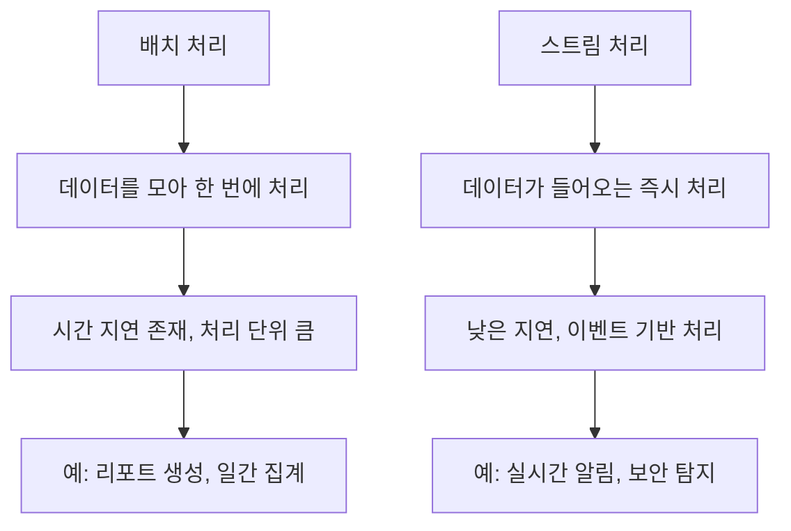
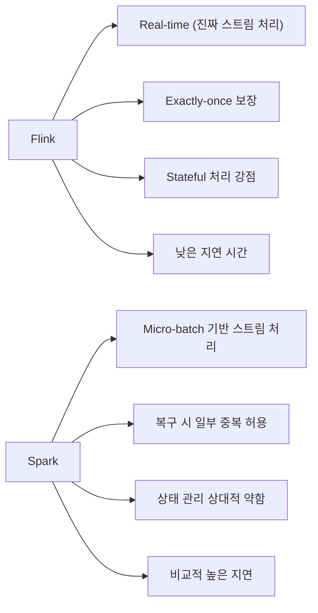
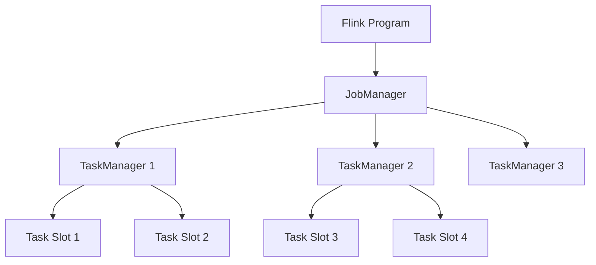
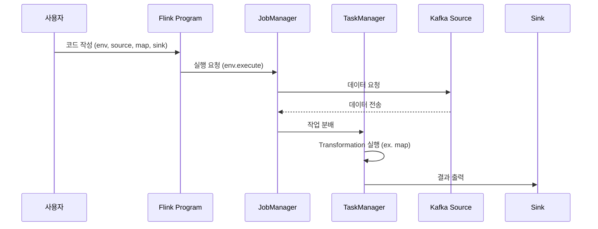

# Flink 설치와 기본 구조 

```text
[Abstract]

본 정리본은 Apache Flink의 구조와 동작 원리에 대해 비전공자도 이해할 수 있도록 체계적으로 구성한 학습 자료이다.
데이터 처리 기술의 흐름 속에서 Flink가 등장하게 된 배경으로는 빅데이터 시대의 도래, 실시간 분석에 대한 수요 증가, 기존 배치 처리 시스템의 한계가 있다.
이에 따라 본 정리본에서는 배치 처리와 스트림 처리의 개념을 비교하며, Flink가 스트림 처리 분야에서 갖는 기술적 강점을 설명한다.

Flink는 실시간 이벤트 처리에 최적화된 분산 스트림 처리 엔진으로서, 정확한 결과 보장(exactly-once semantics), 상태 기반 처리(stateful processing), 고확장성, 다양한 언어 지원 등의 특징을 지닌다.
또한 Flink의 아키텍처는 사용자의 프로그램 구조(Flink Program), 중앙 통제 역할을 수행하는 JobManager, 실제 작업을 실행하는 TaskManager로 구성되어 있으며, 각 구성 요소는 병렬성과 안정성을 고려하여 설계되어 있다.

실제 사례로는 Netflix의 시청 로그 분석, 삼성전자의 SmartThings 센서 데이터 처리, NortonLifeLock의 보안 위협 탐지 등 다양한 산업군에서 Flink가 실시간 데이터 분석의 핵심 인프라로 활용되고 있음을 보여준다.
아울러 Python API(PyFlink)를 활용한 기본 코드 예제와 함께, WSL 기반의 설치 및 실행 환경 설정 절차도 실습 중심으로 수록하였다.

본 정리본은 Flink의 기초부터 실습까지 아우르며, 데이터 기반 실시간 의사결정 환경을 이해하고자 하는 학습자에게 실질적인 도움을 주는 것을 목표로 한다.
```

1\. Flink 개요와 등장 배경
-------------------

### 1.1 빅데이터 시대의 요구

#### 💡 빅데이터 개념의 등장

디지털 기술의 비약적인 발전과 함께 웹, 모바일, IoT 등 다양한 환경에서 생성되는 데이터의 양은 폭발적으로 증가하였다. 단순히 크기만 큰 데이터를 의미하는 것이 아니라, **속도(velocity), 다양성(variety), 정확도(accuracy), 가치(value)** 등 여러 속성을 포괄하는 ‘**빅데이터**’가 등장하였다. 이러한 데이터를 처리하기 위해서는 기존의 전통적인 데이터베이스 방식으로는 한계에 부딪히게 되었고, 대안이 필요하게 되었다.

#### 💡 실시간 데이터 처리 기술의 발전

과거에는 데이터를 수집한 후 분석까지 수 시간이 걸리는 것이 일반적이었다. 하지만 현대 사회에서는 실시간으로 반응하고 예측할 수 있는 시스템이 필수적이다. 예를 들어 다음과 같은 사례를 생각해볼 수 있다:

*   **교통 관리 시스템**: 도로 위의 교통량을 실시간으로 분석하여 신호를 제어
    
*   **금융 거래 감시**: 수상한 거래를 실시간으로 감지하여 보안 강화
    
*   **SNS 분석**: 실시간 트렌드를 분석하여 마케팅 전략 수립
    

이처럼 **데이터의 발생과 동시에 분석과 반응이 이루어지는 '실시간 처리 기술'** 이 점점 더 중요해지고 있다.

#### 💡 기존 배치 처리 시스템의 한계

과거에는 Hadoop이나 Spark Batch와 같은 시스템을 통해 데이터를 일괄적으로 처리하는 방식(배치 처리)이 주로 사용되었다. 하지만 이 방식은 다음과 같은 한계점을 갖는다:

*   일정 간격으로 데이터를 모아 처리 → 분석 지연 발생
    
*   실시간 대응이 어려움
    
*   빠르게 변화하는 데이터를 반영하기 어려움
    

> 예를 들어, 하루치 데이터를 모아 매일 자정에 분석을 시작한다면, 오전 10시에 발생한 이상 현상은 다음 날 자정에나 감지될 수 있다.

<br>

### 1.2 스트림 처리 기술의 필요성과 발전

이러한 문제를 해결하기 위해 등장한 것이 **스트림 처리(Stream Processing)** 기술이다. 스트림 처리는 데이터가 들어오는 즉시 처리하여 **지연 없이 실시간 분석을 가능하게** 한다.

*   배치 처리: "한꺼번에 모아서 처리"
    
*   스트림 처리: "하나하나 들어오는 즉시 처리"
    

이 방식은 특히 **사용자 경험, 보안, 추천 시스템, IoT 분야** 등 실시간성이 요구되는 영역에서 필수적인 기술로 자리잡고 있다.

<br>

### 1.3 Flink란 무엇인가?

Apache Flink는 이러한 **실시간 스트림 처리**를 전문적으로 수행하는 **오픈소스 분산 처리 엔진**이다. Flink는 단순한 데이터 처리 툴이 아니라, **고성능, 고신뢰성, 고유연성**을 모두 갖춘 시스템으로서 다음과 같은 특징을 가진다:

*   **실시간 스트림 처리**에 최적화되어 있음
    
*   **Exactly-once** 보장: 한 번만 처리되도록 정확성을 유지
    
*   **상태 관리** 기능 내장: 예를 들어 ‘이전 상태와 비교하여 이상 여부 판단’이 가능
    
*   **분산 시스템으로 무한히 확장 가능**
    
*   다양한 언어(Python, Java, Scala 등) 지원
    

Flink는 현재 **Netflix, Alibaba, Uber, 삼성전자** 등 대형 기업에서 실시간 데이터 분석의 핵심 엔진으로 활용되고 있으며, 특히 **대규모 데이터를 다루는 환경에서 안정성과 속도 면에서 우수한 성능을 보인다.**

<br>

### 📌 요약 정리

| 항목 | 내용 |
| --- | --- |
| 등장 배경 | 실시간 분석 필요성 증가, 배치 처리 한계 |
| 스트림 처리 | 데이터 유입 즉시 처리하는 기술 |
| Flink | 실시간 스트림 처리를 위한 오픈소스 분산 처리 시스템 |
| 특징 | 정확성, 상태관리, 확장성, 유연성, 높은 처리 성능 |

<br>
<br>

2\. 배치 처리 vs 스트림 처리
-------------------

### 2.1 배치 처리 (Batch Processing)

#### 🧩 정의

배치 처리는 일정 시간 동안 데이터를 수집한 뒤, **한 번에 일괄적으로 처리**하는 방식이다. 우리가 흔히 사용하는 엑셀 프로그램에서 수천 개의 행 데이터를 정렬하거나 평균을 구할 때, 버튼 한 번으로 "전체 데이터를 계산"하는 것과 유사하다.

#### 📦 특징

*   데이터가 모일 때까지 기다린 후 처리
    
*   처리 단위가 크고, 일정 주기로 실행됨 (ex. 하루 한 번)
    
*   설계가 상대적으로 단순하고 안정적
    
*   분석 결과가 지연되어 발생 (latency 존재)
    

#### 🔍 예시

*   하루 동안의 주문 데이터를 집계하여 다음 날 보고서 생성
    
*   사용자의 1주일 평균 접속시간을 통계 내는 작업
    

<br>

### 2.2 스트림 처리 (Stream Processing)

#### 🧩 정의

스트림 처리는 데이터가 발생하는 순간마다, 즉 **실시간으로 데이터를 처리하는 방식**이다. 처리의 단위는 데이터 한 건 한 건이다. 이 방식은 특히 **즉시 반응이 필요한 시스템**에서 핵심적인 역할을 한다.

#### ⚙️ 특징

*   데이터가 들어오는 즉시 처리
    
*   처리 지연 시간(latency)이 매우 짧음 (수 밀리초 단위도 가능)
    
*   상태(state)를 유지하며 연속적인 계산 가능
    
*   시스템 복잡도가 다소 높지만, 실시간성 요구 상황에 매우 적합
    

#### 🔍 예시

*   실시간 교통량에 따른 신호 조정 시스템
    
*   실시간 신용카드 이상 거래 탐지
    
*   실시간 주식 가격 변화 알림
    

<br>

### 🆚 배치 처리 vs 스트림 처리 요약 비교



<br>

| 항목 | 배치 처리 | 스트림 처리 |
| --- | --- | --- |
| 처리 방식 | 데이터를 모아 일괄 처리 | 데이터가 들어올 때마다 실시간 처리 |
| 처리 시간 | 수 초 ~ 수 시간 | 수 밀리초 ~ 수 초 |
| 사용 사례 | 집계, 통계 분석, 리포트 생성 | 실시간 이상 탐지, 알림 시스템 |
| 복잡도 | 낮음 (단순한 파이프라인) | 상대적으로 높음 (상태, 연산 지속성 필요) |
| 대표 기술 | Hadoop MapReduce, Spark | Flink, Kafka Streams, Spark Structured Streaming |

> 💬 비유로 말하자면, **배치 처리**는 우편물 분류 작업처럼 "일단 모아서 한 번에 처리",  
> **스트림 처리**는 실시간 채팅처럼 "들어오자마자 반응"하는 방식이야.

<br>
<br>

3\. Spark vs Flink
------------------

### 3.1 비교 개요

Apache Spark는 원래 **배치 처리에 강점**을 가진 프레임워크로 등장했으며, 이후에 스트림 기능(Structured Streaming)을 추가하면서 스트림 처리도 지원하게 되었다. 반면, Apache Flink는 **처음부터 스트림 처리에 최적화**되어 설계된 엔진이다.

<br>

### 3.2 주요 비교 항목

| 비교 항목 | Spark | Flink |
| --- | --- | --- |
| 처리 철학 | 배치 우선 + 스트림 보완 | 스트림 우선 (배치도 스트림으로 간주) |
| 정확성 보장 | At-least-once, Exactly-once (일부 제한적) | Exactly-once 처리 보장 |
| 상태 처리(State) | 제한적 지원 (특히 배치 중심) | 내장된 복원 가능 상태 처리 |
| 복구 방식 | 마이크로배치 기반 체크포인트 | 정확한 상태 스냅샷 기반 복구 |
| 처리 지연 시간 | 비교적 높음 (마이크로배치 구조) | 매우 짧음 (진짜 실시간) |
| 예시 도메인 | 빅데이터 분석, ML 학습 | 실시간 이벤트 분석, IoT, 로그 모니터링 |

<br>

### 3.3 Yahoo Benchmark 실험 결과

Yahoo에서는 실시간 광고 클릭 로그 처리 성능을 측정하기 위해 유명한 **Yahoo Streaming Benchmark**를 수행하였다. 결과는 다음과 같다:

*   **Throughput(처리량)**: Flink가 Spark보다 **최대 2배 이상 높은 처리량**을 보임
    
*   **Latency(지연 시간)**: Flink는 수 밀리초 단위, Spark는 수 초 단위
    
*   **정확성**: Flink는 정확한 결과 보장을 기본으로 제공
    

이 결과는 **Flink가 스트림 처리 성능과 안정성 모두에서 Spark보다 유리함을 보여준다.**

<br>

### 📌 요약 정리



<br>

| 핵심 포인트 | 설명 |
| --- | --- |
| 배치 vs 스트림 | 배치는 모아서 한 번에, 스트림은 실시간 개별 처리 |
| Flink vs Spark | Flink는 스트림에 특화, Spark는 배치 중심에 스트림 보완 |
| Yahoo Benchmark | Flink가 처리 속도, 정확성 모두에서 앞섬 |

<br>
<br>

4\. Flink 아키텍처 구조
-----------------



### 4.1 Flink Architecture 개요

Flink는 단순한 라이브러리가 아니라, **분산 처리 시스템(distributed stream processor)** 으로서 수많은 노드들로 구성된 클러스터에서 데이터를 처리한다. 이 구조는 크게 세 가지 핵심 요소로 구성된다:

1.  **Flink Program** – 사용자가 작성한 코드
    
2.  **JobManager** – 작업의 전체 계획을 세우고 관리하는 관리자
    
3.  **TaskManager** – 실제 데이터를 처리하는 작업자
    

이 세 가지가 협업하여 실시간 스트리밍 데이터를 **끊김 없이**, **정확하게**, **확장 가능하게** 처리한다.

<br>

### 4.2 Flink Program: 사용자 코드의 처리 흐름

Flink에서 사용자가 작성한 프로그램은 다음의 구조를 따른다:


<br>

#### 🏗️ 1. 실행 환경 생성

가장 먼저 실행 환경(`StreamExecutionEnvironment`)을 생성한다. 이 환경은 Flink에게 “어떻게 실행할지”를 알려주는 설정 기반이다.

```python
env = StreamExecutionEnvironment.get_execution_environment()
```

#### 📥 2. 데이터 소스 정의

데이터는 Kafka, 파일, 소켓, 데이터베이스 등 다양한 형태에서 들어올 수 있다.

```python
data = env.from_elements("hello", "world")
```

#### 🔁 3. 데이터 변환 (Transformation)

들어온 데이터를 필터링하거나 집계하는 등 다양한 변환 작업을 적용한다.

```python
processed = data.map(lambda x: x.upper())
```

#### 📤 4. 데이터 싱크 정의

처리된 데이터를 어디에 보낼지 정한다. 파일, 데이터베이스, 콘솔 출력 등으로 전송할 수 있다.

```python
processed.print()
```

#### ▶️ 5. 실행 명령 (execute)

작성한 모든 작업을 실행하기 위해 `env.execute()` 명령을 호출하면 Flink 프로그램이 실행되기 시작한다.

```python
env.execute("My Flink Job")
```

<br>

### 4.3 JobManager: 두뇌 역할

JobManager는 클러스터 전체의 **중앙 통제 센터**다. Flink 프로그램이 실행되면 JobManager는 다음과 같은 일을 한다:

#### 🗺️ 작업 계획 수립

*   사용자가 작성한 코드를 논리적 실행 계획으로 변환
    
*   이를 다시 물리적 실행 계획으로 최적화
    

#### 🧠 리소스 관리 및 스케줄링

*   어떤 TaskManager가 어떤 작업을 맡을지 결정
    
*   각 작업이 언제 어디서 실행될지 배정
    

#### 💥 장애 복구

*   실행 중 TaskManager가 실패하면 자동으로 복구
    
*   체크포인트를 기반으로 정확한 위치에서 재실행 가능
    

#### 🔌 통신 및 조정

*   TaskManager와 지속적인 신호(하트비트)를 주고받음
    
*   상태 유지, 병렬도 조정 등 관리
    

#### 🌐 웹 UI 제공

*   사용자는 웹 대시보드에서 Job의 상태, 성능 지표 등을 확인할 수 있음 (`localhost:8081`)
    

<br>

### 4.4 TaskManager: 실행자 역할

TaskManager는 실제 데이터를 처리하는 노드다. 하나의 JobManager 아래에 여러 개의 TaskManager가 존재한다.

#### ⚙️ 태스크 실행

*   JobManager가 보낸 명령에 따라 데이터를 처리하는 태스크(task)를 수행
    
*   병렬 처리 단위인 작업 슬롯(task slot)을 통해 동시에 여러 작업 수행 가능
    

#### 🧮 리소스 및 메모리 관리

*   하나의 TaskManager는 여러 CPU와 메모리를 가짐
    
*   작업 슬롯마다 1/N씩 자원을 할당하여 효율적으로 사용
    

#### 🔁 데이터 버퍼링 및 전송

*   네트워크를 통해 다른 TaskManager와 데이터 전송
    
*   이 과정에서 데이터는 내부 버퍼에 저장되며, 처리 속도에 영향을 미침
    

#### 📡 상태 모니터링

*   JobManager에 주기적으로 상태 전송
    
*   오류 발생 시 JobManager가 감지하고 자동 재시도
    

<br>

### 4.5 작업 슬롯(Task Slot)과 병렬 처리

TaskManager는 내부적으로 \*\*작업 슬롯(Task Slot)\*\*을 가진다. 이는 CPU 코어와 유사하게 병렬로 작업을 처리하는 단위다. 예를 들어, 4개의 슬롯을 가진 TaskManager는 4개의 태스크를 동시에 처리할 수 있다.

*   기본적으로 **슬롯 1개당 1개 태스크** 실행
    
*   Flink는 **작업 슬롯 공유 기능**을 제공하여 효율적으로 리소스를 사용할 수 있게 해줌
    
*   이 구조는 **작업 단위가 많을수록 성능에 유리**하게 작용한다
    

<br>

### 📌 요약 정리

| 구성 요소 | 설명 |
| --- | --- |
| Flink Program | 사용자가 작성하는 코드, 소스 → 변환 → 싱크 구조 |
| JobManager | 계획 수립, 리소스 할당, 장애 복구 담당 |
| TaskManager | 실제 실행 담당, 슬롯 기반 병렬 처리 |
| 작업 슬롯 | TaskManager의 병렬 처리 단위, 리소스 분할 관리 |

<br>
<br>

5\. Flink의 주요 특징 및 기술적 강점
-------------------------

### 5.1 실시간 처리 능력 (True Stream Processing)



Apache Flink는 **실시간 스트림 처리**를 “태생적으로” 지원한다.  
이는 다른 프레임워크들이 **마이크로배치(micro-batch)** 방식으로 데이터를 빠르게 일괄 처리하는 것과 달리,  
Flink는 데이터가 들어오는 즉시 즉시 처리하는 **이벤트 단위 처리(Event-at-a-time)** 방식을 채택하고 있다.

*   ✔ 진짜 실시간: 데이터가 생성되는 순간 즉시 처리 가능
    
*   ✔ 낮은 지연 시간 (millisecond 단위)
    
*   ✔ 지연 발생 없이 연산 연속성 유지
    

> 💬 예를 들어, 실시간 신용카드 사기 탐지 시스템은 단 몇 초 안에 거래를 분석하고 차단해야 한다. 이처럼 실시간성이 생명인 분야에서 Flink는 높은 평가를 받고 있다.

<br>

### 5.2 정확한 결과 보장 (Exactly-once Semantics)

실시간 시스템에서 가장 중요한 문제 중 하나는 **중복 처리나 누락**이 발생하지 않도록 하는 것이다.  
Flink는 **Exactly-once 처리 보장**을 통해 이 문제를 해결한다.

*   **Exactly-once란?**  
    → 하나의 이벤트가 시스템 내에서 **정확히 한 번만 처리**된다는 의미
    
*   ✔ Flink는 내부적으로 **체크포인트(Checkpoint)** 및 **상태 스냅샷(snapshot)** 기능을 활용하여 정확성 보장
    
*   ✔ 장애가 발생하더라도, 마지막 체크포인트로부터 정확하게 복원 가능
    
*   ✔ Kafka 등 외부 시스템과 연동 시에도 트랜잭션을 통해 exactly-once 보장 가능
    

> 💡 대부분의 시스템은 **at-least-once**(중복 가능) 또는 **at-most-once**(누락 가능) 보장이 일반적인데,  
> Flink는 이보다 더 엄격한 신뢰도를 제공한다는 점에서 차별화된다.

<br>

### 5.3 상태 관리 (Stateful Stream Processing)


Flink는 단순히 데이터를 읽고 쓰는 수준이 아니라, **이전 상태를 기억하고 이어서 처리하는 능력**을 갖추고 있다.  
이 상태는 단순 카운터부터 시간 기반 윈도우 연산까지 폭넓게 사용된다.

*   ✔ **Keyed State**: 키별로 상태를 유지하여 사용자 세션 분석, 클릭 수 계산 등에 활용
    
*   ✔ **Window State**: 일정 시간/수량 기준으로 집계 처리
    
*   ✔ 상태는 디스크에 저장되는 것이 아니라 **메모리 기반**으로 매우 빠르게 접근 가능
    
*   ✔ 장애 발생 시에도 상태를 보존할 수 있도록 **체크포인트와 연동**되어 안정적으로 관리됨
    

> 예를 들어, '5분 안에 3번 이상 로그인 실패 시 알림 발송'과 같은 요구사항은 상태 관리가 없이는 구현이 어렵다.

<br>

### 5.4 확장성과 분산 처리 구조

Flink는 설계부터 **분산 환경에서 동작**하도록 만들어졌으며, 대규모 데이터를 처리하는 데 적합하다.

*   ✔ 수십~수백 대의 노드로 클러스터 구성 가능
    
*   ✔ JobManager 1개, TaskManager 여러 개 → 작업 분산 처리
    
*   ✔ 필요에 따라 **작업 병렬도(parallelism)** 조정 가능
    
*   ✔ Task Slot을 활용한 효율적인 리소스 분배
    

> Flink는 아마존, 넷플릭스처럼 하루에도 수십억 건의 이벤트를 처리하는 기업에서도 안정적으로 운영되고 있다.

<br>

### 5.5 유연한 API 및 다양한 언어 지원

Flink는 다양한 프로그래밍 언어와 친화적인 인터페이스를 제공하며, **초보자부터 전문가까지** 모두 사용할 수 있도록 설계되었다.

*   ✔ Java, Scala, Python, SQL API 지원
    
*   ✔ PyFlink: Python 사용자도 손쉽게 접근 가능
    
*   ✔ Table API / SQL API: SQL을 쓰듯이 데이터 흐름 정의 가능
    
*   ✔ 복잡한 사용자 정의 함수(UDF)도 쉽게 작성 가능
    

> 💡 데이터 분석가가 SQL로 윈도우 집계 쿼리를 날리고, 개발자가 Python으로 로직을 작성하는 식의 협업도 가능하다.

<br>

### 📌 요약 정리

| 특징 | 설명 |
| --- | --- |
| 실시간 처리 | 이벤트 발생 즉시 처리하는 진짜 스트림 처리 |
| 정확성 보장 | Exactly-once 보장으로 중복/누락 없는 결과 제공 |
| 상태 관리 | 세션, 집계 등 상태 기반 연산 지원 |
| 확장성 | 분산 처리와 병렬성 설정으로 대규모 데이터 대응 |
| 유연한 API | 다양한 언어 및 인터페이스로 접근성 높음 |

<br>
<br>

6\. Flink 활용 사례
---------------

### 6.1 Netflix: 대규모 스트리밍 로그 분석

**Netflix**는 전 세계 수억 명이 사용하는 대표적인 OTT 플랫폼이다.  
이들은 사용자 시청 로그, 검색 패턴, 장치 상태 등을 **실시간으로 수집하고 분석**해야 한다.  
Flink는 Netflix의 다음과 같은 목적에 사용된다:

*   📊 **시청 데이터 분석**: 어떤 장르가 어느 시간대에 인기 있는지 분석
    
*   🔄 **개인화 추천 시스템**: 실시간으로 시청 데이터를 반영하여 추천 콘텐츠 업데이트
    
*   🛡️ **서비스 품질 모니터링**: 재생 오류, 지연 발생 등을 빠르게 탐지하고 복구
    

> 💡 Netflix는 기존의 Spark 스트리밍을 사용하다가, **실시간성 한계**를 느끼고 Flink로 전환한 대표적인 기업이다.  
> Flink의 low-latency, exactly-once 보장이 그 전환의 핵심 이유였다.

<br>

### 6.2 SmartThings: IoT 센서 데이터 실시간 처리

**SmartThings**는 삼성전자가 운영하는 IoT(Internet of Things) 플랫폼으로,  
전등, 보일러, 도어락, 창문 센서 등 수많은 장치의 상태 정보를 **실시간으로 수집**한다.

Flink는 SmartThings에서 다음과 같은 용도로 활용된다:

*   📡 **센서 이벤트 스트리밍 처리**: 예를 들어, 창문이 열렸는지 닫혔는지를 실시간으로 감지
    
*   🧠 **규칙 기반 알림**: 특정 조건이 충족되면 푸시 알림 혹은 자동 제어 수행 (예: 밤 10시 이후 창문 열림 → 알림 발송)
    
*   ⏱️ **지연 없는 반응성**: 사용자 행동에 즉시 반응하여 자동화 동작 실행
    

> 💡 수십만 개의 장치에서 매초 발생하는 데이터를 빠짐없이 처리하려면 **정확성**과 **확장성**이 필수인데,  
> Flink는 이를 안정적으로 지원하고 있다.

<br>

### 6.3 그 외 기업들의 활용 사례

#### 🛡️ NortonLifeLock (구 Symantec)

*   보안 로그를 실시간 분석하여 **이상 탐지 및 공격 대응**
    
*   각종 악성 코드나 의심 행동을 즉시 식별하기 위해 Flink를 채택
    

#### 🏒 NHL (National Hockey League)

*   경기 중 선수의 위치, 속도, 패스 등을 실시간으로 분석
    
*   방송 그래픽, 팬 인터페이스 등에 즉시 반영하여 시청 경험 개선
    

#### 🏗️ Autodesk

*   CAD, 설계 소프트웨어에서 사용자 행동 데이터를 수집
    
*   사용자의 **행동 흐름 분석**을 통해 기능 개선에 반영
    
*   Flink로 클릭, 이동, 확대 등 모든 이벤트를 실시간 처리
    

<br>

### 🧠 사례 요약 정리

| 기업 | 사용 목적 | Flink의 기여 |
| --- | --- | --- |
| Netflix | 시청 로그 분석, 추천 시스템 | 빠른 처리 + 정확성 보장 |
| Samsung SmartThings | IoT 센서 이벤트 처리 | 대규모 이벤트 실시간 반응 |
| NortonLifeLock | 실시간 보안 위협 분석 | 이상 탐지의 정확성과 속도 |
| NHL | 스포츠 데이터 분석 | 실시간 위치 추적 및 시각화 |
| Autodesk | 제품 사용 분석 | 사용자 행동 기반 피드백 제공 |

<br>
<br>

7\. Flink 코드 구조 이해 (with PyFlink)
---------------------------------

### 7.1 전체 코드 흐름 개요

Flink 프로그램은 아래와 같은 순서로 구성된다:

1.  **실행 환경 생성** (`StreamExecutionEnvironment`)
    
2.  **데이터 소스 정의** (Source)
    
3.  **데이터 변환 로직 작성** (Transformation)
    
4.  **결과를 출력할 위치 설정** (Sink)
    
5.  **작업 실행 명령어 호출** (`env.execute()`)
    

이 구조는 마치 “공장 라인”처럼 데이터를 흘려보내는 **데이터 파이프라인**을 설계하는 것과 같다.

<br>

### 7.2 실행 환경 생성

```python
from pyflink.datastream import StreamExecutionEnvironment

env = StreamExecutionEnvironment.get_execution_environment()
```

*   Flink 프로그램은 반드시 이 환경 객체(`env`)에서 시작한다.
    
*   이 객체는 Flink에게 **“어떻게 실행할 것인지”** 알려주는 설정 공간이다.
    
*   예: 병렬도 설정, 체크포인트 활성화, 소스와 싱크 등록 등
    

```python
env.set_parallelism(1)  # 작업 병렬도 설정
```

<br>

### 7.3 데이터 소스 정의

```python
from pyflink.datastream import DataStream

data = env.from_collection(
    collection=["apple", "banana", "orange"],
    type_info=Types.STRING()
)
```

*   데이터를 외부에서 읽어올 수 있음 (Kafka, 파일 등)
    
*   위 코드는 리스트로부터 간단한 문자열 스트림을 생성
    
*   실습이나 테스트에 자주 쓰이는 방식
    

> 실제 환경에서는 다음과 같은 소스를 쓸 수 있다:
> 
> *   KafkaConsumer
>     
> *   FileSource (CSV, JSON 등)
>     
> *   SocketTextStream
>     

<br>

### 7.4 데이터 변환 (Transformation)

```python
processed = data.map(lambda x: x.upper())
```

*   `map`, `filter`, `flatMap`, `keyBy`, `reduce` 등 다양한 연산 제공
    
*   Flink는 이 과정을 통해 **데이터를 가공, 분류, 집계**할 수 있다
    

예시:

```python
from pyflink.common.typeinfo import Types

data = env.from_collection(
    [("apple", 3), ("banana", 5)],
    type_info=Types.TUPLE([Types.STRING(), Types.INT()])
)

# 과일 이름을 대문자로 변환
mapped = data.map(lambda x: (x[0].upper(), x[1]))
```

<br>

### 7.5 데이터 싱크 정의 (Sink)

```python
mapped.print()
```

*   `print()`는 콘솔에 결과를 출력하는 가장 간단한 싱크
    
*   실제 환경에서는 다음과 같은 싱크를 사용한다:
    
    *   KafkaSink
        
    *   FileSink (CSV, Parquet 등)
        
    *   JDBC Sink (DB 저장)
        

```python
from pyflink.datastream.connectors import StreamingFileSink
from pyflink.common.serialization import SimpleStringEncoder
from pyflink.common.typeinfo import Types
from pyflink.common.watermark_strategy import WatermarkStrategy
from pyflink.common import Duration

sink = StreamingFileSink \
    .for_row_format("/tmp/output", SimpleStringEncoder()) \
    .build()

mapped.add_sink(sink)
```

<br>

### 7.6 실행 명령 (`env.execute()`)

```python
env.execute("Simple Stream Job")
```

*   Flink 프로그램을 **실제로 실행**하는 트리거 명령
    
*   이 명령이 호출되기 전까지는 어떤 연산도 수행되지 않음 (lazy evaluation)
    
*   JobManager에게 Job을 제출하고 실행이 시작됨
    

<br>

### 📌 요약 정리

| 단계 | 내용 | 주요 메서드 |
| --- | --- | --- |
| 실행 환경 설정 | Flink 작업의 환경을 정의 | `StreamExecutionEnvironment.get_execution_environment()` |
| 데이터 소스 정의 | 데이터를 읽어오는 입력 파트 | `from_collection()`, `add_source()` |
| 데이터 변환 | 데이터를 필터링, 가공, 집계 | `map()`, `filter()`, `keyBy()`, `reduce()` |
| 데이터 싱크 | 처리된 데이터를 저장/출력 | `print()`, `add_sink()` |
| 작업 실행 | 실제로 Job을 실행 | `env.execute()` |

<br>
<br>

8\. Flink 설치 및 실행 환경 구성 (WSL 기반)
--------------------------------

### 8.1 Apache Flink 설치 (WSL 기준)

\*\*WSL (Windows Subsystem for Linux)\*\*은 윈도우 환경에서 리눅스를 사용할 수 있도록 해주는 기능이다.  
우리는 Ubuntu가 설치된 WSL 환경을 기준으로 Flink를 설치할 것이다.

#### 📦 설치 순서 요약

1.  [Flink 공식 사이트](https://flink.apache.org/downloads.html)에서 버전 다운로드
    
2.  압축 해제 및 환경 변수 설정
    
3.  실행 테스트
    

#### 🛠️ 설치 상세 절차

```bash
# 1. Flink 설치 디렉토리로 이동
cd /usr/local

# 2. Flink 다운로드 (버전은 필요에 따라 선택)
wget https://downloads.apache.org/flink/flink-1.20.0/flink-1.20.0-bin-scala_2.12.tgz

# 3. 압축 해제
tar -xvzf flink-1.20.0-bin-scala_2.12.tgz

# 4. 디렉토리 이름을 간단하게 변경
mv flink-1.20.0 flink

# 5. 환경 변수 등록 (bash 기준)
echo 'export FLINK_HOME=/usr/local/flink' >> ~/.bashrc
echo 'export PATH=$PATH:$FLINK_HOME/bin' >> ~/.bashrc
source ~/.bashrc
```

<br>

### 8.2 Flink 실행 테스트 (WordCount 예제)

Flink 설치가 끝났다면 가장 기본적인 **WordCount 프로그램**으로 동작 확인을 해보자.

#### ✅ WordCount 실행 방법

```bash
# Flink 실행
start-cluster.sh

# Flink 웹 UI 확인 (브라우저에서 열기)
http://localhost:8081

# WordCount 예제 실행 (Flink 예제 jar 제공됨)
flink run $FLINK_HOME/examples/streaming/WordCount.jar \
  --input $FLINK_HOME/README.txt \
  --output /tmp/result.txt
```

> 💡 실행 결과는 `/tmp/result.txt`에 저장된다.

<br>

### 8.3 PyFlink 설치 및 실행

Flink는 Python API인 **PyFlink**도 제공하고 있어 Python 사용자도 쉽게 접근할 수 있다.  
(단, Java 기반의 Flink 엔진 위에서 Python 코드를 실행하는 구조이므로 **Java & Python 환경이 모두 필요**하다.)

#### 📦 설치

```bash
pip install apache-flink
```

> 추가적으로 WSL에서는 `/tmp`, `/var` 디렉토리에 권한 문제가 생길 수 있으니 실행 전 `chmod`로 권한을 열어주는 것이 좋다.

```bash
sudo chmod -R 777 /tmp
```

<br>

### 8.4 PyFlink 예제 코드 실행

#### 📜 예제 코드: 단어 대문자 변환 스트림

```python
from pyflink.datastream import StreamExecutionEnvironment

env = StreamExecutionEnvironment.get_execution_environment()
env.set_parallelism(1)

data = env.from_collection(["apple", "banana", "melon"])

# 대문자 변환
processed = data.map(lambda x: x.upper())

# 결과 출력
processed.print()

# 실행
env.execute("Uppercase Stream")
```

#### ▶️ 실행 명령

```bash
python my_flink_job.py
```

*   콘솔에 다음과 같은 결과가 출력된다:
    
    ```
    APPLE
    BANANA
    MELON
    ```
    

<br>

### 8.5 DAG 시각화 확인

Flink 웹 UI에서는 작업이 어떻게 실행되고 있는지를 **시각적으로 확인**할 수 있다.  
PyFlink로 실행한 작업도 Flink 내부적으로는 DAG(Directed Acyclic Graph)로 구성되며,

*   각 연산이 어떤 흐름으로 연결되어 있는지
    
*   병렬로 어떻게 분산되는지
    
*   현재 상태가 어떤지
    

를 직관적으로 파악할 수 있다.

#### ✅ 접속 방법

```bash
http://localhost:8081
```

*   Job 실행 이력, TaskManager 상태, 병렬도 설정, 체크포인트 상황 등 확인 가능
    

<br>

### 📌 설치 & 실행 정리

| 단계 | 명령 / 내용 |
| --- | --- |
| Flink 다운로드 | `wget`, `tar`, `mv` |
| 환경 변수 등록 | `.bashrc`에 `FLINK_HOME` 등록 |
| Flink 실행 | `start-cluster.sh` |
| PyFlink 설치 | `pip install apache-flink` |
| PyFlink 실행 | `python my_flink_job.py` |
| 웹 UI 확인 | `http://localhost:8081` |
