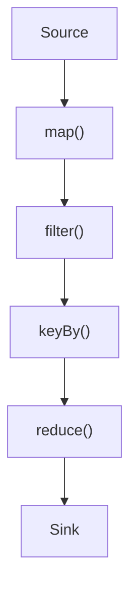
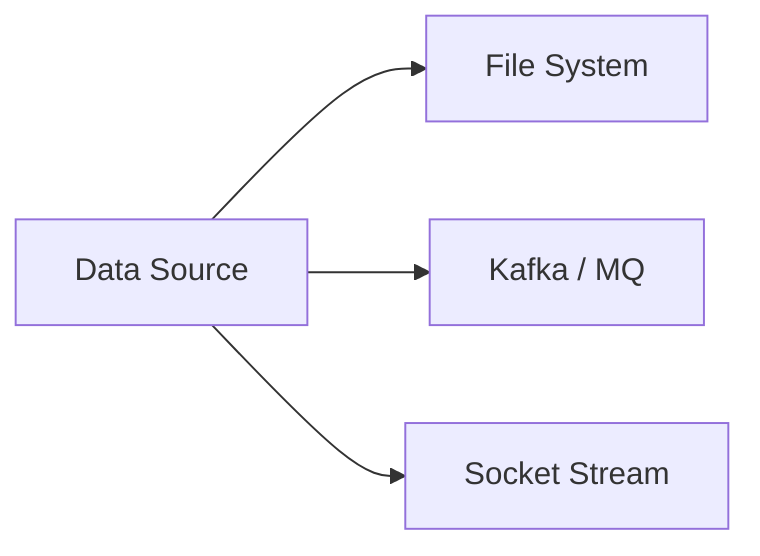
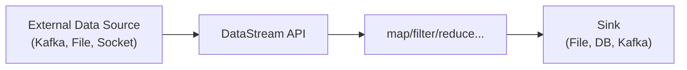
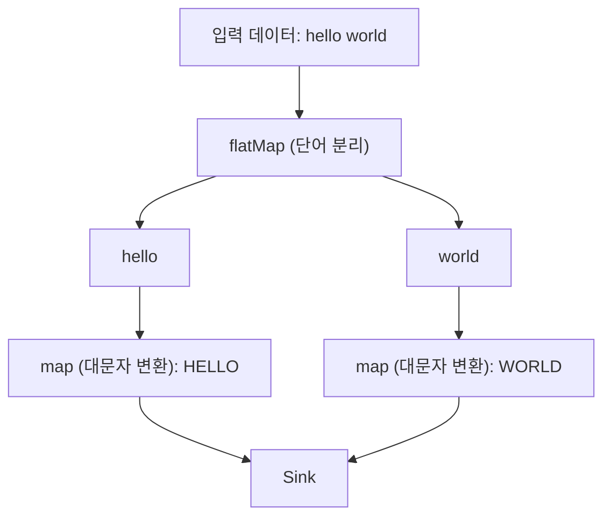
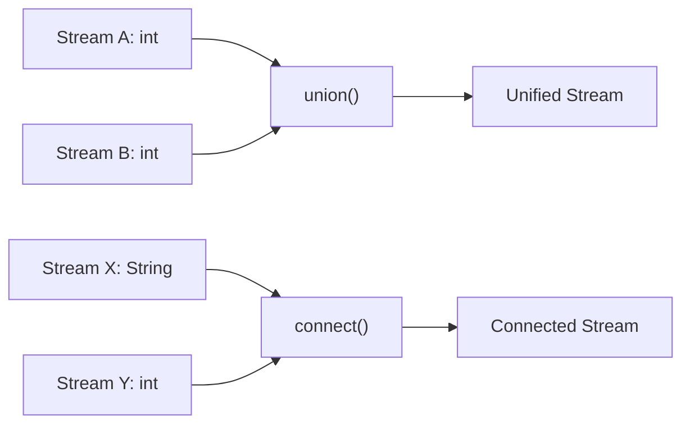
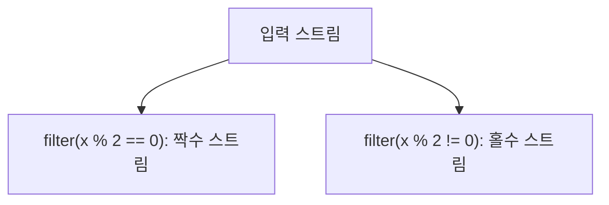
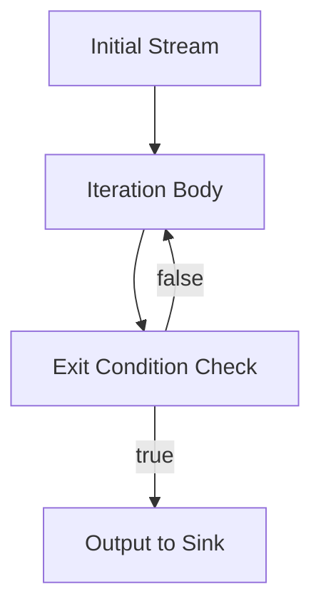

# DataStream

```text
[Abstract]

본 정리본은 Apache Flink의 **DataStream API**를 중심으로 실시간 데이터 스트림 처리의 핵심 개념과 구조, 연산 방식을 비전공자도 이해할 수 있도록 체계적으로 정리한 것이다.  
현대의 데이터 환경은 더 이상 정적인 분석에 머무르지 않으며, **실시간으로 유입되는 데이터에 대한 즉각적인 대응 능력**이 요구된다. 이에 따라 **스트림 처리(stream processing)** 기술은 데이터 엔지니어링, 분석, 추천 시스템, 이상 감지 등의 실무 전반에 걸쳐 핵심 도구로 자리매김하고 있다.

이 정리본은 크게 네 가지 주제로 구성된다. 첫 번째로, **스트림 처리의 개념과 배치 처리와의 비교**, Flink가 채택하고 있는 **DAG(Directed Acyclic Graph)** 기반 처리 모델에 대한 이해를 다룬다. 두 번째로, **DataStream API의 구성 요소**인 데이터 소스(Source)와 싱크(Sink)의 구조를 분석하며, 다양한 입력/출력 채널을 통한 스트림 파이프라인 설계 방법을 제시한다.

세 번째로는, Flink의 강력한 연산 기능에 대한 내용을 중심으로, `map`, `filter`, `keyBy`, `reduce`, `process` 등 핵심 연산자의 동작 방식과 `union`, `connect`를 통한 멀티 스트림 결합 방식까지 폭넓게 다룬다. 또한, PyFlink에서는 아직 지원되지 않지만 개념적으로 중요한 `iterate()`, `coFlatMap()` 등의 Java 전용 연산자도 함께 소개하였다.

마지막으로, 데이터 흐름을 더욱 세밀하게 제어하기 위한 \*\*스트림의 조건 분할(Filter)\*\*과 **반복 처리(Iteration)** 구조를 설명하며, 실시간 처리가 요구되는 다양한 시나리오에서의 응용 가능성을 제시하였다.

본 정리본은 비전공자 독자가 Flink 기반의 실시간 데이터 처리 시스템을 이해하고 설계할 수 있도록 돕는 것을 목표로 하며, 이후 보다 실무적인 프로젝트나 고급 분석 시스템 구현의 기반 지식을 제공하는 데 그 의의를 둔다.
```

<br>

1\. 스트림 처리 개요 (Stream Processing Overview)
------------------------------------------

### 1.1 스트림 처리란 무엇인가?

현대 데이터 환경에서는 정적인 데이터보다 **실시간으로 생성되고 변하는 데이터**를 처리하는 기술이 점점 더 중요해지고 있다. 이러한 실시간 데이터를 처리하는 방법론이 바로 **스트림 처리(Stream Processing)** 이다.

스트림 처리란, **데이터가 생성되는 즉시 한 건씩 처리하는 방식**을 의미하며, 이는 데이터가 쌓인 이후에 일괄 처리하는 방식인 **배치 처리(Batch Processing)** 와 구분된다.

이를 이해하기 쉽게 설명하자면, 스트림 처리는 마치 **동전 분류기**처럼 실시간으로 떨어지는 동전을 하나씩 바로 분류하는 방식이고, 배치 처리는 **은행 마감 후 하루 치 동전을 한꺼번에 분류하는 방식**과 같다.

또한, **마트의 계산대에 줄을 서서 하나씩 결제를 처리하는 방식**도 스트림 처리의 좋은 비유이다. 고객이 줄을 서서 기다리고 있는 상황에서, 한 명 한 명 결제가 끝날 때마다 바로 다음 고객을 처리하는 흐름은 스트림 처리의 실시간성과 유사하다.

<br>

### 1.2 Batch 처리와 Streaming 처리의 차이

| 구분 | 배치 처리 (Batch) | 스트림 처리 (Streaming) |
| --- | --- | --- |
| 처리 단위 | 일정량의 데이터를 한 번에 처리 | 데이터 한 건을 실시간으로 처리 |
| 처리 시점 | 데이터가 모두 쌓인 후 처리 | 데이터가 생성되자마자 처리 |
| 예시 | 일일 리포트 생성, 정산 | 실시간 모니터링, 이상 감지 |
| 장점 | 처리 안정성, 단순한 구조 | 낮은 지연 시간, 실시간 대응 가능 |
| 단점 | 지연 발생, 실시간 대응 불가 | 시스템 설계 복잡도 높음 |

스트림 처리는 **실시간 금융 거래 분석**, **IoT 센서 데이터 수집**, **실시간 사용자 로그 분석** 등 시의성이 중요한 상황에서 매우 유용하다. 반면, 배치 처리는 **월별 보고서 작성**, **집계 통계 계산** 등 비실시간 작업에 적합하다.

<br>

### 1.3 DataStream API란?

Apache Flink에서 제공하는 **DataStream API**는 실시간 스트림 데이터를 효율적으로 처리하기 위한 핵심 도구이다.  
이 API는 단순히 데이터를 받아들이는 것을 넘어서, 데이터를 **가공하고 변환하며**, **다양한 연산을 적용한 후 결과를 내보내는 흐름 전체**를 다룬다.

DataStream API는 다음과 같은 기능을 중심으로 구성된다:

*   **데이터 소스 연결 (Source)**  
    파일, 소켓, 메시지 큐 등 다양한 외부 시스템에서 데이터를 받아온다.
    
*   **변환 및 처리 (Transformation)**  
    필터링, 집계, 분할 등 다양한 연산을 통해 데이터를 원하는 형태로 가공한다.
    
*   **결과 저장 (Sink)**  
    처리된 데이터를 파일, 데이터베이스, 혹은 다른 시스템으로 전송한다.
    

<br>

### 1.4 Directed Acyclic Graph (DAG)란?

DataStream API는 내부적으로 모든 데이터 처리 과정을 **DAG(Directed Acyclic Graph)** 형태로 표현한다.  
DAG는 **방향성을 가지며, 사이클이 존재하지 않는 그래프 구조**로, 데이터가 흐르는 경로를 **논리적으로 시각화**한 것이다.



<br>

#### DAG의 구성 요소

*   **노드(Node)**: 연산 단계를 의미함 (ex. map, filter, sink 등)
    
*   **엣지(Edge)**: 데이터의 흐름을 나타냄
    

#### DAG를 사용하는 이유

*   연산 흐름이 명확하여 **최적화 및 병렬처리**에 유리함
    
*   데이터 흐름을 **시각적으로 표현**하기 쉬움
    
*   **사이클이 없기 때문에 무한 루프를 방지**할 수 있음
    

따라서, Flink는 DataStream 연산을 DAG로 변환하여 내부적으로 **효율적인 실행 계획을 수립**하고, 실행 시 병렬성을 최대로 활용할 수 있도록 구조화한다.

<br>
<br>

2\. DataStream API 구성 요소
------------------------

### 2.1 데이터 소스 (Source)

DataStream에서 데이터 처리는 언제나 **Source**, 즉 데이터를 가져오는 지점에서 시작된다.  
Flink는 다양한 형태의 데이터 소스를 지원하며, 실시간 처리 목적에 따라 Source의 종류를 선택할 수 있다.



#### 📌 주요 소스 유형

| 유형 | 설명 |
| --- | --- |
| **파일 시스템 (File System)** | 로컬 파일이나 HDFS 등의 분산 파일 시스템에서 데이터를 읽는다. (ex. `.csv`, `.txt`) |
| **메시지 큐 / 스트리밍 플랫폼** | Kafka, RabbitMQ, Pulsar 등과 같은 시스템에서 실시간으로 생성되는 데이터를 소비한다. |
| **소켓 스트림 (Socket Stream)** | TCP 소켓을 통해 외부 시스템에서 직접 들어오는 실시간 데이터를 수신한다. (학습 및 데모용으로 주로 사용됨) |

각 소스는 Flink의 환경에서 `env.addSource()` 혹은 PyFlink에서는 `StreamExecutionEnvironment().from_source()`와 같은 방식으로 연결할 수 있다.

#### 📎 예시 - PyFlink에서 소켓 연결

```python
env = StreamExecutionEnvironment.get_execution_environment()
ds = env.socket_text_stream("localhost", 9999)
```

<br>

### 2.2 데이터 소스 구성 방법

데이터 소스를 구성할 때 중요한 것은, **외부 시스템과 안정적으로 연결을 설정하고**, 필요한 경우 **역직렬화 방식**을 정의하는 것이다.  
Flink에서는 다음과 같은 절차로 소스를 구성한다:

1.  **데이터의 포맷 정의 (텍스트, JSON 등)**
    
2.  **소스와의 연결 설정 (ex. Kafka 토픽, 포트 번호 등)**
    
3.  **병렬성 설정 (Parallelism)**
    

이러한 설정은 코드뿐만 아니라 Flink SQL, 구성 파일 등 다양한 방법으로 이뤄질 수 있으며, 실무 환경에서는 **Kafka → JSON → 체크포인트** 설정과 함께 구성되는 경우가 많다.

<br>

### 2.3 싱크(Sink)

스트림 처리는 데이터를 수집하는 것뿐만 아니라, 처리된 데이터를 외부로 **저장하거나 전송하는 작업**, 즉 **Sink**로 마무리된다.

#### 🔁 데이터 흐름 구조



<br>

`소스(Source) → 연산(Transformations) → 싱크(Sink)`

#### 🧾 주요 Sink 유형

| 유형 | 설명 |
| --- | --- |
| **파일 시스템 Sink** | 처리 결과를 텍스트, CSV, JSON 등 형식으로 파일에 저장 |
| **Kafka Sink** | Kafka의 특정 토픽에 결과 데이터를 전송 |
| **데이터베이스 Sink** | JDBC를 이용해 RDBMS나 NoSQL에 저장 |
| **Print Sink** | 학습 또는 디버깅용 콘솔 출력 |

<br>

### 2.4 Sink 예제 – FileSink

실습 단계에서 가장 자주 쓰이는 Sink는 **FileSink**이다. PyFlink에서는 `StreamingFileSink`를 사용하고, Java에서는 encoder와 함께 더 복잡한 설정을 요구하기도 한다.

#### PyFlink 예시

```python
from pyflink.datastream.connectors import StreamingFileSink
from pyflink.common.serialization import SimpleStringEncoder
from pyflink.common.typeinfo import Types
from pyflink.common import ExecutionConfig

sink = StreamingFileSink \
    .for_row_format("/output/path", SimpleStringEncoder()) \
    .build()

data_stream.add_sink(sink)
```

이처럼 Sink를 설정할 때는 **출력 경로**, **데이터 포맷**, 그리고 **파일 분할 기준**(rolling policy 등)까지 고려할 수 있다.

<br>
<br>

3\. 데이터 변환과 연산 (Transformation & Operations)
--------------------------------------------

### 3.1 데이터 변환 개요

스트림 데이터는 대부분 **원시 데이터(raw data)** 상태로 수집된다. 이 데이터는 그대로는 활용 가치가 낮기 때문에, 특정 목적에 맞게 **가공(변환, 집계, 필터링 등)** 해야 한다.

Flink의 DataStream API는 이런 변환을 수행하는 다양한 연산자(operator)를 제공하며, 이 연산들은 대부분 **지연 평가(Lazy Evaluation)** 방식으로 수행된다.



<br>

### 3.2 지연 평가 (Lazy Evaluation)

지연 평가는 연산을 정의해도 **즉시 실행하지 않고**, **실제로 결과가 필요할 때 실행**하는 방식이다. Flink는 내부적으로 전체 연산 흐름을 그래프로 구성하고, 최종 Sink가 정의되어야 실행 계획을 트리거한다.

#### ✅ 지연 평가의 작동 방식

1.  **연산 정의**: map, filter, keyBy 등의 함수들을 호출해 처리 흐름을 설계
    
2.  **연산 계획 수립**: Flink는 이 흐름을 DAG(Directed Acyclic Graph)로 저장
    
3.  **최적화 기회 제공**: 여러 연산을 병합하거나 병렬화 가능성 탐색
    
4.  **Sink 호출 시 실행 시작**
    

#### 💡 Lazy Evaluation의 장점

| 항목 | 설명 |
| --- | --- |
| **효율성** | 불필요한 계산을 피하고 필요한 연산만 수행 |
| **성능 향상** | 연산 순서, 병렬성 등을 자동으로 최적화 |
| **유연성** | 연산 흐름을 자유롭게 구성 가능, 실행 시점에 맞춰 트리거 |

<br>

### 3.3 기본 변환 함수

#### ① `map()`: 한 요소를 다른 형태로 변환

```python
# 문자열을 대문자로 변환
stream.map(lambda x: x.upper())
```

*   입력값 1개 → 출력값 1개
    
*   가장 기본적인 변환 함수
    

#### ② `flatMap()`: 하나의 요소를 여러 개로 펼침

```python
# 문장을 단어로 나누기
stream.flat_map(lambda line: line.split(" "))
```

*   입력값 1개 → 출력값 다수
    
*   텍스트 분리, 토큰화 등에 활용
    

#### ③ `filter()`: 조건에 맞는 요소만 남기기

```python
# 숫자 중 짝수만 통과
stream.filter(lambda x: x % 2 == 0)
```

*   조건식 기반 데이터 선별
    
*   실시간 이상 탐지나 특정 사용자 필터링에 유용
    

<br>

### 3.4 그룹화 및 집계 함수

#### ① `keyBy()`: 그룹화 기준 설정

```python
# 사용자 ID를 기준으로 데이터 그룹화
stream.key_by(lambda x: x.user_id)
```

*   MapReduce의 groupBy와 유사
    
*   이후 reduce, process 함수와 함께 사용됨
    

#### ② `reduce()`: 집계 연산

```python
# 최대값 유지
stream.key_by(lambda x: x.key).reduce(lambda a, b: max(a, b))
```

*   누적 계산, 최댓값, 합계 등에 활용
    
*   상태 기반의 연산에 적합
    

#### ③ `process()`: 고급 연산 가능 (저수준 API)

*   `ProcessFunction`, `KeyedProcessFunction` 등
    
*   타이머 등록, 상태 관리 등 고급 기능 지원
    

```python
class MyProcessFunction(KeyedProcessFunction):
    def process_element(self, value, ctx):
        # 사용자 정의 로직
        yield value

stream.key_by(lambda x: x.key).process(MyProcessFunction())
```

*   실시간 경고, 타임윈도우 제어 등에서 사용됨
    

<br>

### 3.5 멀티 스트림 및 결합 함수

스트림 처리에서는 **하나의 데이터 흐름만 사용하는 것이 아니라**,  
여러 개의 스트림을 **합치거나 연결하여 함께 처리**하는 경우가 많다.  
Flink의 DataStream API는 이러한 연산을 위한 다양한 함수들을 제공한다.



#### ① `union()`: 여러 스트림을 하나로 합치기

*   동일한 타입의 여러 스트림을 하나로 결합
    
*   스트림을 수평적으로 붙이는 개념
    

```python
stream1 = env.from_collection([1, 2, 3])
stream2 = env.from_collection([4, 5, 6])
combined = stream1.union(stream2)
```

> ⚠️ 모든 스트림은 **동일한 타입이어야 한다**.


#### ② `connect()`: 서로 다른 타입의 두 스트림 연결

*   두 개의 **서로 다른 타입의 스트림**을 결합
    
*   이후 각각을 따로 처리할 수 있는 `CoMapFunction` 또는 `CoFlatMapFunction` 사용
    

```python
stream1 = env.from_collection(["apple", "banana"])
stream2 = env.from_collection([1, 2])

connected = stream1.connect(stream2)
```

> `connect()`는 **둘을 나란히 붙이는 것**이 아니라,  
> 각 스트림의 데이터를 **개별적으로 다룰 수 있도록 연결**한다는 개념이다.

<br>

### 3.6 PyFlink에서 지원되지 않는 Java 전용 연산자

Apache Flink는 Java 기반으로 만들어졌기 때문에,  
Java/Scala API에서는 사용 가능하지만 **PyFlink에서는 아직 지원되지 않는 연산자**들도 존재한다.  
그 중에서도 몇 가지는 구조적으로 중요한 개념이기 때문에 알아두는 것이 좋다.


#### ❌ `split()`

*   하나의 스트림을 조건에 따라 여러 스트림으로 나눔
    
*   PyFlink에서는 deprecated 또는 미지원 상태
    
*   대신 `filter()`를 여러 개 써서 목적별로 분리 가능
    


#### ❌ `connect().coFlatMap()`

*   `connect()` 후 두 스트림 각각에 **flatMap 연산**을 적용할 수 있는 함수
    
*   PyFlink에서는 일반적으로 별도로 사용자 정의 클래스로 구현해야 함
    


#### ❌ `iterate()`

*   **반복적 처리**를 구현할 수 있는 기능
    
*   예: 머신러닝의 반복 학습, 점진적 수렴 연산
    
*   PyFlink는 지원이 미미하거나 안정성이 낮아 사용 제한적
    


#### ❌ `CustomPartitioner`

*   사용자가 직접 파티셔닝 전략을 정의할 수 있는 기능
    
*   Java에서는 `partitionCustom()` 사용 가능
    
*   PyFlink에서는 공식적으로는 미지원이나 workaround로 구현 가능
    

<br>

이처럼 PyFlink는 비교적 최근에 발전하고 있는 인터페이스이기 때문에,  
Java에 비해 일부 고급 기능이나 저수준 API는 제한이 있는 경우가 많다.  
그러나 **대부분의 일반적인 스트림 처리 시나리오에서는 PyFlink만으로도 충분**히 구현이 가능하다.

<br>
<br>

4\. 데이터 스트림의 분할 및 반복 (Stream Splitting & Iteration)
---------------------------------------------------

### 4.1 데이터 스트림 분할 (Stream Splitting)

하나의 스트림 내에는 다양한 목적과 속성을 가진 데이터가 섞여 있는 경우가 많다. 이럴 때는 **하나의 데이터 스트림을 조건에 따라 나누어 하위 스트림들로 분리**할 수 있다.

이러한 분할은 크게 두 가지 방식으로 구현할 수 있다:


#### ✅ ① 조건 필터 기반 분할 – `filter()`

가장 단순하고 효과적인 방식은 여러 개의 `filter()`를 사용하는 것이다.

```python
even_stream = stream.filter(lambda x: x % 2 == 0)
odd_stream = stream.filter(lambda x: x % 2 != 0)
```

*   하나의 원본 스트림에서 짝수/홀수로 분할
    
*   각각 다른 처리 방식 적용 가능
    
*   PyFlink에서는 **split() 연산이 deprecated**되었기 때문에 이 방식이 일반적
    


#### 📌 사용 예시

*   금융 거래에서 이상 거래만 따로 분석
    
*   로그 데이터에서 에러 로그만 추출
    
*   이벤트 로그에서 특정 사용자 ID만 별도로 분리
    

<br>

### 4.2 데이터 스트림 반복 (Stream Iteration)

#### 🌀 개요

반복(iteration)은 **같은 연산을 데이터에 여러 번 적용하여 점진적으로 개선**하거나,  
**조건이 충족될 때까지 반복 수행**하는 구조를 구현할 때 사용된다.  
예를 들어, 머신러닝 학습, 수렴 기반 알고리즘, 그래프 탐색 등이 이에 해당한다.



#### 🔄 반복 처리 흐름

1.  **초기 입력 스트림** 설정
    
2.  **반복 처리 로직 정의** (단일 함수로 반복 연산)
    
3.  **조건부 종료 또는 피드백 루프 구성**
    
4.  **결과 출력 또는 다음 연산 단계로 전달**
    


#### 🧱 PyFlink에서의 구현 방식

PyFlink는 현재 명시적인 `iterate()` API를 공식 지원하지 않는다.  
따라서 반복 로직은 일반적으로 **`while` 루프 기반 외부 반복**, 또는 **상태 기반 타이머와 조건문**을 조합하여 구현해야 한다.


#### 🧠 반복 사용 시 주의사항

| 항목 | 설명 |
| --- | --- |
| **종료 조건** | 무한 루프 방지를 위해 반드시 종료 조건이 필요하다. |
| **상태 관리** | 각 반복 단계의 상태를 저장하고 이어받아야 하기 때문에 `state backend` 설정이 중요하다. |
| **성능 고려** | 반복은 연산량이 많고 리소스를 소모하므로 병렬성, 버퍼 관리 등을 최적화해야 한다. |


#### 💡 반복 처리 예시

*   **PageRank 알고리즘**: 링크 구조를 기반으로 페이지 중요도를 반복 계산
    
*   **KMeans Clustering**: 각 데이터를 중심점에 반복적으로 할당하고 중심 재계산
    
*   **이벤트 추적**: 특정 조건을 만족할 때까지 알람 대기 상태 유지
    

<br>

마무리 정리
------

지금까지 우리는 Flink의 DataStream API를 기반으로 다음과 같은 흐름을 학습했다:

1.  스트림 처리의 개념과 필요성
    
2.  데이터 소스와 싱크를 통한 입출력 구조
    
3.  다양한 데이터 변환 및 그룹화, 필터링 연산
    
4.  스트림의 분할과 반복 로직을 통한 고급 제어
    

이러한 개념들은 **단순히 이론으로 그치는 것이 아니라**, 실제로는 **실시간 이상 탐지 시스템**, **추천 엔진**, **IoT 센서 데이터 분석**, **실시간 사용자 행동 분석** 등 다양한 현업 시스템의 기초를 이룬다.