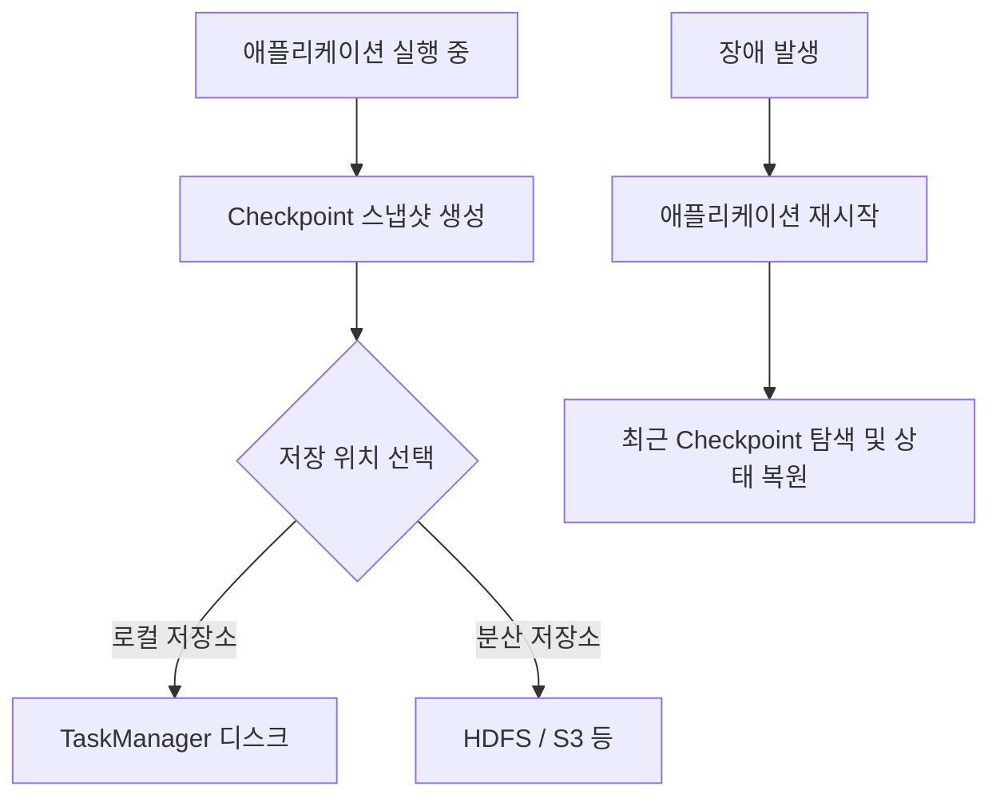
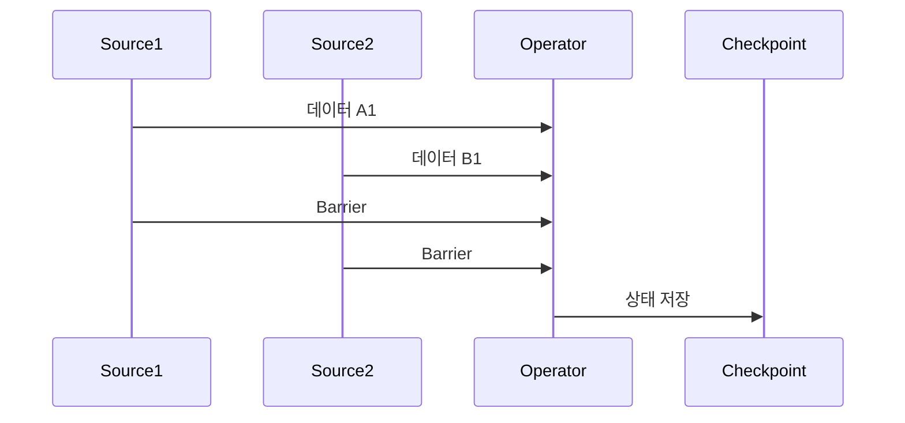
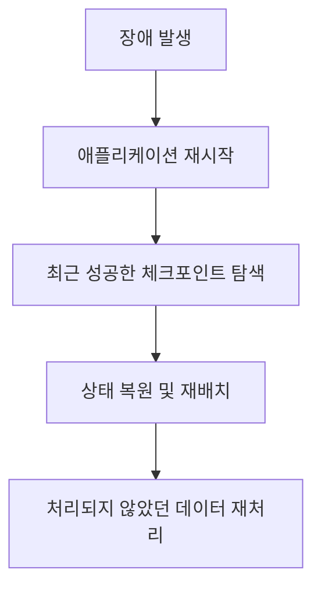
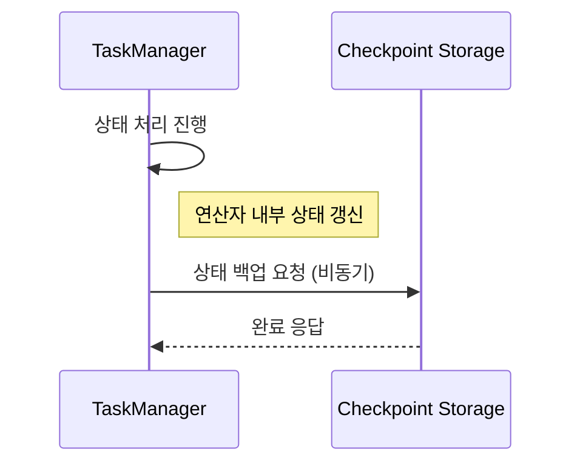

# Checkpointing

```text
[Abstract]

본 정리본은 실시간 데이터 처리 시스템인 Apache Flink에서 핵심적으로 사용되는 Checkpointing과 상태 관리(State Management)에 대한 개념과 구현 방식을 체계적으로 정리하고자 한다. 스트림 처리 환경에서는 데이터가 연속적으로 흘러들어오기 때문에, 중간 결과를 기억하고 이를 기반으로 연산을 지속하는 상태 관리가 필수적이다. 이 정리본은 상태의 정의와 유형, 그리고 상태 관리가 실시간 처리에서 갖는 중요성을 먼저 서술한다.

이어지는 내용에서는 장애 복구 및 정확성 보장을 위한 핵심 기술인 Checkpointing의 구조와 동작 원리를 설명한다. Checkpoint는 실행 중인 애플리케이션의 상태를 주기적으로 스냅샷으로 저장하여, 시스템 장애 발생 시 최근 시점으로부터의 복구를 가능하게 한다. Barrier를 활용한 동기화 방식, SavePoint와의 차이점, 복구 시나리오 등을 포함하여 Checkpointing의 전반적인 흐름을 다룬다.

또한, 고성능 스트리밍 시스템을 위한 최적화 기법으로서 비동기 체크포인팅, 증분 체크포인팅, Barrier Alignment 최적화, 그리고 주기 및 병렬성 조정 등의 전략을 제시하며, 각 기법이 시스템 성능과 안정성에 어떤 영향을 미치는지 구체적으로 서술하였다.

마지막으로 Checkpointing을 실제 Flink 애플리케이션에 적용하기 위한 설정 코드와 구현 방법을 상세히 설명하였다. 실습에 기반한 예제를 통해 Checkpoint의 주기, 저장소 설정, 장애 복구 시나리오를 포괄적으로 소개함으로써, 비전공자도 실제 환경에서 Checkpointing을 능동적으로 적용할 수 있도록 돕는다.

본 정리본은 Checkpointing을 처음 접하는 학습자를 대상으로 하며, 단순 개념의 나열이 아닌 실질적인 이해와 실무 적용을 위한 흐름 중심의 설명에 중점을 두었다. 이를 통해 Flink 기반의 실시간 데이터 처리 환경에서 신뢰성 있는 애플리케이션을 설계하고 운영하는 데 필요한 기초 역량을 함양할 수 있도록 구성하였다.
```

<br>

1\. 상태(State)란 무엇인가?
--------------------

### 1-1. 상태란?

스트리밍 데이터 처리 시스템에서 ‘상태(state)’란, 연산 도중의 중간 결과 혹은 이전 데이터를 의미한다. Flink와 같은 스트림 처리 시스템은 단순히 데이터를 받아 처리하고 버리는 방식이 아니라, **과거의 데이터를 기억하고** 이를 바탕으로 **현재의 계산을 지속적으로 갱신**해나가는 방식으로 동작한다. 이러한 동작을 가능하게 만드는 핵심 요소가 바로 상태이다.

예를 들어, 실시간으로 사용자 클릭 수를 집계하는 시스템을 생각해보자. 이때 각 사용자의 총 클릭 수를 기억하기 위해서는 이전까지의 클릭 횟수를 어딘가에 저장해두어야 하며, 이 저장 공간이 바로 상태이다.

<br>

### 1-2. 상태의 유형

Flink에서는 상태를 크게 두 가지 방식으로 분류한다.

#### 1) Keyed State

*   특정 키(예: 사용자 ID)에 따라 분리되어 저장된다.
    
*   파티셔닝된 연산자 내에서 각 키에 해당하는 데이터만을 기억한다.
    
*   주로 `KeyedStream`에서 사용된다.
    

> 예시: 사용자 ID를 키로 하여, 각 사용자의 클릭 수를 별도로 저장

#### 2) Operator State

*   키와 무관하게 연산자 전체에 걸쳐 공유된다.
    
*   일반적으로 병렬도가 낮거나 병렬성이 없는 연산자에서 활용된다.
    
*   전체 상태를 파티션 단위로 나누어 처리한다.
    

<br>

### 1-3. 상태 관리의 중요성

#### 📌 정확성 보장

상태를 올바르게 관리하지 않으면, 중복 집계나 일부 누락된 결과가 발생할 수 있다. 특히 정확히 한 번 처리(exactly-once processing)语 보장하기 위해서는 상태의 일관성과 복구 가능성이 매우 중요하다.

#### 📌 장애 복구

실시간 시스템은 언제든 장애가 발생할 수 있으며, 이때 상태가 없다면 전체 처리를 처음부터 다시 시작해야 한다. 반면, 상태가 저장되어 있다면 이전 상태로부터 복구하여 효율적으로 서비스를 이어갈 수 있다.

#### 📌 성능 최적화

복잡한 연산에서 모든 계산을 매번 처음부터 반복하지 않고, 이전 상태를 기반으로 연산을 이어가는 방식은 시스템의 부하를 줄이고 성능을 극대화할 수 있다.

<br>

### 1-4. 상태 관리 예제 - KeyedSum

아래는 상태를 활용하여 각 키마다 누적합을 계산하는 간단한 Flink 애플리케이션의 핵심 로직이다.


```python
class KeyedSumFunction(KeyedProcessFunction[str, int, int]):
    def open(self, runtime_context):
        self.sum_state = runtime_context.get_state(ValueStateDescriptor("sum", Types.INT()))

    def process_element(self, value, ctx):
        current_sum = self.sum_state.value() or 0
        updated_sum = current_sum + value
        self.sum_state.update(updated_sum)
        yield updated_sum
```

이 코드는 각 키마다 현재까지의 합을 저장하는 `ValueState`를 생성하고, 새로운 값이 들어올 때마다 기존 합에 더해 업데이트한 결과를 출력한다. 상태가 없다면 이 누적 계산은 불가능하다.

<br>
<br>

2\. Checkpointing의 개념과 원리
-------------------------

### 2-1. Checkpointing이란?

Checkpointing은 **스트리밍 애플리케이션의 실행 상태를 일정 시점에 저장하는 메커니즘**이다. 일반적인 문서 편집기에서 ‘자동 저장’ 기능이 주기적으로 현재 작업을 백업해두는 것처럼, Flink는 애플리케이션이 처리 중인 데이터를 포함한 **상태(state)** 를 스냅샷(snapshot) 형태로 저장해둔다.

이러한 Checkpoint는 시스템에 장애가 발생하더라도, **최근 저장된 상태로부터 복구**할 수 있게 해주며, 실시간 데이터 처리의 연속성과 정확성을 보장하는 데 필수적이다.

<br>

### 2-2. Checkpoint의 저장 위치와 복구 흐름



<br>

Checkpoint는 로컬 또는 분산 저장소에 저장되며, 일반적으로 **Flink는 다음 두 가지 위치를 함께 활용**한다:

*   **로컬 저장소 (Local Storage)**
    
    *   각 작업 노드(Local TaskManager)의 디스크에 저장됨
        
    *   장애 복구 시 가장 먼저 탐색됨 (복구 속도 빠름)
        
*   **분산 저장소 (Distributed Storage)**
    
    *   예: HDFS, S3, GCS 등
        
    *   장기 보관 및 다중 노드 간 공유에 적합
        
    *   로컬 저장소에 없거나 손상된 경우 여기에 접근
        

복구 과정은 다음과 같은 단계로 진행된다:

1.  **애플리케이션 재시작**
    
2.  **가장 최근의 성공한 체크포인트를 찾음**
    
3.  **각 연산자에 저장된 상태 정보를 복원**
    
4.  **해당 시점 이후의 데이터부터 재처리**
    

> ✅ **중요 개념**: 체크포인트 이후에 처리된 데이터는 보통 다시 처리되며, 이를 **"at-least-once" 보장** 또는 적절한 설정에 따라 **"exactly-once" 보장**이 가능하다.

<br>

### 2-3. Barrier: 정확한 상태 저장을 위한 동기화 장치



<br>

스트리밍 데이터는 연속적이고 병렬적으로 흐르기 때문에, 모든 연산자가 **동일한 시점의 상태**를 저장하지 않으면 체크포인트의 정확성을 보장할 수 없다. 이를 위해 Flink는 **Barrier(장벽)** 라는 개념을 도입했다.

*   **Barrier란?**
    
    *   데이터 흐름 사이에 삽입되는 특수한 메시지
        
    *   각 연산자는 이 Barrier가 도달하면 **현재까지의 상태를 임시 저장**함
        
    *   모든 입력 스트림에 Barrier가 도달한 시점에 체크포인트가 완료됨
        
*   **Barrier Alignment**
    
    *   연산자가 여러 입력 스트림을 갖는 경우, **모든 스트림에서 동일한 Barrier가 도달할 때까지 기다림**
        
    *   이때 발생하는 지연을 최소화하기 위한 최적화 기법이 Barrier Alignment
        

<br>

### 2-4. SavePoint와의 차이점

**SavePoint**는 Checkpoint와 유사하지만, 일반적으로 **수동으로 트리거**되며 운영 관리 목적으로 활용된다.

| 구분 | Checkpoint | SavePoint |
| --- | --- | --- |
| 생성 시점 | 자동, 주기적으로 수행 | 사용자가 명령어로 수동 생성 |
| 목적 | 장애 복구 | 애플리케이션 업그레이드, 유지보수 등 |
| 유지 여부 | 주로 덮어쓰기 | 장기 보관 가능 |

SavePoint는 마치 게임에서 수동 저장을 해두는 기능과 비슷하다. 특정 시점의 상태를 보존해두고, 언제든 해당 지점에서 다시 시작할 수 있도록 설계된 것이다.

<br>

### 2-5. 장애 발생 시 복구 흐름 요약



이러한 흐름을 통해 Checkpointing은 실시간 스트림 처리의 안정성과 정확성을 실현하는 핵심 기술로 자리 잡고 있다.

<br>
<br>

3\. Checkpointing 최적화 기법
------------------------

Checkpointing은 기본적으로 안정성을 위한 기능이지만, **잘못 설정하면 처리 지연, 자원 낭비, 장애 복구 실패** 등의 문제가 발생할 수 있다. 이를 해결하기 위한 주요 최적화 기법들을 아래와 같이 설명한다.

<br>

### 3-1. 비동기 체크포인팅 (Asynchronous Checkpointing)

기본적으로 Checkpoint는 상태를 저장할 때 연산을 멈추고 해당 시점의 상태를 복사해야 한다. 이 과정은 전체 처리 지연(latency)을 유발할 수 있다. 이를 해결하기 위한 방법이 바로 **비동기 저장 방식**이다.

#### ✔ 개념

*   상태(State)는 연산과 동시에 별도의 스레드에서 비동기적으로 저장된다.
    
*   실제 데이터 처리는 계속 진행되고, 상태만 병렬 저장 작업을 수행한다.
    

#### ✔ 장점

*   **처리 지연 감소**: 연산 중단 없이 상태를 저장 가능
    
*   **성능 향상**: 고빈도 체크포인트도 시스템 부하 없이 적용 가능
    

#### ✔ 시각화 요약



<br>

### 3-2. 증분 체크포인팅 (Incremental Checkpointing)

스트림 애플리케이션에서 상태가 클수록 저장해야 하는 데이터도 많아지며, 그만큼 I/O 비용이 증가한다. 이를 해결하기 위한 기법이 **증분 저장**이다.

#### ✔ 개념

*   이전 체크포인트와 비교하여 변경된 부분만 저장
    
*   RocksDBStateBackend와 같은 상태 백엔드를 사용할 때 주로 활용
    

#### ✔ 장점

*   **저장 시간 단축**
    
*   **디스크 공간 절약**
    
*   **복구 시간 단축**
    

#### ✔ 동작 방식

```text
[Checkpoint 1]  → 전체 상태 저장
[Checkpoint 2]  → 변경된 상태만 추가 저장
[Checkpoint 3]  → 변경된 상태만 추가 저장
```

> 실습 또는 운영 환경에서 상태 크기가 수 GB 이상이 되는 경우, 이 방식은 시스템 부하를 크게 줄여준다.

<br>

### 3-3. Barrier Alignment 최적화

앞서 언급한 Barrier는 모든 입력 스트림에서 동일한 체크포인트 타이밍을 맞추기 위해 사용된다. 하지만 스트림 도착 속도에 차이가 있으면 일부 입력은 **대기 상태**가 된다. 이로 인해 성능 병목이 발생할 수 있다.

#### ✔ 문제

*   입력이 느린 스트림을 기다리며 빠른 스트림의 데이터가 임시로 큐에 쌓임
    
*   대기 시간 증가 및 메모리 낭비
    

#### ✔ 최적화 전략

*   **Checkpoint Buffer** 사이즈 조정
    
*   **Unaligned Checkpoint**: 데이터를 Buffer에 저장하지 않고 그대로 상태와 함께 기록  
    (Flink 1.11부터 지원, 고지연 환경에서 유리)
    

<br>

### 3-4. 체크포인트 주기 및 병렬성 조정

#### ✔ 체크포인트 주기 설정

*   너무 자주 → I/O 오버헤드 증가, 성능 저하
    
*   너무 드물게 → 장애 발생 시 손실 데이터 증가
    
*   적정 주기는 애플리케이션 특성과 처리량에 따라 다르며, 일반적으로 **30초 ~ 5분 간격**을 설정
    

#### ✔ 병렬성 조정

*   병렬 작업 수에 따라 상태 크기와 Checkpoint 처리 속도가 달라짐
    
*   각 TaskManager의 리소스를 고려한 병렬도 설정 필요
    

<br>

### 3-5. 체크포인트 타임아웃 및 최소 간격 설정

| 설정 항목 | 설명 | 효과 |
| --- | --- | --- |
| `timeout` | Checkpoint가 제한 시간 내 완료되지 않으면 무효 처리 | 장기 실행 방지 |
| `min pause between checkpoints` | 체크포인트 간 최소 대기 시간 | 너무 자주 저장되는 것 방지 |
| `max concurrent checkpoints` | 동시에 실행 가능한 체크포인트 수 | 병렬 처리 조절 |

<br>

Checkpointing의 효율은 단순히 기능을 "켜는 것"만으로는 보장되지 않는다. **시스템 환경, 처리량, 상태 크기, 장애 복구 시간 요구 조건** 등을 종합적으로 고려한 **정교한 설정**이 필요하며, 위와 같은 최적화 기법들을 이해하고 적용하는 것이 필수적이다.

<br>
<br>

4\. Checkpointing 구현 및 관리
-------------------------

### 4-1. Checkpointing 활성화

Flink에서 Checkpointing을 사용하려면 먼저 `StreamExecutionEnvironment`에서 활성화해야 한다. 이는 스트림 처리 애플리케이션이 장애 복구 기능을 갖추도록 하는 첫 번째 단계이다.

```python
from pyflink.datastream import StreamExecutionEnvironment

env = StreamExecutionEnvironment.get_execution_environment()
env.enable_checkpointing(60000)  # 60초 간격으로 체크포인트 생성
```

*   `enable_checkpointing(60000)`: 밀리초 단위의 주기를 설정하며, 위 예시는 60초마다 Checkpoint 수행
    
*   기본적으로 at-least-once 처리를 보장하며, 설정 변경을 통해 exactly-once도 가능
    

<br>

### 4-2. 체크포인트 저장소 설정

Checkpoint 데이터는 일반적으로 디스크에 저장되며, 안정적인 복구를 위해 \*\*분산 파일 시스템(HDFS, S3 등)\*\*에 저장하는 것이 일반적이다.

```python
from pyflink.common import CheckpointingMode

# 체크포인트 모드 설정 (Exactly-once 또는 At-least-once)
env.get_checkpoint_config().set_checkpointing_mode(CheckpointingMode.EXACTLY_ONCE)

# 외부 저장소 설정 (예: HDFS)
env.get_checkpoint_config().set_checkpoint_storage("hdfs://namenode:9000/flink/checkpoints")
```

> ※ 로컬 테스트 시에는 `"file:///tmp/checkpoints"` 와 같이 사용할 수 있음

<br>

### 4-3. 주요 설정 항목

Checkpointing을 실용적으로 운영하기 위해서는 여러 설정 값을 병행해서 조정해야 한다.

| 설정 항목 | 설명 |
| --- | --- |
| `set_min_pause_between_checkpoints(ms)` | 두 체크포인트 사이 최소 대기 시간 |
| `set_checkpoint_timeout(ms)` | 체크포인트 완료 최대 허용 시간 |
| `set_max_concurrent_checkpoints(n)` | 동시에 실행 가능한 체크포인트 개수 |
| `enable_externalized_checkpoints(retain_on_cancellation)` | 작업 취소 후에도 체크포인트 보존 여부 |
| `enable_unaligned_checkpoints(True)` | 지연 최소화를 위한 비정렬 체크포인트 사용 |

#### 예시 코드:

```python
config = env.get_checkpoint_config()
config.set_min_pause_between_checkpoints(30000)  # 최소 30초 간격
config.set_checkpoint_timeout(120000)            # 타임아웃 2분
config.set_max_concurrent_checkpoints(1)         # 동시 체크포인트 1개
config.enable_externalized_checkpoints(
    ExternalizedCheckpointCleanup.RETAIN_ON_CANCELLATION
)
```

<br>

### 4-4. 증분 체크포인트 활성화 (RocksDB)

Flink에서 증분 체크포인트를 사용하려면 **RocksDBStateBackend**를 명시적으로 사용해야 한다. PyFlink에서는 아직 제한적이지만, Java/Scala API에서는 다음과 같이 설정한다.

```java
env.setStateBackend(new EmbeddedRocksDBStateBackend(true)); // true = 증분 저장 활성화
```

> RocksDB는 디스크 기반의 키-값 저장소로, 대규모 상태 처리를 위한 대표적인 백엔드이다.

<br>

### 4-5. 전체 코드 예시 (Python 기준)


```python
from pyflink.datastream import StreamExecutionEnvironment
from pyflink.common import CheckpointingMode

env = StreamExecutionEnvironment.get_execution_environment()

# Checkpoint 설정
env.enable_checkpointing(60000)
config = env.get_checkpoint_config()
config.set_checkpointing_mode(CheckpointingMode.EXACTLY_ONCE)
config.set_min_pause_between_checkpoints(30000)
config.set_checkpoint_timeout(120000)
config.set_max_concurrent_checkpoints(1)
config.enable_externalized_checkpoints(
    ExternalizedCheckpointCleanup.RETAIN_ON_CANCELLATION
)

# Checkpoint 저장 위치 설정
config.set_checkpoint_storage("file:///tmp/flink_checkpoints")

# 이후 데이터 처리 코드 작성...
```

<br>

✅ 마무리 정리
--------

Checkpointing은 Flink의 핵심적인 **내결함성(fault tolerance)** 기술로, 안정적인 실시간 스트리밍을 위해 반드시 이해하고 구성해야 할 요소이다. 단순히 기능을 '켜는' 것을 넘어, 상태 크기, 처리량, 지연 시간, 시스템 자원까지 고려한 **설계 수준의 적용**이 요구된다.

이를 통해 우리는 실시간 데이터 환경에서의 **신뢰성 있는 데이터 흐름**과 **운영 안정성**을 동시에 확보할 수 있다.
