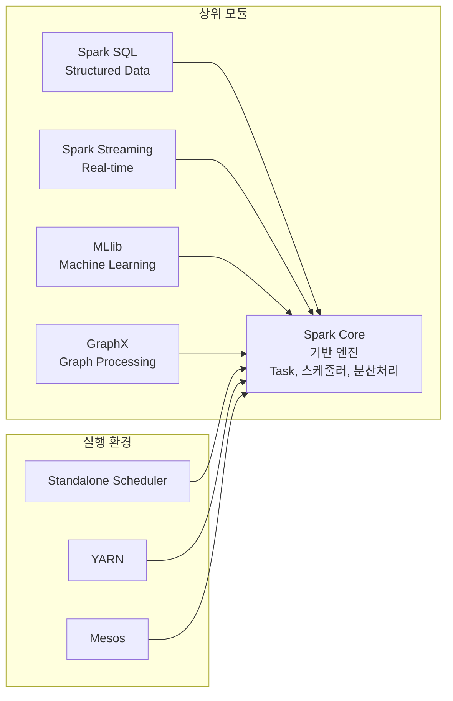
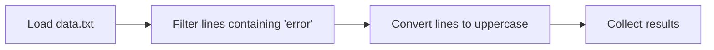

데이터 엔지니어링 기초: Spark 설치와 기본 구조
=============================

1\. Apache Spark의 필요성과 실행 구조 이해
-------------------------------

### 1.1 기존 데이터 처리 방식의 한계점

#### 1.1.1 단일 서버의 확장성 부족

*   **확장성 문제**: 기존 데이터 처리는 주로 단일 서버로 이루어졌습니다.
    
*   **수직 확장(Scale-Up)**: 데이터가 증가하면 서버 성능을 높이는 방식으로 대응했습니다.
    
    *   하지만 단일 서버는 하드웨어의 물리적 한계로 인해 무한정 성능 증가가 불가능합니다.​
        

#### 1.1.2 확장성 부족의 대안

*   **수평 확장(Scale-Out)**: 서버를 여러 대로 부하를 나누는 방식으로, 분산 처리를 통해 확장성을 확보합니다.​
    

#### 1.1.3 실시간 분석의 어려움

*   **배치 처리**: 일정 시간 간격으로 데이터를 일괄 처리하는 방식으로, 실시간 분석에는 부적합합니다.
    
*   **스트림 처리**: 실시간 데이터 처리를 위해 별도의 시스템이 필요하며, 구현이 복잡합니다.​
    

#### 1.1.4 디스크 기반 처리로 인한 속도 문제

*   **디스크 I/O 병목**: 기존 기술은 데이터를 처리할 때 디스크 기반의 저장장치를 사용하여, 메모리(RAM)보다 데이터 읽기/쓰기 속도가 현저히 느립니다.
    
*   **속도 저하**: 이로 인해 데이터 처리 과정에서 속도 저하 현상이 발생합니다.​
    

### 1.2 Apache Spark란?

#### 1.2.1 정의

*   **Apache Spark**: 오픈소스 클러스터 컴퓨팅 프레임워크로, 대규모 데이터를 빠르게 처리할 수 있도록 설계되었습니다.
    
*   **지원 언어**: Scala, Java, Python, R 등 다양한 언어를 지원합니다.
    
*   **활용 분야**: 데이터 과학, 머신러닝, 스트리밍 분석 등 다양한 분야에서 활용됩니다.​
    

#### 1.2.2 특징

*   **메모리 기반 처리**: 디스크 기반 처리보다 훨씬 빠른 성능을 제공합니다.
    
*   **Lazy Evaluation**: 지연 평가를 통해 실행 계획을 최적화합니다.
    
*   **다양한 데이터 처리 방식 지원**: 배치 처리, 스트리밍 처리 등 다양한 방식의 데이터 처리를 지원합니다.
    
*   **폭넓은 언어 지원**: 고수준 API를 다양한 언어로 지원합니다.​
    

#### 1.2.3 활용 시 주의점

*   **엄밀한 실시간 처리 불가**: Micro-batch 기반으로, 완전한 실시간 처리는 어렵습니다.
    
*   **작은 데이터 파일 처리의 비효율성**: 작은 파일을 다수 처리할 경우 비효율이 발생할 수 있습니다.
    
*   **자체 파일 관리 시스템 부재**: 파일 저장소(HDFS, S3 등) 사용이 권장됩니다.
    
*   **높은 메모리 비용**: 메모리 기반 처리로 인해 메모리 사용량이 많을 수 있습니다.​
    

### 1.3 Apache Spark의 구성 요소



#### 구성 요소 상세 설명

| 컴포넌트 | 설명 | 특징 |
| --- | --- | --- |
| **Spark Core** | Spark의 기반이 되는 엔진 | 작업 스케줄링, 메모리 관리, 장애 복구 |
| **Spark SQL** | 구조화된 데이터 처리 (쿼리 기반) | SQL 언어 및 DataFrame API 지원 |
| **Spark Streaming** | 실시간 데이터 처리 | 마이크로 배치 처리 방식 |
| **MLlib** | 머신러닝 알고리즘 라이브러리 | 분류, 회귀, 군집, 추천 등 다양한 알고리즘 제공 |
| **GraphX** | 그래프 기반 데이터 처리 | 소셜 네트워크 분석 등 그래프 처리 기능 제공 |

#### 실행 환경 (Cluster Manager)

*   **Standalone Scheduler**: Spark 자체 제공 스케줄러로, 간단한 설정으로 클러스터를 구성할 수 있습니다.
    
*   **YARN**: Hadoop 환경에서 통합 리소스 관리를 제공하며, Hadoop과의 연동이 용이합니다.
    
*   **Mesos**: 다양한 분산 시스템을 위한 범용 리소스 관리자로, 다양한 워크로드를 지원합니다.​
    

* * *           
* * *

2\. Apache Spark의 실행 구조
-----------------------

### 2.1 Spark 애플리케이션 구성 요소

Apache Spark는 분산 데이터 처리 시스템으로, 다음과 같은 주요 구성 요소로 이루어져 있습니다:

*   **Driver**: 애플리케이션의 실행 계획을 생성하고 작업을 분배하는 중앙 제어 노드입니다.
    
*   **Cluster Manager**: 클러스터의 자원을 관리하며, 드라이버의 요청에 따라 실행기를 할당합니다.
    
*   **Executor**: 실제 작업을 수행하는 워커 노드로, 드라이버로부터 할당받은 태스크를 실행합니다.​[Velog](https://velog.io/%40ynsoo1225/Apache-Spark-%ED%81%B4%EB%9F%AC%EC%8A%A4%ED%84%B0%EC%97%90%EC%84%9C-%EC%8A%A4%ED%8C%8C%ED%81%AC-%EC%8B%A4%ED%96%89%ED%95%98%EA%B8%B0?utm_source=chatgpt.com)
    

### 2.2 클러스터 매니저

클러스터 매니저는 Spark 애플리케이션의 리소스를 관리하는 역할을 합니다:

*   **리소스 할당**: 드라이버의 요청에 따라 실행기 프로세스를 시작합니다.
    
*   **프로세스 관리**: 실행 중인 프로세스를 중지하거나 재시작할 수 있습니다.
    
*   **리소스 제한**: 실행기 프로세스가 사용할 수 있는 최대 CPU 코어 개수를 제한할 수 있습니다.​[Medium+1Apache Spark+1](https://medium.com/%40vigneshbw2002/understanding-apache-spark-architecture-driver-executors-cores-partitions-stages-and-shuffles-e6893db16994?utm_source=chatgpt.com)
    

지원되는 클러스터 매니저:

*   **Standalone**: Spark 자체 제공 스케줄러입니다.
    
*   **Apache Mesos**: 다양한 분산 시스템을 위한 범용 리소스 관리자입니다.
    
*   **Hadoop YARN**: Hadoop 환경에서 통합 리소스 관리를 제공합니다.
    
*   **Kubernetes**: 컨테이너 오케스트레이션 시스템으로, 최근 많이 사용됩니다.​
    

### 2.3 드라이버(Driver)

드라이버는 Spark 애플리케이션의 실행을 관장하고 모니터링합니다:

*   **리소스 요청**: 클러스터 매니저에 메모리 및 CPU 리소스를 요청합니다.
    
*   **작업 분할**: 애플리케이션 로직을 스테이지와 태스크로 분할합니다.
    
*   **태스크 전달**: 여러 실행기에 태스크를 전달합니다.
    
*   **결과 수집**: 태스크 실행 결과를 수집합니다.​
    

드라이버는 애플리케이션당 하나만 존재하며, 실행 위치에 따라 두 가지 모드로 구분됩니다:

*   **클러스터 모드**: 드라이버가 클러스터 내의 특정 노드에서 실행됩니다.
    
*   **클라이언트 모드**: 드라이버가 클러스터 외부에서 실행됩니다.​
    

### 2.4 실행기(Executor)

실행기는 드라이버가 요청한 태스크를 받아 실행하고 결과를 반환합니다:

*   **JVM 프로세스**: 각 실행기는 독립된 JVM 프로세스로 실행됩니다.
    
*   **병렬 실행**: 여러 태스크 슬롯(스레드)을 통해 태스크를 병렬로 실행합니다.​
    

### 2.5 SparkSession

SparkSession은 Spark Core 기능들과 상호 작용할 수 있는 진입점을 제공합니다:

*   **API 제공**: DataFrame 및 SQL API를 통해 데이터 처리를 수행할 수 있습니다.
    
*   **세션 관리**: 애플리케이션의 설정 및 리소스를 관리합니다.​
    

```python
from pyspark.sql import SparkSession

spark = SparkSession.builder \
    .appName("MySparkApp") \
    .getOrCreate()
```

### 2.6 Job, Stage, Task

Spark의 실행 단위는 다음과 같이 구성됩니다:

*   **Job**: 액션 연산에 의해 생성되며, 전체 작업 단위를 의미합니다.
    
*   **Stage**: Job은 여러 개의 Stage로 나뉘며, 각 Stage는 연산 간의 셔플 유무에 따라 구분됩니다.
    
*   **Task**: Stage는 여러 개의 Task로 구성되며, 각 Task는 데이터의 파티션 단위로 실행됩니다.​
    

### 2.7 Spark 연산의 종류

Spark 연산은 크게 트랜스포메이션(Transformation)과 액션(Action)으로 구분됩니다:

*   **Transformation**: 기존 RDD나 DataFrame을 변형하여 새로운 RDD나 DataFrame을 생성합니다.
    
    *   예: `map()`, `filter()`, `groupBy()`, `select()`
        
*   **Action**: 변형된 데이터를 기반으로 결과를 반환하거나 외부 저장소에 저장합니다.
    
    *   예: `count()`, `collect()`, `save()`​
        

#### Narrow vs. Wide Transformation

*   **Narrow Transformation**: 하나의 파티션에서만 데이터를 처리하며, 셔플이 발생하지 않습니다.
    
    *   예: `map()`, `filter()`
        
*   **Wide Transformation**: 여러 파티션 간에 데이터를 이동시키며, 셔플이 발생합니다.
    
    *   예: `groupBy()`, `join()`​
        

### 2.8 Lazy Evaluation (지연 평가)

Apache Spark는 **지연 평가(Lazy Evaluation)** 전략을 통해 실행 계획을 최적화하고, 자원 사용을 효율화하며, 장애 복구를 용이하게 합니다.​

### 개념 정리

*   **트랜스포메이션(Transformation)**: `map()`, `filter()`와 같은 연산으로, 새로운 RDD나 DataFrame을 생성하지만 즉시 실행되지 않습니다.​
    
*   **액션(Action)**: `count()`, `collect()`와 같은 연산으로, 실제 결과를 반환하며 이때까지의 트랜스포메이션이 실행됩니다.​
    

### Lazy Evaluation의 작동 방식

1.  **실행 계획 수립**: 트랜스포메이션 연산이 호출되면, Spark는 이를 즉시 실행하지 않고 실행 계획으로 저장합니다.​
    
2.  **계보(Lineage) 생성**: 연속된 트랜스포메이션 연산들은 계보로 기록되며, 이는 Directed Acyclic Graph(DAG) 형태로 표현됩니다.​
    
3.  **액션 호출 시 실행**: 액션 연산이 호출되면, Spark는 저장된 실행 계획을 기반으로 최적화된 실행을 수행합니다.​
    

### Lazy Evaluation의 장점

*   **최적화 기회 제공**: 전체 실행 계획을 분석하여, 불필요한 연산을 제거하거나 연산 순서를 재조정하여 성능을 향상시킬 수 있습니다.​
    
*   **자원 효율성 향상**: 필요한 연산만을 수행하므로, 메모리와 CPU 사용을 최소화할 수 있습니다.​
    
*   **장애 복구 용이성**: 계보 정보를 활용하여, 실패한 연산만을 재실행함으로써 전체 작업을 재실행하지 않고도 복구가 가능합니다.​
    

#### 예시 코드

```python
from pyspark.sql import SparkSession

# Spark 세션 생성
spark = SparkSession.builder.appName("LazyEvaluationExample").getOrCreate()
sc = spark.sparkContext

# 데이터 로드 (트랜스포메이션)
rdd = sc.textFile("data.txt")
filtered_rdd = rdd.filter(lambda line: "error" in line)
mapped_rdd = filtered_rdd.map(lambda line: line.upper())

# 액션 호출 전까지는 실제 실행되지 않음
# 액션 호출 시점에서 모든 트랜스포메이션이 실행됨
result = mapped_rdd.collect()

# 결과 출력
for line in result:
    print(line)
```

위 코드에서 `filter`와 `map` 연산은 트랜스포메이션으로, `collect` 액션이 호출되기 전까지는 실제 실행되지 않습니다. `collect`가 호출되는 시점에서 Spark는 전체 실행 계획을 최적화하여 실행합니다.​

#### DAG 시각화

Spark의 실행 계획은 DAG(Directed Acyclic Graph) 형태로 표현됩니다. 아래는 간단한 DAG의 예시입니다.​[Medium+1codeinspark.com+1](https://medium.com/%40swayampravapanda686/understanding-lazy-evaluation-and-dags-in-apache-spark-0f3cc21a94a4?utm_source=chatgpt.com)



이러한 DAG 구조를 통해 Spark는 연산 간의 의존성을 파악하고, 최적화된 실행 계획을 수립할 수 있습니다.​


* * *
* * *

3\. Spark 실행 흐름: Job, Stage, Task의 이해
-------------------------------------

Apache Spark의 실행 흐름은 사용자가 작성한 애플리케이션 코드가 어떻게 분산 환경에서 실행되는지를 이해하는 데 핵심적입니다. 이 흐름은 다음과 같은 단계로 구성됩니다:

### 3.1 애플리케이션 제출 및 드라이버 초기화

*   **애플리케이션 제출**: 사용자는 `spark-submit` 명령어를 통해 애플리케이션을 클러스터에 제출합니다.
    
*   **드라이버 프로그램 시작**: 클러스터 매니저는 드라이버 프로그램을 시작하며, 이는 `SparkContext` 또는 `SparkSession`을 초기화하여 클러스터와의 연결을 설정합니다.​
    

### 3.2 논리 및 물리 실행 계획 생성

*   **논리 실행 계획**: 사용자가 작성한 트랜스포메이션 연산들은 논리 실행 계획으로 구성됩니다.
    
*   **Catalyst Optimizer**: 논리 실행 계획은 Catalyst Optimizer에 의해 최적화되어 물리 실행 계획으로 변환됩니다.
    
*   **물리 실행 계획**: 최적화된 계획은 DAG(Directed Acyclic Graph) 형태로 표현되며, 이는 Stage와 Task로 구성됩니다.​[Medium](https://medium.com/%40diehardankush/what-are-job-stage-and-task-in-apache-spark-2fc0d326c15f?utm_source=chatgpt.com)
    

### 3.3 Stage 및 Task 스케줄링

*   **Stage 분할**: DAG Scheduler는 셔플 경계를 기준으로 Job을 여러 Stage로 분할합니다.
    
*   **Task 생성**: 각 Stage는 데이터 파티션 수에 따라 여러 Task로 나뉘며, 이는 병렬로 실행됩니다.
    
*   **TaskScheduler**: TaskScheduler는 생성된 Task를 Executor에 할당하고 실행을 관리합니다.​
    

### 3.4 Executor에서의 Task 실행

*   **Task 수신**: Executor는 드라이버로부터 Task를 수신합니다.
    
*   **데이터 처리**: 각 Task는 할당된 데이터 파티션에 대해 연산을 수행합니다.
    
*   **결과 반환**: Task 실행 결과는 드라이버에 반환되며, 필요 시 중간 결과는 메모리에 캐시됩니다.​
    

### 3.5 Job 완료 및 리소스 해제

*   **Job 완료**: 모든 Task가 성공적으로 완료되면, 해당 Job은 완료 상태로 표시됩니다.
    
*   **리소스 해제**: 애플리케이션이 종료되면, 드라이버와 Executor는 사용한 리소스를 해제하고 종료됩니다.​
    

* * *
* * *

4\. Spark Web UI를 통한 실행 모니터링
----------------------------

Spark는 실행 중인 애플리케이션의 상태를 실시간으로 모니터링할 수 있는 Web UI를 제공합니다. 기본적으로 `http://localhost:4040`에서 접근할 수 있으며, 주요 탭은 다음과 같습니다:

### 4.1 Jobs 탭

*   **Job 목록**: 현재 실행 중이거나 완료된 Job들의 목록과 상태를 확인할 수 있습니다.
    
*   **DAG 시각화**: 각 Job의 실행 계획을 DAG 형태로 시각화하여 보여줍니다.​
    

### 4.2 Stages 탭

*   **Stage 상세 정보**: 각 Stage의 실행 시간, 입력 및 출력 데이터 크기, 셔플 읽기/쓰기 정보 등을 제공합니다.
    
*   **Task 진행 상황**: Stage 내의 Task들의 진행 상황과 상태를 확인할 수 있습니다.​
    

### 4.3 Storage 탭

*   **RDD 및 DataFrame 캐시 상태**: 캐시된 데이터의 저장 위치와 크기 등을 확인할 수 있습니다.​
    

### 4.4 Executors 탭

*   **Executor 상태**: 각 Executor의 메모리 사용량, 디스크 I/O, Task 실행 수 등을 모니터링할 수 있습니다.​
    

* * *
* * *

5\. Spark의 최적화 전략
-----------------

효율적인 Spark 애플리케이션을 개발하기 위해서는 다음과 같은 최적화 전략을 고려해야 합니다:

### 5.1 셔플 최소화

*   **Wide Transformation 최소화**: `groupByKey`, `join` 등의 Wide Transformation은 셔플을 유발하므로, 가능한 한 Narrow Transformation으로 대체합니다.
    
*   **`reduceByKey` 사용**: `groupByKey` 대신 `reduceByKey`를 사용하여 셔플 데이터를 줄일 수 있습니다.​
    

### 5.2 데이터 파티셔닝 최적화

*   **적절한 파티션 수 설정**: 데이터의 크기와 클러스터의 리소스를 고려하여 적절한 파티션 수를 설정합니다.
    
*   **`repartition`과 `coalesce` 사용**: 필요에 따라 파티션 수를 조정하여 작업 효율을 높입니다.​
    

### 5.3 캐싱 전략

*   **중간 결과 캐싱**: 반복적으로 사용되는 중간 결과는 `cache()` 또는 `persist()`를 사용하여 메모리에 저장합니다.
    
*   **캐시 해제**: 사용이 끝난 캐시는 `unpersist()`를 통해 메모리에서 해제하여 리소스를 확보합니다.​

* * *
* * *

6\. Spark의 고급 기능: Catalyst Optimizer와 Adaptive Query Execution
--------------------------------------------------------------

Apache Spark는 성능 최적화를 위해 다양한 고급 기능을 제공합니다. 그 중에서도 Catalyst Optimizer와 Adaptive Query Execution(AQE)은 쿼리 실행 계획을 최적화하여 성능을 향상시키는 데 중요한 역할을 합니다.

### 6.1 Catalyst Optimizer

*   **정의**: Catalyst Optimizer는 Spark SQL의 쿼리 최적화 엔진으로, 쿼리 실행 계획을 분석하고 최적화하여 효율적인 실행을 도모합니다.
    
*   **기능**:
    
    *   **논리 계획 최적화**: 쿼리의 논리적 실행 계획을 분석하여 불필요한 연산을 제거하거나 재배치합니다.
        
    *   **물리 계획 생성**: 최적화된 논리 계획을 기반으로 실제 실행 가능한 물리 계획을 생성합니다.
        
    *   **코스트 기반 최적화**: 다양한 실행 계획 중에서 비용이 가장 낮은 계획을 선택합니다.
        
*   **장점**:
    
    *   **자동 최적화**: 사용자가 명시적으로 최적화하지 않아도 Catalyst가 자동으로 최적화를 수행합니다.
        
    *   **확장성**: 다양한 데이터 소스와 연동하여 복잡한 쿼리도 효율적으로 처리할 수 있습니다.
        

### 6.2 Adaptive Query Execution (AQE)

*   **정의**: AQE는 실행 중에 수집된 통계를 기반으로 쿼리 계획을 동적으로 조정하여 성능을 향상시키는 기능입니다.
    
*   **기능**:
    
    *   **셔플 파티션 병합**: 실행 중에 파티션 크기를 분석하여 작은 파티션을 병합함으로써 셔플 오버헤드를 줄입니다.
        
    *   **조인 전략 변경**: 실행 중에 조인 대상의 크기를 분석하여 브로드캐스트 조인 등 더 효율적인 조인 전략으로 변경합니다.
        
    *   **스큐 조인 최적화**: 데이터 스큐가 발생하는 경우, 스큐된 파티션을 분할하여 병렬 처리를 향상시킵니다.
        
*   **설정 방법**:
    
    ```python
    spark.conf.set("spark.sql.adaptive.enabled", "true")
    ```
    
*   **장점**:
    
    *   **동적 최적화**: 실행 중에 수집된 정보를 기반으로 최적화를 수행하므로, 사전에 예측하기 어려운 상황에서도 효율적인 실행이 가능합니다.
        
    *   **성능 향상**: 셔플 오버헤드 감소, 조인 전략 최적화 등을 통해 전체 쿼리 실행 시간을 단축할 수 있습니다.
        

* * *
* * *

7\. 실전 예제: Spark를 활용한 데이터 처리
----------------------------

Apache Spark의 강력한 기능을 활용하여 실제 데이터를 처리하는 예제를 살펴보겠습니다.

### 7.1 데이터프레임 생성 및 기본 연산

```python
from pyspark.sql import SparkSession
from pyspark.sql.functions import col, when

# Spark 세션 생성
spark = SparkSession.builder.appName("DataProcessingExample").getOrCreate()

# 데이터프레임 생성
data = [("Alice", 29), ("Bob", 17), ("Charlie", 35), ("Diana", 12)]
columns = ["name", "age"]
df = spark.createDataFrame(data, columns)

# life_stage 컬럼 추가
df = df.withColumn(
    "life_stage",
    when(col("age") < 13, "child")
    .when(col("age").between(13, 19), "teenager")
    .otherwise("adult")
)

# 결과 출력
df.show()
```

**출력 결과**:

```
+-------+---+----------+
|   name|age|life_stage|
+-------+---+----------+
|  Alice| 29|     adult|
|    Bob| 17|  teenager|
|Charlie| 35|     adult|
|  Diana| 12|     child|
+-------+---+----------+
```

### 7.2 데이터 저장 및 불러오기

```python
# 데이터 저장 (Parquet 형식)
df.write.mode("overwrite").parquet("people.parquet")

# 저장된 데이터 불러오기
df_loaded = spark.read.parquet("people.parquet")
df_loaded.show()
```

### 7.3 SQL 쿼리 실행

```python
# 뷰 생성
df.createOrReplaceTempView("people")

# SQL 쿼리 실행
result = spark.sql("SELECT name FROM people WHERE age >= 18")
result.show()
```

* * *
* * *

8\. Spark Structured Streaming: 실시간 데이터 처리의 진화
----------------------------------------------

Apache Spark는 실시간 데이터 처리의 요구에 대응하기 위해 Structured Streaming을 도입하였습니다. 이는 기존의 Spark Streaming의 한계를 극복하고, 더 강력하고 유연한 스트리밍 처리를 가능하게 합니다.

### 8.1 Structured Streaming의 개요

*   **정의**: Structured Streaming은 Spark SQL 엔진 위에 구축된 확장 가능한 스트리밍 처리 엔진으로, 배치 처리와 동일한 방식으로 스트리밍 데이터를 처리할 수 있습니다.
    
*   **특징**:
    
    *   **고수준 API**: DataFrame과 Dataset API를 사용하여 스트리밍 쿼리를 작성할 수 있습니다.
        
    *   **지속적인 처리**: 데이터가 도착함에 따라 결과를 지속적으로 업데이트합니다.
        
    *   **내결함성**: 체크포인팅과 Write-Ahead Logs를 통해 정확히 한 번 처리(Exactly-once semantics)를 보장합니다.
        
*   **장점**:
    
    *   **일관된 API**: 배치 및 스트리밍 처리를 동일한 API로 작성할 수 있어 코드 재사용성이 높습니다.
        
    *   **다양한 소스 및 싱크 지원**: Kafka, 파일 시스템, 소켓 등 다양한 데이터 소스와 싱크를 지원합니다.
        

### 8.2 Structured Streaming의 작동 방식

Structured Streaming은 내부적으로 마이크로 배치(micro-batch) 방식을 사용하여 데이터를 처리합니다. 이는 데이터 스트림을 작은 배치로 나누어 처리함으로써 낮은 지연 시간과 높은 처리량을 달성합니다.


### 8.3 예제: TCP 소켓에서 실시간 단어 수 세기

```python
from pyspark.sql import SparkSession
from pyspark.sql.functions import explode, split

# Spark 세션 생성
spark = SparkSession.builder.appName("StructuredNetworkWordCount").getOrCreate()

# 소켓에서 데이터 읽기
lines = spark.readStream.format("socket").option("host", "localhost").option("port", 9999).load()

# 단어 분리 및 집계
words = lines.select(explode(split(lines.value, " ")).alias("word"))
word_counts = words.groupBy("word").count()

# 결과 출력
query = word_counts.writeStream.outputMode("complete").format("console").start()
query.awaitTermination()
```

이 예제는 TCP 소켓에서 수신한 텍스트 데이터를 실시간으로 처리하여 각 단어의 출현 횟수를 계산합니다.

* * *
* * *

9\. MLlib: Spark의 머신러닝 라이브러리
----------------------------

Apache Spark는 대규모 데이터에 대한 머신러닝 작업을 지원하기 위해 MLlib을 제공합니다. MLlib은 다양한 알고리즘과 도구를 제공하여 확장 가능하고 효율적인 머신러닝 파이프라인을 구축할 수 있습니다.

### 9.1 MLlib의 주요 구성 요소

*   **알고리즘**: 분류, 회귀, 클러스터링, 협업 필터링 등 다양한 머신러닝 알고리즘을 제공합니다.
    
*   **특징 처리**: 특성 추출, 변환, 차원 축소 등의 기능을 지원합니다.
    
*   **파이프라인**: 머신러닝 워크플로우를 구성하고 관리할 수 있는 파이프라인 API를 제공합니다.
    
*   **모델 저장 및 로드**: 학습된 모델을 저장하고 재사용할 수 있습니다.
    

### 9.2 예제: 로지스틱 회귀를 통한 이진 분류

```python
from pyspark.sql import SparkSession
from pyspark.ml.classification import LogisticRegression
from pyspark.ml.feature import VectorAssembler
from pyspark.ml import Pipeline

# Spark 세션 생성
spark = SparkSession.builder.appName("LogisticRegressionExample").getOrCreate()

# 데이터 로드
data = spark.read.format("libsvm").load("sample_libsvm_data.txt")

# 로지스틱 회귀 모델 생성
lr = LogisticRegression(maxIter=10, regParam=0.3, elasticNetParam=0.8)

# 파이프라인 구성
pipeline = Pipeline(stages=[lr])

# 모델 학습
model = pipeline.fit(data)

# 예측 수행
predictions = model.transform(data)
predictions.select("features", "label", "prediction").show()
```

이 예제는 로지스틱 회귀를 사용하여 이진 분류를 수행하는 과정을 보여줍니다. MLlib의 파이프라인 API를 활용하여 모델 학습과 예측을 간단하게 구현할 수 있습니다.

* * *
* * *

10\. GraphX: Apache Spark의 그래프 처리 API
-------------------------------------

Apache Spark의 GraphX는 대규모 그래프 데이터를 효율적으로 처리하기 위한 분산 그래프 처리 프레임워크입니다. GraphX는 RDD를 기반으로 하며, 그래프와 컬렉션 간의 통합된 API를 제공합니다.

### 10.1 GraphX의 주요 특징

*   **속도**: GraphX는 Spark의 분산 처리 능력을 활용하여 대규모 그래프 데이터를 빠르게 처리할 수 있습니다.
    
*   **유연성**: 그래프와 컬렉션 간의 변환이 용이하며, 다양한 그래프 알고리즘을 지원합니다.
    
*   **확장성**: 대규모 그래프 데이터를 클러스터 환경에서 효율적으로 처리할 수 있습니다.
    

### 10.2 GraphX의 구성 요소

*   **VertexRDD**: 그래프의 정점 정보를 담고 있는 RDD입니다. 각 정점은 고유한 ID와 속성 값을 가집니다.
    
*   **EdgeRDD**: 그래프의 간선 정보를 담고 있는 RDD입니다. 각 간선은 출발 정점 ID, 도착 정점 ID, 그리고 속성 값을 가집니다.
    
*   **Graph**: VertexRDD와 EdgeRDD를 기반으로 구성된 그래프 객체입니다.
    

### 10.3 GraphX의 주요 연산

*   **subgraph**: 특정 조건을 만족하는 정점과 간선으로 구성된 부분 그래프를 추출합니다.
    
*   **mapVertices**: 정점의 속성 값을 변환합니다.
    
*   **mapEdges**: 간선의 속성 값을 변환합니다.
    
*   **joinVertices**: 외부 데이터와 정점을 조인하여 속성 값을 확장합니다.
    
*   **aggregateMessages**: 정점 간의 메시지 전달을 통해 정보를 집계합니다.
    

### 10.4 GraphX의 내장 알고리즘

GraphX는 다양한 그래프 알고리즘을 내장하고 있어, 복잡한 그래프 분석 작업을 간편하게 수행할 수 있습니다.

| 알고리즘 | 설명 |
| --- | --- |
| **PageRank** | 정점의 중요도를 계산하여 웹 페이지 순위 등을 평가합니다. |
| **Connected Components** | 연결된 정점 집합을 식별하여 그래프의 구조를 분석합니다. |
| **Triangle Count** | 정점이 포함된 삼각형의 개수를 계산하여 클러스터링 계수를 분석합니다. |
| **Label Propagation** | 정점에 라벨을 전파하여 커뮤니티를 탐지합니다. |
| **SVD++** | 추천 시스템에서 사용되는 행렬 분해 기법입니다. |

### 10.5 예제: GraphX를 이용한 간단한 그래프 분석

```scala
import org.apache.spark._
import org.apache.spark.graphx._
import org.apache.spark.rdd.RDD

// SparkContext 생성
val conf = new SparkConf().setAppName("GraphXExample").setMaster("local")
val sc = new SparkContext(conf)

// 정점 RDD 생성
val vertices: RDD[(VertexId, String)] = sc.parallelize(Seq(
  (1L, "Alice"),
  (2L, "Bob"),
  (3L, "Charlie"),
  (4L, "David")
))

// 간선 RDD 생성
val edges: RDD[Edge[String]] = sc.parallelize(Seq(
  Edge(1L, 2L, "friend"),
  Edge(2L, 3L, "follow"),
  Edge(3L, 4L, "follow"),
  Edge(4L, 1L, "friend")
))

// 그래프 생성
val graph = Graph(vertices, edges)

// 각 정점의 차수 출력
val degrees = graph.degrees.collect()
degrees.foreach { case (id, degree) =>
  println(s"Vertex $id has degree $degree")
}
```

이 예제는 간단한 소셜 네트워크 그래프를 생성하고, 각 정점의 차수를 계산하여 출력합니다.

* * *
* * *

11\. Spark의 클러스터 매니저
--------------------

Apache Spark는 다양한 클러스터 매니저를 지원하여, 분산 환경에서의 자원 관리를 효율적으로 수행할 수 있습니다.

### 11.1 클러스터 매니저의 역할

클러스터 매니저는 클러스터의 자원을 관리하고, Spark 애플리케이션에 필요한 자원을 할당합니다. 주요 역할은 다음과 같습니다:

*   **자원 할당**: 애플리케이션에 필요한 CPU, 메모리 등의 자원을 할당합니다.
    
*   **작업 스케줄링**: 작업을 적절한 노드에 분배하여 실행합니다.
    
*   **모니터링**: 클러스터의 상태를 모니터링하고, 장애 발생 시 복구를 지원합니다.
    

### 11.2 Spark에서 지원하는 클러스터 매니저

| 클러스터 매니저 | 설명 |
| --- | --- |
| **Standalone** | Spark에 내장된 간단한 클러스터 매니저로, 설정이 간편하며 테스트 환경에 적합합니다. |
| **Apache Mesos** | 다양한 분산 시스템을 위한 범용 리소스 관리자입니다. |
| **Hadoop YARN** | Hadoop 환경에서 통합 리소스 관리를 제공하는 클러스터 매니저입니다. |
| **Kubernetes** | 컨테이너화된 애플리케이션의 배포, 확장, 관리를 자동화하는 오픈소스 시스템입니다. |

### 11.3 클러스터 매니저 선택 시 고려사항

*   **환경**: 기존에 사용 중인 시스템과의 호환성을 고려해야 합니다.
    
*   **확장성**: 클러스터의 크기와 확장 계획에 따라 적합한 매니저를 선택해야 합니다.
    
*   **복잡성**: 설정과 관리의 복잡성을 고려하여 선택해야 합니다.
    


* * *
* * *

12\. Apache Spark 성능 최적화 및 튜닝
-----------------------------

Apache Spark는 대규모 데이터 처리를 위한 강력한 프레임워크이지만, 최적의 성능을 발휘하기 위해서는 적절한 튜닝과 최적화가 필요합니다. 아래에서는 Spark 애플리케이션의 성능을 향상시키기 위한 주요 기법과 모범 사례를 소개합니다.

### 12.1 데이터 구조 선택: DataFrame/Dataset vs. RDD

*   **DataFrame/Dataset 사용 권장**: Spark는 기본적으로 RDD(Resilient Distributed Dataset)를 제공하지만, DataFrame과 Dataset은 내부적으로 **Catalyst 옵티마이저**와 **Tungsten 실행 엔진**을 활용하여 자동으로 실행 계획을 최적화합니다. 이를 통해 RDD보다 더 나은 성능을 제공합니다.​[ChaosGenius+1Medium+1](https://www.chaosgenius.io/blog/spark-performance-tuning/?utm_source=chatgpt.com)
    
    ```python
    # DataFrame 예제
    from pyspark.sql import SparkSession
    
    spark = SparkSession.builder.appName("Example").getOrCreate()
    df = spark.read.csv("data.csv", header=True, inferSchema=True)
    df.select("column_name").show()
    ```
    

위의 예제에서 DataFrame을 사용하여 CSV 파일을 읽고 특정 열을 선택하였습니다. 이는 RDD를 사용하는 것보다 간결하고 효율적입니다.​

### 12.2 데이터 파티셔닝 최적화

*   **적절한 파티션 수 설정**: Spark는 데이터를 여러 파티션으로 나누어 병렬 처리를 수행합니다. 파티션 수는 클러스터의 코어 수와 데이터 크기에 따라 조정해야 합니다. 일반적으로 코어 수의 2~3배 정도의 파티션을 권장합니다.​
    
    ```python
    # 파티션 수 조정 예제
    df = df.repartition(100)  # 파티션 수를 100개로 설정
    ```
    
*   **데이터 스큐(Data Skew) 방지**: 특정 파티션에 데이터가 집중되는 현상을 방지하기 위해 키를 고르게 분포시키는 것이 중요합니다. 필요 시 **salting 기법**을 사용하여 키에 임의의 값을 추가하여 분포를 개선할 수 있습니다.​
    

### 12.3 셔플(Shuffle) 최소화

*   **셔플이란?**: 셔플은 데이터가 파티션 간에 이동하는 과정으로, 네트워크 I/O와 디스크 I/O를 증가시켜 성능 저하를 유발할 수 있습니다.​
    
*   **셔플 최소화 전략**:
    
    *   **집계 시 `reduceByKey` 사용**: `groupByKey` 대신 `reduceByKey`를 사용하면 셔플 전에 각 파티션 내에서 로컬 집계를 수행하여 전송되는 데이터를 줄일 수 있습니다.​[ChaosGenius](https://www.chaosgenius.io/blog/spark-performance-tuning/?utm_source=chatgpt.com)
        
        ```python
        # RDD에서 reduceByKey 사용 예제
        rdd = sc.parallelize([("key1", 1), ("key2", 2), ("key1", 3)])
        rdd.reduceByKey(lambda a, b: a + b).collect()
        ```
        
    *   **브로드캐스트 조인 활용**: 작은 데이터셋과의 조인 시 브로드캐스트 변수를 사용하여 셔플을 방지할 수 있습니다.​
        
        ```python
        # DataFrame에서 브로드캐스트 조인 예제
        from pyspark.sql.functions import broadcast
        
        small_df = spark.read.csv("small_data.csv", header=True, inferSchema=True)
        large_df = spark.read.csv("large_data.csv", header=True, inferSchema=True)
        
        result = large_df.join(broadcast(small_df), "key_column")
        ```
        

### 12.4 사용자 정의 함수(UDF) 사용 시 주의사항

*   **내장 함수 우선 사용**: Spark의 내장 함수는 최적화되어 있어 UDF보다 빠릅니다. 가능하면 내장 함수를 사용하는 것이 좋습니다.​
    
    ```python
    # 내장 함수 사용 예제
    from pyspark.sql.functions import col
    
    df = df.withColumn("new_column", col("existing_column") + 1)
    ```
    
*   **UDF 사용 시 주의점**: UDF는 파이썬과 JVM 간의 데이터 변환이 필요하여 성능 저하를 유발할 수 있습니다. 따라서 사용을 최소화하고, 반드시 필요한 경우에만 사용해야 합니다.​
    

### 12.5 데이터 캐싱과 퍼시스팅

*   **캐싱(Caching)**: 반복적으로 사용되는 데이터셋은 메모리에 캐싱하여 재연산을 방지하고 성능을 향상시킬 수 있습니다.​
    
    ```python
    # DataFrame 캐싱 예제
    df.cache()
    df.show()
    ```
    
*   **퍼시스팅(Persisting)**: 캐싱과 유사하지만, 저장소 레벨을 지정하여 메모리 외에도 디스크 등에 데이터를 저장할 수 있습니다.​
    
    ```python
    # RDD 퍼시스팅 예제
    rdd.persist(StorageLevel.MEMORY_AND_DISK)
    rdd.count()
    ```
    

캐싱과 퍼시스팅은 과도하게 사용하면 메모리 부족을 초래할 수 있으므로, 필요할 때만 사용하고 사용이 끝난 후에는 `unpersist()` 메서드를 통해 해제하는 것이 좋습니다.​

### 12.6 실행 계획 확인과 튜닝

*   **실행 계획 확인**: `explain()` 메서드를 사용하여 DataFrame의 실행 계획을 확인하고, 비효율적인 부분을 찾아 최적화할 수 있습니다.​
    
    ```python
    # 실행 계획 확인 예제
    df.explain()
    ```
    
*   **코드 프로파일링**: Spark UI를 활용하여 작업의 실행 시간, 셔플 발생 여부, 파티션 크기 등을 모니터링하고 병목 지점을 파악하여 튜닝할 수 있습니다.​
    

### 12.7 메모리 관리와 GC 튜닝

Apache Spark는 대규모 데이터를 메모리에서 처리하기 때문에, 효율적인 메모리 관리와 가비지 컬렉션(GC) 튜닝이 중요합니다. 적절한 설정을 통해 성능을 향상시키고, OutOfMemoryError와 같은 문제를 방지할 수 있습니다.

#### 12.7.1 JVM 힙 메모리 설정

*   **Executor 및 Driver 메모리 설정**: 작업의 특성과 클러스터 리소스를 고려하여 적절한 메모리 크기를 설정해야 합니다. 일반적으로 Executor당 4~8GB의 메모리를 권장합니다.​
    
    ```bash
    --executor-memory 4g
    --driver-memory 2g
    ```
    
*   **메모리 오버헤드 설정**: JVM의 네이티브 메모리 사용량을 고려하여 오버헤드를 설정해야 합니다. 일반적으로 Executor 메모리의 10% 또는 최소 384MB를 권장합니다.​
    
    ```bash
    --conf spark.executor.memoryOverhead=512
    ```
    

#### 12.7.2 가비지 컬렉션(GC) 튜닝

*   **G1 GC 사용**: Spark에서는 G1 GC를 사용하는 것이 일반적으로 권장됩니다. G1 GC는 짧은 GC 정지 시간과 높은 처리량을 제공하며, 대규모 데이터 처리에 적합합니다.​[Apache Spark 소개+1community.cloudera.com+1](https://umbertogriffo.gitbook.io/apache-spark-best-practices-and-tuning/serialization-and-gc/tuning-java-garbage-collection?utm_source=chatgpt.com)
    
    ```bash
    --conf spark.executor.extraJavaOptions="-XX:+UseG1GC"
    --conf spark.driver.extraJavaOptions="-XX:+UseG1GC"
    ```
    
*   **GC 로그 활성화**: GC 로그를 활성화하여 GC 동작을 모니터링하고, 성능 병목 지점을 파악할 수 있습니다.​
    
    ```bash
    --conf spark.executor.extraJavaOptions="-verbose:gc -XX:+PrintGCDetails -XX:+PrintGCTimeStamps"
    ```
    
*   **GC 튜닝 파라미터**: GC 동작을 세밀하게 조정하기 위해 다양한 파라미터를 설정할 수 있습니다. 예를 들어, G1 GC의 경우 다음과 같은 설정이 있습니다.​[Microsoft Learn+2Apache Spark 소개+2community.cloudera.com+2](https://umbertogriffo.gitbook.io/apache-spark-best-practices-and-tuning/serialization-and-gc/tuning-java-garbage-collection?utm_source=chatgpt.com)
    
    ```bash
    --conf spark.executor.extraJavaOptions="-XX:+UseG1GC -XX:InitiatingHeapOccupancyPercent=35 -XX:ConcGCThreads=4"
    ```
    
    *   `InitiatingHeapOccupancyPercent`: GC를 시작하는 힙 점유율을 설정합니다. 기본값은 45%이며, 낮출수록 GC가 더 자주 발생하지만, 정지 시간이 짧아집니다.​[Apache Spark 소개](https://umbertogriffo.gitbook.io/apache-spark-best-practices-and-tuning/serialization-and-gc/tuning-java-garbage-collection?utm_source=chatgpt.com)
        
    *   `ConcGCThreads`: 동시 GC를 수행하는 스레드 수를 설정합니다. 스레드 수를 늘리면 GC 속도가 빨라지지만, 다른 작업에 사용할 수 있는 스레드가 줄어듭니다.​
        

#### 12.7.3 오프 힙(Off-Heap) 메모리 사용

*   **오프 힙 메모리 활성화**: Spark에서는 오프 힙 메모리를 사용하여 GC 오버헤드를 줄이고, 메모리 사용 효율을 높일 수 있습니다.​
    
    ```bash
    --conf spark.memory.offHeap.enabled=true
    --conf spark.memory.offHeap.size=2g
    ```
    

오프 힙 메모리는 JVM 힙 외부의 메모리를 사용하므로, GC의 영향을 받지 않습니다. 특히, 대규모 데이터를 처리할 때 유용합니다.​

#### 12.7.4 메모리 분할 조정

*   **메모리 분할 비율 설정**: Spark는 JVM 힙 메모리를 Execution과 Storage 영역으로 나누어 사용합니다. 이 비율을 조정하여 작업의 특성에 맞게 메모리 사용을 최적화할 수 있습니다.​
    
    ```bash
    --conf spark.memory.fraction=0.6
    --conf spark.memory.storageFraction=0.5
    ```
    
    *   `spark.memory.fraction`: 전체 JVM 힙 메모리에서 Execution과 Storage에 사용할 비율을 설정합니다. 기본값은 0.6입니다.​
        
    *   `spark.memory.storageFraction`: `spark.memory.fraction`에서 Storage에 사용할 비율을 설정합니다. 기본값은 0.5입니다.​[Stack Overflow+1blogs.diggibyte.com+1](https://stackoverflow.com/questions/70003111/spark-garbage-collection-tuning-reduce-memory-for-caching-using-spark-memory-f?utm_source=chatgpt.com)
        
    
    예를 들어, `spark.memory.fraction=0.6`이고 `spark.memory.storageFraction=0.5`이면, 전체 JVM 힙의 30%를 Storage에 사용하게 됩니다.​[Stack Overflow](https://stackoverflow.com/questions/70003111/spark-garbage-collection-tuning-reduce-memory-for-caching-using-spark-memory-f?utm_source=chatgpt.com)
    

#### 12.7.5 GC 모니터링 및 분석

*   **Spark UI 활용**: Spark UI의 Executors 탭에서 각 Executor의 메모리 사용량과 GC 시간을 확인할 수 있습니다. 이를 통해 GC로 인한 성능 저하를 파악할 수 있습니다.​
    
*   **GC 로그 분석**: GC 로그를 수집하여 GC 발생 빈도, 정지 시간 등을 분석할 수 있습니다. 이를 통해 GC 튜닝의 효과를 평가하고, 추가적인 최적화 방안을 도출할 수 있습니다.​
    
