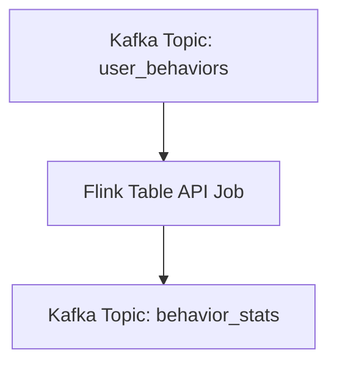

# Kafka, Flink, Spark 통합 실습 정리본

```text
[Abstract]

본 정리본은 실시간 데이터 처리와 배치 처리의 전반적인 흐름을 직접 구현하고 학습하기 위한 실습 기반 문서이다. Kafka를 중심으로 Flink와 Spark를 연계하여 실시간 이벤트 생성, 스트리밍 집계, 그리고 정적 파일 기반 배치 처리를 포괄하는 데이터 파이프라인을 구성하였다.

먼저, Python 기반 Kafka Producer를 통해 사용자 행동 데이터를 실시간으로 생성하여 Kafka 토픽으로 전송하고, Flink Table API를 활용하여 해당 데이터를 카테고리 및 행동 유형별로 실시간 집계한 후 다시 Kafka로 출력하는 스트리밍 구조를 설계하였다. 이어서, Spark Structured Streaming을 이용해 Kafka로부터 타임스탬프 기반 메시지를 수신하고, 1분 단위 윈도우 집계를 통해 시간 흐름에 따른 메시지 패턴을 시각화하였다.

또한, PyFlink를 활용한 배치 처리 실습을 통해 CSV 형식의 정적 판매 데이터를 로드하고, SQL 기반의 카테고리별 집계 작업을 수행함으로써 Flink의 배치 처리 역량을 검증하였다. 결과 데이터는 Pandas를 통해 후처리 및 시각화되었다.

이번 정리본을 통해 Kafka의 유연한 메시지 전달 구조, Flink의 정밀한 시간 제어 및 스트리밍 처리 능력, Spark의 직관적인 마이크로 배치 방식, PyFlink의 SQL 기반 배치 분석 기능 등 각각의 기술이 가지는 고유한 특성과 실무 적용 가능성을 통합적으로 조망할 수 있었다. 실시간 데이터 환경에서의 통합적 사고와 기술 선택의 근거를 마련하고자 하는 학습자에게 실질적이고 구조화된 이해를 제공하는 것을 목표로 한다.
```

<br>

1\. 실시간 데이터 파이프라인 개요 및 목표
=========================


### 1.1 데이터는 왜 ‘실시간’이어야 하는가?

현대의 디지털 비즈니스 환경에서는 단순한 데이터 수집과 저장을 넘어,  
**데이터의 실시간 처리와 분석**이 핵심 경쟁력으로 부상하고 있다.

*   **사용자 경험(UX) 개선**: 페이지 클릭, 상품 탐색, 장바구니 담기 등 사용자의 행동은 빠르게 변화하며, 그에 즉시 반응하는 개인화 전략이 필요하다.
    
*   **즉각적인 인사이트 제공**: 실시간 분석을 통해 마케팅, 추천 시스템, 트래픽 조절 등의 반응 속도를 높일 수 있다.
    
*   **운영 효율성 향상**: 실시간 장애 탐지, 재고 관리, 물류 추적 등도 스트리밍 데이터로 가능해진다.
    

이러한 실시간 흐름을 구현하기 위해, 본 실습에서는 다음의 구성으로 파이프라인을 설계하였다:

<br>

### 1.2 실습 목표 및 구조

> 데이터를 실시간으로 생성 → Kafka로 전송 → Flink 또는 Spark에서 처리 → 다시 Kafka로 전송

아래는 전체 파이프라인의 흐름이다:

```mermaid
graph TD
    A[데이터 생성기 (Python)] --> B[Kafka (user_behaviors)]
    B --> C[Flink 스트리밍 집계]
    C --> D[Kafka (behavior_stats)]
    B --> E[Spark 집계 테스트용 메시지 처리]
```

#### 주요 실습 도구 및 역할:

| 구성 요소                 | 설명                                                       |
| ------------------------- | ---------------------------------------------------------- |
| **Kafka**                 | 실시간 메시지 전달 시스템 (메시지 큐)                      |
| **Flink**                 | 실시간 데이터 처리 엔진 (스트리밍, 배치 모두 지원)         |
| **Spark**                 | 마이크로 배치 기반 실시간 분석 도구 (Structured Streaming) |
| **Python Kafka Producer** | 사용자 이벤트를 Kafka로 전송하는 시뮬레이션 코드           |

<br>

### 1.3 실습 개요 요약

| 실습 구성         | 목적                                                |
| ----------------- | --------------------------------------------------- |
| **Kafka + Flink** | 사용자 행동 데이터를 수집 및 실시간 집계            |
| **Kafka + Spark** | 시간 기반 메시지 집계를 통해 Spark 스트리밍 이해    |
| **Flink Batch**   | 정적 CSV 데이터를 집계하여 Table API 배치 활용 경험 |

<br>
<br>

2\. 실시간 사용자 이벤트 생성: Kafka 프로듀서 구성
=================================


2.1 실습 목적
---------

본 실습에서는 Kafka를 데이터 파이프라인의 **입구(ingestion point)** 로 활용한다.  
이를 위해 Python 언어로 작성된 **Kafka Producer** 코드를 사용하여,  
사용자의 클릭, 조회, 구매 등의 행동을 모의한 이벤트를 Kafka로 실시간 전송한다.

<br>

2.2 실습 대상 토픽
------------

Kafka는 데이터를 구분하여 저장하기 위해 **토픽(Topic)** 이라는 논리적 단위를 사용한다.  
이 실습에서는 다음과 같은 토픽이 사용된다:

*   `user_behaviors` : 실시간으로 사용자 행동 이벤트를 수신하는 Kafka 토픽
    
*   이후 Flink에서 이 데이터를 구독하고 분석
    

<br>

2.3 핵심 코드 설명: `flink_producer.py`


### 📄 전체 구조

```python
from kafka import KafkaProducer
import json
import time
import random
from datetime import datetime

# Kafka 프로듀서 설정
producer = KafkaProducer(
    bootstrap_servers=['localhost:9092'],
    value_serializer=lambda v: json.dumps(v).encode('utf-8')
)

# 샘플 데이터 속성
user_ids = [f"user_{i}" for i in range(1, 100)]
item_ids = [f"item_{i}" for i in range(1, 200)]
categories = ["electronics", "books", "clothing", "home", "sports"]
behaviors = ["click", "view", "add_to_cart", "purchase"]

# 데이터 생성 및 전송
for _ in range(1000):  # 1000개의 이벤트 생성
    event = {
        "user_id": random.choice(user_ids),
        "item_id": random.choice(item_ids),
        "category": random.choice(categories),
        "behavior": random.choice(behaviors),
        "ts": datetime.now().strftime("%Y-%m-%d %H:%M:%S.%f")[:-3]
    }

    producer.send('user_behaviors', event)
    print(f"Sent: {event}")
    time.sleep(0.1)  # 0.1초 간격으로 이벤트 전송

producer.flush()
print("Data generation complete!")
```

<br>

2.4 코드 구성 상세 해설
---------------

### 🔧 KafkaProducer 설정

```python
producer = KafkaProducer(
    bootstrap_servers=['localhost:9092'],
    value_serializer=lambda v: json.dumps(v).encode('utf-8')
)
```

*   `bootstrap_servers`: Kafka 브로커 주소를 지정한다. 여기서는 로컬 환경에서 동작하므로 `localhost:9092`를 사용.
    
*   `value_serializer`: Python 딕셔너리(`dict`) 형태의 데이터를 Kafka에 전송하기 위해,  
    이를 JSON 문자열로 직렬화하고 UTF-8로 인코딩함.
    

### 🎲 이벤트 속성 정의

```python
user_ids = [f"user_{i}" for i in range(1, 100)]
item_ids = [f"item_{i}" for i in range(1, 200)]
categories = ["electronics", "books", "clothing", "home", "sports"]
behaviors = ["click", "view", "add_to_cart", "purchase"]
```

*   이벤트에 포함될 사용자 ID, 상품 ID, 카테고리, 행동 타입을 미리 정의하여 랜덤 추출.
    

### 🧾 JSON 메시지 생성 및 Kafka 전송

```python
event = {
    "user_id": ...,
    "item_id": ...,
    "category": ...,
    "behavior": ...,
    "ts": ...
}
```

*   각 메시지는 사용자 행동을 나타내며, `ts` 필드는 millisecond 단위의 타임스탬프를 포함한다.
    
*   0.1초마다 이벤트를 생성해 Kafka의 `user_behaviors` 토픽으로 전송하며,  
    실시간 스트리밍 환경을 자연스럽게 시뮬레이션한다.
    

<br>

2.5 실행 방법
---------

터미널에서 해당 스크립트를 실행하면 다음과 같이 로그가 출력되며 Kafka로 메시지가 전송된다:

```bash
$ python flink_producer.py
Sent: {'user_id': 'user_3', 'item_id': 'item_122', 'category': 'books', 'behavior': 'view', 'ts': '2025-04-21 14:10:45.123'}
Sent: ...
...
Data generation complete!
```

<br>

2.6 이 실습의 의미
------------

이 Producer는 단순한 테스트 코드가 아니다.  
Flink나 Spark의 실시간 처리를 **현실적인 사용자 시나리오에 기반한 이벤트 흐름으로 검증할 수 있게 해주는** 핵심 인프라이다.  
이를 통해 아래와 같은 경험을 하게 된다:

*   Kafka 기반 메시지 큐의 동작 방식 체험
    
*   JSON 기반 이벤트 구조 설계 경험
    
*   실시간 데이터 처리 전, **‘데이터가 어떻게 발생하는가’** 에 대한 감각 확보
    

<br>
<br>

3\. Flink 스트리밍 파이프라인 구성 및 실행
============================


3.1 실습 목적
---------

Flink는 대용량 데이터를 빠르게 처리할 수 있는 실시간 스트리밍 엔진이다.  
이번 실습에서는 Kafka로부터 들어온 사용자 이벤트 데이터를 Flink가 받아들여,  
카테고리(category)와 행동 유형(behavior)별로 집계하고,  
그 결과를 다시 Kafka에 보내는 **end-to-end 실시간 데이터 흐름**을 구현한다.

<br>

3.2 실습 흐름 요약
------------



*   `user_behaviors`: 사용자 이벤트가 담긴 Kafka 토픽 (입력)
    
*   `behavior_stats`: Flink가 집계 결과를 보내는 Kafka 토픽 (출력)
    

<br>

3.3 핵심 코드 구조: `kafka_flink_example.py`
--------------------------------------

### 📄 전체 구조

```python
from pyflink.datastream import StreamExecutionEnvironment
from pyflink.table import StreamTableEnvironment, EnvironmentSettings

import os
import time
import logging

# 로깅 설정
logging.basicConfig(level=logging.INFO, format='%(asctime)s - %(levelname)s - %(message)s')
logger = logging.getLogger(__name__)

def main():
    logger.info("Flink 작업 시작...")
    
    # 스트림 실행 환경 설정
    env = StreamExecutionEnvironment.get_execution_environment()
    # Table API는 Batch와 Streaming 모드를 명확히 구분
    # DataStream API는 기본이 스트리밍 → 별도 설정 필요 없음
    # Table API에서 Kafka 사용 시	in_streaming_mode() + StreamTableEnvironment 필수
    env_settings = EnvironmentSettings.new_instance().in_streaming_mode().build()
    table_env = StreamTableEnvironment.create(env, environment_settings=env_settings)
    
    # 로깅 레벨 설정
    table_env.get_config().get_configuration().set_string("pipeline.global-job-parameters.logger.level", "INFO")
    
    # JAR 파일 추가 (전체 경로로 수정하세요)
    kafka_jar = os.path.join(os.path.abspath('.'), 'flink-sql-connector-kafka-3.3.0-1.20.jar')
    logger.info(f"사용하는 JAR 파일 경로: {kafka_jar}")
    if not os.path.exists(kafka_jar):
        logger.error(f"JAR 파일이 존재하지 않습니다: {kafka_jar}")
        return
    
    table_env.get_config().get_configuration().set_string("pipeline.jars", f"file://{kafka_jar}")
    
    # 소스 테이블 정의
    try:
        logger.info("Kafka 소스 테이블 생성 시도...")
        table_env.execute_sql("""
        CREATE TABLE kafka_source (
            user_id STRING,
            item_id STRING,
            category STRING,
            behavior STRING,
            ts TIMESTAMP(3),
            proctime AS PROCTIME()
        ) WITH (
            'connector' = 'kafka',
            'topic' = 'user_behaviors',
            'properties.bootstrap.servers' = 'localhost:9092',
            'properties.group.id' = 'flink-consumer-group',
            'scan.startup.mode' = 'earliest-offset',
            'format' = 'json',
            'json.fail-on-missing-field' = 'false',
            'json.ignore-parse-errors' = 'true'
        )
        """)
        logger.info("Kafka 소스 테이블 생성 성공")
    except Exception as e:
        logger.error(f"소스 테이블 생성 중 오류 발생: {e}")
        return
    
    # 싱크 테이블 정의
    try:
        logger.info("Kafka 싱크 테이블 생성 시도...")
        table_env.execute_sql("""
        CREATE TABLE kafka_sink (
            category STRING,
            behavior STRING,
            behavior_count BIGINT,
            update_time TIMESTAMP(3),
            PRIMARY KEY (category, behavior) NOT ENFORCED
        ) WITH (
            'connector' = 'kafka',
            'topic' = 'behavior_stats',
            'properties.bootstrap.servers' = 'localhost:9092',
            'key.format' = 'json',
            'value.format' = 'json',
            'properties.group.id' = 'flink-sink-group'
        )
        """)
        logger.info("Kafka 싱크 테이블 생성 성공")
    except Exception as e:
        logger.error(f"싱크 테이블 생성 중 오류 발생: {e}")
        return
    
    # 작업 제출
    try:
        logger.info("SQL 쿼리 실행 시도...")
        stmt_set = table_env.create_statement_set()
        stmt_set.add_insert_sql("""
        INSERT INTO kafka_sink
        SELECT 
            category,
            behavior,
            COUNT(*) AS behavior_count,
            CURRENT_TIMESTAMP as update_time
        FROM kafka_source
        GROUP BY category, behavior
        """)
        
        # 작업 실행 및 JobClient 가져오기
        job_client = stmt_set.execute().get_job_client()
        
        if job_client:
            job_id = job_client.get_job_id()
            logger.info(f"작업이 성공적으로 제출되었습니다. 작업 ID: {job_id}")
            
            # 작업 상태 확인
            monitor_job(job_client)
        else:
            logger.error("작업 클라이언트를 가져올 수 없습니다.")
    except Exception as e:
        logger.error(f"작업 실행 중 오류 발생: {e}")

def monitor_job(job_client):
    """작업 상태에 대한 로그를 출력합니다."""
    try:
        # 작업 상태 확인
        # Flink Job 상태 값
        # RUNNING    : Flink 작업이 현재 실행 중
        # FINISHED   : 작업이 성공적으로 완료됨
        # FAILED     : 작업 실패
        # CANCELED   : 작업이 중단됨
        # RESTARTING : 작업이 재시작 중
        
        job_status = job_client.get_job_status().result()

        logger.info(f"현재 작업 상태: {job_status}")
        
        # 샘플 데이터가 있는지 확인
        logger.info("Kafka 토픽에 샘플 데이터가 있는지 확인해주세요.")
        logger.info("샘플 데이터가 없다면 kafka_producer.py를 실행하여 테스트 데이터를 생성하세요.")
        
        # 작업 실행 중 상태 확인
        print("\n작업 확인 시작 (10초마다 상태 확인, Ctrl+C로 종료)")
        for i in range(6):  # 60초 동안 확인
            time.sleep(10)
            try:
                current_status = job_client.get_job_status().result()
                print(f"[{i+1}/6] 현재 작업 상태: {current_status}")
                
                # 선택적: 작업 메트릭스 확인 (PyFlink API가 지원하는 경우)
                # 이 부분은 PyFlink 버전에 따라 다를 수 있습니다
                if hasattr(job_client, 'get_job_metrics'):
                    metrics = job_client.get_job_metrics()
                    print(f"작업 메트릭스: {metrics}")
            except Exception as e:
                print(f"상태 확인 중 오류 발생: {e}")
        
        print("\n확인 완료. 작업은 계속 실행 중입니다.")
        print("결과를 확인하려면 다음 명령어를 실행하세요:")
        print("$KAFKA_HOME/bin/kafka-console-consumer.sh --topic behavior_stats --bootstrap-server localhost:9092 --from-beginning")
        
    except Exception as e:
        logger.error(f"작업 확인 중 오류 발생: {e}")

if __name__ == '__main__':
    main()
```

> **PyFlink의 Table API**를 이용한 실시간 집계 작업

### ▶ 전체 흐름 요약

```python
1. Flink 환경 설정 및 Kafka 커넥터 JAR 로딩
2. Kafka 소스 테이블 생성
3. Kafka 싱크 테이블 생성
4. SQL 쿼리 정의 및 실행
5. Flink Job 실행 및 상태 모니터링
```

<br>

3.4 주요 코드 블록 설명
---------------

### ✅ 환경 설정 및 JAR 등록

```python
env = StreamExecutionEnvironment.get_execution_environment()
env_settings = EnvironmentSettings.new_instance().in_streaming_mode().build()
table_env = StreamTableEnvironment.create(env, environment_settings=env_settings)

# Kafka 커넥터 JAR 파일 경로 등록
table_env.get_config().get_configuration().set_string(
    "pipeline.jars",
    "file:///절대경로/flink-sql-connector-kafka-3.3.0-1.20.jar"
)
```

*   `StreamExecutionEnvironment`: Flink 스트리밍 실행 환경
    
*   `StreamTableEnvironment`: SQL 기반 Table API 실행 환경
    
*   Flink에서 Kafka를 SQL로 다루려면 커넥터 JAR 등록이 필요함
    

<br>

### ✅ Kafka 소스 테이블 생성

```sql
CREATE TABLE kafka_source (
    user_id STRING,
    item_id STRING,
    category STRING,
    behavior STRING,
    ts TIMESTAMP(3),
    proctime AS PROCTIME()
) WITH (
    'connector' = 'kafka',
    'topic' = 'user_behaviors',
    'properties.bootstrap.servers' = 'localhost:9092',
    'format' = 'json',
    'scan.startup.mode' = 'earliest-offset',
    ...
)
```

*   `user_behaviors` 토픽을 통해 들어오는 JSON 메시지를 Flink 테이블로 매핑
    
*   `ts`: 이벤트 발생 시각
    
*   `proctime`: Flink의 처리 시각 → 시간 기반 연산에 사용 가능
    
*   `scan.startup.mode = 'earliest-offset'`: 토픽의 처음부터 데이터를 읽음
    

<br>

### ✅ Kafka 싱크 테이블 생성

```sql
CREATE TABLE kafka_sink (
    category STRING,
    behavior STRING,
    behavior_count BIGINT,
    update_time TIMESTAMP(3),
    PRIMARY KEY (category, behavior) NOT ENFORCED
) WITH (
    'connector' = 'upsert-kafka',
    'topic' = 'behavior_stats',
    'key.format' = 'json',
    'value.format' = 'json',
    ...
)
```

*   Flink가 처리한 결과를 다시 Kafka 토픽에 전송하기 위한 테이블
    
*   `upsert-kafka`는 **키 기반 덮어쓰기**를 허용하는 싱크 커넥터
    
*   `category + behavior` 조합을 키로 사용하고, 해당 조합의 집계 값을 Kafka에 지속 업데이트
    

<br>

### ✅ SQL 집계 쿼리 실행

```sql
INSERT INTO kafka_sink
SELECT 
    category,
    behavior,
    COUNT(*) AS behavior_count,
    CURRENT_TIMESTAMP AS update_time
FROM kafka_source
GROUP BY category, behavior
```

*   실시간으로 들어오는 사용자 행동을 **카테고리 + 행동 유형** 기준으로 집계
    
*   `COUNT(*)`: 해당 조합의 발생 횟수 집계
    
*   `CURRENT_TIMESTAMP`: Flink가 집계한 시점 기록
    

<br>

### ✅ 실행 후 모니터링

```python
job_client = stmt_set.execute().get_job_client()
status = job_client.get_job_status().result()
```

*   `StatementSet`을 통해 SQL 쿼리를 실행하고, 해당 작업의 상태를 모니터링할 수 있음
    
*   콘솔 로그 또는 Kafka consumer에서 결과를 실시간으로 확인할 수 있음
    

<br>

3.5 실행 및 결과 확인
--------------

Kafka consumer를 사용하여 Flink가 전송하는 결과 메시지를 실시간으로 확인할 수 있다:

```bash
$KAFKA_HOME/bin/kafka-console-consumer.sh \
  --topic behavior_stats \
  --bootstrap-server localhost:9092 \
  --from-beginning
```

#### 예시 출력:

```json
{"category":"books","behavior":"view","behavior_count":53,"update_time":"2025-04-21T14:15:00"}
```

<br>

3.6 실습의 핵심 학습 포인트
-----------------

*   Kafka → Flink 연계를 위한 커넥터 설정 및 SQL 기반 처리 흐름 체험
    
*   실시간 사용자 데이터를 Flink SQL로 집계하는 로직 이해
    
*   Kafka를 입출력 양쪽에 활용하는 실시간 스트리밍 파이프라인 설계
    
*   Flink의 **Table API, StatementSet, proctime, upsert-kafka** 등의 실전 사용법 체득
    

<br>
<br>

4\. Spark Structured Streaming을 활용한 실시간 메시지 집계
==============================================


4.1 실습 목표
---------

이번 실습에서는 Kafka에 저장된 JSON 메시지를 **Spark Structured Streaming**으로 수신하고,  
그 안에 포함된 타임스탬프를 기준으로 **1분 단위 윈도우 집계**를 수행한다.

이 실습을 통해 다음과 같은 목적을 달성할 수 있다:

*   Kafka + Spark 연동 경험
    
*   타임스탬프 기반 집계 (event time)
    
*   Structured Streaming의 **Watermark** 개념 실습
    
*   Flink와 Spark 간의 차이점 비교
    

<br>

4.2 실습 흐름 요약
------------

```mermaid
graph TD
    A[Kafka Topic: test-topic] --> B[Spark Structured Streaming]
    B --> C[콘솔 출력 (1분 단위 윈도우 메시지 수)]
```

*   Kafka로부터 메시지를 읽음
    
*   각 메시지의 timestamp 필드를 기준으로 윈도우 집계
    
*   집계 결과를 콘솔에 출력
    

<br>

4.3 Kafka 메시지 예시 (Producer 코드 `spark_producer.py`에서 생성)
-------------------------------------------------------

```json
{
  "id": 12,
  "message": "테스트 메시지 12",
  "timestamp": "2025-04-21 14:08:35"
}
```

*   Spark는 이 메시지의 `timestamp` 값을 기준으로 집계를 수행하게 된다.
    
### 📄 전체 구조

```python
from kafka import KafkaProducer
import json
import time
from datetime import datetime, timedelta
import random

# Kafka Producer 생성
producer = KafkaProducer(
    bootstrap_servers=['localhost:9092'],
    value_serializer=lambda v: json.dumps(v).encode('utf-8')
)

# 기준 시간 (현재 시각 기준 -5분)
base_time = datetime.now() - timedelta(minutes=5)

# 메시지 전송
for i in range(30):
    # 0~4분 사이의 임의 시점 생성 (1분 단위 집계를 위해)
    offset_minutes = random.randint(0, 4)
    offset_seconds = random.randint(0, 59)

    msg_time = base_time + timedelta(minutes=offset_minutes, seconds=offset_seconds)
    
    message = {
        'id': i,
        'message': f'테스트 메시지 {i}',
        'timestamp': msg_time.strftime('%Y-%m-%d %H:%M:%S')
    }
    
    # Kafka로 메시지 전송
    producer.send('test-topic', message)
    print(f'전송된 메시지: {message}')
    
    time.sleep(0.5)  # 너무 빠르게 보내지 않도록 살짝 텀 주기

producer.flush()
```

<br>

4.4 핵심 코드 설명: `spark_kafka_example.py`
--------------------------------------

### 📄 전체 구조

```python
from pyspark.sql import SparkSession
from pyspark.sql.functions import *
from pyspark.sql.types import *
import findspark

# 로컬 Python 환경에서 Spark를 사용할 수 있도록 초기화
findspark.init()

# Spark 세션 생성 함수
# 애플리케이션 이름 지정
# Kafka 연동용 패키지 자동 다운로드
def create_spark_session():
    return SparkSession.builder \
        .appName("KafkaSparkStreaming") \
        .config("spark.jars.packages", "org.apache.spark:spark-sql-kafka-0-10_2.12:3.5.0") \
        .getOrCreate()

# Kafka 스트림 처리 메인 함수
def process_kafka_stream():
    # Spark 세션 생성
    spark = create_spark_session()
    
    # Kafka에서 스트림 데이터 읽기
    # 실시간 스트림 읽기 시작
    # 데이터 소스 형식 지정
    # Kafka 브로커 주소
    # 구독할 Kafka 토픽 이름
    # 가장 마지막 오프셋부터 읽기 시작
    df = spark \
        .readStream \
        .format("kafka") \
        .option("kafka.bootstrap.servers", "localhost:9092") \
        .option("subscribe", "test-topic") \
        .option("startingOffsets", "latest") \
        .load()
    
    # Kafka 메시지의 value는 binary 형태 → 문자열로 변환
    value_df = df.selectExpr("CAST(value AS STRING)")

    # Kafka 메시지 안의 JSON을 파싱하기 위한 스키마 정의
    # 이벤트 발생 시각
    # 메시지 본문
    schema = StructType([
        StructField("timestamp", TimestampType(), True),
        StructField("message", StringType(), True)
    ])
    
    # JSON 문자열을 구조화된 컬럼으로 파싱
    # JSON 파싱 후 "data" 컬럼으로 감싸기
    # 컬럼 펼치기 (timestamp, message 등으로 분리)
    parsed_df = value_df.select(
        from_json(col("value"), schema).alias("data")
    ).select("data.*")
    
    # 타임스탬프 기준으로 1분 단위 윈도우 집계
    # 1분 지연까지 허용 (이벤트 타임 기반)
    # 1분 단위로 타임스탬프 윈도우 분할
    result_df = parsed_df \
        .withWatermark("timestamp", "1 minute") \
        .groupBy(window("timestamp", "1 minute")) \
        .count()  # 각 윈도우별 메시지 수 계산
    
    # 실시간 집계 결과를 콘솔에 출력
    # 스트림 결과 쓰기 시작
    # 전체 윈도우 결과를 계속 갱신
    # 콘솔로 출력
    # 스트리밍 쿼리 시작
    query = result_df \
        .writeStream \
        .outputMode("complete") \
        .format("console") \
        .start()

    # 스트리밍 작업이 끝날 때까지 대기
    query.awaitTermination()

# 메인 함수 실행
if __name__ == "__main__":
    process_kafka_stream()
```

### ✅ SparkSession 설정

```python
spark = SparkSession.builder \
    .appName("KafkaSparkStreaming") \
    .config("spark.jars.packages", "org.apache.spark:spark-sql-kafka-0-10_2.12:3.5.0") \
    .getOrCreate()
```

*   Kafka를 Spark와 연동하려면 위와 같은 패키지를 설정해야 한다.
    
*   PySpark에서 Kafka 토픽을 스트림 소스로 처리할 수 있게 된다.
    

<br>

### ✅ Kafka에서 메시지 수신

```python
df = spark.readStream \
    .format("kafka") \
    .option("kafka.bootstrap.servers", "localhost:9092") \
    .option("subscribe", "test-topic") \
    .option("startingOffsets", "latest") \
    .load()
```

*   `test-topic`으로부터 실시간 메시지를 수신
    
*   Kafka 메시지의 `key`, `value`, `timestamp` 등이 binary 형태로 들어옴
    

<br>

### ✅ JSON 문자열 파싱 및 스키마 적용

```python
from pyspark.sql.types import StructType, StructField, TimestampType, StringType

schema = StructType([
    StructField("timestamp", TimestampType(), True),
    StructField("message", StringType(), True)
])

parsed_df = df.selectExpr("CAST(value AS STRING)") \
    .select(from_json(col("value"), schema).alias("data")) \
    .select("data.*")
```

*   Kafka 메시지의 `value`는 JSON 문자열 → `CAST(value AS STRING)` 필요
    
*   `from_json()`을 통해 구조화된 DataFrame으로 변환
    
*   `"data.*"`를 통해 내부 필드를 펼침 (message, timestamp)
    

<br>

### ✅ 타임윈도우 + Watermark 집계 수행

```python
result_df = parsed_df \
    .withWatermark("timestamp", "1 minute") \
    .groupBy(window("timestamp", "1 minute")) \
    .count()
```

*   `withWatermark()`는 늦게 도착하는 데이터를 어느 정도까지 수용할지 결정
    
*   `window("timestamp", "1 minute")`: 타임스탬프를 기준으로 1분 단위 집계
    
*   `count()`: 각 시간 구간마다 메시지 수를 세어줌
    

<br>

### ✅ 콘솔로 실시간 출력

```python
query = result_df.writeStream \
    .outputMode("complete") \
    .format("console") \
    .start()

query.awaitTermination()
```

*   `complete` 모드는 집계된 전체 윈도우 결과를 지속적으로 출력
    
*   콘솔에 출력된 메시지를 통해 집계 결과를 실시간으로 확인할 수 있음
    

<br>

4.5 실행 예시 및 결과 해석
-----------------

### ✅ Producer 실행 (`spark_producer.py`)

```bash
$ python spark_producer.py
전송된 메시지: {'id': 3, 'message': '테스트 메시지 3', 'timestamp': '2025-04-21 14:08:35'}
...
```

### ✅ Structured Streaming 실행

```bash
$ python spark_kafka_example.py
+------------------------------------------+-----+
|window                                    |count|
+------------------------------------------+-----+
|{2025-04-21 14:08:00, 2025-04-21 14:09:00}|  7  |
|{2025-04-21 14:09:00, 2025-04-21 14:10:00}|  6  |
+------------------------------------------+-----+
```

*   출력에서 `"window"`는 집계 시간 구간
    
*   `"count"`는 해당 시간대에 수신된 메시지 수
    

<br>

4.6 Flink와 비교하며 이해하기
--------------------

| 항목        | Spark Structured Streaming    | Apache Flink                        |
| ----------- | ----------------------------- | ----------------------------------- |
| 처리 방식   | 마이크로 배치                 | 이벤트 단위 처리                    |
| 기본 API    | DataFrame, SQL                | Table API, DataStream API           |
| 집계 방식   | `window()`, `withWatermark()` | `GROUP BY`, `PROCTIME`, `WATERMARK` |
| 실습 난이도 | 상대적으로 쉬움               | 세밀한 제어 가능 (복잡도 ↑)         |

<br>

4.7 학습 포인트
----------

*   Kafka 메시지를 PySpark에서 실시간 수신하는 법
    
*   JSON 구조의 메시지를 파싱하여 분석 대상으로 만드는 실전 경험
    
*   `withWatermark()`를 이용한 event time 기반 집계
    
*   Flink와 Spark의 처리 패러다임 차이 이해
    

<br>
<br>

5\. PyFlink Table API를 활용한 정적 데이터 배치 처리
=======================================


5.1 실습 목적
---------

본 실습에서는 PyFlink를 이용해 다음과 같은 작업을 수행한다:

*   CSV로 저장된 정적 데이터를 읽는다.
    
*   판매 데이터를 카테고리 단위로 집계한다.
    
*   집계 결과를 또 다른 CSV 파일로 출력한다.
    
*   Pandas를 통해 결과를 확인한다.
    

이 실습을 통해 Flink Table API의 **SQL 기반 배치 처리 능력**과  
파일 기반 ETL 파이프라인 구축 방식을 직접 경험할 수 있다.

<br>

5.2 실습 흐름 요약
------------

```mermaid
graph TD
    A[CSV 소스 데이터 (sales_data.csv)] --> B[Flink Table API 배치 처리]
    B --> C[카테고리별 집계 결과 CSV (sales_summary)]
    C --> D[Pandas 로딩 및 출력]
```

<br>

5.3 샘플 입력 데이터 구조 (`create_sample_csv()` 자동 생성)
----------------------------------------------

CSV 데이터는 다음과 같은 컬럼으로 구성되어 있다:

| 컬럼명            | 설명                    |
| ----------------- | ----------------------- |
| product\_id       | 상품 ID                 |
| category          | 상품 카테고리           |
| price             | 단가                    |
| quantity          | 수량                    |
| transaction\_date | 거래일자 (`YYYY-MM-DD`) |

예시:

```
P321,electronics,899.99,3,2024-02-21
P514,accessories,45.20,1,2024-03-12
```

<br>

5.4 핵심 코드 설명: `pyflink_batch_example.py`
----------------------------------------

### 📄 전체 구조

```python
from pyflink.table import EnvironmentSettings, TableEnvironment
from pyflink.table.expressions import col
import tempfile
import os
import pandas as pd
import numpy as np
import logging

# 로깅 설정
logging.basicConfig(level=logging.INFO)
logger = logging.getLogger(__name__)

def main():
    logger.info("Flink 배치 처리 시작")
    
    # 배치 처리를 위한 테이블 환경 설정
    env_settings = EnvironmentSettings.in_batch_mode()
    table_env = TableEnvironment.create(env_settings)
    
    # 실행 설정
    config = table_env.get_config().get_configuration()    
    config.set_string("parallelism.default", "1")
    config.set_string("pipeline.auto-watermark-interval", "0")
    
    # 입력/출력 경로 설정
    input_path = create_sample_csv()
    output_dir = os.path.join(os.getcwd(), 'flink_output')  # 현재 디렉토리로 변경
    
    logger.info(f"입력 파일 경로: {input_path}")
    logger.info(f"출력 디렉토리 경로: {output_dir}")
    
    # 기존 출력 디렉토리 삭제
    if os.path.exists(output_dir):
        import shutil
        shutil.rmtree(output_dir)
        logger.info("기존 출력 디렉토리 삭제됨")
    
    # 소스 테이블 생성
    source_ddl = f"""
    CREATE TABLE sales (
        product_id STRING,
        category STRING,
        price DOUBLE,
        quantity INT,
        transaction_date STRING
    ) WITH (
        'connector' = 'filesystem',
        'path' = '{input_path}',
        'format' = 'csv',
        'csv.field-delimiter' = ',',
        'csv.ignore-parse-errors' = 'true'
    )
    """
    logger.info("소스 테이블 생성 시작")
    table_env.execute_sql(source_ddl)
    logger.info("소스 테이블 생성 완료")
    
    # 싱크 테이블 생성
    sink_ddl = f"""
    CREATE TABLE sales_summary (
        category STRING,
        total_revenue DOUBLE,
        avg_price DOUBLE,
        total_quantity BIGINT,
        transaction_count BIGINT
    ) WITH (
        'connector' = 'filesystem',
        'path' = '{output_dir}',
        'format' = 'csv',
        'csv.field-delimiter' = ',',
        'csv.quote-character' = '"',
        'sink.rolling-policy.file-size' = '1MB',
        'sink.rolling-policy.rollover-interval' = '0',
        'sink.rolling-policy.check-interval' = '1s'
    )
    """
    logger.info("싱크 테이블 생성 시작")
    table_env.execute_sql(sink_ddl)
    logger.info("싱크 테이블 생성 완료")
    
    # SQL 쿼리 실행
    logger.info("데이터 처리 쿼리 실행 시작")
    result = table_env.execute_sql("""
    INSERT INTO sales_summary
    SELECT 
        category,
        SUM(price * quantity) AS total_revenue,
        AVG(price) AS avg_price,
        SUM(quantity) AS total_quantity,
        COUNT(*) AS transaction_count
    FROM sales
    GROUP BY category
    """)
    
    logger.info(f"쿼리 실행 결과: {result.get_job_client().get_job_status()}")
    print(f"배치 처리가 완료되었습니다. 결과는 {output_dir} 에 저장되었습니다.")
    
    # 결과 확인
    try:
        import time
        time.sleep(2)
        result_files = [f for f in os.listdir(output_dir) if f.startswith('part-')]
        logger.info(f"발견된 결과 파일들: {result_files}")
        if not result_files:
            raise FileNotFoundError("결과 파일을 찾을 수 없습니다.")
        result_file = os.path.join(output_dir, result_files[0])
        result_df = pd.read_csv(result_file, header=None,
            names=['category', 'total_revenue', 'avg_price', 'total_quantity', 'transaction_count'])
        print("\n===== 처리 결과 =====")
        print(result_df)
    except Exception as e:
        logger.error(f"결과 확인 중 오류 발생: {e}")
        print(f"결과 확인 중 오류 발생: {e}")
        print("출력 폴더를 직접 확인하세요.")

def create_sample_csv():
    """샘플 판매 데이터 생성"""
    temp_file = os.path.join(os.getcwd(), 'sales_data.csv')  # 현재 디렉토리에 저장
    np.random.seed(42)
    products = ['laptop', 'smartphone', 'tablet', 'monitor', 'keyboard']
    categories = ['electronics', 'accessories', 'peripherals']
    data = []
    for i in range(1000):
        product_id = f"P{np.random.randint(100, 999)}"
        category = np.random.choice(categories)
        price = round(np.random.uniform(10.0, 1000.0), 2)
        quantity = np.random.randint(1, 10)
        date = f"2024-{np.random.randint(1, 13):02d}-{np.random.randint(1, 29):02d}"
        data.append(f"{product_id},{category},{price},{quantity},{date}")
    with open(temp_file, 'w') as f:
        f.write('\n'.join(data))
    print(f"샘플 데이터가 {temp_file}에 생성되었습니다.")
    return temp_file

if __name__ == '__main__':
    main()
```

### ✅ Flink 배치 모드 환경 설정

```python
env_settings = EnvironmentSettings.in_batch_mode()
table_env = TableEnvironment.create(env_settings)

table_env.get_config().get_configuration().set_string("parallelism.default", "1")
```

*   `in_batch_mode()`: Table API를 **배치 처리 모드**로 설정
    
*   병렬도(parallelism) 기본값을 1로 설정하여 단순 실행 환경 구성
    

<br>

### ✅ CSV 소스 테이블 정의

```sql
CREATE TABLE sales (
    product_id STRING,
    category STRING,
    price DOUBLE,
    quantity INT,
    transaction_date STRING
) WITH (
    'connector' = 'filesystem',
    'path' = '{input_path}',
    'format' = 'csv',
    'csv.field-delimiter' = ','
)
```

*   CSV 형식의 파일을 Flink 테이블로 인식
    
*   필드 타입을 SQL 스키마로 명시
    
*   `'connector' = 'filesystem'` 사용 → 로컬 파일도 데이터 소스로 활용 가능
    

<br>

### ✅ CSV 싱크 테이블 정의

```sql
CREATE TABLE sales_summary (
    category STRING,
    total_revenue DOUBLE,
    avg_price DOUBLE,
    total_quantity BIGINT,
    transaction_count BIGINT
) WITH (
    'connector' = 'filesystem',
    'path' = '{output_dir}',
    'format' = 'csv',
    'csv.field-delimiter' = ','
)
```

*   카테고리 단위 집계 결과를 저장할 싱크 테이블
    
*   배치 처리 결과는 지정된 디렉토리에 `part-*.csv` 형태로 저장됨
    

<br>

### ✅ SQL 집계 쿼리 실행

```sql
INSERT INTO sales_summary
SELECT 
    category,
    SUM(price * quantity) AS total_revenue,
    AVG(price) AS avg_price,
    SUM(quantity) AS total_quantity,
    COUNT(*) AS transaction_count
FROM sales
GROUP BY category
```

*   카테고리별 매출(total revenue), 평균 가격, 총 수량, 거래 건수 계산
    
*   SQL 문법으로 처리 가능하다는 점에서 **Flink Table API의 높은 추상화 수준**을 체험할 수 있음
    

<br>

### ✅ 결과 파일 로딩 및 Pandas 출력

```python
result_df = pd.read_csv(result_file, header=None, names=[
    'category', 'total_revenue', 'avg_price', 'total_quantity', 'transaction_count'
])
print(result_df)
```

*   Flink는 결과를 파일로 저장하기 때문에, Python 환경에서 Pandas를 통해 결과를 다시 불러올 수 있음
    
*   ETL 실무에서 흔히 볼 수 있는 “Flink → CSV → 후처리”의 구조를 경험할 수 있음
    

<br>

5.5 실행 결과 예시
------------

```plaintext
        category  total_revenue  avg_price  total_quantity  transaction_count
0    electronics       143009.1     505.22             310                105
1     peripherals        90231.8     413.75             281                 95
2    accessories        48123.4     231.60             213                100
```

<br>

5.6 실습 요약 및 학습 포인트
------------------

*   PyFlink를 통해 정적 데이터를 SQL로 처리하는 배치 파이프라인을 직접 구현
    
*   FileSystem 커넥터를 활용하여 CSV를 데이터 소스/싱크로 사용
    
*   Table API 기반의 집계, 변환, 그룹 연산 학습
    
*   Pandas 연계로 사후 분석 경험
    

<br>
<br>

6\. Kafka, Flink, Spark 통합 실습 총정리
=================================


6.1 전체 실습 흐름 요약
---------------

이번 실습은 **실시간 데이터 스트리밍 파이프라인**을 설계하고 구현하는 경험을 중심으로 진행되었다.  
Kafka를 중심으로 Flink, Spark, 그리고 PyFlink의 Table API를 연계하며,  
실제 데이터를 다루는 전반적인 흐름을 체계적으로 다루었다.

<br>

### 🧭 실습 흐름 통합 다이어그램

```mermaid
graph TD
    A[Kafka Producer (flink_producer.py)] --> B[Kafka Topic: user_behaviors]
    B --> C[Flink 처리 (kafka_flink_example.py)]
    C --> D[Kafka Topic: behavior_stats]
    E[Kafka Producer (spark_producer.py)] --> F[Kafka Topic: test-topic]
    F --> G[Spark Streaming 집계 (spark_kafka_example.py)]
    H[CSV 파일 생성] --> I[PyFlink 배치 처리 (pyflink_batch_example.py)]
    I --> J[CSV 결과 파일 → Pandas 로딩]
```

<br>

6.2 각 실습 구성의 의미와 핵심 포인트
-----------------------

| 실습 구성                  | 목적                                      | 주요 기술              | 학습 포인트                              |
| -------------------------- | ----------------------------------------- | ---------------------- | ---------------------------------------- |
| `flink_producer.py`        | Kafka에 실시간 이벤트 전송                | KafkaProducer (Python) | JSON 메시지 구조, 시뮬레이션 이벤트 생성 |
| `kafka_flink_example.py`   | Flink로 Kafka 스트리밍 데이터 실시간 집계 | Flink Table API + SQL  | Kafka-Connector, proctime, upsert-kafka  |
| `spark_producer.py`        | 타임스탬프 포함 메시지 전송               | KafkaProducer (Python) | Event Time 기반 집계용 데이터 생성       |
| `spark_kafka_example.py`   | Spark Structured Streaming으로 Kafka 집계 | PySpark + Kafka 연동   | withWatermark(), window(), from\_json()  |
| `pyflink_batch_example.py` | 정적 CSV 데이터를 배치 집계               | PyFlink Table API      | FileSystem Connector, SQL 기반 ETL       |

<br>

6.3 기술별 특징 정리
-------------

| 기술                | 핵심 개념                   | 장점                        | 사용 시점                               |
| ------------------- | --------------------------- | --------------------------- | --------------------------------------- |
| **Kafka**           | 메시지 큐 (데이터 버스)     | 높은 처리량, 장애 복원력    | 실시간 데이터 수집 및 전송              |
| **Flink**           | 이벤트 기반 실시간 처리     | 낮은 지연, 정밀한 시간 제어 | 실시간 분석, 패턴 탐지                  |
| **Spark**           | 마이크로 배치 기반 처리     | 유연한 API, 쉬운 사용성     | 로그 분석, 지연 허용 가능한 실시간 집계 |
| **PyFlink (Batch)** | 정적 데이터 처리용 SQL 엔진 | SQL과 DataFrame 혼합        | 파일 기반 집계, 사후 데이터 처리        |

<br>

6.4 실무에서의 활용 시나리오 예시
--------------------

| 시나리오                     | 적합한 기술 조합      | 설명                                  |
| ---------------------------- | --------------------- | ------------------------------------- |
| 사용자 행동 기반 추천 시스템 | Kafka + Flink         | 실시간 행동 분석 및 피드백 제공       |
| 라이브 방송 트래픽 모니터링  | Kafka + Spark         | 분 단위로 유입량 집계, 대시보드 제공  |
| 월별 판매 데이터 집계 리포트 | PyFlink (Batch)       | 정적 CSV 파일을 SQL로 정리, 결과 저장 |
| 알림 서비스                  | Kafka + Flink + Kafka | 특정 행동 감지 → 메시지 발송 트리거   |
