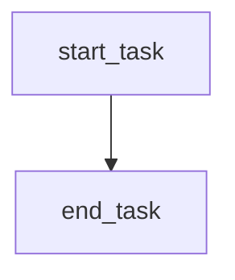

# 가장 간단한 DAG 작성 및 실행


📘 1. 실습 주제 개요
==============

💡 주제: Apache Airflow를 활용한 DAG 작성의 기초 – EmptyOperator 실습
--------------------------------------------------------

### 🧭 학습 목적

본 실습은 **Apache Airflow**의 핵심 구성 요소인 **DAG(Directed Acyclic Graph, 방향 비순환 그래프)** 와 **Operator**의 기본 개념을 이해하고, 이를 활용하여 간단한 워크플로우(작업 흐름)를 정의하는 법을 익히는 데 그 목적이 있다.

특히, Airflow 2.3 버전 이후 도입된 `EmptyOperator`를 통해, 실질적인 작업은 수행하지 않지만 **작업 간 흐름을 시각적으로 표현하고 실습의 뼈대를 구성하는 방법**을 학습한다.

### 🔍 왜 배우는가?

*   **Airflow는 데이터 엔지니어링에서 가장 널리 쓰이는 워크플로우 오케스트레이션 도구**로, 복잡한 데이터 파이프라인을 일정 주기나 조건에 따라 자동화할 수 있도록 설계되어 있다.
    
*   그 중심에는 DAG와 Operator가 있다. DAG는 "작업들의 실행 순서를 정의"하고, Operator는 "각 작업을 실제로 수행"하는 단위이다.
    
*   이 실습을 통해 DAG 구조와 실행 흐름의 기본을 익히고, 이후의 데이터 수집·가공·저장 과정 전체에 이를 적용할 준비를 갖추게 된다.
    

### 🚩 실습에서 사용하는 주요 개념

| 개념          | 설명                                                                                                                                                       |
| ------------- | ---------------------------------------------------------------------------------------------------------------------------------------------------------- |
| DAG           | 여러 작업(Task)을 연결하여 실행 순서를 정의하는 Airflow의 핵심 구조                                                                                        |
| Operator      | DAG 내부에서 수행할 단일 작업 단위                                                                                                                         |
| EmptyOperator | 실제 작업은 수행하지 않지만 DAG 흐름을 구성하거나 테스트용으로 사용하는 Operator (Airflow 2.3 이후 버전에서는 기존 DummyOperator가 EmptyOperator로 변경됨) |
| task\_id      | 각각의 Operator에 부여되는 고유 식별자                                                                                                                     |
| `>>` 연산자   | 앞의 태스크가 끝난 후 다음 태스크가 실행됨을 나타냄 (태스크 간 의존성 설정)                                                                                |

<br>
<br>

🛠️ 2. 코드 구조 및 흐름 해설 + 실행 결과 예시 및 해설
====================================

2.1 코드 흐름 요약
------------

이번 실습의 코드는 단순한 두 개의 태스크(Task)를 연결한 DAG를 정의하는 예제이다. 실습의 주요 목적은 **DAG의 구조와 Operator 간 실행 순서 정의 방법**을 이해하는 것이다.

다음은 전체 코드 흐름의 개요이다:

1.  **필수 라이브러리 임포트**
    
    *   DAG 정의를 위한 `airflow.models.DAG`
        
    *   작업(Task) 단위를 생성하기 위한 `EmptyOperator`
        
2.  **DAG 정의**
    
    *   `with DAG(...) as dag:` 문을 통해 DAG 객체를 생성하고 context 안에서 태스크를 정의한다.
        
    *   `dag_id`, `default_args`, `schedule`과 같은 파라미터를 설정하여 DAG의 특성을 정의한다.
        
3.  **태스크 생성**
    
    *   `EmptyOperator`를 이용해 `start_task`, `end_task`라는 두 개의 태스크 생성
        
    *   각각의 태스크는 아무 동작도 하지 않지만, 실행 순서를 연결하는 데 사용된다.
        
4.  **태스크 간 의존성 정의**
    
    *   `start >> end`를 통해 `start_task`가 완료된 후에 `end_task`가 실행되도록 설정한다.
        

<br>

2.2 주요 코드 라인 해설
---------------

| 코드 라인                                           | 설명                                                                  |
| --------------------------------------------------- | --------------------------------------------------------------------- |
| `from airflow.models.dag import DAG`                | DAG 객체 생성을 위한 클래스 임포트                                    |
| `from airflow.operators.empty import EmptyOperator` | 아무 작업도 수행하지 않는 Operator를 임포트                           |
| `with DAG(...) as dag:`                             | DAG 정의 시작. 이 블록 내부에서 태스크를 정의함                       |
| `dag_id="dog"`                                      | DAG의 이름(식별자) 설정. Web UI 등에서 이 이름으로 구분됨             |
| `default_args={'start_date': None}`                 | 태스크 실행을 위한 기본 설정 (단순한 예제이므로 최소한의 설정만 포함) |
| `schedule=None`                                     | 주기적 실행이 아닌 수동 실행용으로 DAG 등록                           |
| `start = EmptyOperator(task_id='start_task')`       | 시작 지점 역할을 하는 태스크 정의                                     |
| `end = EmptyOperator(task_id='end_task')`           | 종료 지점 역할을 하는 태스크 정의                                     |
| `start >> end`                                      | `start_task` 완료 후 `end_task`가 실행되도록 의존성 정의              |

<br>

2.3 실행 결과 예시 (Airflow Web UI 기준)
--------------------------------

실제 DAG를 실행하면 아래와 같은 결과를 확인할 수 있다:

```text
DAG: dog
├── start_task (EmptyOperator)
└── end_task (EmptyOperator)
```

### 실행 순서 시각화 (텍스트 표현)



### 결과 해설:

*   두 개의 태스크 모두 실행되며, 각각 아무 작업도 하지 않음
    
*   Airflow Web UI의 DAG Graph View에서 "→" 방향으로 연결된 노드를 통해 **실행 순서 시각화** 가능
    
*   태스크 상태(Status)는 "Success"로 표시되며, 실제 처리 내용은 없음
    

<br>
<br>

⚙️ 3. 전체 코드 + 상세 주석
===================

```python
# DAG 및 Operator 관련 핵심 모듈 임포트
from airflow.models.dag import DAG                   # DAG(워크플로우의 흐름을 정의하는 객체)
from airflow.operators.empty import EmptyOperator    # 아무 작업도 하지 않는 Operator (Airflow 2.3 이후)

# DAG 정의 시작
with DAG(
    dag_id="dog",  # DAG의 고유 식별자 (Airflow Web UI에서 이 이름으로 표시됨)
    
    # DAG 실행 시 기본 설정값. 여기서는 start_date만 설정함
    # 실제 운영 환경에서는 retries, retry_delay 등도 설정함
    default_args={'start_date': None},
    
    # DAG 실행 주기 설정. None은 수동 실행만 가능하다는 의미
    schedule=None
) as dag:  # with 블록 내부에 정의된 모든 태스크는 이 DAG에 포함됨

    # 시작 태스크 정의 - 실제 동작은 없지만 DAG 흐름의 시작점 역할
    start = EmptyOperator(
        task_id='start_task'  # 태스크 고유 식별자 (Web UI에서 노드 이름으로 사용됨)
    )

    # 종료 태스크 정의 - 마찬가지로 실제 동작은 없지만 종료 지점 표현
    end = EmptyOperator(
        task_id='end_task'
    )

    # 태스크 실행 순서 정의: start_task → end_task
    # 이는 실행 흐름(의존성)을 나타냄
    start >> end
```

<br>

✏️ 보충 설명
--------

*   `EmptyOperator`는 DAG 구조를 테스트하거나 시각적으로 설계할 때 사용되는 **"흐름 표시용 가짜 작업(dummy task)"** 이다.
    
*   실무에서는 다음과 같은 상황에서 자주 사용된다:
    
    *   여러 개의 태스크를 병렬로 실행한 뒤, 모든 태스크가 완료된 후에 다음 태스크를 실행하고자 할 때 → 중간에 EmptyOperator를 허브처럼 삽입
        
    *   개발 초기에 태스크 코드가 완성되지 않았을 때, **자리 표시자**(placeholder)로 삽입
        
    *   테스트 또는 문서화 목적으로 **단계 구조만 구성**하고 싶을 때
        

<br>
<br>

📚 4. 추가 설명 및 실무 팁
==================

✅ 자주 하는 실수
----------

### ❌ DummyOperator 사용 오류

*   **Airflow 2.3 버전 이상에서는 더 이상 `DummyOperator`를 사용하지 않음**
    
    *   `from airflow.operators.dummy import DummyOperator` → ❌
        
    *   `from airflow.operators.empty import EmptyOperator` → ✅
        
    *   실습 시 버전이 달라 발생하는 `ImportError`가 대표적인 초기 오류이다.
        

### ❌ `start_date=None` 설정 시 DAG이 실행되지 않는 이유

*   `start_date=None`은 학습 목적이므로 문제가 없지만, 실제 운영 DAG에서는 반드시 날짜를 명시해야 스케줄 실행이 가능하다.
    
    *   예: `start_date=datetime(2023, 1, 1)`
        

* * *

💡 실무 팁
-------

### 📌 `EmptyOperator`의 실무 활용 예시

1.  **워크플로우 분기 제어**
    
    ```text
    start
      ├── task_A
      └── task_B
         ↓
        merge
    ```
    
    *   여러 분기 작업을 병렬로 실행 후 하나의 `EmptyOperator`에 합쳐 다음 단계로 이동
        
2.  **테스트를 위한 워크플로우 뼈대 설계**
    
    *   아직 구현되지 않은 태스크 대신 `EmptyOperator`를 배치하여 흐름 설계와 테스트를 선행할 수 있다.
        
3.  **로깅이나 알림만 보내는 작업의 단순화 처리**
    
    *   실제 처리를 하지 않고 "성공 상태"만 필요한 경우 활용
        

* * *

🚀 심화 학습 방향
-----------

| 주제                  | 학습 방향                                                                                |
| --------------------- | ---------------------------------------------------------------------------------------- |
| DAG 파라미터 심화     | `default_args`에 retry, email, depends\_on\_past 등 추가 옵션 설정 방법                  |
| Operator 심화         | `PythonOperator`, `BashOperator`, `EmailOperator` 등 다양한 Operator 실습                |
| Task 의존성 복합 설정 | `>>`, `<<`, `.set_downstream()`, `.set_upstream()` 등을 활용한 유연한 연결               |
| DAG 스케줄링          | `schedule_interval`을 사용한 주기적 실행 (`'@daily'`, `'0 6 * * 1'` 등 크론 표현식 학습) |
| Web UI 해석           | Graph View, Tree View, Gantt View 등을 통해 DAG 실행 상태 분석                           |

* * *

🔎 참고 문서 및 키워드
--------------

*   Airflow 공식 문서: [https://airflow.apache.org/docs/apache-airflow/stable/index.html](https://airflow.apache.org/docs/apache-airflow/stable/index.html)
    
*   키워드: `EmptyOperator`, `DAG`, `Operator`, `task dependency`, `Airflow Web UI`
    
