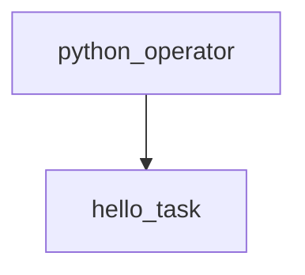

# PythonOperator를 이용한 간단한 Task 실행

📘 1. 실습 주제 개요
==============

💡 주제: PythonOperator를 활용한 사용자 정의 함수 실행 실습
------------------------------------------

### 🧭 학습 목적

본 실습은 Apache Airflow에서 가장 널리 사용되는 Operator 중 하나인 `PythonOperator`를 활용하여, **사용자 정의 함수**를 태스크(Task)로 등록하고 실행하는 방법을 학습하는 데 목적이 있다.

Airflow는 다양한 작업을 자동화할 수 있지만, **핵심은 Python 함수를 태스크로 감싸고 워크플로우에 통합하는 방식**이다. 본 실습을 통해 단일 함수 기반의 태스크 정의 및 실행 방법을 익히고, 실무에서 데이터 수집, 전처리, 분석 등을 자동화할 수 있는 기반을 마련한다.

<br>

🔍 왜 배우는가?
----------

*   실무에서는 ETL 파이프라인, 데이터 수집, 데이터베이스 업데이트, 알림 전송 등 다양한 작업을 Python 코드로 작성하고 이를 자동화한다.
    
*   `PythonOperator`는 이러한 Python 기반 작업을 Airflow DAG 안에 **정식 태스크(Task)로 등록**하는 핵심 도구이다.
    
*   단일 함수 실행이라는 단순한 구조를 통해 **Operator 동작 원리와 DAG 실행 흐름을 실습적으로 이해**할 수 있다.
    

<br>

🔑 주요 개념 요약
-----------

| 개념 | 설명 |
| --- | --- |
| PythonOperator | Python 함수를 Airflow 태스크로 실행하기 위한 Operator |
| `python_callable` | 실행할 Python 함수 객체를 지정하는 인자 |
| DAG | 작업 흐름(워크플로우)을 정의하는 틀 |
| `@once` | DAG이 최초 활성화 시 단 1회만 실행되도록 설정하는 주기 |
| `catchup=False` | 과거 날짜로 DAG가 자동 실행되는 것을 방지하는 옵션 |
| `task_id` | DAG 내에서 태스크를 식별하기 위한 고유 이름 |

<br>
<br>

🛠️ 2. 코드 구조 및 흐름 해설 + 실행 결과 예시 및 해설
====================================

2.1 코드 흐름 요약
------------

해당 코드는 **PythonOperator를 이용하여 단일 함수를 실행하는 DAG**를 정의하는 예제이다. 코드의 전체 구조는 다음 3단계로 나뉜다:

1.  **실행할 Python 함수 정의**
    
    *   `print_hello()` 함수: 단순히 콘솔에 문자열을 출력
        
2.  **DAG 정의**
    
    *   실행 주기(`@once`)와 시작일, 실행 조건을 지정한 DAG 생성
        
3.  **PythonOperator 태스크 등록 및 실행 흐름 정의**
    
    *   함수와 연결된 태스크를 생성하고 DAG에 포함
        

<br>

2.2 코드 라인별 설명
-------------

| 코드 | 설명 |
| --- | --- |
| `from airflow import DAG` | DAG 객체 생성을 위한 기본 모듈 |
| `import datetime` | 시작일 설정을 위한 datetime 모듈 |
| `from airflow.operators.python import PythonOperator` | Python 함수를 실행할 수 있는 Operator 클래스 |

<br>

### ▶️ 함수 정의

```python
def print_hello():
    print("Hello, Airflow!")
```

*   실행 시 Airflow 로그에 `"Hello, Airflow!"`가 출력된다.
    
*   실무에서는 여기에 데이터 크롤링, DB 저장, 알림 등 다양한 작업을 넣을 수 있다.
    

<br>

### 🗂 DAG 정의 및 Task 생성

```python
with DAG(
    dag_id="python_operator",
    schedule_interval="@once",
    start_date=datetime.datetime(2024, 4, 22),
    catchup=False,
) as dag:
```

*   DAG ID는 "python\_operator"로 설정됨 (Airflow Web UI에서 이 이름으로 식별됨)
    
*   `@once`: 수동 실행 혹은 최초 활성화 시 한 번만 실행
    
*   `start_date`: DAG이 실행 가능한 최소 날짜
    
*   `catchup=False`: 과거 실행 이력 누락분을 자동으로 실행하지 않도록 방지
    

<br>

### ⚙️ PythonOperator 태스크 설정

```python
hello_task = PythonOperator(
    task_id='hello_task',
    python_callable=print_hello,
    dag=dag
)
```

*   `python_callable`: 실제 실행할 함수 연결
    
*   `task_id`: DAG 내에서 고유하게 태스크를 식별하기 위한 이름
    

<br>

2.3 실행 결과 예시
------------

### ✅ Airflow 실행 로그 출력

Airflow Web UI에서 DAG 실행 후, **Task Instance > Log**를 클릭하면 다음과 같은 로그 출력 확인 가능:

```plaintext
[2024-04-22 00:00:00] INFO - Hello, Airflow!
```

*   이는 `print()` 함수가 실행된 결과이며, PythonOperator가 정상적으로 동작했음을 나타낸다.
    

<br>

### 🧭 DAG 흐름 시각화 (Mermaid)



*   하나의 태스크만 있는 단순 DAG이지만, 이후 다중 태스크로 확장 시 기본 구조가 유지된다.
    
<br>
<br>

⚙️ 3. 전체 코드 + 상세 주석
===================


```python
# DAG 생성 및 실행 시간 설정을 위한 모듈
from airflow import DAG                    # DAG 객체 생성에 필요
import datetime                            # DAG 시작일 설정을 위한 모듈

# Python 함수 실행용 Operator
from airflow.operators.python import PythonOperator  # 사용자 정의 함수 실행에 사용

# 1. 실행할 Python 함수 정의
def print_hello():
    # 태스크가 실행되면 아래 문구가 Airflow 로그에 출력됨
    print("Hello, Airflow!")  # 실무에서는 이 위치에 ETL, 크롤링, 전처리 등의 작업을 넣음

# 2. DAG 정의 (with 블록 내부에서 모든 태스크가 정의됨)
with DAG(
    dag_id="python_operator",                    # DAG의 고유 식별자 (Web UI에 표시됨)
    schedule_interval="@once",                   # 수동 실행 또는 최초 활성화 시 1회만 실행
    start_date=datetime.datetime(2024, 4, 22),   # DAG이 활성화 가능한 시작일
    catchup=False                                # 과거 누락된 실행 이력 자동 생성 방지
) as dag:
    
    # 3. PythonOperator 태스크 정의
    hello_task = PythonOperator(
        task_id='hello_task',        # 태스크 고유 식별자
        python_callable=print_hello, # 실행할 함수 연결
        dag=dag                      # 해당 태스크를 포함할 DAG 객체 (생략 가능하나 명확성 위해 기재)
    )

    # 4. 실행 순서 정의 (단일 태스크이므로 흐름 설정은 형식적으로만 작성)
    hello_task
```

<br>

🧠 학습 포인트 정리
------------

| 위치 | 학습 포인트 |
| --- | --- |
| `PythonOperator` | Python 함수 기반 작업을 자동화할 수 있는 기본 도구 |
| `dag_id`, `task_id` | 모든 DAG와 태스크에는 고유 이름이 필요함 (로그와 UI에서 추적 가능) |
| `python_callable` | 단순한 `print()` 함수뿐 아니라 복잡한 로직도 연결 가능 |
| `@once` | 실습 및 테스트 목적의 DAG에서 자주 사용되는 실행 주기 |
| `catchup=False` | 의도치 않은 과거 DAG 실행 방지를 위해 항상 고려해야 할 옵션 |

<br>
<br>

📚 4. 추가 설명 및 실무 팁 (자주 하는 실수, 심화 방향 등)
======================================


✅ 자주 하는 실수
----------

### ❌ `python_callable=print_hello()`로 괄호 붙이기

*   `python_callable`에는 **함수 객체**를 전달해야 하며, 괄호를 붙이면 **함수를 즉시 실행한 반환값**이 전달되어 에러 발생
    
    ```python
    python_callable=print_hello  # ✅ (정상)
    python_callable=print_hello()  # ❌ (즉시 실행됨, None이 전달됨)
    ```
    

### ❌ `start_date`를 현재보다 미래 날짜로 설정

*   DAG는 기본적으로 `start_date`가 현재보다 **과거 또는 현재 시점**이어야 실행된다.
    
*   미래 날짜를 설정하면 DAG가 실행되지 않으며, Web UI에도 표시되지 않을 수 있음
    

### ❌ `schedule_interval=None` vs `@once` 혼동

*   `None`: DAG은 실행 스케줄이 없음 (수동으로만 실행)
    
*   `@once`: DAG이 생성된 즉시 단 1회 실행됨
    
*   학습에서는 보통 `@once`를 사용하여 빠르게 테스트
    

<br>

💡 실무 팁
-------

### 📌 함수 안에 로깅을 추가하자

*   실무에서는 `print()` 대신 Airflow 로그 시스템에 기록되는 `logging` 모듈을 사용하는 것이 좋다
    
    ```python
    import logging
    def print_hello():
        logging.info("Hello from PythonOperator!")  # ✅ 로그 기록
    ```
    

### 📌 Operator 확장을 고려하자

| 작업 유형 | 추천 Operator |
| --- | --- |
| Bash 명령어 실행 | `BashOperator` |
| 외부 API 호출 | `PythonOperator` 또는 `SimpleHttpOperator` |
| 이메일 전송 | `EmailOperator` |
| SQL 실행 | `PostgresOperator`, `MySqlOperator` 등 |
| 조건 분기 | `BranchPythonOperator` |

### 📌 다중 태스크 예제를 시도해보자

```python
start = EmptyOperator(task_id='start')
end = EmptyOperator(task_id='end')
task_1 = PythonOperator(task_id='task1', python_callable=func1)
task_2 = PythonOperator(task_id='task2', python_callable=func2)

start >> [task_1, task_2] >> end
```

*   위처럼 병렬 실행, 선후 관계 지정 등을 연습하면 실무에 바로 적용 가능
    

<br>

🚀 심화 학습 방향
-----------

| 단계 | 심화 주제 | 설명 |
| --- | --- | --- |
| 1단계 | 다중 태스크 정의 | 여러 개의 PythonOperator를 정의하고 실행 순서 구성 |
| 2단계 | 변수 및 파라미터 전달 | `op_args`, `op_kwargs`를 사용하여 함수에 인자 전달 |
| 3단계 | XCom 사용 | 태스크 간 값 전달을 위한 Airflow의 기본 통신 수단 |
| 4단계 | DAG 모듈화 및 분리 | DAG 파일 구조 분리 및 재사용 구조 설계 (`/dags`, `/plugins`) |
| 5단계 | 태스크 실패 처리 | `retries`, `on_failure_callback` 등 오류 대응 로직 구현 |

<br>

🔎 참고 키워드 및 문서
--------------

*   [Airflow PythonOperator 공식 문서](https://airflow.apache.org/docs/apache-airflow/stable/howto/operator/python.html)
    
*   키워드: `python_callable`, `start_date`, `schedule_interval`, `XCom`, `DAG`


