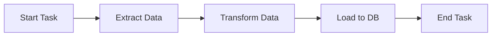
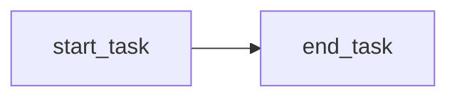
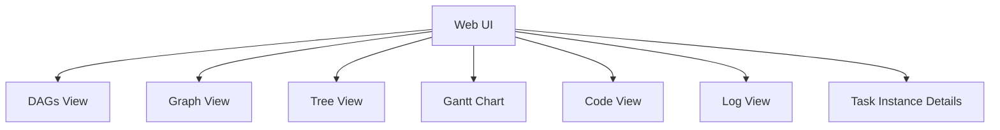
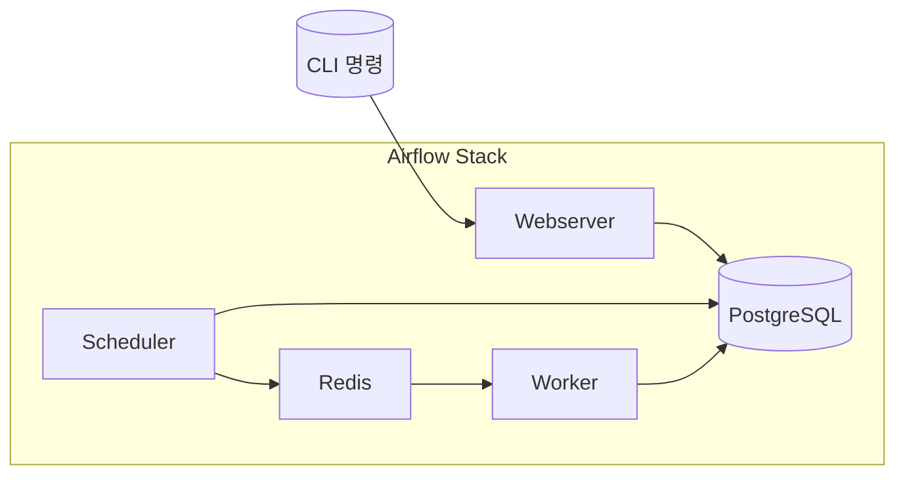
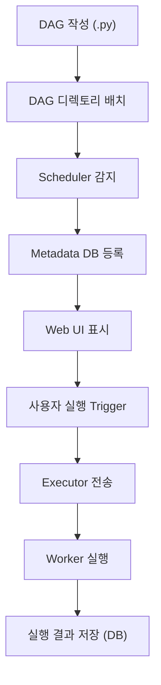
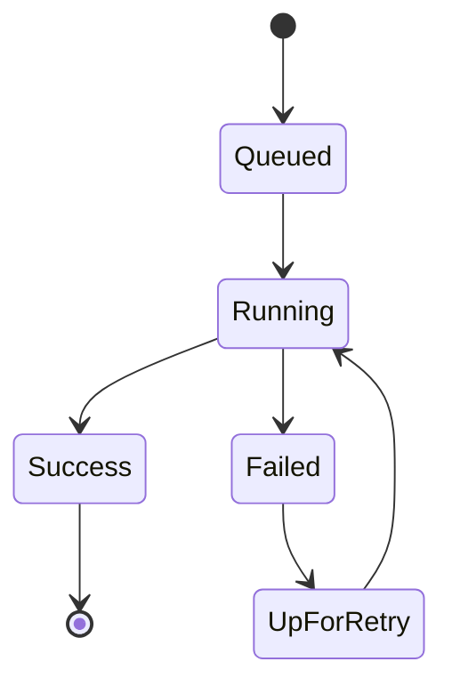

# Apache Airflow 설치 및 기본 구조

```text
[Abstract]

이 정리본은 Apache Airflow와 Docker 기반의 워크플로우 오케스트레이션 기술을 처음 접하는 학습자를 대상으로 구성되었다. 데이터 기반 프로젝트가 복잡해짐에 따라, 수작업으로 처리하기 어려운 반복적이고 의존적인 작업들을 자동화하고 관리하는 도구로서 **워크플로우 오케스트레이션의 개념**은 필수적으로 이해되어야 한다. 본 정리본에서는 그 중심 도구인 **Apache Airflow**를 다루며, Airflow의 구조적 특성과 동작 원리를 Python 기반의 DAG(Directed Acyclic Graph) 개념을 통해 상세히 설명한다.

Airflow의 주요 컴포넌트인 Webserver, Scheduler, Worker, Executor, Metadata Database, 메시지 브로커(Redis) 등의 역할을 체계적으로 분석하였고, 실습 환경에서는 Docker와 Docker Compose를 이용하여 실제 운영 환경을 손쉽게 구현하고 실험할 수 있도록 구성하였다. 또한 DAG의 정의 방식, 실행 흐름, Web UI 사용법을 단계적으로 설명하며, 실전에서 자주 마주치는 오류 상황에 대한 해결 방법과 설정 팁도 포함하였다.

학습자가 단순히 DAG을 실행해보는 것을 넘어, 실무 수준의 운영 환경을 이해하고 주체적으로 운용할 수 있도록 구성된 이 정리본은 Airflow 학습의 초석을 제공하며, 추후 ETL, MLOps, DevOps 자동화 등 다양한 영역에서의 확장적 활용에 기반이 된다.
```

<br>

📘 1. 워크플로우 오케스트레이션이란?
======================

1.1 개념 소개
---------

현대의 데이터 기반 서비스나 분석 시스템에서는 단일 작업만으로 원하는 결과를 얻는 경우가 거의 없다. 데이터 수집, 전처리, 변환, 분석, 저장, 시각화까지의 전체 과정이 **일련의 작업(Task)들로 연결된 워크플로우(workflow)** 로 구성되며, 이 각각의 작업은 서로 명확한 **실행 순서와 의존성**을 가진다.

이처럼 서로 연결된 복수의 작업을 **정해진 순서와 시점에 따라 자동으로 실행**하고, 실행 상태를 추적하며, 오류가 발생했을 경우 이를 처리하고 복구까지 지원하는 일련의 체계를 **워크플로우 오케스트레이션(Workflow Orchestration)** 이라 부른다.

<br>

1.2 워크플로우 오케스트레이션의 핵심 기능
------------------------

워크플로우 오케스트레이션은 다음과 같은 기능을 제공함으로써 데이터 처리 및 운영 업무의 자동화를 실현한다.

*   **작업 자동화(Task Automation)**: 사람이 수동으로 실행하지 않아도 주기적으로 또는 조건에 따라 작업을 자동 실행한다.
    
*   **의존성 관리(Dependency Management)**: 작업들 간의 선후 관계를 명확히 정의하고, 이전 작업이 성공해야 다음 작업이 수행되도록 한다.
    
*   **실패 처리 및 복구(Failure Handling & Retry)**: 특정 작업이 실패했을 경우 자동으로 재시도하거나 관리자에게 알림을 보낼 수 있다.
    
*   **모니터링 및 추적(Monitoring & Logging)**: 각 작업의 실행 상태(성공/실패/대기 등)를 실시간으로 추적하고 로그를 통해 세부 내용을 확인할 수 있다.
    
*   **스케줄링(Scheduling)**: 시간 기반으로 작업을 실행할 수 있도록 예약 기능을 지원한다. 예: 매일 자정, 매시간 등

<br>

1.3 워크플로우 오케스트레이션이 필요한 이유
-------------------------

다음은 실제 상황에서 오케스트레이션이 필요한 대표적인 예시다:

| 사례 | 설명 |
| --- | --- |
| **매일 자정에 데이터 수집 → 전처리 → 저장 수행** | 순서가 중요한 여러 작업을 자동화해야 함 |
| **모델 재학습을 주 1회 수행하고, 이후 리포트 생성** | 조건부 실행 및 의존성 설정이 필요 |
| **운영 중 장애 발생 시 관리자에게 알림 전송** | 실패 감지 및 알림 시스템 필요 |

이러한 복잡한 과정을 수동으로 처리하는 것은 비효율적이며, 오류 발생 가능성도 높다. 오케스트레이션 도구를 사용하면 이러한 위험을 줄이고 **신뢰성과 재현성을 높인 자동화된 시스템**을 구축할 수 있다.

<br>
<br>

📘 2. Apache Airflow 소개
=======================

2.1 Airflow란 무엇인가?
------------------

**Apache Airflow**는 복잡한 데이터 처리 과정을 코드로 정의하고 자동화할 수 있게 해주는 **워크플로우 오케스트레이션 도구**이다.  
특히 Python 언어 기반으로 설계되어 있기 때문에 데이터 분석이나 개발에 익숙한 사용자라면 손쉽게 사용할 수 있다.

Airflow의 핵심 개념은 모든 워크플로우를 **DAG(Directed Acyclic Graph, 방향성 비순환 그래프)** 라는 구조로 표현한다는 점이다.  
DAG는 작업(Task)들의 흐름을 시간적으로 정의하며, 각 작업은 Operator라는 형태로 표현된다.

> ✅ 간단히 요약하자면:  
> Airflow는 여러 개의 작업을 순차적 또는 병렬로 실행해야 할 때, 이를 코드로 정의하고 시간 기반으로 자동 실행하는 도구이다.

<br>

2.2 Airflow의 주요 특징
------------------

| 항목 | 설명 |
| --- | --- |
| **Python 기반 구성** | DAG와 작업을 모두 Python 코드로 작성 가능 |
| **Web UI 제공** | 작업 흐름 시각화, 실행 상태 확인, 수동 실행 가능 |
| **확장성과 유연성** | 다양한 시스템과 연동 가능 (클라우드, 데이터베이스 등) |
| **재시도 및 알림 기능** | 작업 실패 시 자동 재시도, 이메일/Slack 알림 등 |
| **스케줄링 및 트리거 기능** | 주기적 실행뿐만 아니라 이벤트 기반 실행도 가능 |

<br>

2.3 기존 방식의 한계와 Airflow의 필요성
---------------------------

기존에도 워크플로우 자동화를 위한 다양한 방식이 존재했으나, 다음과 같은 문제점이 있었다:

| 기존 방식 | 주요 한계 |
| --- | --- |
| **Cron Job** | 작업 간 의존성 표현 불가, 실패 감지 및 복구 어려움 |
| **Bash Script** | 코드 가독성 낮음, 모니터링 불가, 재사용성 부족 |
| **ETL 툴 내 스케줄러** | 유연성이 부족하고, 커스터마이징 어려움 |

이러한 한계를 극복하기 위해 등장한 것이 Airflow이다.  
Airflow는 **작업 간 관계와 흐름을 명확하게 정의**하고, **웹 UI를 통해 직관적으로 모니터링**하며, **다양한 시스템과 연동 가능한 확장성**을 제공한다.

<br>

2.4 어떤 분야에 활용되는가?
-----------------

Airflow는 다양한 분야에서 다음과 같은 형태로 활용되고 있다:

1.  **ETL/ELT 파이프라인**
    
    *   데이터를 수집하고 변환하여 저장소(Data Warehouse)로 적재하는 작업 흐름 자동화
        
2.  **Business Operations**
    
    *   내부 보고서 자동 생성, 로그 처리, 정기 메일 발송 등 반복적인 운영 업무 자동화
        
3.  **Infrastructure as Code**
    
    *   클라우드 자원 생성/삭제, CI/CD 파이프라인 관리
        
4.  **MLOps**
    
    *   모델 학습, 검증, 배포까지의 전체 머신러닝 프로세스 자동화
        

<br>

> ✅ 요약  
> Airflow는 시간, 조건, 의존성 기반의 반복 작업을 자동화해야 하는 모든 분야에서 폭넓게 사용된다.  
> Python 기반으로 유연하고 확장성이 뛰어나며, Web UI를 통해 직관적인 작업 관리가 가능하다.

<br>
<br>

📘 3. Airflow 아키텍처 및 구성 요소
==========================

3.1 전체 구조 개요
------------

Airflow는 단일 프로그램이 아니라 **여러 컴포넌트로 구성된 분산형 시스템**이다. 이 구조는 작업을 병렬로 처리하고, 장애에 유연하게 대처하며, 대규모 워크플로우를 효과적으로 운영할 수 있도록 설계되어 있다.

아래는 Airflow 아키텍처의 주요 컴포넌트와 그 연결 방식이다:

```mermaid
graph TD
  subgraph 사용자 인터페이스
    A[Webserver]
  end

  subgraph 백엔드
    B[Scheduler]
    C[Executor]
    D[Worker]
    E[Metadata Database]
    F[Redis (메시지 브로커)]
  end

  A --> E
  B --> E
  B --> F
  F --> D
  D --> E
```

<br>

3.2 주요 구성 요소 설명
---------------

### 🔹 1. Webserver (포트: 8080)

*   Airflow 사용자 인터페이스를 제공하는 **웹 서비스** 역할
    
*   DAG 실행 상태, Task 로그, Gantt 차트 등을 시각화하여 확인 가능
    
*   DAG를 수동으로 실행하거나 일시 정지, 재시도 등 제어 가능
    
*   실시간 로그 확인 기능으로 디버깅에 매우 유용
    

### 🔹 2. Scheduler

*   DAG 정의를 읽고 **스케줄에 따라 실행이 필요한 Task를 식별**
    
*   실행할 Task에 대한 **명령을 Executor로 전달**
    
*   스케줄 조건이 충족되면 TaskInstance를 생성함
    

### 🔹 3. Executor

*   Scheduler가 요청한 Task를 **어떻게 실행할지 결정**
    
*   종류:
    
    *   LocalExecutor: 단일 머신에서 동시 실행
        
    *   CeleryExecutor: 분산 환경에서 Worker와 메시지 큐를 통해 실행
        
*   본 실습 환경에서는 **CeleryExecutor** 사용
    

### 🔹 4. Worker

*   실제로 Task 코드를 실행하는 주체
    
*   Scheduler와 Executor가 지시한 작업을 Redis 메시지 큐로부터 수신하여 처리
    
*   Task 실행 결과는 Metadata DB에 기록됨
    

### 🔹 5. Metadata Database (PostgreSQL)

*   모든 DAG 정의, Task 실행 이력, 로그, 설정 정보 등을 저장하는 **중앙 저장소**
    
*   UI에서 DAG 상태나 로그를 확인할 수 있는 이유는 모두 이 DB에 기록되기 때문
    

### 🔹 6. Redis (메시지 브로커)

*   Scheduler와 Worker 간 **비동기 메시지 전달**을 담당
    
*   Task 명령을 큐 형태로 Worker에 전달하며, Worker는 이를 구독하고 작업을 수행
    

<br>

3.3 추가 컴포넌트
-----------

### 🔸 Triggerer

*   **Deferrable Operator** 지원을 위한 비동기 처리용 이벤트 루프
    
*   Airflow 2.2 이상에서 등장
    
*   대기 시간이 긴 작업(예: API 응답 대기 등)을 효율적으로 처리
    

### 🔸 airflow-init

*   최초 실행 시에만 사용
    
*   DB 초기화, 계정 생성, 로그 디렉토리 권한 설정 등을 수행
    

### 🔸 CLI 컨테이너

*   `docker exec` 또는 `airflow` 명령어를 사용하여 DAG 목록 확인, Task 테스트 등 수행 가능
    
*   예: `airflow dags list`, `airflow tasks test <dag_id> <task_id>`
    

<br>

3.4 실행 흐름 요약
------------

1.  Scheduler가 DAG를 읽고 실행 조건을 확인함
    
2.  조건이 맞으면 TaskInstance를 생성하고 Executor에 전달
    
3.  Executor는 Redis에 작업을 전송
    
4.  Worker는 Redis 큐를 통해 작업을 수신하고 실행
    
5.  결과는 PostgreSQL(Metadata DB)에 저장
    
6.  Webserver는 이 정보를 읽어 UI에 표시
    

<br>

> ✅ 요약  
> Airflow는 Webserver, Scheduler, Executor, Worker, Metadata DB, Redis 등으로 구성된 분산 시스템이며, 이들이 유기적으로 연동되어 DAG 기반 작업 자동화를 수행한다.

<br>
<br>

📘 4. DAG(Directed Acyclic Graph)의 이해
=====================================

4.1 DAG란 무엇인가?
--------------

Airflow에서 모든 워크플로우는 **DAG(Directed Acyclic Graph, 방향성 비순환 그래프)** 라는 구조로 표현된다.  
DAG는 여러 작업(Task)들을 노드로, 이들 간의 **의존 관계(선후 관계)** 를 방향이 있는 선(Edge)으로 나타낸 그래프이다.

*   **Directed(방향성)**: 작업들은 순서를 가지며, "A 다음에 B를 실행"처럼 방향이 있음
    
*   **Acyclic(비순환)**: 순환이 없기 때문에 무한 루프에 빠지지 않음
    
*   **Graph(그래프)**: 노드(Task)와 간선(의존성)으로 구성된 구조
    

> DAG는 단순한 스케줄링이 아닌, **복잡한 작업의 실행 흐름을 정확하게 표현**하고 제어할 수 있게 해주는 핵심 개념이다.

<br>

4.2 Task란 무엇인가?
---------------



**Task**는 DAG를 구성하는 가장 작은 실행 단위로, 일반적으로 하나의 작업을 의미한다. 예를 들어, 다음과 같은 작업이 각각 하나의 Task가 될 수 있다:

*   데이터 수집 (CSV 다운로드)
    
*   데이터 전처리 (결측값 제거, 타입 변환)
    
*   모델 학습 (Python 스크립트 실행)
    
*   결과 저장 (데이터베이스에 저장)
    

Airflow에서는 Task를 정의할 때 **Operator**를 사용한다.  
대표적인 Operator들은 다음과 같다:

| Operator 이름 | 설명 |
| --- | --- |
| `PythonOperator` | Python 함수 실행 |
| `BashOperator` | Bash 명령어 실행 |
| `EmptyOperator` | 아무 작업도 하지 않음 (DAG 흐름 제어용) |
| `HttpSensor`, `S3Operator` 등 | 특정 시스템과 연동하거나 외부 자원 감시 |

<br>

4.3 DAG 코드 예제 해설
----------------

Airflow에서는 DAG를 Python 코드로 정의한다. 다음은 가장 기본적인 형태의 DAG 예제다:

```python
from airflow.models.dag import DAG
from airflow.operators.empty import EmptyOperator

with DAG(
    dag_id="dags_empty_operator",
    default_args={'start_date': None},
    schedule=None
) as dag:
    start = EmptyOperator(task_id='start_task')
    end = EmptyOperator(task_id='end_task')

    start >> end
```

### ✅ 코드 설명

| 코드 요소 | 설명 |
| --- | --- |
| `dag_id` | DAG의 고유 이름 (웹 UI에 이 이름으로 표시됨) |
| `default_args` | 모든 Task에 공통으로 적용할 기본 설정 |
| `schedule` | DAG의 실행 주기 (여기서는 없음: 수동 실행 전용) |
| `EmptyOperator` | 실제 작업은 하지 않지만, DAG 구조를 구성하기 위해 사용 |
| `start >> end` | start\_task → end\_task 순서로 실행됨을 의미 |

이 구조는 다음처럼 해석할 수 있다:



즉, 이 DAG는 아무 작업도 하지 않지만, **DAG 구조와 Task 흐름을 테스트하기 위한 템플릿**으로 사용할 수 있다.

<br>

4.4 DAG 파일의 위치와 구조
------------------

Airflow는 기본적으로 `dags/` 폴더 내부에 존재하는 `.py` 파일을 자동으로 인식한다.

```bash
ssafy_airflow/
├── dags/
│   └── test.py   ← 이곳에 DAG 정의 코드가 있어야 인식됨
```

> 단, 하위 폴더 1단계까지만 인식 가능. 예: `dags/my_dag/test.py` 가능, `dags/a/b/test.py`는 불가능

<br>

4.5 DAG을 구성할 때의 기본 규칙
---------------------

1.  DAG 정의는 반드시 `DAG` 객체로 이루어져야 함
    
2.  Task는 Operator를 통해 정의됨
    
3.  Task 간의 관계(의존성)는 `>>`, `<<`, `.set_upstream()`, `.set_downstream()`으로 지정
    
4.  모든 DAG 파일은 **Python 문법을 따르는 스크립트**이므로 함수/클래스 등 사용 가능
    
5.  DAG 파일은 **반드시 실행 시 에러가 없어야 하며**, 에러가 있으면 UI에 표시되지 않음
    

<br>

> ✅ 요약  
> DAG은 작업 흐름을 표현하는 핵심 구조이며, Task는 DAG을 구성하는 실행 단위다.  
> Python 코드로 DAG과 Task를 정의하고, 의존성을 표현함으로써 전체 파이프라인을 자동화할 수 있다.

<br>
<br>

📘 5. Airflow Web UI 기능
=======================

5.1 Web UI 개요
-------------

Apache Airflow는 강력한 **웹 기반 사용자 인터페이스(Web UI)** 를 제공하여, 사용자로 하여금 다음과 같은 기능을 직관적으로 수행할 수 있도록 돕는다.

*   DAG의 상태 확인 및 실행 제어
    
*   Task의 실행 로그 확인
    
*   DAG 전체 구조 시각화
    
*   작업 흐름 및 실행 시간 추적 (Gantt, Tree View 등)
    
*   수동 실행, 일시 정지, 재시도 등 제어 기능
    

UI는 기본적으로 `http://localhost:8080` 에서 접속할 수 있으며,  
기본 사용자 계정은 아래와 같다:

```
Username: airflow  
Password: airflow
```

<br>

5.2 주요 메뉴 및 뷰 구성
----------------




### 🔹 DAGs View (기본 홈 화면)

*   등록된 DAG들의 목록이 표시되는 기본 페이지
    
*   DAG의 상태, 최근 실행, 실행 스케줄, 활성화 여부 등을 한눈에 확인 가능
    
*   DAG 옆에 있는 토글 스위치로 활성/비활성(ON/OFF) 조정 가능
    
*   ▶ 버튼 클릭 시 수동 실행 가능
    

### 🔹 Graph View

*   DAG의 전체 작업 흐름을 **그래프 구조로 시각화**
    
*   Task 간의 의존성과 순서를 직관적으로 확인 가능
    
*   각 Task 노드 클릭 시, 상세 정보나 로그로 이동 가능
    

```mermaid
graph LR
  start --> extract --> transform --> load --> end
```

### 🔹 Tree View

*   DAG의 실행 이력을 **트리 형태로 일자별로 시각화**
    
*   각 Task의 실행 상태(success, failed, skipped 등)가 색상으로 표시됨
    
*   DAG가 주기적으로 실행되는 환경에서 유용
    

### 🔹 Gantt Chart

*   Task의 실행 시간과 흐름을 **막대 그래프 형식으로 시각화**
    
*   병렬 실행된 작업들의 시간 분포 및 병목 구간을 파악할 수 있음
    

### 🔹 Task Instance Details

*   개별 Task 실행의 상세 정보 확인 화면
    
*   실행 시간, 실행 로그, 재시도 횟수, 상태 등 확인 가능
    

### 🔹 Log View

*   Task 실행 로그가 출력되는 창
    
*   에러 메시지, 출력 결과, 디버깅 정보 확인 가능
    

### 🔹 Code View

*   DAG 파일의 내용을 UI 상에서 확인할 수 있음
    
*   직접 수정은 불가능하며, 로컬 파일을 변경해야 반영됨
    

<br>

5.3 DAG 실행 제어
-------------

Web UI에서는 다음과 같은 방식으로 DAG 실행을 관리할 수 있다:

| 실행 방식 | 설명 |
| --- | --- |
| **자동 실행** | DAG 정의 시 `schedule_interval`에 따라 자동 실행됨 |
| **수동 실행** | UI에서 ▶ 버튼을 눌러 수동으로 트리거 |
| **이벤트 기반 실행** | 외부 이벤트가 트리거 역할을 하도록 구성 가능 (예: Sensor 활용) |

단, DAG 옆의 스위치가 **OFF** 상태이면, 자동 실행 스케줄이 있어도 실행되지 않는다.  
최초 DAG 등록 후에는 UI에서 **수동으로 ON으로 켜줘야** DAG이 작동함.

<br>

5.4 실행 상태 종류
------------

Airflow는 Task 실행 결과를 다양한 상태로 관리한다.  
UI에서는 색상으로 표시되며, 다음과 같은 상태들이 있다:

| 상태 | 설명 | 색상 예시 |
| --- | --- | --- |
| **success** | 작업이 성공적으로 완료됨 | 초록색 |
| **failed** | 작업 실행 중 오류 발생 | 빨간색 |
| **running** | 현재 실행 중인 상태 | 파란색 |
| **skipped** | 조건 불충족 등으로 건너뜀 | 회색 |
| **up\_for\_retry** | 재시도 대기 중 | 주황색 |
| **queued** | 실행 대기 중 (큐에 있음) | 노란색 |

<br>

> ✅ 요약  
> Web UI는 DAG과 Task의 상태를 직관적으로 파악하고 실행을 제어할 수 있도록 도와준다.  
> 다양한 View(그래프, 트리, 간트 등)를 통해 시각적으로 흐름과 실행 결과를 이해할 수 있다.

<br>
<br>


📘 6. Docker & Docker Compose 기초
================================

6.1 Docker란 무엇인가?
-----------------

**Docker**는 애플리케이션과 실행에 필요한 모든 것을 **컨테이너(Container)** 라는 독립된 환경으로 패키징하여 실행할 수 있게 해주는 플랫폼이다.  
Docker는 개발자와 운영자가 같은 환경에서 코드를 실행하게 해주므로 **일관된 배포와 테스트 환경을 보장**해준다.

> ✅ 요약하자면:  
> "어디서나 같은 환경에서 실행되게 만들어주는 가볍고 빠른 가상화 기술"이다.

<br>

### 🔹 주요 개념

| 개념 | 설명 |
| --- | --- |
| **이미지 (Image)** | 컨테이너 실행에 필요한 코드, 라이브러리 등을 포함한 패키지 |
| **컨테이너 (Container)** | 이미지를 기반으로 실제로 실행되는 독립적인 환경 |
| **레지스트리 (Registry)** | 이미지 저장소 (예: Docker Hub) |
| **도커파일 (Dockerfile)** | 이미지 생성을 위한 명령어가 적힌 스크립트 파일 |

<br>

6.2 Docker의 장점
--------------

*   **일관성**: 어디서 실행해도 동일한 환경 보장 (로컬 ↔ 서버 ↔ 클라우드)
    
*   **격리성**: 여러 컨테이너가 서로 독립적으로 작동
    
*   **경량화**: 기존의 VM보다 빠르고 자원 소모가 적음
    
*   **확장성**: 마이크로서비스 환경에 적합
    

<br>

6.3 Docker Compose란?
--------------------

**Docker Compose**는 복수의 컨테이너(예: Airflow + PostgreSQL + Redis)를 하나의 YAML 파일로 정의하고, **단일 명령어로 실행/중지/관리**할 수 있도록 도와주는 도구이다.

> 🛠️ 예를 들어:  
> Airflow를 실행하려면 Webserver, Scheduler, Worker, DB 등 여러 컨테이너가 필요하다.  
> 이 모든 설정을 `docker-compose.yml` 하나로 정의해서 통합 실행할 수 있다.

<br>

### 🔹 docker-compose.yaml 구조 예시

```yaml
services:
  webserver:
    image: apache/airflow:2.10.5
    ports:
      - "8080:8080"
    environment:
      - AIRFLOW__CORE__EXECUTOR=CeleryExecutor
  postgres:
    image: postgres:13
    ports:
      - "5433:5432"
```

<br>

6.4 Docker 명령어 요약
-----------------

### 이미지 관련

```bash
docker images              # 이미지 목록 확인
docker pull 이미지이름     # 이미지 다운로드
docker build -t 이름 .     # Dockerfile로 이미지 생성
docker rmi 이미지이름      # 이미지 삭제
```

### 컨테이너 관련

```bash
docker run -d -p 8080:8080 이미지   # 백그라운드 실행
docker ps                          # 실행 중인 컨테이너 확인
docker ps -a                       # 전체 컨테이너 목록
docker stop/start/rm 컨테이너ID    # 정지/시작/삭제
```

<br>

6.5 Docker Compose 명령어 요약
-------------------------

```bash
docker compose up             # 컨테이너 실행
docker compose up -d          # 백그라운드 실행
docker compose down           # 컨테이너 중지 및 정리
docker compose ps             # 상태 확인
docker compose logs           # 로그 보기
```

<br>

> ✅ 요약  
> Docker는 "한 번 만들고 어디서든 실행"할 수 있게 해주는 컨테이너 기반 플랫폼이고,  
> Docker Compose는 이 컨테이너들을 하나의 서비스처럼 **묶어서 쉽게 실행/중지**할 수 있게 해주는 도구이다.

<br>
<br>

📘 7. Airflow 설치 실습 (Docker Compose 활용)
=======================================

7.1 디렉토리 구성 및 초기 세팅
-------------------

Airflow를 Docker로 설치하기 위해 먼저 **Airflow 프로젝트 전용 디렉토리**를 구성해야 한다. 디렉토리 구조는 다음과 같다:

```bash
ssafy_airflow/
├── dags/        ← DAG 코드 파일 위치
├── logs/        ← 로그 파일 저장
├── plugins/     ← 커스텀 플러그인 저장
├── config/      ← 환경 설정 파일 (선택)
├── docker-compose.yml
└── .env         ← 환경 변수 설정
```

### 🔹 초기 디렉토리 생성 명령어

```bash
mkdir ssafy_airflow
cd ssafy_airflow
mkdir -p ./dags ./logs ./plugins ./config
echo -e "AIRFLOW_UID=$(id -u)" > .env
sudo chmod -R 777 ./logs ./dags ./plugins ./config
```

*   `AIRFLOW_UID`는 컨테이너가 파일에 접근할 수 있게 하기 위한 사용자 정보
    
*   권한 설정(`chmod`)은 DAG 또는 로그 파일 접근 오류를 방지하기 위함


### 컨테이너 구성도


<br>

7.2 Docker Compose 파일 다운로드 및 설정
-------------------------------

Airflow 공식 사이트에서 `docker-compose.yaml` 파일을 다운로드한다.

```bash
curl -LfO 'https://airflow.apache.org/docs/apache-airflow/2.10.5/docker-compose.yaml'
```

해당 파일은 여러 컨테이너(Webserver, Scheduler, Worker, DB 등)를 포함하고 있으며, 아래 항목들을 실습에 맞게 수정해야 한다.

<br>

7.3 실습용 docker-compose 수정 항목
----------------------------

### 🔸 PostgreSQL 포트 변경 (기존 5432 → 5433)

```yaml
postgres:
  ports:
    - "5433:5432"
```

> 다른 프로젝트에서 PostgreSQL을 사용하고 있을 경우 포트 충돌을 피하기 위해 변경

<br>

### 🔸 타임존 설정 (Asia/Seoul)

```yaml
environment:
  AIRFLOW__CORE__DEFAULT_TIMEZONE: Asia/Seoul
```

> Airflow는 UTC 기준으로 실행되므로, 로컬 시간 기준으로 정확히 작동하도록 설정 필요

<br>

### 🔸 예제 DAG 비활성화

```yaml
environment:
  AIRFLOW__CORE__LOAD_EXAMPLES: 'false'
```

> 기본적으로 70개 이상의 예제 DAG이 자동 등록되므로 학습 중 혼란을 줄이기 위해 비활성화

<br>

### 🔸 DAG 자동 활성화 설정 (선택)

```yaml
environment:
  AIRFLOW__CORE__DAGS_ARE_PAUSED_AT_CREATION: 'false'
```

> DAG을 만들 때마다 UI에서 일일이 스위치 ON을 누르기 귀찮다면, 이 설정을 추가

<br>

7.4 Airflow 컨테이너 실행
-------------------

### 1단계: 초기화

```bash
sudo docker compose up airflow-init
```

*   metadata DB 초기화
    
*   로그 폴더 권한 설정
    
*   관리자 계정 생성 등
    

### 2단계: 서비스 시작 (백그라운드 실행 권장)

```bash
sudo docker compose up -d
```

<br>

7.5 Airflow Web UI 접속
---------------------

*   주소: [http://localhost:8080](http://localhost:8080)
    
*   기본 계정:
    
    *   Username: `airflow`
        
    *   Password: `airflow`
        

로그인 후 DAG 목록이 나타나고, 새로 추가한 DAG이 있다면 목록에서 확인할 수 있다.  
처음엔 스위치가 OFF 상태이므로, 실행을 위해 **ON으로 활성화**해야 한다.

<br>

7.6 DAG 실행 테스트
--------------

1.  `dags/` 폴더에 `test.py` 파일 추가
    
2.  UI에 DAG이 나타나는지 확인
    
3.  DAG 옆의 스위치 ON
    
4.  ▶ 버튼 클릭 → Trigger 실행
    

```python
from airflow.models.dag import DAG
from airflow.operators.empty import EmptyOperator

with DAG(
    dag_id="dags_empty_operator",
    default_args={'start_date': None},
    schedule=None
) as dag:
    start = EmptyOperator(task_id='start_task')
    end = EmptyOperator(task_id='end_task')

    start >> end
```

<br>

> ✅ 요약  
> `docker-compose.yaml` 설정과 초기 디렉토리 구성만 올바르게 완료하면, Airflow를 수 분 안에 컨테이너 기반으로 실행할 수 있다.  
> DAG을 `dags/` 폴더에 추가하면 자동 인식되며, Web UI에서 손쉽게 실행하고 모니터링할 수 있다.

<br>
<br>

📘 8. DAG 테스트 및 실행 흐름
=====================

8.1 DAG 추가 및 자동 인식 원리
---------------------

Airflow는 기본적으로 `docker-compose.yaml` 안에 정의된 서비스들 중 **Webserver/Scheduler가 주기적으로 `dags/` 디렉토리를 스캔**하면서 DAG을 탐지한다.  
이 디렉토리는 프로젝트 루트(`ssafy_airflow/`)에 위치해야 하며, 기본 규칙은 다음과 같다:

### 📂 유효한 DAG 파일 경로

```plaintext
ssafy_airflow/
├── dags/
│   └── skeleton.py         ✅ O
│   └── homework/test.py    ✅ O (하위 디렉토리 1단계까지만 허용)
│   └── hw/step1/flow.py    ❌ X (2단계 이상 하위 폴더는 인식 안 됨)
```

### 📌 파일 추가 시 유의사항

*   파일 확장자는 `.py` 여야 하며, Python 문법 에러가 없어야 함
    
*   DAG 객체가 정의되지 않거나 오류가 발생하면 UI에 나타나지 않음
    

<br>

8.2 DAG 실행 단계 요약
----------------

Airflow에서 DAG이 실행되기 위해서는 다음 단계가 필요하다:

| 단계 | 설명 |
| --- | --- |
| 1\. DAG 정의 | Python 파일로 DAG을 생성 (`dag_id`, `start_date`, `schedule` 등 지정) |
| 2\. 파일 배치 | `dags/` 폴더에 `.py` 파일로 저장 |
| 3\. DAG 감지 | Scheduler가 DAG을 인식하고 Metadata DB에 등록 |
| 4\. DAG 활성화 | UI에서 DAG 스위치 ON |
| 5\. 실행 트리거 | ▶ 버튼을 클릭하거나 스케줄에 의해 자동 실행 |
| 6\. 상태 확인 | Graph View, Tree View, Gantt View, Log View 등에서 확인 가능 |



<br>

8.3 DAG 재배포 및 수정 반영
-------------------

### 🔁 DAG 코드 변경 후 적용 방법

Airflow는 일정 주기(기본: 30초 간격)로 `dags/` 폴더를 자동 감지하지만, 다음과 같은 경우 **명시적 재시작이 필요**하다:

*   DAG 파일 구조 변경 (예: `dag_id` 수정, Task 간 의존성 변경 등)
    
*   Docker 내부 설정 변경 (`docker-compose.yml`, 환경 변수 등)
    

### 🛠️ 명시적 재시작 명령어

```bash
sudo docker compose down
sudo docker compose up -d
```

*   `down`은 컨테이너를 종료하고
    
*   `up -d`는 백그라운드 모드로 다시 시작
    

이후 변경한 DAG이 Web UI에 정상 반영되는지 확인해야 한다.

<br>

8.4 DAG 실행 조건 및 오류 방지
---------------------

### 📌 실행되지 않는 주요 원인

| 문제 상황 | 해결 방법 |
| --- | --- |
| DAG이 목록에 안 보임 | Python 문법 오류 → 파일 내 에러 확인 |
| DAG이 비활성화 상태 | Web UI에서 스위치 ON 필요 |
| 실행했지만 결과 없음 | `schedule_interval=None` 설정 시 ▶ 수동 실행 필요 |
| Task 실패 후 진행 안 됨 | 로그 확인 후 재시도 가능 (Retry/Skip 버튼 활용) |

<br>

8.5 DAG 실행 시 주의사항
-----------------

*   `start_date`는 **과거 날짜**여야 함 (`datetime.now()` 사용 시 DAG이 실행되지 않음)
    
*   Task 간 의존성은 `>>`, `<<` 또는 `.set_downstream()`으로 명확히 지정해야 함
    
*   `schedule_interval="@daily"` 처럼 cron 표현 또는 매크로 문자열 사용 가능
    

<br>

> ✅ 요약  
> DAG은 `dags/` 폴더에 배치되기만 하면 자동으로 인식되며, UI에서 활성화 후 손쉽게 실행할 수 있다.  
> 코드 변경이 발생할 경우, 컨테이너 재시작이 필요한 상황을 파악하고 명확히 대응할 수 있어야 한다.

<br>
<br>

📘 9. 실전 팁 및 FAQ
================



9.1 DAG 수정 시 반영이 안 될 때
----------------------

Airflow는 기본적으로 일정 주기(기본 30초)에 한 번씩 DAG 파일을 감지하지만, 변경 사항이 아래 조건에 해당되면 재시작이 필요할 수 있다.

### 🔁 재시작이 필요한 상황

| 상황 | 해결 방법 |
| --- | --- |
| DAG 이름(`dag_id`) 변경 | `docker compose down && up -d` |
| Task 간 흐름 변경 | 위와 동일 |
| 환경 변수 수정 (`.env`, `docker-compose.yml`) | 반드시 `docker compose down && up -d` 후 재확인 |

<br>

9.2 실행 오류가 발생했을 때
-----------------

Airflow에서 DAG 실행이 실패하거나 Task가 멈추는 경우 다음 절차로 확인하면 된다:

### 🛠️ 에러 확인 절차

1.  **Tree View**에서 실패한 Task 클릭
    
2.  **Log View**로 이동
    
3.  에러 메시지 확인 (예: `ImportError`, `FileNotFoundError`, `SyntaxError` 등)
    
4.  DAG 코드 수정 후 재시작
    

### 💡 재시도/무시 기능

*   **재시도**: Task 옆 🔁 아이콘 클릭
    
*   **무시하고 진행**: ☠ 아이콘 클릭 → `skip` 처리
    

<br>

9.3 DAG이 UI에 보이지 않는 경우
----------------------

### 체크리스트:

| 점검 항목 | 설명 |
| --- | --- |
| `.py` 파일 여부 | `.py` 확장자여야 함 |
| 문법 오류 여부 | 파이썬 코드 실행 오류가 없어야 함 |
| `dag_id` 정의 여부 | `DAG(...)` 객체가 있어야 UI에 노출됨 |
| 경로 확인 | `dags/` 폴더 하위 1단계까지만 인식됨 |

<br>

9.4 DAG 실행 스케줄 팁
----------------

### 자주 쓰이는 스케줄 표현

| 표현 | 의미 |
| --- | --- |
| `@once` | 한 번만 실행 |
| `@daily` | 매일 자정 |
| `0 9 * * *` | 매일 오전 9시 (cron 표현) |
| `None` | 수동 실행 전용 |

> **주의**: `start_date`는 반드시 **과거 시점**이어야 실행됨

<br>

9.5 로컬 환경에서 가볍게 Airflow 설치하기 (선택 사항)
------------------------------------

Docker가 아닌 로컬 Python 환경에서도 Airflow를 설치할 수 있다.

### 설치 명령어 (Python 3.10 기준):

```bash
pip install "apache-airflow[celery]==2.10.5" \
  --constraint "https://raw.githubusercontent.com/apache/airflow/constraints-2.10.5/constraints-3.10.txt"
```

> constraints 파일을 함께 지정해야 버전 충돌을 피할 수 있다.

<br>

9.6 추가 실습 아이디어
--------------

*   `PythonOperator`로 로컬 함수 실행하기
    
*   `BashOperator`로 쉘 명령어 실행 (ex: `echo`, `ls`)
    
*   `BranchPythonOperator`로 조건 분기 처리
    
*   `Sensor`로 외부 조건(예: 파일 존재 여부) 확인 후 실행
    

<br>

9.7 참고 링크 및 학습 자료
-----------------

*   🔗 [Airflow 공식 문서 (2.10.5)](https://airflow.apache.org/docs/apache-airflow/2.10.5/)
    
*   📘 추천 키워드:  
    `"Airflow DAG 작성법"`, `"PythonOperator 튜토리얼"`, `"Airflow 모니터링 전략"`
    

<br>

> ✅ 요약  
> 실전에서는 DAG 구조 이해뿐만 아니라 **재시작 타이밍, 에러 대처, 실습 스케일업** 역량이 매우 중요하다.  
> 에러 메시지를 읽고 로그를 확인하는 습관은 Airflow 실력을 가장 빠르게 키우는 방법 중 하나다.
