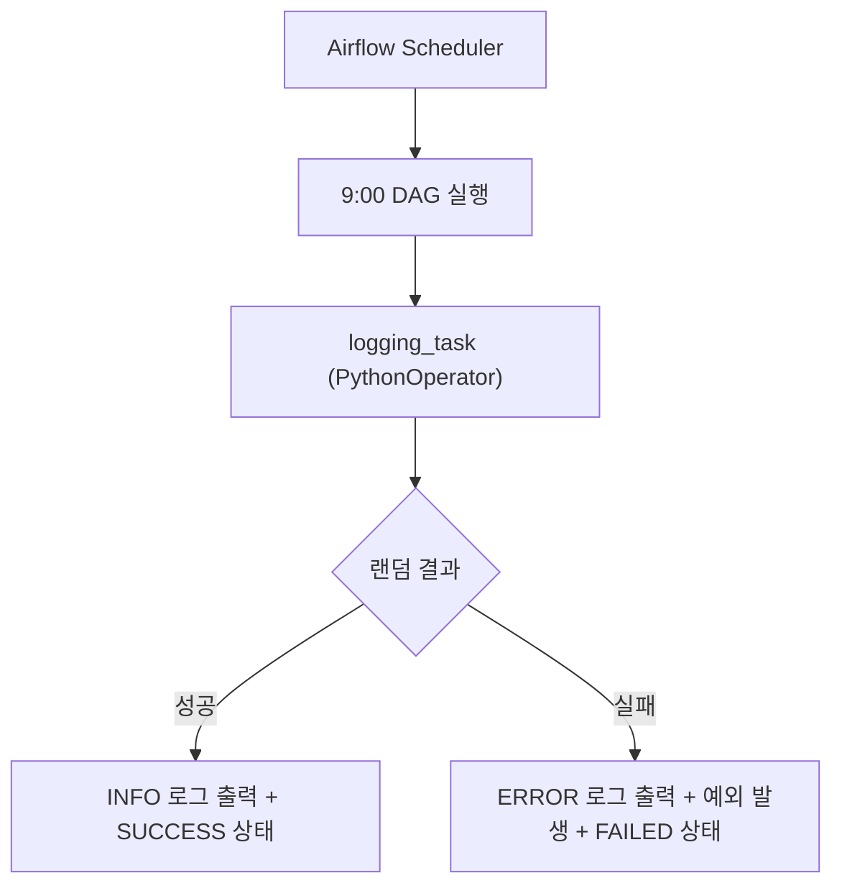

# DAG 실행 및 로그 분석(Task 성공/실패 로그 확인 방법 익히기)


📘 1. 실습 주제 개요
==============

### 🧩 주제: Airflow PythonOperator의 로그 출력 및 실패 처리 실습

현대의 워크플로우 자동화 환경에서는 단순히 작업을 실행하는 것 이상으로, **작업의 성공과 실패 여부를 명확히 기록하고 모니터링**하는 기능이 필수적이다. Apache Airflow는 이러한 필요를 충족시키기 위해 각 Task 실행 로그를 자동으로 수집하고 저장하는 로깅 시스템을 기본 제공한다.

이번 실습은 PythonOperator를 사용하여 **의도적으로 성공과 실패를 시뮬레이션**하는 Python 함수를 실행하고, 이에 대한 **로그 출력 및 예외 발생 처리 방식을 학습**하는 데 목적이 있다. 이를 통해 실무에서 작업 실패 시 발생하는 로그 기록을 어떻게 활용할 수 있는지 이해할 수 있으며, 나아가 에러 처리를 통해 DAG의 안정성과 예측 가능성을 높이는 방법도 함께 익히게 된다.

<br>

### 🎯 학습 목표

1.  **PythonOperator의 예외 처리 구조** 이해
    
2.  **Airflow에서의 로그 출력 방식 (logging vs print)** 비교
    
3.  **실패 상황에서 Task 상태 변화(Failed, Success) 확인 방법** 습득
    
4.  **dagrun\_timeout 등 고급 DAG 설정 옵션**의 활용법 익히기
    

<br>

### 🧑‍💻 실무 활용 예시

| 시나리오                        | 활용 방식                              |
| ------------------------------- | -------------------------------------- |
| ETL 파이프라인의 중간 작업 실패 | 로그를 통해 원인 추적 가능             |
| 머신러닝 모델 학습 실패         | 로그로 에러 메시지 및 환경 정보 확인   |
| API 호출 실패                   | 로그 기록 + 자동 재시도 로직 구현 기반 |

<br>
<br>

🛠️ 2. 코드 구조 및 흐름 해설 + 실행 결과 예시 및 해설
====================================

🔍 코드 구조 요약
-----------

```plaintext
1. 로깅 및 실패 시뮬레이션 함수 정의
2. DAG 정의 (실행 주기, 타임존, 실행 제한시간 포함)
3. PythonOperator로 Task 정의 및 등록
```

<br>

📂 코드 흐름 해설
-----------

### ✅ ① 실행 함수: `sample_task()`

```python
def sample_task():
    logging.info("Task가 실행되었습니다!")
    print("이것은 표준 출력입니다.")
    
    if random.choice([True, False]):
        logging.info("Task가 성공적으로 완료되었습니다!")
        return "Task 실행 완료"
    else:
        logging.error("Task가 실패했습니다!")
        raise Exception("의도적인 실패 발생")
```

*   `logging.info()`: **로그 파일 및 Airflow UI에 남는 기록**으로, 실무에서는 이 방법을 주로 사용
    
*   `print()`: **표준 출력**만을 담당하므로 로깅 시스템에는 노출되지 않음
    
*   `random.choice([True, False])`: 무작위로 성공 또는 실패 상황을 시뮬레이션
    
*   `raise Exception(...)`: 실패를 명시적으로 발생시키는 방식 (실제 업무에서는 API 실패, DB 연결 실패 등을 여기서 감지하여 raise)
    

<br>

### ✅ ② DAG 정의

```python
with DAG(
    dag_id="dags_logging_example",
    schedule="0 9 * * *",
    start_date=pendulum.datetime(2024, 1, 1, tz="Asia/Seoul"),
    dagrun_timeout=datetime.timedelta(minutes=60),
) as dag:
```

*   `dag_id`: Airflow 웹 UI에서 표시될 워크플로우 이름
    
*   `schedule`: 매일 오전 9시에 실행됨
    
*   `dagrun_timeout`: DAG 전체 실행 시간 제한 → 60분 이상 걸릴 경우 강제 중단
    
*   `start_date`: DAG의 첫 시작 기준점 (과거 날짜도 지정 가능)
    

<br>

### ✅ ③ PythonOperator 등록

```python
logging_task = PythonOperator(
    task_id='logging_task',
    python_callable=sample_task
)
```

*   `task_id`: UI에서 표시되는 Task 이름
    
*   `python_callable`: 실행할 함수 이름
    
*   DAG 블록 안에 정의되어 있어 자동으로 해당 DAG에 등록됨
    

<br>

🖥️ 실행 결과 예시
------------

### 💚 성공한 경우 (로그)

```
[2025-04-23, 09:00:00] INFO - Task가 실행되었습니다!
[2025-04-23, 09:00:00] INFO - Task가 성공적으로 완료되었습니다!
```

*   Airflow UI 상에서는 Task가 녹색(Success) 상태로 표시됨
    
*   실행 결과 "Task 실행 완료"가 로그에 남음
    

<br>

### 💥 실패한 경우 (로그)

```
[2025-04-23, 09:00:00] INFO - Task가 실행되었습니다!
[2025-04-23, 09:00:00] ERROR - Task가 실패했습니다!
[2025-04-23, 09:00:00] ERROR - Traceback (most recent call last):
...
Exception: 의도적인 실패 발생
```

*   Task는 붉은색(Failed) 상태로 표시됨
    
*   실패 메시지는 UI 로그에서 상세히 확인 가능
    
*   `Exception`은 Airflow가 해당 Task를 실패로 판단하는 기준이 됨
    

<br>

🔁 전체 실행 흐름 요약 (Mermaid 차트)
---------------------------



<br>
<br>

⚙️ 3. 전체 코드 + 상세 주석
===================

```python
# DAG 정의를 위한 Airflow의 핵심 클래스 import
from airflow.models.dag import DAG

# 날짜 및 시간 계산을 위한 파이썬 기본 모듈
import datetime

# 타임존을 명확히 지정하기 위한 pendulum 라이브러리 (Airflow 권장)
import pendulum

# Python 함수를 Task로 실행하는 데 사용하는 Operator
from airflow.operators.python import PythonOperator

# 로그 출력을 위한 표준 logging 모듈
import logging

# Task의 성공/실패를 무작위로 결정하기 위한 모듈
import random

# 1. PythonOperator가 실행할 Python 함수 정의
def sample_task():
    """
    로그를 출력하고, 무작위로 성공 또는 실패를 시뮬레이션하는 함수입니다.
    이 함수는 Airflow 로그 시스템과 Task 상태 변화를 실습하기 위한 목적입니다.
    """
    logging.info("Task가 실행되었습니다!")  # INFO 레벨 로그: 정상 실행 흐름을 기록
    print("이것은 표준 출력입니다.")  # 표준 출력: 로그 기록과는 별개로 콘솔에만 표시됨

    # 무작위로 성공(True) 또는 실패(False) 결과를 선택
    if random.choice([True, False]):
        logging.info("Task가 성공적으로 완료되었습니다!")  # 성공 시 로그 출력
        return "Task 실행 완료"  # Task 성공 시 반환 값 기록됨
    else:
        logging.error("Task가 실패했습니다!")  # 실패 시 ERROR 레벨 로그 출력
        raise Exception("의도적인 실패 발생")  # 예외 발생 → Task는 실패(Failed) 상태로 기록

# 2. Airflow의 DAG 정의 시작
with DAG(
    dag_id="dags_logging_example",  # DAG 이름 (Airflow UI에서 표시됨)
    schedule="0 9 * * *",  # 매일 오전 9시에 실행 (Cron 표현식)
    start_date=pendulum.datetime(2024, 1, 1, tz="Asia/Seoul"),  # DAG 시작 시점과 시간대 지정
    dagrun_timeout=datetime.timedelta(minutes=60),  # DAG 전체 실행 시간 제한 (60분)
) as dag:

    # 3. Task 정의: sample_task 함수를 실행하는 PythonOperator 생성
    logging_task = PythonOperator(
        task_id='logging_task',         # Task 고유 이름
        python_callable=sample_task     # 실행할 Python 함수 지정
    )

    # 단일 Task 실행이므로 별도의 순서 지정은 생략 (Task 하나만 실행됨)
    logging_task
```

<br>

📌 핵심 포인트 정리
------------

| 요소                           | 설명                                          |
| ------------------------------ | --------------------------------------------- |
| `logging.info()`               | 일반적인 정보 기록. 실행 경로 확인용          |
| `logging.error()`              | 오류 발생 기록. 문제 원인 파악에 사용         |
| `raise Exception()`            | Task를 실패로 만들기 위한 명시적 예외 처리    |
| `dagrun_timeout`               | DAG 전체가 오래 걸릴 경우 중단시키는 안전장치 |
| `random.choice([True, False])` | 실패를 일부러 발생시키기 위한 시뮬레이션 코드 |

<br>
<br>

📚 4. 추가 설명 및 실무 팁
==================

💡 자주 발생하는 실수 및 체크리스트
---------------------

### 1\. `print()`와 `logging`의 차이를 구분하지 못함

*   `print()`는 단지 표준 출력으로서, **Airflow 웹 UI의 로그 페이지에서는 출력 내용이 잘 보이지 않을 수 있습니다.**
    
*   실무에서는 **`logging` 모듈을 사용한 기록(log.info, log.error 등)** 을 사용해야 로그 관리가 정확히 됩니다.
    

### 2\. `Exception`을 명시적으로 raise하지 않으면 실패로 인식되지 않음

*   Python 함수가 아무 에러 없이 종료되면 Airflow는 이를 **성공(Success)** 으로 처리합니다.
    
*   따라서 실패를 테스트하거나, 에러를 정확히 잡아야 하는 경우 **`raise Exception()` 구문으로 예외를 명시적으로 발생**시켜야 합니다.
    

### 3\. 로그만 보고는 원인을 모를 수 있음 → context logging 활용 추천

```python
from airflow.utils.context import Context

def sample_with_context(**context: Context):
    logging.info(f"현재 Task ID: {context['task_instance'].task_id}")
```

*   `context`를 통해 실행 시간, DAG ID, Task ID 등 **메타정보를 함께 로그로 기록**할 수 있습니다.
    

<br>

🛠️ 실무 확장 아이디어
--------------

### ✅ 1. 실패 감지 → 슬랙 알림 연동

*   Airflow는 실패 알림을 **Slack, 이메일, SMS 등 외부 시스템과 연동**할 수 있습니다.
    
*   예: 실패 시 슬랙 메시지를 보내는 Python 함수
    
    ```python
    def notify_slack_on_failure(context):
        import requests
        task_id = context.get('task_instance').task_id
        msg = f":x: Task Failed: {task_id}"
        requests.post("https://hooks.slack.com/services/...", json={"text": msg})
    ```
    
*   Operator 정의 시 `on_failure_callback=notify_slack_on_failure` 추가
    

### ✅ 2. Task 자동 재시도 옵션 사용

```python
PythonOperator(
    task_id='logging_task',
    python_callable=sample_task,
    retries=3,  # 최대 3회 재시도
    retry_delay=datetime.timedelta(minutes=2)  # 2분 간격으로 재시도
)
```

*   네트워크/API 작업처럼 일시적인 실패가 예상되는 경우 **재시도 설정은 필수**
    

<br>

🎯 정리 요약: 실무 적용 포인트
-------------------

| 항목        | 적용 포인트                                     |
| ----------- | ----------------------------------------------- |
| 로그 출력   | `logging`을 사용하여 실행 흐름과 결과를 기록    |
| 실패 처리   | `raise Exception`으로 명시적 예외 처리          |
| 로그 확인   | UI → DAG → Task Instance → Logs 탭에서 확인     |
| 자동 재시도 | `retries`, `retry_delay` 옵션으로 복원력 강화   |
| 슬랙 연동   | `on_failure_callback`으로 실패 알림 자동화 가능 |

<br>

📘 결론 및 추천 학습 방향
----------------

이번 실습은 단일 Task와 간단한 로직이지만, 다음과 같은 중요한 개념을 이해하고 응용할 수 있는 기반을 마련해 줍니다.

*   Airflow의 로그 구조 이해
    
*   Task 성공/실패의 기준
    
*   실무에서 오류 감지 및 알림 설정
    
*   DAG 설계 시 예외 관리의 중요성
    

이후에는 다음 항목들을 차례로 학습해보는 것을 추천드립니다:

| 심화 학습 주제       | 설명                                           |
| -------------------- | ---------------------------------------------- |
| BranchPythonOperator | 조건에 따라 분기 처리                          |
| Sensor Operator      | 외부 조건 만족 시까지 대기                     |
| TaskGroup            | 복잡한 DAG를 논리적 그룹으로 묶기              |
| TriggerRule          | 실패한 Task 이후에도 흐름을 이어가는 조건 설정 |
