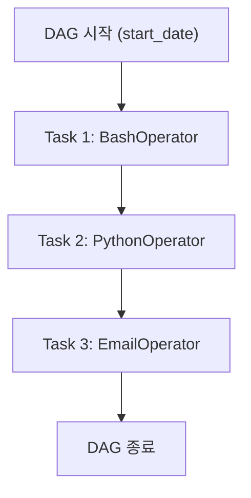
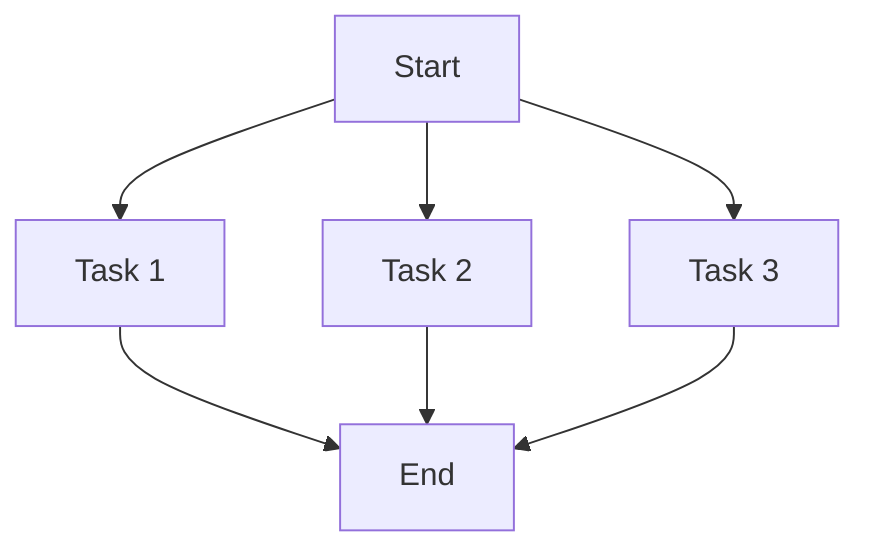
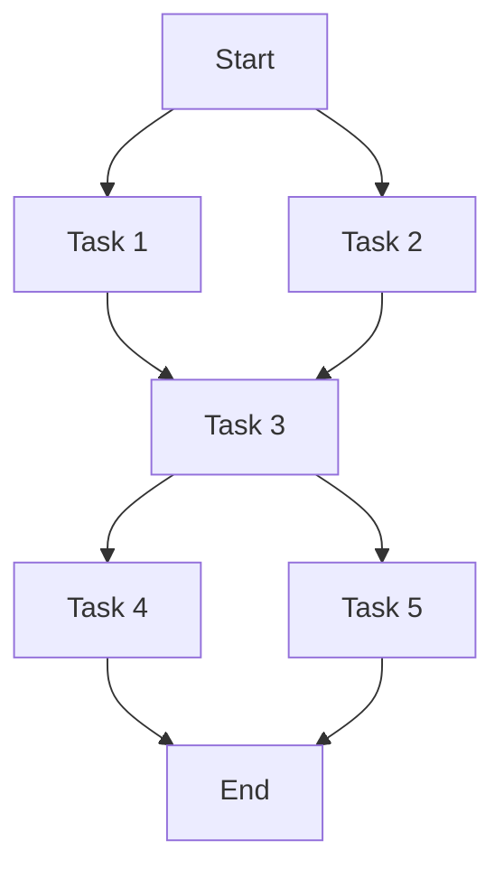
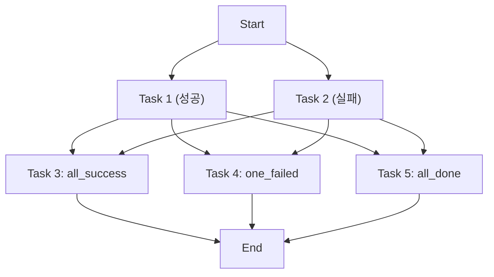
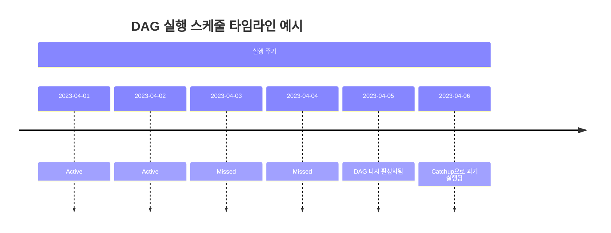
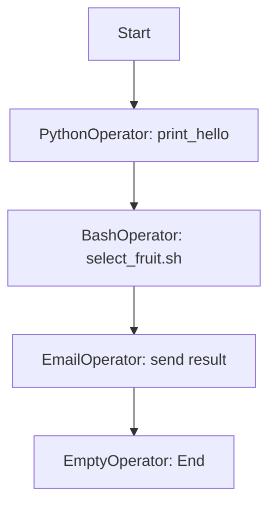

# Airflow DAG

[Abstract]

이 정리본은 Apache Airflow에 대한 구조적 이해를 돕기 위해 작성된 교육용 자료로, 데이터 기반 실무 자동화 환경에서 필수적으로 요구되는 **워크플로우 오케스트레이션 개념과 실습 예시**를 기반으로 구성되었다.  
비전공자도 따라올 수 있도록 기초 개념부터 실제 코드 예시까지 단계적으로 설명하고, 수업에서 제공된 실습 코드(총 10개 이상)를 모두 반영하여, 단순한 문법 학습을 넘어 **Airflow의 실행 원리와 실무 설계 방식**을 이해할 수 있도록 했다.


<br>

1\. Airflow 기본 개념
---------------------------

### 1.1 Airflow란?

**Apache Airflow**는 일정에 따라 자동으로 실행되는 **워크플로우(Workflow)를 정의하고 운영하는 오케스트레이션 툴**이다. 다양한 데이터 처리, 외부 API 호출, 데이터 적재 작업 등을 코드로 정의하고 연결할 수 있으며, UI를 통해 작업 흐름을 모니터링하거나 관리할 수 있다.

*   **"코드로 작성하는 스케줄러"** 로 이해하면 좋다.
    
*   각 작업(Task)을 **시간 기반**으로 실행하거나 **다른 작업의 결과**에 따라 조건적으로 실행할 수 있다.
    
*   Python으로 작성되며, 기본적으로 DAG(Directed Acyclic Graph)라는 구조로 전체 워크플로우를 표현한다.
    

> ✅ 실무 활용: 배치 데이터 처리, ETL 자동화, 모델 재학습 주기 운영, 주기적인 API 크롤링 등

<br>

### 1.2 DAG이란?

Airflow의 모든 워크플로우는 **DAG(Directed Acyclic Graph)** 으로 구성된다. DAG은 **방향성이 있고 순환하지 않는 그래프**를 의미하며, 각 작업(Task)을 **노드(Node)** 로, 작업 간 연결(의존 관계)을 **엣지(Edge)** 로 표현한다.

#### ✅ DAG의 핵심 속성:

| 속성명              | 설명                                   |
| ------------------- | -------------------------------------- |
| `dag_id`            | DAG 고유 이름                          |
| `schedule_interval` | 실행 주기 (ex. 매일 자정, 매달 1일 등) |
| `start_date`        | DAG 시작 시점                          |
| `catchup`           | 과거 실행 누락분 보정 여부             |
| `dagrun_timeout`    | 전체 DAG 실행 제한 시간                |

<br>

#### 📄 예시 코드 분석: `1_dags_bash_operator.py`

```python
with DAG(
    dag_id="dags_bash_operator",
    schedule="0 0 * * *",  # 매일 자정
    start_date=pendulum.datetime(2021, 1, 1, tz="Asia/Seoul"),
    catchup=False,
    dagrun_timeout=datetime.timedelta(minutes=60),
) as dag:
```

이 코드는 다음과 같은 의미를 가진다:

*   `dag_id="dags_bash_operator"` → 이 DAG의 이름은 `"dags_bash_operator"`
    
*   매일 자정에 실행됨 (`"0 0 * * *"`)
    
*   2021년 1월 1일부터 실행되며
    
*   `catchup=False`이므로 과거 누락된 실행은 무시
    
*   DAG 실행 전체가 60분 넘게 걸리면 실패 처리됨
    

<br>

### 1.3 Task란 무엇인가?

**Task는 DAG 내에서 실행되는 단일 작업 단위**로, 하나의 Python 코드 블록 혹은 외부 명령어, SQL 실행 등을 수행하는 역할을 한다. 각각의 Task는 `Operator`를 통해 정의된다. 예를 들어 Bash 명령어 실행은 `BashOperator`, Python 함수 실행은 `PythonOperator`, SQL 실행은 `PostgresOperator` 등을 사용한다.

*   Task는 DAG의 노드(Node)이며, 각각의 Task는 **고유한 `task_id`** 를 가진다.
    
*   Task 간 의존성 설정을 통해 실행 순서를 정할 수 있다 (`>>`, `<<` 연산자 사용).
    
*   Task는 **재시도**, **실행 제한 시간**, **우선순위** 등을 설정할 수 있다.
    

<br>

### 📄 예시 코드 분석: `1_dags_bash_operator.py` (계속)

```python
bash_t1 = BashOperator(
    task_id="bash_t1",
    bash_command="echo whoami",
)
bash_t2 = BashOperator(
    task_id="bash_t2",
    bash_command="echo $HOSTNAME",
)
bash_t1 >> bash_t2
```

#### 이 예시의 의미는?

| Task ID   | 실행 명령어      | 설명                                    |
| --------- | ---------------- | --------------------------------------- |
| `bash_t1` | `echo whoami`    | 현재 DAG 실행을 수행하는 유저 계정 출력 |
| `bash_t2` | `echo $HOSTNAME` | DAG가 실행되는 서버의 호스트 이름 출력  |

→ `bash_t1`이 완료된 후 `bash_t2`가 실행되도록 의존성을 설정 (`bash_t1 >> bash_t2`)

> 📌 이 예시는 가장 기본적인 DAG 흐름 구조를 보여준다: **두 Task를 순차적으로 연결**

<br>

### 💡 실무 연계 포인트

*   DAG을 사용하면 단순한 반복 작업부터 복잡한 데이터 파이프라인까지 자동화할 수 있다.
    
*   모든 DAG 실행 흐름은 UI에서 시각화되며, 각 Task의 성공/실패 상태를 확인하고 재실행할 수 있다.
    
*   Task 실패 시 `retries`, `retry_delay` 등을 활용해 자동 재시도 가능.
    



<br>
<br>

2\. DAG과 Task 구성 요소
-------------------------

Airflow에서 DAG과 Task는 매우 유연하게 정의되며, 각각 세밀한 속성 설정을 통해 실행 방식, 반복 주기, 실패 처리 정책 등을 제어할 수 있다. 이 단원에서는 DAG과 Task의 주요 속성과 설정 옵션들을 실습 예제를 중심으로 구체적으로 살펴본다.

<br>

### 2.1 DAG 주요 속성

DAG은 단순히 작업들의 실행 순서만 정하는 것이 아니라, **언제**, **어떻게**, **얼마나 자주** 실행될지를 결정하는 핵심 속성들을 포함한다.

#### ✅ 핵심 속성 설명

| 속성명              | 설명                                              |
| ------------------- | ------------------------------------------------- |
| `dag_id`            | DAG의 고유 식별자                                 |
| `start_date`        | DAG 실행 시작 시점 (timezone-aware datetime 필요) |
| `schedule_interval` | DAG 실행 주기 (예: `@daily`, `0 0 * * *`)         |
| `catchup`           | 과거 누락된 실행을 보완할지 여부                  |
| `dagrun_timeout`    | DAG 실행 제한 시간 (초과 시 실패 처리)            |

<br>

#### 📄 예시: `2_bashOperator.py`

```python
with DAG(
    dag_id="bash_operator_example",
    schedule="0 0 * * *",  # 매일 자정 실행
    start_date=pendulum.datetime(2021, 1, 1, tz="Asia/Seoul"),
    catchup=False,
    dagrun_timeout=datetime.timedelta(minutes=60),
) as dag:
```

*   **매일 자정에 실행되며**, 시작일 이후의 과거 실행은 생략(`catchup=False`)
    
*   DAG 전체 실행 시간이 60분을 초과하면 실패 처리
    

<br>

### 2.2 Task 주요 속성

각 Task는 독립적인 실행 단위이며, 다양한 속성을 통해 실행 조건을 상세하게 정의할 수 있다.

#### ✅ 주요 속성 정리

| 속성명              | 설명                                             |
| ------------------- | ------------------------------------------------ |
| `task_id`           | DAG 내에서 고유한 Task 식별자                    |
| `operator`          | 작업 실행 방식 (BashOperator, PythonOperator 등) |
| `depends_on_past`   | 이전 실행 주기의 결과에 따라 현재 실행 여부 결정 |
| `retries`           | 실패 시 재시도 횟수                              |
| `execution_timeout` | 작업 단위 실행 제한 시간                         |
| `priority_weight`   | 실행 우선순위 조정                               |
| `task_concurrency`  | 동시에 실행될 수 있는 최대 인스턴스 수           |

<br>

#### 📄 예시: `2_bashOperator.py` 내 Task

```python
bash_t1 = BashOperator(
    task_id="bahs_t1",
    bash_command='echo "Hello, Airflow!"',
)
bash_t2 = BashOperator(
    task_id="bahs_t2",
    bash_command="ls -al",
)
```

*   `task_id`: 각각의 Task를 DAG 내에서 구분하기 위한 고유 ID
    
*   `bash_command`: Bash에서 실행할 명령
    
*   여기서는 `bash_t1`이 `"Hello, Airflow!"`를 출력하고, `bash_t2`는 현재 디렉토리의 파일 목록을 출력
    

<br>

### 2.3 실무 관점 핵심 요약

*   `dag_id`, `task_id`는 중복되면 DAG 실행 시 충돌이 발생한다.
    
*   `start_date`는 **현재보다 미래의 시간**이면 DAG이 실행되지 않기 때문에 반드시 주의해야 한다.
    
*   `catchup=False`로 설정하면 과거 실행 누락을 무시할 수 있어 학습용/실험용으로 유용하다.
    
*   `dagrun_timeout`, `execution_timeout`은 실무 환경에서 **데이터 오류로 인한 무한 대기 방지**에 매우 중요하다.
    

<br>
<br>

3\. Operator 개념 및 종류
--------------------------

### 3.1 Operator란?

Airflow에서 **Operator는 Task의 실행 로직을 정의하는 핵심 구성 요소**이다. DAG 안에서 각각의 Task는 Operator를 통해 실제로 어떤 작업을 할지를 정의한다. Operator는 '무엇을 실행할 것인가'를 결정짓는 클래스이며, Airflow는 매우 다양한 내장 Operator를 제공한다.

> 📌 쉽게 말하면, DAG은 '언제' 실행할지 결정하고, Operator는 '무엇을' 실행할지 결정한다.

<br>

### 3.2 Operator의 분류

Airflow에는 목적에 따라 다양한 Operator가 존재한다. 이번 수업에서는 아래의 주요 Operator를 중심으로 실습했다.

#### ✅ Operator 유형 요약

| 분류                    | 예시                                                               | 설명                       |
| ----------------------- | ------------------------------------------------------------------ | -------------------------- |
| Action Operators        | `BashOperator`, `PythonOperator`, `EmailOperator`, `EmptyOperator` | 가장 일반적인 작업 실행용  |
| Sensor Operators        | `FileSensor`, `ExternalTaskSensor`                                 | 특정 조건 충족 시까지 대기 |
| Transfer Operators      | `S3ToRedshiftOperator`, `FTPOperator`                              | 시스템 간 데이터 이동      |
| Database Operators      | `PostgresOperator`, `MySqlOperator`                                | SQL 쿼리 실행              |
| Big Data & ML Operators | `SparkSubmitOperator`, `DatabricksSubmitRunOperator`               | Spark, ML 플랫폼 실행      |
| Docker & K8s Operators  | `DockerOperator`, `KubernetesPodOperator`                          | 컨테이너 기반 실행         |
| Dummy/Empty Operators   | `EmptyOperator`                                                    | 흐름 제어용, 작업 없음     |

<br>

### 3.3 실습에 등장한 주요 Operator

#### ① BashOperator

*   **용도**: 시스템 셸에서 명령을 실행
    
*   **예제 코드**: `2_bashOperator.py`, `3_bash_select.py`
    

```python
t1 = BashOperator(
    task_id="t1_orange",
    bash_command="/opt/airflow/plugins/shell/select_fruit.sh ORANGE"
)
```

*   외부 쉘 스크립트를 인자로 실행
    
*   사전에 실행 권한(`chmod +x`)과 포맷 변환(`dos2unix`) 필요
    

#### 🔧 관련 Shell Script (`select_fruit.sh`)

```bash
#!/bin/bash
FRUIT=$1
if [ "$FRUIT" = "APPLE" ]; then
    echo "You selected Apple!"
...
```

> 📌 `3_bash_select.py`에서는 `ORANGE`, `AVOCADO`를 입력 값으로 스크립트를 실행하며, cron 표현식 `"10 0 * * 6#1"`으로 매달 첫 번째 토요일 0시 10분 실행을 설정함

<br>

#### ② PythonOperator

*   **용도**: Python 함수를 직접 실행
    
*   **예제 코드**: `5_dags_python_operator.py`
    

```python
def print_hello():
    return "Hello, Airflow!"

python_task = PythonOperator(
    task_id="print_hello_task",
    python_callable=print_hello
)
```

*   Python 내에서 직접 함수를 호출해 Task 실행
    
*   데이터 처리, 로깅, API 호출 등에 매우 자주 사용됨
    

<br>

#### ③ EmailOperator

*   **용도**: DAG 완료 시 메일 발송
    
*   **예제 코드**: `4_dags_email_operator.py`
    

```python
EmailOperator(
    task_id='send_email_task',
    to='me@example.com',
    subject='Airflow 성공메일',
    html_content='작업 완료되었습니다.'
)
```

> 📧 Gmail SMTP 사용 시 환경변수 설정 필수:

```yaml
AIRFLOW__SMTP__SMTP_HOST: smtp.gmail.com
AIRFLOW__SMTP__SMTP_USER: {gmail}
AIRFLOW__SMTP__SMTP_PASSWORD: {앱 비밀번호}
...
```

<br>

#### ④ EmptyOperator (구 DummyOperator)

*   **용도**: DAG 흐름 구조 제어용 (실제 작업 없음)
    
*   **예제 코드**: `6_dags_empty_operator.py`, `7_dags_basic.py`, `8_dags_multiple.py`
    

```python
start = EmptyOperator(task_id="start")
end = EmptyOperator(task_id="end")
start >> task_1 >> end
```

*   병렬 처리 시 시작점 또는 종결점 역할로 유용함
    
*   테스트나 DAG 구조 설정용으로 자주 사용됨
    

<br>
<br>

4\. 주요 Operator 예시 및 활용
-----------------------------

이번 단원에서는 앞서 소개된 Operator들이 실제 DAG 안에서 어떻게 활용되는지, 그리고 어떤 구조로 병렬 실행이나 작업 분기를 설계할 수 있는지를 중심으로 살펴본다.

<br>

### 4.1 BashOperator 응용

**외부 쉘 스크립트 실행 및 인자 전달**

📄 예제: `3_bash_select.py`

```python
t1_orange = BashOperator(
    task_id="t1_orange",
    bash_command="/opt/airflow/plugins/shell/select_fruit.sh ORANGE",
)
```

*   위 명령은 `select_fruit.sh` 스크립트를 실행하고, `ORANGE`라는 문자열을 인자로 전달한다.
    
*   이 스크립트는 조건문을 통해 입력값에 따라 출력 메시지를 다르게 설정한다.
    

```bash
if [ "$FRUIT" = "ORANGE" ]; then
    echo "You selected Orange!"
```

#### 🛠 준비사항

*   `chmod +x select_fruit.sh`로 실행 권한 부여
    
*   `dos2unix select_fruit.sh`로 Windows 개행문자 제거
    

> 📌 이 구조는 실제로도 “고정된 명령어” 대신 “매개변수에 따라 다른 동작을 하게 하고 싶을 때” 유용하다. 예를 들어 매주 특정 카테고리의 데이터를 자동 수집하는 DAG에서, 카테고리명을 인자로 전달할 수 있다.

<br>

### 4.2 PythonOperator 실전 예시

📄 예제: `5_dags_python_operator.py`

```python
def print_hello():
    return "Hello, Airflow!"

python_task = PythonOperator(
    task_id='print_hello_task',
    python_callable=print_hello
)
```

*   간단한 출력 함수지만, 실무에선 다음과 같은 작업이 들어간다:
    
    *   데이터베이스에서 데이터 로딩
        
    *   외부 API 요청
        
    *   Pandas/Numpy 기반 데이터 전처리
        
    *   로그 저장 및 슬랙 알림
        

> 📌 장점은 “완전한 Python 함수”이기 때문에 **복잡한 로직**도 자유롭게 작성 가능하다는 점이다.

<br>

### 4.3 EmailOperator + SMTP 설정

📄 예제: `4_dags_email_operator.py`

```python
EmailOperator(
    task_id='send_email_task',
    to='me@example.com',
    subject='Airflow 작업 완료',
    html_content='성공적으로 DAG가 완료되었습니다.'
)
```

#### ✅ 환경변수 설정 예시 (Gmail 기준)

```yaml
AIRFLOW__SMTP__SMTP_HOST: smtp.gmail.com
AIRFLOW__SMTP__SMTP_USER: your.email@gmail.com
AIRFLOW__SMTP__SMTP_PASSWORD: 앱 비밀번호
AIRFLOW__SMTP__SMTP_PORT: 587
AIRFLOW__SMTP__SMTP_MAIL_FROM: your.email@gmail.com
```

> 📌 `EmailOperator`는 Task 실패 시 알림, DAG 성공 알림 등에 매우 유용하며, SlackOperator나 TelegramOperator와 함께 실시간 모니터링 체계를 구축할 수 있다.

<br>

### 4.4 EmptyOperator 응용: 병렬 흐름 제어

📄 예제: `6_dags_empty_operator.py`

```python
start = EmptyOperator(task_id="start")
task_1 = BashOperator(...)
task_2 = BashOperator(...)
end = EmptyOperator(task_id="end")

start >> [task_1, task_2] >> end
```

*   **의미**: `start`가 실행된 후 `task_1`, `task_2`는 병렬 실행되고, 두 작업이 끝난 뒤 `end`가 실행됨
    
*   `start`, `end`는 아무 작업도 하지 않지만, **흐름을 시각적으로 구조화**하고 복잡한 DAG를 관리하기 쉽게 만든다.
    

> 📌 병렬 실행 Task들의 **공통 진입점 / 공통 종료점**으로 자주 사용된다.

<br>
<br>

5\. Task 간 연결 및 실행 흐름 제어
------------------------------

Airflow의 DAG은 단순히 여러 작업을 나열하는 것이 아니라, Task 간의 **의존성(Dependency)** 을 명시적으로 표현하고 실행 순서를 제어하는 것이 핵심이다. DAG에서는 이러한 실행 흐름을 `>>`, `<<` 연산자 또는 `.set_downstream()`, `.set_upstream()` 메서드를 사용하여 구성한다.

<br>

### 5.1 기본 연결: 순차 실행 (Linear Dependency)

📄 예제: `7_dags_basic.py`

```python
start >> task_1 >> task_2 >> end
```

*   실행 흐름:
    
    *   `start` → `task_1` → `task_2` → `end`
        
*   `EmptyOperator`로 시작과 끝을 명시하면 DAG 구조가 명확하게 시각화된다.
    

> 📌 순차 실행은 작업 간 선형적인 관계가 있을 때 사용하며, 각 Task가 이전 Task의 성공을 전제로 실행된다.

<br>

### 5.2 병렬 실행 (Parallel Execution)

📄 예제: `9_dags_parallel.py`

```python
start >> [task_1, task_2, task_3] >> end
```

*   `task_1`, `task_2`, `task_3`는 동시에 실행되며, 모두 완료된 후 `end`가 실행된다.
    
*   이 구조는 작업이 서로 의존하지 않을 때 효율적인 실행을 위해 사용된다.
    

> 📌 병렬 실행은 ETL 단계 중 I/O 처리(예: 파일 읽기, DB 조회 등)에 특히 유용하다.




<br>

### 5.3 다중 Task 종속 및 단계적 분기

📄 예제: `8_dags_multiple.py`

```python
start >> [task_1, task_2]
[task_1, task_2] >> task_3
task_3 >> [task_4, task_5] >> end
```

*   `task_1`, `task_2`는 병렬로 실행되고, 둘 다 성공해야 `task_3`가 실행된다.
    
*   `task_3` 실행 후 `task_4`, `task_5`가 병렬로 실행되고, 마지막으로 `end`가 실행된다.
    

> 📌 여러 단계에 걸친 병렬/직렬 혼합 구조를 설계할 때 매우 유용하며, 실제 데이터 파이프라인에서는 자주 사용되는 패턴이다.




<br>

### 5.4 조건에 따른 실행 제어: Trigger Rules

Airflow에서는 기본적으로 모든 Upstream Task가 **성공**해야 다음 Task가 실행된다. 그러나 실무에서는 **실패한 경우에도 실행**하거나, **어떤 Task든 하나라도 완료되면 실행**하는 등의 유연한 제어가 필요하다. 이를 위해 `trigger_rule` 속성이 존재한다.

📄 예제: `10_dags_trigger.py`

```python
task_3 = BashOperator(
    task_id="task_3",
    bash_command="echo 'All success'",
    trigger_rule="all_success"  # 기본값
)

task_4 = BashOperator(
    task_id="task_4",
    bash_command="echo '실패한 Task가 있으므로 실행됨'",
    trigger_rule="one_failed"
)

task_5 = BashOperator(
    task_id="task_5",
    bash_command="echo '어쨌든 다 끝났으니 실행됨'",
    trigger_rule="all_done"
)
```




#### 주요 Trigger Rule 요약

| 규칙                     | 설명                                     |
| ------------------------ | ---------------------------------------- |
| `all_success`            | 모든 Upstream이 성공해야 실행됨 (기본값) |
| `one_failed`             | 하나라도 실패하면 실행                   |
| `all_failed`             | 모두 실패해야 실행                       |
| `all_done`               | 성공/실패 상관없이 실행                  |
| `none_failed`            | 실패 없이 실행된 경우 실행               |
| `none_failed_or_skipped` | 실패/스킵 없이 실행된 경우 실행          |

> 📌 이 기능은 **예외 처리 흐름**, **실패 시 복구 플랜**, **성공/실패 여부에 따른 알림 설정** 등에서 매우 중요하다.

<br>
<br>

6\. DAG 스케줄링 개념
---------------------

Airflow는 DAG을 단발성으로 실행할 수도 있지만, 대부분은 **정해진 주기마다 반복적으로 실행**되도록 설정한다. 이 반복 실행을 가능하게 해주는 것이 바로 `schedule_interval`과 시간 관련 설정들이다.

<br>

### 6.1 `start_date`와 `execution_date`

#### ✅ `start_date`

*   DAG이 처음으로 실행될 수 있는 기준 시각이다.
    
*   반드시 **과거 또는 현재 시점**이어야 한다. 미래의 시간으로 설정하면 DAG이 실행되지 않는다.
    
*   **timezone-aware datetime 객체**로 설정하는 것이 좋다. (예: `pendulum.datetime(2023, 3, 1, tz="Asia/Seoul")`)
    

#### ✅ `execution_date`

*   DAG이 논리적으로 "언제 실행되었다고 간주되는지"를 나타내는 시간이다.
    
*   `execution_date`는 실제로 DAG이 실행되는 시간과는 다를 수 있다.
    

📌 예시:

*   DAG의 `start_date`가 2023-01-01, `schedule_interval`이 `@daily`일 경우
    
*   **2023-01-01 자정 기준의 데이터를 처리하기 위해, DAG은 2023-01-02 00:00에 실행된다.**
    

> 🧠 즉, `execution_date`는 “어제 데이터를 처리하기 위한 실행”이 될 수 있다.

<br>

### 6.2 `schedule_interval`

DAG의 반복 주기를 지정하는 속성으로, 다음과 같은 방법으로 설정할 수 있다:

#### ① 크론(Cron) 표현식

*   `"0 0 * * *"` → 매일 자정
    
*   `"10 0 * * 6#1"` → 매달 첫 번째 토요일 0시 10분 (`3_bash_select.py`에서 사용됨)
    

#### ② 예약어 표현

*   `@once`: 한 번만 실행
    
*   `@hourly`, `@daily`, `@weekly`, `@monthly`, `@yearly`: 예약된 주기 실행
    

<br>

### 6.3 Catchup: 과거 실행 보완 여부

*   `catchup=True` (기본값): DAG이 오랫동안 비활성 상태였다면, `start_date`부터 현재까지의 모든 `execution_date`를 기반으로 실행을 **보충 수행**
    
*   `catchup=False`: 가장 최근 실행만 수행하며 과거 실행은 무시
    

📄 예제: 대부분의 실습 예제에서는 `catchup=False`로 설정되어 있음

```python
with DAG(
    dag_id="bash_operator_example",
    start_date=pendulum.datetime(2021, 1, 1, tz="Asia/Seoul"),
    catchup=False,
    ...
)
```



<br>

### 6.4 Backfill: 수동으로 과거 실행 수행

터미널이나 UI에서 수동으로 지정한 기간의 DAG 실행을 요청할 수 있다.

#### ✅ CLI 예시:

```bash
airflow dags backfill -s 2023-01-01 -e 2023-01-05 example_dag
```

*   위 명령은 2023년 1월 1일부터 1월 5일까지의 `execution_date`를 가진 DAG 인스턴스를 수동으로 실행한다.
    

<br>

### 6.5 실전 예시 종합: `3_bash_select.py`

```python
with DAG(
    dag_id="dags_bash_select_fruit",
    schedule="10 0 * * 6#1",  # 매월 첫 번째 토요일 0시 10분
    start_date=pendulum.datetime(2023, 3, 1, tz="Asia/Seoul"),
    catchup=False
)
```

*   주기적으로 실행되는 구조 설정
    
*   특정한 일정(첫 번째 토요일)을 대상으로 한 **정교한 cron 표현식**
    
*   외부 스크립트에 인자를 전달하며 조건별 실행 수행
    

<br>
<br>

7\. DAG 실행 복구 기능: Catchup과 Backfill
-----------------------------------------

Airflow는 **주기적으로 실행되는 DAG**에서, 일시적으로 중단되거나 끊어진 기간이 있을 때, 누락된 실행을 복원할 수 있는 기능을 제공한다. 이 기능이 바로 **Catchup**과 **Backfill**이다.

<br>

### 7.1 Catchup: 자동 복구 기능

*   **정의**: DAG이 일정 기간 비활성 상태였다가 다시 활성화되었을 때, 누락된 주기의 `execution_date`를 기준으로 **자동으로 보완 실행**하는 기능
    
*   **기본값**: `catchup=True`
    
*   **활용 예시**:
    
    *   DAG을 며칠 동안 끄고 있었던 경우
        
    *   DAG 수정 후 다시 활성화했을 때
        

📄 예제:

```python
with DAG(
    dag_id="example_dag",
    start_date=pendulum.datetime(2023, 4, 1, tz="Asia/Seoul"),
    schedule="@daily",
    catchup=True  # 기본값이지만 명시 가능
)
```

*   위 DAG은 활성화된 시점이 2023-04-05라면, `2023-04-01`, `2023-04-02`, ..., `2023-04-04`에 대한 DAG 실행도 자동 수행됨
    

> ⚠️ 실습 환경에서는 과거 실행을 무시하고자 `catchup=False`로 설정하는 경우가 많음

<br>

### 7.2 Backfill: 수동 복구 기능

*   **정의**: 사용자가 CLI 또는 Web UI를 통해 **명시적으로 과거 특정 기간의 DAG 실행을 요청**하는 기능
    
*   `catchup=False`인 DAG도 강제로 실행할 수 있다
    

#### ✅ CLI 명령어 예시

```bash
airflow dags backfill -s 2024-03-01 -e 2024-03-03 example_dag
```

*   이 명령은 2024년 3월 1일부터 3일까지의 `execution_date`를 가진 DAG 인스턴스를 순차적으로 실행한다.
    

#### ✅ Web UI에서 실행 방법

*   Airflow UI 접속 → DAG 이름 클릭 → \[Graph View\] 또는 \[Tree View\]에서 특정 날짜 선택 → "Run" 클릭
    

<br>

### 7.3 Catchup vs Backfill 비교

| 항목      | Catchup                      | Backfill                     |
| --------- | ---------------------------- | ---------------------------- |
| 실행 방식 | DAG 설정에 따라 자동 실행    | 사용자가 수동으로 실행       |
| 사용 시점 | DAG 재활성화, Airflow 재시작 | 테스트 또는 특정 기간 재처리 |
| 적용 대상 | `catchup=True` 설정된 DAG만  | 모든 DAG에 적용 가능         |
| 권장 용도 | 정기적인 실행 복구           | 임시적/보정성 재실행         |

<br>

### 실무 적용 팁

*   개발/테스트 단계에서는 `catchup=False`로 설정해 과거 실행을 방지하고 실시간 확인에 집중하는 것이 좋다.
    
*   운영 환경에서는 `catchup=True`로 설정하고 DAG 실패/중단 시 누락 주기를 자동 보완하도록 설계한다.
    
*   대량 데이터 재처리 시에는 `backfill`을 활용하여 **병렬성 제어**, **시점 제한**, **재시도 정책**을 적용할 수 있다.
    


* * *

주요 내용 요약
--------

*   **DAG(Directed Acyclic Graph)** 는 Airflow에서 Task의 실행 순서와 흐름을 정의하는 기본 단위로, `schedule_interval`, `start_date`, `catchup`, `dagrun_timeout` 등의 속성을 통해 시간 기반 워크플로우를 정교하게 설계할 수 있다.
    
*   **Task**는 DAG 내에서 독립적으로 실행되는 작업 단위이며, `BashOperator`, `PythonOperator`, `EmailOperator`, `EmptyOperator` 등 다양한 Operator를 활용하여 외부 명령 실행, 함수 호출, 이메일 발송, 흐름 제어 등 다양한 작업을 수행한다.
    
*   **의존성(Dependency) 설정**을 통해 Task 간 실행 순서를 설계할 수 있으며, `>>`, `[]`, `trigger_rule` 등을 활용해 순차 실행, 병렬 실행, 조건 분기 구조를 자유롭게 구성할 수 있다.
    
*   **시간 개념**은 Airflow를 이해하는 데 있어 가장 핵심적인 요소 중 하나로, `execution_date`와 `schedule_interval`, 그리고 `catchup`, `backfill` 설정을 통해 과거 실행 이력 관리 및 주기 설정을 유연하게 제어할 수 있다.
    
*   모든 설명은 `1_dags_bash_operator.py`부터 `10_dags_trigger.py`, `select_fruit.sh`, SMTP 환경 설정 등 실제 기본 코드 예시를 기반으로 설명되었으며, 개념적 설명과 함께 **실무에서 사용되는 흐름과 설계 전략**까지 함께 다루었다.
    

