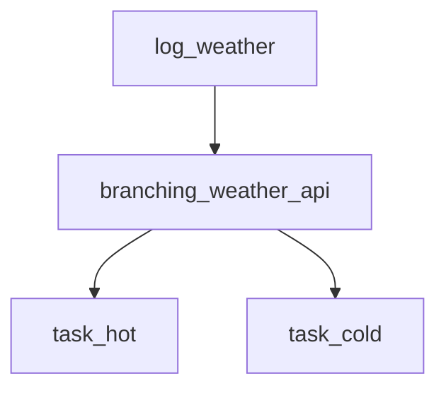

# 실시간 이상 거래 탐지

**User:** 장철환(하냥) (wkdcjfghks1@gmail.com)  
**Created:** 5/11/2025 14:18  
**Updated:** 5/11/2025 14:26  
**Exported:** 5/11/2025 14:29  

## Response:
좋습니다. 이번 실습은 Open-Meteo API를 활용하여 실제 기온 데이터를 기반으로 동적 조건 분기를 수행하는 Airflow 워크플로우입니다. 아래와 같이 정리본의 첫 번째 단계부터 차례대로 작성해드리겠습니다.

* * *

📘 1\. 실습 주제 개요
---------------

**주제: 실시간 날씨 API를 활용한 조건 분기형 워크플로우 구성**

* * *

### 🧠 이론 및 배경

이번 실습은 Apache Airflow에서 외부 API를 활용하여 동적으로 분기(branching) 처리를 수행하는 방법을 다룹니다. 특히, 실시간 날씨 데이터를 받아와 **현재 기온에 따라 워크플로우의 실행 경로를 변경**하는 구조를 구현합니다.

핵심 기술 요소는 다음과 같습니다:

| 요소 | 설명 |
| --- | --- |
| `requests` | 외부 API(Open-Meteo)를 호출하기 위한 HTTP 라이브러리 |
| `BranchPythonOperator` | 조건 분기 처리를 위한 핵심 Operator |
| `PythonOperator` | 날씨 정보 로깅 용도 |
| `BashOperator` | 분기 후 메시지를 출력하는 간단한 실행 Task |

* * *

### 🎯 실습의 목적

1.  **API 통합 워크플로우 설계 능력 습득**
    
    *   외부 시스템(API)에서 데이터를 가져와 DAG 조건 분기에 활용
        
2.  **실시간 조건 분기 처리 학습**
    
    *   `BranchPythonOperator`를 통해 입력값에 따라 동적으로 실행 경로 변경
        
3.  **복합 Task 구성 이해**
    
    *   Python → Branch → Bash 구조의 단계별 Task 연결 방식 학습
        

* * *

### ❓왜 이걸 배우는가?

실무 환경에서 파이프라인은 외부 데이터에 크게 의존합니다.  
예를 들어:

*   API로부터 환율, 주가, 날씨 데이터를 받아 특정 조건에 따라 분석을 수행하거나
    
*   모니터링 시스템에서 에러가 감지되었을 때만 알림을 발송하는 등
    

이러한 상황에 대응하려면 DAG 내부에서 **조건 분기 로직을 외부 데이터 기반으로 유연하게 처리할 수 있어야** 합니다.  
이번 실습은 이와 같은 상황을 단순화하여 학습용으로 구성한 것입니다.

* * *

이어서 **🛠️ 2\. 코드 구조 및 흐름 해설** 파트를 정리해드릴게요. 준비가 되면 이어서 진행하겠습니다. 계속 진행할까요?

## Response:
좋습니다. 이어서 **🛠️ 2\. 코드 구조 및 흐름 해설 + 실행 결과 예시 및 해설**을 상세히 정리해드리겠습니다.

* * *

🛠️ 2\. 코드 구조 및 흐름 해설 + 실행 결과 예시 및 해설
-------------------------------------

* * *

### 🔧 전체 흐름 요약

본 실습은 총 **4개의 주요 Task**로 구성된 DAG입니다:

1.  `log_weather`: 외부 날씨 API를 호출하고 현재 기온을 로그로 출력
    
2.  `branching_weather_api`: 현재 기온을 기준으로 `task_hot` 또는 `task_cold`를 선택
    
3.  `task_hot`: 기온이 15도 이상일 경우 실행되는 메시지 출력 Task
    
4.  `task_cold`: 기온이 15도 미만일 경우 실행되는 메시지 출력 Task
    

* * *

### 📌 흐름 다이어그램



* * *

### 🔍 핵심 코드 해설

#### (1) 날씨 API 호출 및 조건 분기

```python
def check_weather():
    response = requests.get(
        "https://api.open-meteo.com/v1/forecast?latitude=37.5665&longitude=126.9780&current_weather=true"
    )
    data = response.json()
    temperature = data["current_weather"]["temperature"]

    if temperature >= 15:
        return "task_hot"
    else:
        return "task_cold"
```

*   Open-Meteo API를 호출해 현재 기온을 확인하고,
    
*   조건에 따라 `"task_hot"` 또는 `"task_cold"` 문자열을 반환합니다.
    
*   이 반환값은 `BranchPythonOperator`에 의해 **해당 task\_id에 해당하는 Task만 실행**하게 합니다.
    

* * *

#### (2) 날씨 데이터 출력용 PythonOperator

```python
def print_weather():
    response = requests.get(...)
    data = response.json()
    temperature = data["current_weather"]["temperature"]
    print("현재 기온:", temperature, "도")
```

*   단순 로깅 목적의 Task입니다.
    
*   Airflow 웹 UI의 로그 화면에서 실행된 시점의 실제 기온 값을 확인할 수 있습니다.
    

* * *

#### (3) DAG 정의 및 Task 흐름 설정

```python
log_weather >> branch_task >> [task_cold, task_hot]
```

*   순차적 실행 흐름을 정의합니다:
    
    1.  `log_weather` → 날씨 확인 및 출력
        
    2.  `branching_weather_api` → 조건 분기 결정
        
    3.  `task_hot` 또는 `task_cold` → 하나만 실행됨
        

* * *

### ✅ 실행 결과 예시

#### 예시 1\. 현재 기온이 16도일 경우

*   `branching_weather_api` → `"task_hot"` 반환
    
*   `task_hot` 실행 결과 로그:
    

```
[2025-05-11, 14:01:00] Task A 실행
오늘 날씨: 덥습니다
```

*   `task_cold`는 `skipped` 처리
    

#### 예시 2\. 현재 기온이 10도일 경우

*   `branching_weather_api` → `"task_cold"` 반환
    
*   `task_cold` 실행 결과 로그:
    

```
오늘 날씨: 춥습니다
```

*   `task_hot`는 `skipped` 처리
    

* * *

다음 단계로는 전체 코드를 세부 주석과 함께 정리한 **⚙️ 3\. 전체 코드 + 상세 주석**으로 넘어가겠습니다. 계속 진행할까요?

## Response:
좋습니다. 이번에는 실습에 사용된 전체 코드를 기반으로 한 **⚙️ 3\. 전체 코드 + 상세 주석** 파트를 원서 스타일로 자세히 정리해드리겠습니다.

* * *

⚙️ 3\. 전체 코드 + 상세 주석
--------------------

```python
# -------------------------------
# (0) 라이브러리 임포트
# -------------------------------
import requests  # 외부 API 요청을 위해 사용
from airflow import DAG  # Airflow의 DAG 객체
from airflow.operators.python import BranchPythonOperator, PythonOperator  # Python 관련 Operator
from airflow.operators.bash import BashOperator  # Bash 명령 실행용 Operator
import pendulum  # 시간대(Timezone) 설정을 위한 라이브러리

# -------------------------------
# (1) 분기 조건 함수 정의
# -------------------------------
def check_weather():
    """
    외부 날씨 API(Open-Meteo)를 호출하여 현재 기온을 기준으로 
    task_hot 또는 task_cold 중 하나를 선택하여 반환하는 함수
    """
    response = requests.get(
        "https://api.open-meteo.com/v1/forecast?latitude=37.5665&longitude=126.9780&current_weather=true"
    )
    data = response.json()  # JSON 형태로 파싱

    # 현재 기온 추출
    temperature = data["current_weather"]["temperature"]
    print("현재 기온:", temperature, "도")

    # 조건 분기 로직: 15도 이상이면 '덥다', 미만이면 '춥다'
    if temperature >= 15:
        return "task_hot"
    else:
        return "task_cold"

# -------------------------------
# (2) 로그 출력용 Python 함수 정의
# -------------------------------
def print_weather():
    """
    현재 날씨 데이터를 API를 통해 가져와 로그로 출력하는 함수
    """
    response = requests.get(
        "https://api.open-meteo.com/v1/forecast?latitude=37.5665&longitude=126.9780&current_weather=true"
    )
    data = response.json()
    temperature = data["current_weather"]["temperature"]
    
    print("현재 날씨 데이터:", data)
    print("현재 기온:", temperature, "도")

# -------------------------------
# (3) DAG 정의
# -------------------------------
with DAG(
    dag_id="branch_operator_weather_api_logging_example",  # DAG의 고유 ID
    start_date=pendulum.datetime(2024, 3, 1, tz="Asia/Seoul"),  # 시작 시간 및 시간대
    catchup=False  # 과거 실행 건 무시
) as dag:

    # ---------------------------
    # (4) 날씨 로그 출력 Task
    # ---------------------------
    log_weather = PythonOperator(
        task_id="log_weather",  # 로그 출력 Task ID
        python_callable=print_weather  # 위에서 정의한 함수 연결
    )

    # ---------------------------
    # (5) 조건 분기 Task
    # ---------------------------
    branch_task = BranchPythonOperator(
        task_id="branching_weather_api",  # 조건 분기 Task ID
        python_callable=check_weather  # 실행할 함수: 현재 기온에 따라 Task 결정
    )

    # ---------------------------
    # (6) 기온이 15도 이상일 때 실행되는 Task
    # ---------------------------
    task_hot = BashOperator(
        task_id="task_hot",  # Task ID
        bash_command="echo '오늘 날씨: 덥습니다'"  # 출력 메시지
    )

    # ---------------------------
    # (7) 기온이 15도 미만일 때 실행되는 Task
    # ---------------------------
    task_cold = BashOperator(
        task_id="task_cold",  # Task ID
        bash_command="echo '오늘 날씨: 춥습니다'"  # 출력 메시지
    )

    # ---------------------------
    # (8) 실행 흐름 정의
    # ---------------------------
    log_weather >> branch_task >> [task_hot, task_cold]
    # log_weather → 현재 날씨 확인 및 출력
    # branch_task → task_hot 또는 task_cold 중 하나 선택 실행
```

* * *

이 코드는 외부 데이터를 활용하여 DAG 실행 경로를 분기하는 대표적인 예제입니다. 실무에서는 API 응답 결과에 따라 ETL 파이프라인을 조건적으로 실행하거나, 자동화된 보고서 생성 조건으로도 응용할 수 있습니다.

이제 마지막 단계인 **📚 4\. 추가 설명 및 실무 팁**을 이어서 제공해드리겠습니다. 계속 진행할까요?

## Response:
좋습니다. 마지막으로 **📚 4\. 추가 설명 및 실무 팁** 파트를 정리해드리겠습니다. 이 파트는 실무에서의 응용, 자주 하는 실수, 그리고 실전 확장 방법에 대해 비전공자도 이해할 수 있도록 서술한 섹션입니다.

* * *

📚 4\. 추가 설명 및 실무 팁
-------------------

* * *

### ✅ 실무 활용 시나리오 예시

| 활용 사례 | 설명 |
| --- | --- |
| **조건 기반 리포트 자동화** | 특정 기온 이상일 때만 알림 전송 또는 마케팅 리포트 생성 |
| **비상대응 시나리오** | 기온이 너무 낮으면 전력 수요 예측 모델 실행, 높으면 냉방 수요 모델 실행 |
| **지리 기반 분기** | 위도/경도를 파라미터화하여 도시별 날씨 분석 Task 구성 가능 |

* * *

### ⚠️ 자주 발생하는 실수 및 주의점

#### 1\. 외부 API 불안정성 고려 부족

*   실시간 API는 네트워크 지연, 장애로 인해 **응답 지연 또는 실패** 가능성 존재
    
*   **해결책**:
    
    *   `requests.get(..., timeout=5)`처럼 timeout 설정
        
    *   `try-except` 블록으로 오류 핸들링
        
    *   응답 유효성 검증 코드 추가 (`if "current_weather" in data` 등)
        

#### 2\. `BranchPythonOperator` 반환값 오타

*   **반환값은 정확한 task\_id 문자열이어야 하며**, 오타가 있을 경우 DAG 전체가 실패
    
*   예: `"task_hot"`이 아닌 `"task_hot "`처럼 공백이 포함되어도 실패
    

#### 3\. 병렬 분기와 `trigger_rule` 충돌

*   분기된 Task만 실행되고 나머지는 `skipped` 처리되기 때문에, 후속 Task가 있는 경우에는 반드시 `trigger_rule`을 조정해야 함
    
*   이 실습에서는 후속 Task가 없기 때문에 문제가 없지만, **확장 시 반드시 고려 필요**
    

* * *

### 🔄 확장/심화 방향

#### 1\. 날씨 외 다른 API 연동

*   예: **환율 API**, **COVID-19 확진자 수**, **트래픽 데이터** 등
    
*   조건을 `기온` → `데이터 값`으로 치환하여 동일한 구조로 활용 가능
    

#### 2\. DAG 외부 파라미터화

*   `dag_run.conf.get("threshold")` 방식으로 분기 기준을 유연하게 설정
    
*   예: DAG 실행 시 기준 기온을 사용자가 설정할 수 있게 만들기
    

#### 3\. 후속 Task 추가

*   분기 후 공통적으로 실행할 `end_task` 등을 구성하려면 반드시 `trigger_rule='none_failed_or_skipped'` 설정 필요
    

* * *

### 🧩 연습 과제 제안

1.  기온 임계값(15도)을 변수로 분리하여 `dag_run.conf`에서 입력받도록 수정해보기
    
2.  응답이 실패했을 때 `"task_fallback"`을 실행하도록 예외 분기 구성해보기
    
3.  다른 도시(예: 부산, 제주)의 날씨를 입력받아 실행하도록 위도/경도 동적 설정 구현
    

* * *

이로써 전체 정리본이 완성되었습니다.

| 파트 | 완료 여부 |
| --- | --- |
| 📘 1\. 주제 개요 | ✅ |
| 🛠️ 2\. 코드 구조 해설 | ✅ |
| ⚙️ 3\. 전체 코드 + 주석 | ✅ |
| 📚 4\. 실무 팁 | ✅ |

이제 이 정리본은 실무에서의 자동화 DAG 설계와 API 연동에 대한 기초를 다지는 데 매우 효과적인 자료가 될 수 있습니다.  
혹시 이 정리본을 바탕으로 **추가로 문서화**하거나, 다른 API 사례로도 확장해볼 생각이 있으신가요?


---
Powered by [ChatGPT Exporter](https://www.chatgptexporter.com)