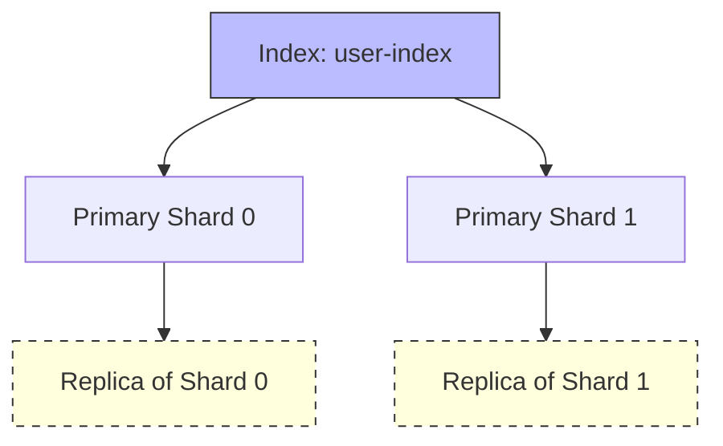
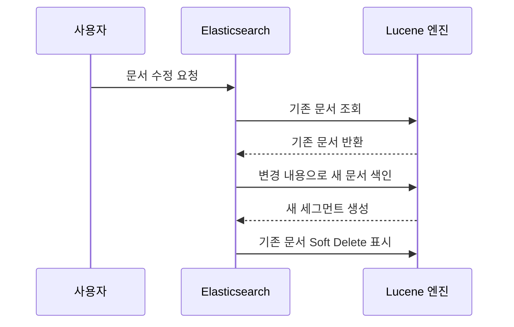
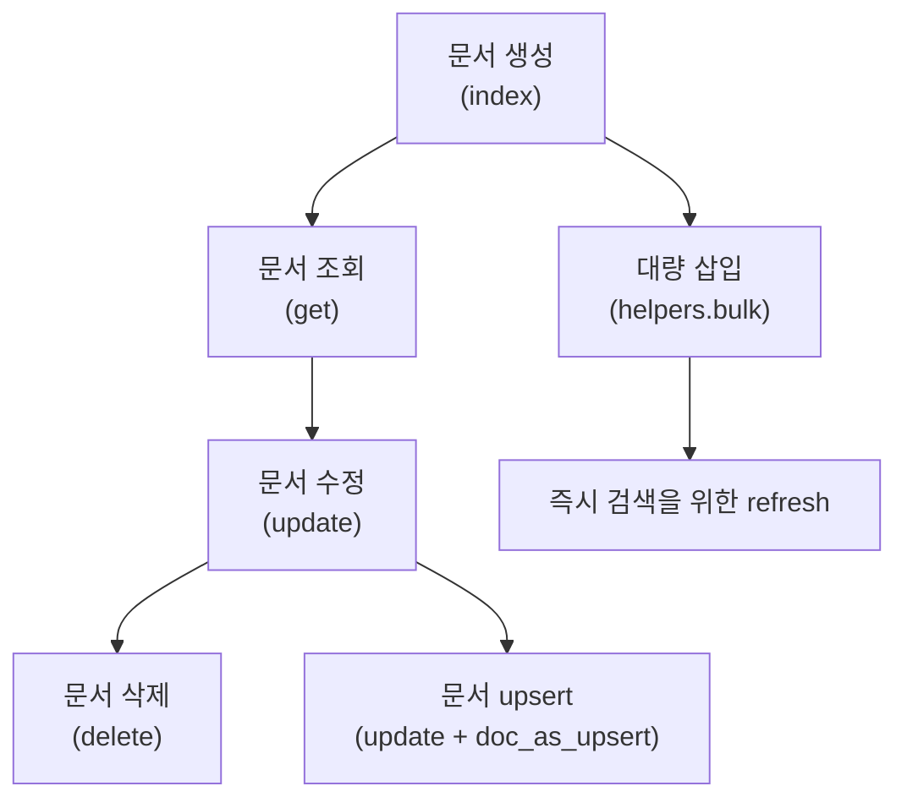

# Elasticsearch 설치 및 기본 개념


>**📄 Abstract**       
>이 정리본은 대규모 비정형 데이터를 효과적으로 검색·분석하기 위한 기술인 Elasticsearch의 핵심 개념과 구조, 설치 방법, 검색 원리, 데이터 저장 방식, 실습 활용까지 전반적인 내용을 체계적으로 다루고 있다. 정보 검색 시스템의 기본 이론부터 시작하여, Elasticsearch와 Lucene의 관계, 분산 구조와 색인 메커니즘, 실시간 검색 처리 과정, RESTful API 기반 CRUD 연산까지 실무에서 바로 활용 가능한 지식을 단계적으로 구성하였다.            
>특히 이 정리본은 Elasticsearch를 처음 접하는 비전공자도 이해할 수 있도록, 개념 정의, 예제, 주석, 실습 예시를 포함하여 학습 효과를 극대화하는 데 중점을 두었다. 복잡하게 느껴질 수 있는 검색 엔진 구조를 명확히 시각화하고, 실습 기반의 설치 및 쿼리 작성까지 이어짐으로써 기술적 이해도를 높이고 실제 데이터 분석 및 시스템 개발에서 응용할 수 있는 기반을 제공한다.       


📘 1\. 정보 검색과 검색 시스템의 이해
========================

1.1 정보 검색이란?
------------

정보 검색(Information Retrieval)이란 대규모 데이터 속에서 사용자가 원하는 정보를 효율적으로 찾아 제공하는 기술이다. 일반적인 예로는 Google 검색, 네이버 블로그 검색, 쇼핑몰 내 상품 검색 등이 있다. 이러한 시스템은 사용자가 키워드를 입력하면, 그에 적절한 결과를 빠르고 정확하게 반환해야 한다.

현대의 정보 검색 대상은 단순한 텍스트 문서를 넘어서 이미지, 동영상, 오디오, PDF, XML, JSON 등 비정형 데이터를 포함한다. 따라서 검색 시스템은 다양한 형태의 데이터를 이해하고 이를 색인할 수 있는 구조를 갖추어야 한다.

> 📌 오해 방지 주석: 정보 검색은 데이터베이스에서 특정 조건에 맞는 값을 찾는 SQL 질의(Query)와는 다르다. SQL은 구조화된 정형 데이터(RDBMS)를 대상으로 하지만, 정보 검색 시스템은 자연어를 포함한 다양한 문서 데이터를 대상으로 한다.

<br>

1.2 정보 검색 시스템의 구성 요소
--------------------

효율적인 정보 검색 시스템은 다음의 세 가지 핵심 요소로 구성된다.

1.  **데이터 수집(Data Collection)**
    
    *   웹 크롤링, RSS 피드, 로그 수집기(Beats) 등을 통해 데이터를 모은다.
        
2.  **데이터 저장(Data Storage)**
    
    *   수집된 데이터를 효율적으로 색인(indexing)하기 위해 역색인(Inverted Index) 구조를 사용한다.
        
    *   역색인은 “단어 → 문서 목록”의 구조로, 어떤 단어가 어떤 문서에 등장하는지를 빠르게 찾을 수 있게 해준다.
        
    
    > 예시:
    > 
    > *   "Elasticsearch는 빠른 검색 엔진이다."라는 문장에서
    >     
    > *   `Elasticsearch → [문서1]`, `검색 → [문서1]`, `엔진 → [문서1]` 처럼 단어 기반으로 색인된다.
    >     
    
3.  **검색 알고리즘(Search Algorithm)**
    
    *   사용자가 입력한 질의(Query)와 문서 간의 관련도를 계산하는 알고리즘을 적용한다.
        
    *   대표적인 알고리즘으로는 **TF-IDF**(Term Frequency - Inverse Document Frequency), **BM25** 등이 있으며, 사용자의 질의와 가장 관련 있는 문서를 높은 점수로 평가하여 결과로 제공한다.
        

<br>

1.3 기존 RDB 검색의 한계
-----------------

전통적인 관계형 데이터베이스(RDBMS)는 정형화된 데이터를 다루는 데 최적화되어 있다. 그러나 텍스트 기반의 유연한 검색에서는 다음과 같은 한계를 가진다.

*   **복잡한 쿼리 구조**  
    예를 들어, 상품 이름에 '블루투스 이어폰'이 포함된 데이터를 찾기 위해서는 `LIKE '%블루투스%' AND '%이어폰%'` 등의 비효율적인 쿼리가 필요하다.
    
*   **검색 성능 저하**  
    데이터량이 증가할수록 전체 스캔이 필요하게 되며, 인덱스를 적절히 설정하지 않으면 성능 저하가 심각해진다.
    
*   **유사어, 오타 대응 불가**  
    사용자가 `블루투쓰`라고 잘못 입력하거나 `이어폰` 대신 `헤드셋`을 입력해도 RDB는 이를 인식하지 못한다.
    

이러한 한계는 검색 품질을 저하시키고, 사용자의 기대에 부합하지 못하는 결과를 야기할 수 있다.

<br>

1.4 검색 엔진 종류와 순위
----------------

검색 엔진은 구조적 특성과 제공 기능에 따라 다음과 같은 종류로 분류된다.

*   **Elasticsearch**
    
    *   대규모 실시간 검색 및 분석에 강력한 오픈소스 엔진. 로그 분석, 제품 검색, 보안 이벤트 탐지 등에 활용.
        
*   **Apache Solr**
    
    *   Lucene 기반의 또 다른 검색 엔진. 복잡한 설정이 가능하고 대용량 문서 처리에 강점을 가짐.
        
*   **Whoosh**
    
    *   Python 기반의 경량 검색엔진. 소규모 프로젝트나 학습용으로 적합.
        
*   **상용 엔진(Google Search Appliance 등)**
    
    *   엔터프라이즈 환경에서 사용되며, 강력하지만 비용이 높음.
        

현재 업계에서는 Elasticsearch가 설치 및 관리의 용이성과 커뮤니티의 활발한 지원으로 가장 널리 사용되고 있다.

<br>
<br>

📘 2\. Elasticsearch의 개념과 구조
============================

2.1 Elasticsearch란?
-------------------

**Elasticsearch**는 구조화되거나 비구조화된 데이터를 실시간으로 저장하고, 검색하고, 분석할 수 있는 **분산형 오픈소스 검색 및 분석 엔진**이다.  
Apache Lucene을 내부 검색 엔진으로 사용하며, RESTful API 기반의 접근 방식을 제공하여 개발자 친화적인 인터페이스를 갖춘 것이 특징이다.

*   **실시간 분석**: 새로운 데이터가 들어와도 거의 즉시 검색에 반영된다.
    
*   **수평 확장성**: 데이터 증가에 따라 노드를 쉽게 추가하여 시스템을 확장할 수 있다.
    
*   **JSON 기반 문서 저장**: 모든 데이터는 JSON 형태로 저장되며 유연한 스키마를 제공한다.
    
*   **Elastic Stack의 일부**: Kibana(시각화), Logstash(수집 및 전처리), Beats(경량 수집기) 등과 함께 사용됨.
    

> 📌 오해 방지 주석: Elasticsearch는 단순한 검색 도구가 아니라, 데이터 저장소이자 분석 플랫폼으로도 사용 가능하다. RDB의 대체는 아니지만 로그 수집, 제품 검색, 추천 시스템 등 다양한 곳에서 중요한 역할을 한다.

<br>

2.2 Elasticsearch vs Lucene
---------------------------

Elasticsearch는 Lucene이라는 강력한 텍스트 검색 엔진을 내부적으로 사용한다. 그러나 Lucene은 자바 기반의 라이브러리로, 직접 사용하기에는 높은 기술적 진입장벽이 있다.

| 항목        | Elasticsearch          | Lucene                    |
| ----------- | ---------------------- | ------------------------- |
| 형태        | 검색 엔진 플랫폼       | 자바 라이브러리           |
| API         | RESTful API 제공       | 제공하지 않음             |
| 분산 구조   | 내장 지원              | 별도 구현 필요            |
| 사용 편의성 | 설치 후 바로 사용 가능 | 자바 프로그래밍 지식 필요 |
| 스케일링    | 수평 확장 구조 지원    | 수동 확장 필요            |

> ✅ 정리: Elasticsearch는 Lucene을 기반으로 하여 복잡한 검색 기능을 간단한 API로 추상화하고, 분산 환경을 기본으로 지원하는 시스템이다. Lucene은 단독으로 사용되기보다 Elasticsearch에 포함되어 활용된다.

<br>

2.3 Lucene의 핵심 개념: 세그먼트(Segment)
--------------------------------

Lucene은 데이터를 색인(index)할 때, 이를 세그먼트라는 단위로 저장한다. 각 세그먼트는 **읽기 전용(Read-Only)** 구조이며, 문서가 추가되거나 수정될 경우 새로운 세그먼트가 생성된다.

*   **세그먼트(Segment)**: 색인된 문서들을 저장하는 최소 단위 파일
    
*   **세그먼트의 장점**:
    
    *   병렬 처리가 가능하여 빠른 색인 지원
        
    *   검색 성능에 최적화된 구조
        
    *   세그먼트가 많아질 경우 자동 병합(Merge) 수행
        

> 📌 참고: Elasticsearch에서 문서를 수정하거나 삭제할 때 기존 문서를 직접 수정하는 것이 아니라, 새로운 문서를 세그먼트로 추가하고 기존 문서는 삭제 표시(soft delete)된다. 완전한 삭제는 Flush 또는 Merge 작업을 통해 이루어진다.

<br>

2.4 Elasticsearch의 주요 특징
------------------------

Elasticsearch는 현대 데이터 처리 환경에 적합한 다음과 같은 특성들을 내장하고 있다.

1.  **분산 구조**
    
    *   데이터를 샤드(shard)라는 단위로 나누고 여러 노드에 분산 저장한다.
        
    *   장애 발생 시, 복제본(replica shard)을 통해 고가용성 유지 가능
        
2.  **전문 검색(Specialized Search)**
    
    *   형태소 분석, 문맥 기반 검색, 정규식 검색 등 다양한 검색 기능 제공
        
3.  **확장성(Scalability)**
    
    *   데이터 증가 시 노드 추가만으로 성능 확장 가능 (수평 확장)
        
4.  **유연성(Flexibility)**
    
    *   JSON 포맷의 자유로운 스키마 설계 가능
        
    *   문서마다 다른 필드를 가질 수 있음 (dynamic mapping)
        

<br>

2.5 Elastic Stack의 구성과 데이터 처리 흐름
--------------------------------

Elasticsearch는 단독으로도 사용할 수 있지만, **Elastic Stack(구 ELK Stack)** 의 일부로 함께 사용하는 경우가 많다.

```
[데이터 수집(Beats)] → [버퍼링(Kafka - Logstash 없음 시 생략)] → [전처리(Logstash)]         
→ [색인 및 저장(Elasticsearch)] → [시각화 및 분석(Kibana)]        
```

*   **Beats**: 경량 데이터 수집기 (예: Filebeat – 로그 수집)
    
*   **Logstash**: 수집된 데이터를 가공하고 파싱하여 Elasticsearch에 전달
    
*   **Elasticsearch**: 저장 및 검색 처리
    
*   **Kibana**: 데이터 시각화를 위한 대시보드 제공
    

> ✅ 예시: 웹 서버 로그 데이터를 실시간으로 수집하여, 검색 가능한 형태로 저장하고 대시보드에서 분석하는 구조는 Elastic Stack이 가장 보편적으로 사용되는 형태이다.

<br>

2.6 주요 활용 사례
------------

*   **로그 수집 및 분석**: 시스템 운영 로그, 보안 이벤트, 트래픽 분석 등
    
*   **사이트 내 검색**: 쇼핑몰, 뉴스 사이트 등에서 키워드 기반 검색 구현
    
*   **보안 정보 분석**: SIEM(Security Information and Event Management) 시스템의 핵심 엔진으로 활용
    
*   **개인화 추천 시스템**: 사용자 활동 로그 분석을 통한 검색 결과 및 콘텐츠 추천
    

<br>
<br>

📘 3\. Elasticsearch의 생태계와 활용
=============================

3.1 Elastic Stack 데이터 처리 흐름
---------------------------

Elasticsearch는 단일 검색 엔진으로도 강력한 기능을 제공하지만, 다양한 데이터 수집 및 시각화 요구를 충족시키기 위해 **Elastic Stack(구 ELK Stack)** 이라는 통합 생태계를 제공합니다. 이 스택은 데이터를 수집하고, 가공하고, 저장하며, 사용자에게 시각적으로 보여주는 전 과정을 포괄합니다.

Elastic Stack 구성요소는 다음과 같습니다:

### 📦 Beats (데이터 수집기)

*   **설명**: 시스템 로그, 메트릭, 트래픽 등의 데이터를 수집하는 경량 에이전트
    
*   **종류**
    
    *   `Filebeat`: 파일 기반 로그 수집
        
    *   `Metricbeat`: 시스템 메트릭 수집
        
    *   `Packetbeat`: 네트워크 패킷 수집
        
*   **특징**: 리소스가 적고, 설정이 간단하며, 실시간 수집이 가능함
    

### 🔁 Kafka (선택적 버퍼링 계층)

*   **설명**: 대용량 데이터를 안정적으로 전송하기 위한 메시지 브로커
    
*   **역할**: 데이터 유실 방지 및 실시간 스트리밍 처리 구현에 적합
    
*   **주의사항**: Elasticsearch 자체로는 버퍼링이 제한적이므로 Kafka를 중간에 두어 안정성과 유연성을 확보할 수 있음
    

> ⚠️ Kafka는 Elastic Stack에 포함된 요소는 아니지만, **대규모 실시간 처리 시스템에서 거의 필수적으로 결합**되어 사용된다.

### 🔧 Logstash (데이터 전처리 및 변환)

*   **설명**: 다양한 데이터 소스를 수집하고 변환하여 Elasticsearch에 전달하는 데이터 파이프라인 도구
    
*   **기능**
    
    *   Grok 패턴을 이용한 로그 파싱
        
    *   JSON 변환, 필터링, 날짜 파싱 등
        
    *   Kafka, Redis, JDBC 등 다양한 입력 소스 지원
        
*   **예시**:
    
    ```bash
    input {
      file {
        path => "/var/log/nginx/access.log"
      }
    }
    filter {
      grok {
        match => { "message" => "%{COMBINEDAPACHELOG}" }
      }
    }
    output {
      elasticsearch {
        hosts => ["http://localhost:9200"]
      }
    }
    ```
    

### 🔍 Elasticsearch (색인 및 검색)

*   **설명**: 전처리된 데이터를 저장하고 고속으로 색인 및 검색 처리
    
*   **기능**:
    
    *   JSON 문서 저장
        
    *   다양한 쿼리 DSL(Query Domain Specific Language)
        
    *   유사도 기반 검색(BM25 등)
        

### 📊 Kibana (시각화 및 대시보드)

*   **설명**: Elasticsearch에 저장된 데이터를 시각화하는 웹 기반 인터페이스
    
*   **기능**:
    
    *   데이터 탐색(Discover)
        
    *   대시보드 구성(Dashboard)
        
    *   시계열 분석(Visualize/TimeSeries)
        
    *   알림 설정(Alerting), 보안 설정 등 확장 기능 존재
        

> ✅ 실제 예시:
> 
> 1.  Filebeat가 웹 서버의 로그를 수집
>     
> 2.  Kafka를 거쳐 Logstash에서 사용자 IP, URL, 응답시간 등으로 파싱
>     
> 3.  Elasticsearch에 저장
>     
> 4.  Kibana에서 방문자 패턴을 시각화하고 이상 트래픽을 감지
>     


<br>

3.2 주요 활용 사례
------------

Elasticsearch는 단순히 검색을 위한 도구가 아니라, **비정형 데이터 기반의 실시간 분석 시스템**으로 광범위하게 활용된다. 다음은 대표적인 사용 사례이다.

### 1️⃣ 로그 수집 및 분석

*   **설명**: 시스템 또는 애플리케이션 로그를 실시간으로 수집하여 분석
    
*   **목적**: 장애 진단, 이상 탐지, 보안 감사 등
    
*   **도입 효과**: 로그 검색 속도 수천 배 향상, 대시보드 기반 실시간 모니터링 가능
    

> 예: AWS 인스턴스에서 발생한 nginx 에러 로그를 수집해 Kibana 대시보드로 실시간 시각화

### 2️⃣ 검색 시스템 구현

*   **설명**: 제품, 기사, 문서 등에 대한 고성능 검색 기능 제공
    
*   **기능**: 자동완성, 추천 검색어, 정렬 및 필터링, 유사 문서 검색
    

> 예: 쇼핑몰에서 ‘무선 이어폰’을 검색하면 관련 제품이 가격순, 리뷰순으로 정렬되어 제공됨

### 3️⃣ 보안 분석 (SIEM)

*   **설명**: SIEM(Security Information and Event Management) 시스템의 핵심 분석 엔진으로 활용
    
*   **기능**: 보안 로그 분석, 이벤트 상관분석, 이상 징후 탐지
    

> 예: 서버에 대한 brute-force 공격을 탐지하여 관리자에게 실시간 알림 제공

### 4️⃣ 사용자 행동 분석 및 추천 시스템

*   **설명**: 웹/모바일 사용자 행동 데이터를 분석하여 개인 맞춤형 콘텐츠 제공
    
*   **기능**: 사용자 유형 분류, 콘텐츠 추천, 이탈률 분석
    

> 예: OTT 서비스에서 사용자가 자주 본 장르에 기반한 콘텐츠 추천

<br>
<br>

📘 4\. Elasticsearch 설치 및 환경 구성
===============================

4.1 Docker 기반 설치
----------------

Elasticsearch는 Java 기반의 복잡한 런타임과 시스템 환경 설정이 필요하므로, 운영체제(OS)에 따라 설치 난이도에 큰 차이가 있다. 이를 해결하기 위해 **Docker** 기반의 설치 방식이 널리 사용된다.

### ✅ Docker 설치의 이점

*   OS 종속성 제거 (Windows, Mac, Linux 모두 동일한 환경 제공)
    
*   설치 및 초기 실행 시간 단축
    
*   복잡한 설정을 `docker-compose.yml` 파일로 선언적으로 관리 가능
    
*   Elasticsearch, Kibana, Logstash 등 여러 컨테이너를 동시에 실행 가능
    

> 💡 참고: Docker는 컨테이너 기술로, 가상머신과 달리 매우 가볍고 빠르며 프로세스 단위로 애플리케이션을 실행한다.

<br>

4.2 Docker Compose로 환경 구성
-------------------------

Elasticsearch를 실행하기 위한 `docker-compose.yml` 파일의 주요 구성 요소는 다음과 같다.

### 예시: `docker-compose-elastic.yml`

```yaml
version: "3.8"
services:
  elasticsearch:
    image: docker.elastic.co/elasticsearch/elasticsearch:8.7.0
    container_name: es-node
    environment:
      - node.name=es-node
      - cluster.name=es-cluster
      - discovery.type=single-node
      - bootstrap.memory_lock=true
      - ES_JAVA_OPTS=-Xms1g -Xmx1g
    ulimits:
      memlock:
        soft: -1
        hard: -1
    ports:
      - 9200:9200
    volumes:
      - esdata:/usr/share/elasticsearch/data
volumes:
  esdata:
```

<br>

4.3 설정 항목 해설
------------

### 📦 image

*   실행할 Elasticsearch Docker 이미지 지정
    
*   버전 번호를 명시하여 버전 일관성을 유지 (`elasticsearch:8.7.0` 등)
    

### 🧱 container\_name

*   컨테이너 이름 설정 (예: `es-node`)
    

### ⚙️ environment

*   `node.name`: 클러스터 내 노드의 이름
    
*   `cluster.name`: 동일 클러스터에 속하는 노드들을 식별하는 이름
    
*   `discovery.type=single-node`: 개발 환경에서 단일 노드로 실행함을 명시 (운영 환경에서는 seed hosts 방식 사용)
    
*   `ES_JAVA_OPTS`: Elasticsearch가 사용하는 JVM 메모리 옵션 (`-Xms`, `-Xmx` 설정)
    

### 🔒 ulimits

*   메모리 잠금을 설정하여 성능 향상을 유도 (물리 메모리를 스와핑하지 않도록 제한)
    

### 🔌 ports

*   외부에서 접속할 수 있도록 포트를 개방
    
    *   `9200`: REST API용 포트
        
    *   `9300`: 노드 간 통신용 포트 (멀티 노드 구성 시 필요)
        

### 💾 volumes

*   컨테이너 내부 `/usr/share/elasticsearch/data` 디렉토리를 로컬 볼륨과 연결하여 데이터 영속성 유지
    

### 🌐 networks (옵션)

*   여러 컨테이너 간 통신을 위해 네트워크를 지정
    
*   Kibana, Logstash와 연결 시 같은 네트워크에 포함되어야 함
    

<br>

4.4 실행 명령어 요약
-------------

```bash
# 1. docker-compose 명령어로 실행
docker-compose -f docker-compose-elastic.yml up -d

# 2. 컨테이너 상태 확인
docker ps

# 3. Elasticsearch 접속 테스트
curl http://localhost:9200
```

<br>

4.5 설치 확인 및 점검 포인트
------------------

### Elasticsearch REST API 응답 예시:

```json
{
  "name": "es-node",
  "cluster_name": "es-cluster",
  "cluster_uuid": "uH0Q2W9RQDydJE7-0O4YiA",
  "version": {
    "number": "8.7.0",
    ...
  },
  "tagline": "You Know, for Search"
}
```

*   정상 응답이 오면 설치 완료
    
*   `curl`, `Postman`, 또는 브라우저에서도 `http://localhost:9200` 접속 가능
    

> ⚠️ 주의: 시스템이 Docker를 제대로 지원하지 않거나, 포트가 충돌될 경우 실행에 실패할 수 있으므로 사전 점검 필요

<br>
<br>

📘 5\. Elasticsearch 핵심 구성 요소
=============================

5.1 기본 데이터 구조: 문서(Document), 필드(Field), 인덱스(Index)
--------------------------------------------------

Elasticsearch에서 모든 데이터는 **문서(document)** 형태로 저장되며, 이 문서는 내부적으로 **JSON 형식**을 따른다. 이는 RDB의 행(row)과 유사한 개념이다.

### 📌 Document (문서)

*   Elasticsearch에서 저장 및 색인의 최소 단위
    
*   **JSON 포맷**으로 구성되며, 하나의 객체 또는 사건을 표현
    

> 예: 한 명의 사용자 정보를 문서로 표현

```json
{
  "user_id": "U12345",
  "name": "홍길동",
  "age": 29,
  "email": "hong@example.com",
  "registered_at": "2024-01-10"
}
```

### 📌 Field (필드)

*   문서 내부의 **개별 키-값 쌍**
    
*   문자열, 숫자, 날짜, boolean 등 다양한 데이터 타입을 가질 수 있음
    

> 예:
> 
> *   `"name": "홍길동"` → name이 필드이며, 값은 "홍길동"
>     
> *   `"age": 29` → 숫자형 필드
>     

### 📌 Index (인덱스)

*   Elasticsearch에서 문서를 저장하는 논리적 공간
    
*   RDB의 데이터베이스(DB)에 해당
    
*   인덱스 안에는 다수의 문서가 존재하며, 이들을 자동으로 색인(indexing)
    

> 예:
> 
> *   `user-index`라는 인덱스에 여러 사용자의 문서 저장
>     

> ⚠️ 주의: Elasticsearch에서 "index"는 저장소를 의미하지만, 내부적으로는 검색을 위한 색인(indexing) 작업도 동시에 수행되므로 용어 혼동에 유의해야 한다.

<br>

5.2 저장 및 분산 처리 구조
-----------------

### 🔹 Shard (샤드)

*   하나의 인덱스를 **물리적으로 나누는 단위**
    
*   Elasticsearch는 인덱스를 여러 개의 샤드로 나누어 **여러 노드에 분산 저장**함
    
*   데이터량이 많아질 경우 자동 또는 수동으로 샤드 수를 조정 가능
    

> 예: `user-index`를 5개의 샤드로 구성하여 서로 다른 노드에 분산

### 🔹 Replica (레플리카)

*   샤드의 **복제본**
    
*   고가용성 및 부하 분산을 위해 사용
    
*   하나의 프라이머리 샤드(primary shard)당 기본적으로 하나 이상의 레플리카를 가질 수 있음
    

> 예: 샤드 1개 + 레플리카 1개 = 동일 데이터를 두 군데 보관  
> → 한 노드가 장애 발생해도 레플리카로 조회 가능

> 💡 비유: RDB의 마스터-슬레이브 복제 구조와 유사하되, Elasticsearch는 자동으로 샤드와 레플리카를 분산 배치한다.

<br>

5.3 문서 저장 구조 예시: 전체 구성 요약
-------------------------

```text
[인덱스] user-index
 ├── [Primary Shard 0] → 문서 1~1000
 ├── [Primary Shard 1] → 문서 1001~2000
 ├── [Replica of Shard 0]
 └── [Replica of Shard 1]
```

*   문서는 JSON 형태로 저장됨
    
*   클러스터의 여러 노드에 샤드와 레플리카가 자동 분산 배치됨
    
*   검색 시 여러 샤드에서 병렬로 검색 후 결과 통합
    


<br>

5.4 매핑(Mapping)과 스키마 구조
-----------------------

Elasticsearch는 문서를 저장할 때, 각 필드의 타입과 특성을 내부적으로 **매핑(mapping)** 형태로 관리한다. 이는 RDB의 스키마(schema)와 유사한 역할을 수행한다.

### ✅ 자동 매핑(Dynamic Mapping)

*   문서가 처음 색인될 때 Elasticsearch가 **자동으로 필드의 타입을 추론**하여 매핑 정보를 생성
    
*   간편하지만 예기치 못한 타입 오류 발생 가능
    

### ✅ 명시적 매핑(Explicit Mapping)

*   사용자가 사전에 필드와 타입을 정의
    
*   데이터 무결성 확보와 검색 정확도 향상에 유리
    

> 예: 명시적 매핑 생성

```json
PUT /user-index
{
  "mappings": {
    "properties": {
      "user_id": { "type": "keyword" },
      "age": { "type": "integer" },
      "registered_at": { "type": "date" }
    }
  }
}
```

> 📌 주의: once set, 필드 타입은 변경할 수 없다. 변경하려면 인덱스를 재생성해야 한다.

<br>
<br>

📘 6\. Elasticsearch의 데이터 처리와 검색 원리
===================================

6.1 색인(Indexing)과 검색(Querying)
------------------------------

Elasticsearch는 **색인(Indexing)** 과 **검색(Querying)** 을 동시에 지원하는 시스템이다. 색인은 문서를 내부적으로 분석 및 변환하여 검색 가능한 형태로 저장하는 과정이며, 검색은 저장된 문서 중 사용자의 질의에 가장 잘 부합하는 결과를 찾는 과정이다.

### ✅ 색인(Indexing)

*   문서(document)를 Elasticsearch에 저장할 때 자동으로 수행
    
*   Lucene 기반으로 **역색인(Inverted Index)** 생성
    
*   역색인은 "단어 → 등장 문서 ID 리스트"로 구성되어, 검색 속도가 매우 빠르다
    

> 예:
> 
> *   문서1: “Elasticsearch is fast”
>     
> *   문서2: “Elasticsearch is scalable”  
>     → 역색인 구조  
>     → `elasticsearch → [문서1, 문서2]`, `fast → [문서1]`, `scalable → [문서2]`
>     

### ✅ 검색(Querying)

*   REST API 기반의 질의 수행
    
*   쿼리 DSL(Domain Specific Language)을 사용하여 다양한 방식으로 검색 가능
    
    *   Match Query, Term Query, Bool Query, Range Query 등
        

> 예: match 쿼리 예시

```json
GET /user-index/_search
{
  "query": {
    "match": {
      "name": "홍길동"
    }
  }
}
```

<br>

6.2 검색 동작 방식
------------

사용자의 질의가 Elasticsearch에 도달하면, 다음과 같은 과정을 통해 검색 결과가 도출된다:

1.  **분석기(Analyzer) 적용**
    
    *   입력된 질의를 형태소 단위로 분리(tokenize)하고 소문자화, 불용어 제거 등의 전처리 수행
        
    *   문서가 색인될 때도 동일한 분석기를 적용하여 일관성 유지
        
2.  **샤드에 분산 질의**
    
    *   해당 인덱스의 모든 샤드(primary 및 replica)에 병렬적으로 질의를 전달
        
    *   각 샤드는 결과와 점수(score)를 반환
        
3.  **연관성 점수 계산**
    
    *   질의어와 문서 간의 **유사도 점수**를 계산하여 순위를 매김
        
    *   기본적으로 **BM25** 알고리즘을 사용 (기존에는 TF-IDF 사용)
        
4.  **결과 정렬 및 집계**
    
    *   가장 점수가 높은 결과를 기준으로 정렬
        
    *   조건에 따라 집계(aggregation)도 동시에 수행 가능
        

> 📌 용어 설명
> 
> *   **TF** (Term Frequency): 문서 내 특정 단어의 등장 횟수
>     
> *   **IDF** (Inverse Document Frequency): 해당 단어가 전체 문서에서 얼마나 드문지를 나타냄
>     
> *   **BM25**: TF-IDF를 개선하여 문서 길이 보정 및 파라미터 튜닝을 지원하는 알고리즘
>     

<br>

6.3 준실시간 검색(NRT: Near Real-Time)
--------------------------------

Elasticsearch는 데이터를 색인하면서 동시에 검색할 수 있는 **준실시간(NRT)** 기능을 제공한다. 이는 전통적인 RDBMS보다 훨씬 빠른 피드백 루프를 가능하게 하며, 실시간 데이터 분석 시스템의 핵심 요소이다.

### ✅ 색인과 검색의 시간 차

*   색인 → Lucene 세그먼트에 반영 (메모리 상)
    
*   검색 → 일정 주기로 commit된 세그먼트 대상으로 수행
    
*   색인 후 몇 초 이내에 검색 가능
    

> 💡 Tip: 완전한 실시간(real-time)이 아닌 이유는 검색 가능한 세그먼트로 변환되기까지 약간의 지연(일반적으로 1초 미만)이 존재하기 때문

<br>

6.4 준실시간 검색이 가능한 이유
-------------------

### 🔹 메모리 기반 버퍼링

*   색인 요청은 디스크에 바로 쓰지 않고 메모리에 저장되며, 일정 주기로 디스크에 반영
    

### 🔹 비동기 색인 처리

*   색인과 검색이 서로 독립적인 쓰레드로 병렬 수행됨
    
*   이로 인해 시스템은 검색 응답을 지연시키지 않음
    

### 🔹 Lucene 최적화

*   Lucene은 색인과 검색을 최적화하는 다양한 내부 알고리즘을 제공
    
*   검색 가능한 세그먼트를 빠르게 생성하고 병합(Merge)을 통해 디스크 사용량도 줄임
    

<br>

6.5 기타 Elasticsearch 검색 관련 특징 요약
--------------------------------

| 기능                      | 설명                                             |
| ------------------------- | ------------------------------------------------ |
| 다양한 쿼리 유형 지원     | match, term, range, wildcard, bool 등            |
| JSON 기반 질의 인터페이스 | RESTful API로 요청 가능                          |
| 정렬 및 필터링            | 쿼리 결과를 점수, 필드 값 기준으로 정렬 가능     |
| Aggregation (집계) 지원   | 평균, 합계, 히스토그램, 버킷 집계 등 가능        |
| 클라이언트 SDK 다양       | Python, Java, JS, Go 등에서 공식 라이브러리 제공 |

> 예: 숫자 필드의 평균을 계산하는 집계 쿼리

```json
GET /sales/_search
{
  "size": 0,
  "aggs": {
    "avg_price": {
      "avg": {
        "field": "price"
      }
    }
  }
}
```

<br>
<br>

📘 7\. Elasticsearch 문서 CRUD 및 업데이트
===================================

7.1 문서 생성, 조회, 수정, 삭제
---------------------

Elasticsearch는 모든 데이터를 **문서(Document)** 단위로 처리하며, 이를 위한 **CRUD(Create, Read, Update, Delete)** 연산은 RESTful API 기반으로 수행된다.

### ✅ 문서 생성 (Create)

*   HTTP `POST` 또는 `PUT` 메서드를 사용
    
*   `_index`, `_id`를 지정하거나 자동 생성 가능
    

> 예: 새 문서 생성

```http
POST /user-index/_doc/
{
  "user_id": "U12345",
  "name": "홍길동",
  "age": 29
}
```

> 또는 ID를 직접 지정

```http
PUT /user-index/_doc/U12345
{
  "user_id": "U12345",
  "name": "홍길동",
  "age": 29
}
```

<br>

### ✅ 문서 조회 (Read)

*   HTTP `GET` 메서드 사용
    
*   `_index`, `_id`를 경로로 지정
    

> 예: ID가 `U12345`인 문서 조회

```http
GET /user-index/_doc/U12345
```

> 응답 예:

```json
{
  "_index": "user-index",
  "_id": "U12345",
  "_source": {
    "user_id": "U12345",
    "name": "홍길동",
    "age": 29
  }
}
```

<br>

### ✅ 문서 수정 (Update)

Elasticsearch는 **문서를 직접 수정할 수 없다**. 대신 기존 문서를 삭제 표시하고, **새 문서를 생성하는 방식으로 업데이트**가 이루어진다.

*   HTTP `POST` 또는 `POST _update` API 사용
    

> 예: 문서 업데이트

```http
POST /user-index/_update/U12345
{
  "doc": {
    "age": 30
  }
}
```

> 결과: 내부적으로 새로운 세그먼트에 새 문서가 저장되고, 기존 문서는 삭제 표시됨

> ⚠️ 주의: 동일한 `_id`를 가진 문서를 다시 PUT하면 전체 문서가 교체됨 (필드 일부가 아닌 전체 재정의)

<br>

### ✅ 문서 삭제 (Delete)

*   HTTP `DELETE` 메서드 사용
    

> 예: 문서 삭제

```http
DELETE /user-index/_doc/U12345
```

*   삭제되었더라도 Lucene 세그먼트 상에서는 **Soft Delete** 상태로 남음
    
*   완전한 삭제는 `flush` 또는 `merge` 작업을 통해 이루어짐
    

<br>

7.2 Upsert 연산
-------------

**Upsert**는 `Update + Insert`의 결합 연산으로, 다음과 같이 동작한다.

*   문서가 존재하면 → 업데이트 수행
    
*   문서가 없으면 → 새 문서 삽입
    

> 예: Upsert 연산

```http
POST /user-index/_update/U99999
{
  "doc": {
    "name": "신규 사용자",
    "age": 25
  },
  "doc_as_upsert": true
}
```

*   `doc_as_upsert: true`를 설정하면, 존재하지 않는 문서일 경우 `doc` 내용을 기준으로 삽입된다.
    

> 📌 실무 팁: 신규 사용자 등록과 기존 사용자 정보 갱신을 하나의 API로 처리 가능하여 활용도가 높다.

<br>

7.3 Elasticsearch 문서 업데이트 메커니즘
------------------------------

Lucene의 내부 구조상 문서는 **불변(immutable)** 이기 때문에 직접 수정은 불가능하다. Elasticsearch는 이를 다음과 같은 방식으로 우회한다:

1.  기존 문서를 `_id`로 조회
    
2.  변경 사항을 반영하여 **새 문서**를 생성
    
3.  기존 문서에 삭제 플래그 설정 (Soft Delete)
    
4.  새로운 세그먼트에 저장
    
5.  일정 시점에 세그먼트 병합(Merge)을 통해 삭제된 문서 제거
    

> 📌 주석: 이러한 방식 덕분에 동시성 문제 없이 여러 요청을 병렬 처리할 수 있으며, 높은 검색 성능을 유지할 수 있다.



<br>

7.4 세그먼트와 Flush의 관계
-------------------

### 🔹 세그먼트 증가

*   문서 수정/삽입이 반복되면 새로운 세그먼트가 계속 생성됨
    
*   세그먼트가 많아질수록 디스크 사용량 증가, 검색 성능 저하 가능
    

### 🔹 Flush

*   메모리 상의 문서를 디스크로 기록하여 세그먼트를 확정
    
*   강제로 `POST /_flush` 요청 가능
    

### 🔹 Merge

*   Elasticsearch는 내부적으로 세그먼트를 병합하여 성능을 최적화
    
*   이 과정에서 삭제된 문서가 완전히 제거됨
    

> 💡 예비 질문 대비: “Elasticsearch에서 문서 수정이 어떻게 가능한가요?”  
> → 문서를 직접 수정하지 않고, 새 문서를 추가하고 기존 문서는 삭제 표시하는 방식으로 업데이트한다는 점을 Lucene 기반 구조와 함께 설명할 수 있어야 함.

<br>
<br>

📘 8\. Elasticsearch 문서 CRUD 및 업데이트 – 실습 코드 해설
==============================================

✅ ① 문서 삽입 (Create)
------------------

```python
from elasticsearch import Elasticsearch

# Elasticsearch 서버에 연결
es = Elasticsearch("http://localhost:9200")

# 저장할 문서 데이터 정의 (JSON 형식)
doc = {
    "name": "Samsung Galaxy S24 Ultra",
    "brand": "Samsung",
    "price": 1199.99,
    "category": "smartphone",
    "rating": 4.8
}

# 'products' 인덱스에 ID 1001번으로 문서 삽입
response = es.index(index="products", id=1001, document=doc)

print(response)
```

> 🔍 이 코드는 새로운 상품 정보를 Elasticsearch에 저장하는 예제입니다.
> 
> *   `index` 함수는 문서를 지정된 인덱스에 삽입합니다.
>     
> *   `id`는 문서의 고유 ID입니다.
>     
> *   `document`는 저장할 JSON 형식의 데이터입니다.
>     

<br>

✅ ② 문서 조회 (Read)
----------------

```python
response = es.get(index="products", id=1001)
print(response)
```

> 🔍 `get` 함수는 지정된 인덱스에서 ID에 해당하는 문서를 가져옵니다.

<br>

✅ ③ 문서 수정 (Update)
------------------

```python
update_body = {
    "doc": {
        "price": 1099  # 수정할 필드만 포함
    }
}

response = es.update(index="products", id=1001, body=update_body)
print(response)
```

> 🔍 Elasticsearch에서 문서는 불변입니다. 이 코드는 내부적으로 기존 문서를 삭제 표시하고, 새 문서로 대체합니다.

<br>

✅ ④ 문서에 필드 추가 (Partial Update)
------------------------------

```python
update_body = {
    "doc": {
        "stock": 200
    }
}

response = es.update(index="products", id=1001, body=update_body)
print(response)
```

> 🔍 `update`를 통해 기존 문서에 새로운 필드(`stock`)를 추가할 수 있습니다.  
> 기존 필드는 그대로 유지되며 변경된 필드만 적용됩니다.

<br>

✅ ⑤ 문서 삭제 (Delete) + Flush
--------------------------

```python
response = es.delete(index="products", id=1001)
print(response)

# 삭제 후 강제로 디스크 반영 (flush)
response = es.indices.flush(index="products")
print(response)
```

> 🔍 문서를 삭제하면 Lucene은 즉시 삭제하지 않고 삭제된 것으로 '표시'합니다.  
> `flush()`는 메모리에서 디스크로 영구 반영하여, 삭제가 완전히 적용되도록 합니다.

<br>

✅ ⑥ Upsert 연산
-------------

```python
update_body = {
    "doc": {
        "price": 1099,
        "stock": 150
    },
    "doc_as_upsert": True
}

response = es.update(index="products", id=1001, body=update_body)
print(response)
```

> 🔍 문서가 있으면 업데이트, 없으면 새로 삽입하는 연산입니다.  
> `doc_as_upsert: True`를 통해 단일 API로 두 작업을 동시에 처리할 수 있습니다.

<br>

✅ ⑦ Bulk Insert + 인덱스 초기화
-------------------------

```python
from elasticsearch import Elasticsearch, NotFoundError, helpers
import json

es = Elasticsearch("http://localhost:9200")

# 1. 기존 인덱스 삭제 (존재할 경우만)
try:
    es.indices.delete(index="products")
    print("1. 'products' 인덱스 삭제 완료")
except NotFoundError:
    print("1. 삭제할 인덱스가 없음")

# 2. Bulk로 여러 문서 삽입
bulk_insert_data = [
    {"_index": "products", "_id": "1", "_source": {
        "product_name": "Samsung Galaxy S25", "brand": "Samsung", "release_date": "2025-02-07", "price": 799}},
    {"_index": "products", "_id": "2", "_source": {
        "product_name": "iPhone 15 Pro", "brand": "Apple", "release_date": "2024-10-13", "price": 1199}},
    {"_index": "products", "_id": "3", "_source": {
        "product_name": "Google Pixel 8", "brand": "Google", "release_date": "2023-10-12", "price": 260}},
]

helpers.bulk(es, bulk_insert_data)

# 3. 색인 즉시 반영 (refresh)
es.indices.refresh(index="products")
print("3. Bulk 문서 삽입 완료")

# 4. 문서 전체 조회
res = es.search(index="products", query={"match_all": {}})
for hit in res["hits"]["hits"]:
    print(hit["_source"])
```

> 🔍 `helpers.bulk()`는 대량 문서 삽입에 최적화된 API입니다.  
> 반복 삽입보다 속도가 훨씬 빠르고, 서버 부하도 줄일 수 있습니다.  
> `refresh()`는 삽입된 내용을 즉시 검색 가능하게 만듭니다.

<br>

🔄 흐름 요약 (Mermaid)
------------------


