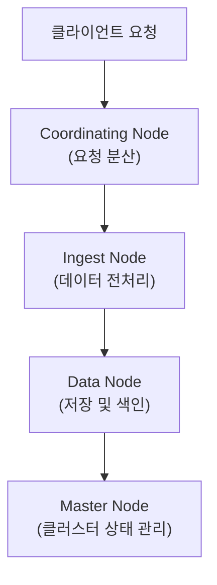
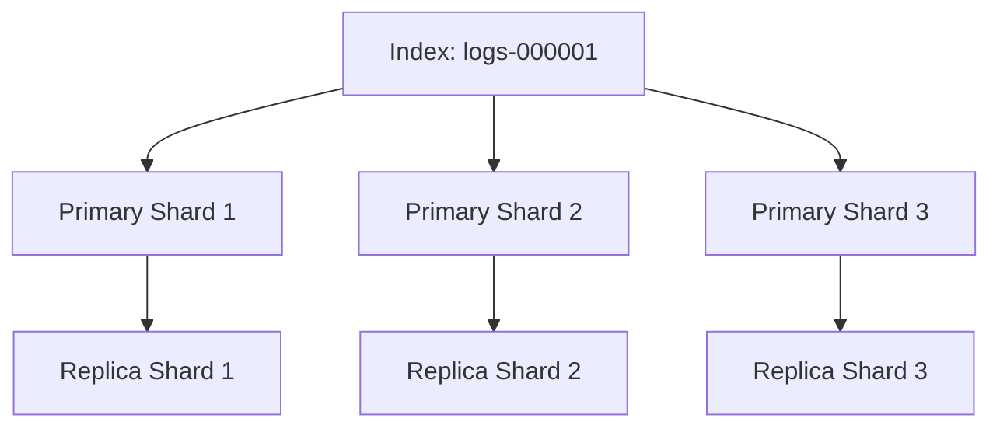
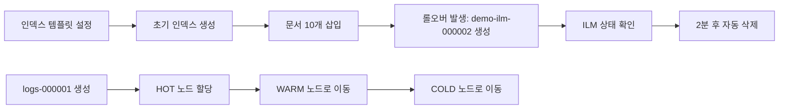

# Elasticsearch 아키텍쳐와 데이터 처리

```bash
[Abstract]
이 정리본은 Elasticsearch의 핵심 개념과 구조, 운영 방식, 최적화 전략, 인덱스 생명주기 관리(ILM)까지의 전 범위를 아우르며, 분산형 검색 엔진에 대한 체계적인 이해를 돕기 위해 구성되었다. 클러스터와 노드, 샤드와 복제 구조 같은 핵심 인프라 개념부터, 실제 운영에서 빈번히 다루는 설정 파일 구성, 리소스 분산 전략, 데이터 자동화 관리 기법까지 단계적으로 설명함으로써 학습자가 전체 흐름을 논리적으로 따라갈 수 있도록 설계되었다.

이 정리본은 특히 Elasticsearch를 처음 접하는 비전공자도 실무 관점에서 그 원리를 정확히 이해하고 응용할 수 있도록 돕는 데 목적이 있다. 모든 내용을 기술 서술 방식으로 풀어내되, 주요 개념과 오해 지점에 대한 설명, 예제와 설정 코드, 시각적 흐름 도식 등을 통해 실질적인 학습 효과를 높였다. 따라서 이 정리본은 대용량 검색 시스템에 대한 실질적인 이해를 기초부터 쌓고자 하는 초중급 학습자에게 유용한 가이드가 될 것이다.
```

📘 1\. Elasticsearch 기본 구조 이해
=============================

1.1 Elasticsearch란 무엇인가?
------------------------

**Elasticsearch**는 대용량의 구조적 및 비구조적 데이터를 실시간으로 저장하고 검색할 수 있는 분산형 검색 엔진이다. 본래는 Apache Lucene 기반으로 개발되었으며, JSON 형식의 문서를 색인(Indexing)하고, 다양한 조건으로 고속 검색(Search)을 수행할 수 있다는 특징을 갖는다.

> ✅ 주요 특징:
> 
> *   분산 처리(distributed computing)
>     
> *   실시간 검색(real-time search)
>     
> *   RESTful API 기반 데이터 처리
>     
> *   NoSQL 기반의 문서 저장(Document-oriented DB)
>     

예를 들어, 인터넷 쇼핑몰에서 수천만 개의 상품 정보를 사용자가 검색할 수 있도록 구현할 때, MySQL보다 Elasticsearch를 사용하는 것이 검색 속도나 확장성 측면에서 효율적이다.

<br>

1.2 클러스터와 노드 개념
---------------

### 클러스터(Cluster)

클러스터는 \*\*여러 개의 노드(Node)\*\*로 구성된 Elasticsearch 전체 시스템 단위를 의미한다. 데이터의 **저장, 분산, 검색, 색인 등의 작업을 여러 노드에 나누어 처리**하기 때문에 수평적 확장이 가능하다.

*   예시: `3대의 서버`가 연결되어 하나의 Elasticsearch 클러스터를 구성하면, 이 클러스터는 전체적으로 하나의 거대한 데이터 저장소처럼 동작한다.
    

### 노드(Node)

노드는 Elasticsearch가 설치되어 실행 중인 **단일 인스턴스**이며, 클러스터 내에서 역할을 나누어 담당한다. 노드는 기본적으로 클러스터에 자동으로 연결되며, 다음과 같은 유형으로 나뉜다.

#### 마스터 노드(Master Node)

*   클러스터 상태 및 메타데이터를 관리
    
*   샤드 할당, 노드 모니터링, 인덱스 생성 등의 **관리 작업**을 담당
    
*   일반적으로 최소 3개 이상의 마스터 후보 노드를 구성하여 **고가용성(HA)** 확보
    

> 💡 마스터 노드가 다운될 경우, 자동으로 다른 후보 노드 중 하나가 새롭게 선출된다.

#### 데이터 노드(Data Node)

*   색인 생성 및 검색 요청 처리
    
*   데이터를 **실제로 저장하고 분석**하는 역할
    
*   고성능 CPU와 많은 메모리가 요구됨
    

> ⚠ 데이터 노드는 물리적으로 많은 자원이 필요하므로, 별도로 운영하는 것이 일반적이다.

#### 인제스트 노드(Ingest Node)

*   외부로부터 유입된 데이터를 Elasticsearch에 저장하기 전에 **전처리(Pre-processing)** 수행
    
*   로그에서 특정 필드 추출, 포맷 변환, 정규식 처리 등의 역할
    

> 예: 로그 파일의 날짜를 “yyyy/MM/dd” 형식으로 통일하거나, IP 주소에서 국가 정보를 추가하는 등의 작업

#### 코디네이팅 노드(Coordinating Node)

*   클라이언트 요청을 받아서 내부 노드에 **적절히 라우팅**해주는 역할
    
*   검색 쿼리를 여러 노드로 나누어 분산 처리한 후, **결과를 통합하여 반환**
    

> 🌐 일반적으로 모든 노드는 기본적으로 Coordinating 역할을 수행하지만, 대규모 클러스터에서는 이 역할만 수행하는 전용 노드를 두는 것이 좋다.

<br>

1.3 노드 역할 흐름 요약
---------------



위 흐름은 실제 데이터가 저장되는 과정의 추상적인 표현이다. 사용자가 데이터를 전송하면, Coordinating Node가 이를 받아 Ingest Node에서 전처리하고, Data Node에 색인하며, 이 모든 흐름은 Master Node가 관리한다.

<br>
<br>

📘 2\. 데이터 저장 방식과 고가용성 설계
=========================

2.1 샤드(Shard) 구조 이해
-------------------

Elasticsearch는 대규모 데이터를 효과적으로 저장하고 빠르게 검색하기 위해 **샤딩(Sharding)** 기법을 사용한다. 이는 하나의 인덱스를 여러 개의 \*\*샤드(shard)\*\*라는 단위로 나누어 저장함으로써 **병렬 처리**를 가능하게 한다.

> 📦 **인덱스(Index)**: 데이터가 저장되는 논리적 공간 (RDB에서 테이블에 해당)  
> 📦 **샤드(Shard)**: 인덱스를 나눈 물리적 단위로, 하나의 샤드는 내부적으로 Lucene 인스턴스이다.

### Primary Shard

*   데이터를 최초로 저장하는 **기본 샤드**
    
*   모든 문서는 하나의 primary shard에 저장되며, 이후 필요에 따라 복제(replica)됨
    
*   인덱스 생성 시 설정한 **primary shard 개수는 변경 불가능**
    

```python
# 인덱스 생성 시 샤드 수 지정 예시
PUT /my-index
{
  "settings": {
    "number_of_shards": 3,
    "number_of_replicas": 1
  }
}
```

### Replica Shard

*   Primary Shard를 복제한 샤드
    
*   **고가용성 확보** 및 **검색 속도 향상**을 위한 용도
    
*   Primary Shard가 장애 발생 시 자동으로 Replica가 승격됨
    

> ✅ Replica는 같은 노드에 Primary Shard와 함께 존재할 수 없다. 따라서 최소 2개 이상의 노드가 있어야 복제가 활성화된다.



<br>

2.2 샤드 복제(Replication)
----------------------

Replication은 데이터의 **중복 저장**을 통해 장애 상황에서도 서비스를 지속할 수 있도록 보장하는 핵심 메커니즘이다.

### 동작 방식

*   Primary Shard에 데이터가 저장되면, 설정된 수의 Replica Shard에 **비동기적으로 복제**
    
*   Replica는 읽기 요청 처리에 사용될 수 있으나, 쓰기 작업은 항상 Primary에서 처리
    

### 장점

*   ✅ **고가용성**: Primary Shard 손상 시 자동으로 Replica가 대체
    
*   ✅ **검색 부하 분산**: 동일한 쿼리를 여러 샤드에 분산하여 처리
    
*   ✅ **복구 용이성**: 장애 발생 시 빠른 복원 가능
    

### 고려사항

*   노드 수: Replica는 Primary와 다른 노드에 위치해야 함
    
*   저장소/네트워크: 복제는 추가적인 리소스 소모가 수반됨
    
*   성능 트레이드오프: 쓰기 성능은 약간 감소하지만, 읽기 성능은 향상
    

<br>

2.3 클러스터 안정성 요소
---------------

Elasticsearch는 분산 시스템 특성상 클러스터 내부 상태를 추적하고 복원하는 여러 메커니즘을 제공한다.

### Routing Table

*   각 문서가 어떤 샤드에 위치하는지를 관리
    
*   문서의 ID를 기반으로 **해시(Hash)** 계산 후 샤드에 할당
    

> 💡 라우팅 알고리즘은 ID를 기준으로 샤드를 결정하므로, 동일한 ID는 항상 같은 샤드에 저장된다.

### Gateway

*   클러스터가 재시작될 경우 필요한 메타데이터와 상태를 보존하는 역할
    
*   Index/Shard의 설정과 위치 정보가 저장됨
    

> 🚀 Elasticsearch 7.x 이후부터는 파일 시스템 기반 Gateway를 기본으로 사용

### Discovery Module

*   클러스터의 초기 노드들을 **자동으로 탐색**하고 연결
    
*   마스터 노드 선출과 샤드 재배치 등에서 중요한 역할
    

<br>
<br>

📘 3\. 클러스터 운영과 설정 관리
=====================

3.1 설정 방식: 정적 vs 동적
-------------------

Elasticsearch는 설정 항목을 크게 **정적 설정(static)** 과 **동적 설정(dynamic)** 으로 구분한다.  
이는 설정을 **클러스터 실행 전에 구성해야 하는가, 실행 중 변경 가능한가**에 따라 나뉜다.

### 정적 제어

*   클러스터가 실행되기 전에만 설정 가능한 항목
    
*   주로 `elasticsearch.yml` 또는 Docker Compose 환경에서 설정
    
*   대표 항목:
    
    *   `cluster.name`, `node.name`
        
    *   `path.data`, `path.logs`
        
    *   `network.host`, `discovery.seed_hosts`
        

```yaml
# elasticsearch.yml 예시
cluster.name: my-cluster
node.name: node-1
path.data: /var/lib/elasticsearch
network.host: 0.0.0.0
```

> 🔁 정적 설정을 변경하려면 클러스터를 재시작해야 한다.

### 동적 제어

*   실행 중인 클러스터에 REST API를 통해 적용 가능
    
*   운영 환경에서 실시간 조정이 가능하여 **유연성** 확보에 유리
    
*   대표 항목:
    
    *   인덱스 레벨의 설정 (refresh interval, replicas 수 등)
        
    *   클러스터 수준 설정 (`cluster.routing.allocation.enable` 등)
        

```bash
# 예: 인덱스 복제본 수 변경
PUT /my-index/_settings
{
  "index": {
    "number_of_replicas": 2
  }
}
```

<br>

3.2 핵심 설정 항목
------------

### 데이터 저장 경로 설정 (`path.data`)

*   Elasticsearch가 데이터를 저장하는 **디렉토리 경로** 지정
    
*   기본값은 `/var/lib/elasticsearch`이지만, 성능이나 보안 목적에 따라 사용자 지정 가능
    

### 네트워크 설정 (`network.host`)

*   외부 클라이언트와 통신할 수 있도록 **호스트 주소**를 지정
    
*   `localhost`로 설정하면 외부에서 접근 불가 → 개발용
    
*   `0.0.0.0`으로 설정 시 모든 IP에서 접근 허용 → 운영 환경
    

### Discovery 설정 (`discovery.seed_hosts`, `initial_master_nodes`)

*   클러스터 내 다른 노드를 탐색(discovery)하는 데 사용
    
*   최초 클러스터 구성 시 최소 하나 이상의 마스터 후보 노드를 지정
    

```yaml
discovery.seed_hosts: ["192.168.1.10", "192.168.1.11"]
cluster.initial_master_nodes: ["node-1", "node-2"]
```

### Heap Size 설정

*   JVM 기반 시스템인 Elasticsearch에서는 **Heap Memory** 설정이 중요
    
*   설정 항목: `Xms`, `Xmx`
    
    *   `Xms`: 최소 힙 크기
        
    *   `Xmx`: 최대 힙 크기
        
*   두 값을 **동일하게 설정**해야 메모리 조정 비용을 줄일 수 있음
    

> 🚨 권장 최대값은 32GB (그 이상은 Compressed OOPs가 비활성화되어 성능 저하)

```bash
# jvm.options 파일에서 설정
-Xms4g
-Xmx4g
```

<br>

3.3 마스터 노드 구성 및 선출
------------------

### 마스터 후보 노드 구성

*   설정 파일(`elasticsearch.yml`)에서 지정
    
*   `cluster.initial_master_nodes`에 최소 3개 이상의 노드를 포함시키는 것이 이상적
    
*   **Quorum(과반수) 기반** 선출 원리로, 안정적인 선출을 위해 반드시 홀수 노드 수를 유지해야 함
    

### 마스터 노드 자동 선출

*   클러스터 실행 시, 후보 노드들 중 자동으로 마스터가 선택됨
    
*   마스터 노드에 장애가 발생할 경우, 후보 중 다른 노드가 선출
    

### Voting-only 노드

*   마스터 선출에는 참여하지만, 실제 마스터 역할은 하지 않음
    
*   **마스터 선출 과정의 안정성 보강**용
    

```yaml
node.roles: [voting_only]
```

> 🧠 실무에서는 마스터 노드를 전용 머신으로 분리하여 안정성을 확보하는 것이 일반적이다.

<br>
<br>

📘 4\. 클러스터 자원 최적화 전략
=====================

4.1 샤드 할당 및 리밸런싱
----------------

Elasticsearch에서는 데이터를 **샤드 단위로 분산**하여 저장하기 때문에, 각 샤드가 클러스터 내 노드에 **어떻게 분배되느냐**가 성능과 안정성에 큰 영향을 미친다.

### 샤드 할당(Shard Allocation)

*   클러스터가 새롭게 형성되거나, 인덱스가 생성될 때 **마스터 노드가 샤드를 각 노드에 자동 배정**한다.
    
*   이때 노드의 리소스 사용량, 데이터 중복 여부, 사용자 지정 규칙 등을 고려한다.
    

```json
# 샤드 자동 할당 제어 예시 (동적 설정)
PUT _cluster/settings
{
  "transient": {
    "cluster.routing.allocation.enable": "all"
  }
}
```

*   설정 값:
    
    *   `"all"`: 색인과 검색 모두 허용 (기본값)
        
    *   `"primaries"`: primary shard만 할당
        
    *   `"none"`: 샤드 할당 중단 (장애 시 수동 제어에 사용)
        

### 샤드 리밸런싱(Rebalancing)

*   클러스터 내 특정 노드에 샤드가 **불균형하게 몰릴 경우**, Elasticsearch는 자동으로 샤드를 재분배하여 **로드 밸런싱**을 수행한다.
    
*   디스크 공간이 부족하거나 노드 간 부하가 극심할 경우 효과적이다.
    

> 🧠 샤드 재배치는 순간적인 I/O 부담이 크므로, 운영 중에는 신중히 제어해야 한다.

<br>

4.2 데이터 티어링 전략 (Data Tiering)
-----------------------------

**데이터 티어링**은 데이터의 성격과 접근 빈도에 따라, 서로 다른 역할의 노드에 **계층적으로 저장**하는 전략이다.  
Elasticsearch는 다음과 같은 4가지 티어(Tier)를 기본 제공한다.

| 티어 | 설명 | 예시 |
| --- | --- | --- |
| **Hot** | 최신 데이터, 빈번한 검색·색인 대상 | 최근 1주일치 로그 |
| **Warm** | 자주 검색되지는 않지만 저장이 필요한 데이터 | 지난달 제품 판매 내역 |
| **Cold** | 거의 검색되지 않는 장기 보관 데이터 | 6개월 전 서버 로그 |
| **Frozen** | 읽기만 가능한 상태로, 최소 자원 사용 | 백업된 이력 데이터 |

### 활용 목적

*   💰 **비용 절감**: 자주 사용되지 않는 데이터를 저사양 노드로 이전
    
*   ⚙️ **성능 최적화**: 빠른 검색이 필요한 데이터만 고성능 노드에 유지
    
*   🔁 **자동화**: ILM과 연계하여 자동 이동 설정 가능
    

### 노드 역할 설정

```yaml
# elasticsearch.yml
node.roles: [data_hot, data_warm, data_cold, data_frozen]
```

### 데이터 할당 규칙 설정 예시

```json
PUT my-index/_settings
{
  "settings": {
    "index.routing.allocation.require._tier": "data_hot"
  }
}
```

> 위 예시는 `my-index`가 오직 `Hot` 티어 노드에만 저장되도록 강제하는 설정이다.

<br>

4.3 인덱스 레벨 티어링 및 데이터 이동
-----------------------

데이터 티어링은 단순히 저장만 분리하는 것이 아니라, **시간 또는 조건에 따라 자동으로 티어를 전환**하는 기능도 지원한다.

### 예시: 조건 기반 티어 이동 정책

```json
PUT _ilm/policy/logs_policy
{
  "policy": {
    "phases": {
      "hot": {
        "actions": {
          "rollover": {
            "max_size": "50gb",
            "max_age": "7d"
          }
        }
      },
      "warm": {
        "actions": {
          "allocate": {
            "require": {
              "data": "warm"
            }
          },
          "shrink": {
            "number_of_shards": 1
          }
        }
      }
    }
  }
}
```

> 🔁 위 정책은 50GB 혹은 7일이 지난 로그 데이터를 Hot에서 Warm 티어로 자동 이동시키고, 샤드 수도 줄여 디스크 사용량을 최소화한다.

<br>
<br>

📘 5\. 인덱스 생명주기 관리 (ILM)
========================

5.1 ILM의 필요성과 목적
----------------

Elasticsearch는 수많은 인덱스를 저장하고 검색할 수 있지만, 데이터가 시간이 지남에 따라 **누적되고 불필요하게 많은 리소스를 소모**하게 된다.  
이를 방지하고 클러스터의 안정성과 비용 효율성을 유지하기 위해, **ILM(인덱스 생명주기 관리)** 기능을 사용한다.

> ✅ ILM이란?  
> 데이터의 나이, 크기, 사용 빈도 등에 따라 **자동으로 인덱스를 생성, 이동, 삭제**하는 정책 기반 시스템이다.

### ILM의 핵심 목적

*   📉 디스크 사용량 최적화
    
*   ⚙️ 자동화된 인덱스 운영
    
*   💰 비용 절감 (티어링과 연계)
    
*   🛠️ 운영자 개입 최소화 (DevOps/관제 부담 완화)
    

<br>

5.2 ILM 핵심 구성 요소
----------------

ILM은 다음과 같은 요소들로 구성되며, 이들은 서로 연동되어 자동화된 데이터 흐름을 구성한다.

### Index Template

*   동일한 속성을 갖는 여러 인덱스에 대해 **공통된 설정과 매핑을 적용**하기 위한 템플릿
    
*   인덱스명 패턴에 따라 자동 적용
    

```json
PUT _index_template/logs_template
{
  "index_patterns": ["logs-*"],
  "template": {
    "settings": {
      "number_of_shards": 1,
      "lifecycle.name": "logs_policy"
    }
  }
}
```

> 위 예시는 logs-로 시작하는 인덱스에 자동으로 `logs_policy` ILM 정책을 적용한다.

<br>

### Alias

*   실제 인덱스명을 외부에 직접 노출하지 않고, **논리적 별칭으로 접근**할 수 있도록 해주는 기능
    
*   **Rollover(롤오버)** 기능과 함께 자주 사용된다.
    

```json
POST /_aliases
{
  "actions": [
    { "add": { "index": "logs-000001", "alias": "logs_write", "is_write_index": true }}
  ]
}
```

> `logs_write`라는 alias를 통해, 실제 인덱스 이름이 변경되더라도 클라이언트 코드는 수정 없이 유지 가능하다.

<br>

### Rollover

*   인덱스가 일정 용량 이상 커지거나, 일정 기간 이상 유지되었을 경우 **새로운 인덱스를 자동 생성**하고, alias를 새 인덱스로 이동
    
*   이를 통해 **검색 성능 저하 방지, 데이터 분산 최적화**가 가능
    

```json
POST /logs_write/_rollover
{
  "conditions": {
    "max_age": "7d",
    "max_docs": 1000000
  }
}
```

> 위 설정은 logs\_write alias가 가리키는 인덱스가 7일이 넘었거나 문서 수가 100만 건을 초과하면 자동으로 새 인덱스를 생성한다.


<br>

5.3 ILM 단계 구성
-------------

ILM 정책은 데이터를 단계적으로 관리하는 **Life Cycle Phase 모델**에 기반하여 구성된다.

| 단계(Phase) | 주요 목적 | 수행 작업 예 |
| --- | --- | --- |
| Hot | 자주 쓰고 읽는 최신 데이터 | 색인, 롤오버 |
| Warm | 읽기만 하지만 여전히 유용한 데이터 | 샤드 병합, 노드 이동 |
| Cold | 거의 접근하지 않는 장기 보관 데이터 | 읽기 전용, 압축 |
| Delete | 더 이상 필요 없는 데이터 | 인덱스 삭제 |


### ILM 단계 예시 구성

```json
PUT _ilm/policy/logs_policy
{
  "policy": {
    "phases": {
      "hot": {
        "actions": {
          "rollover": {
            "max_age": "7d",
            "max_size": "50gb"
          }
        }
      },
      "warm": {
        "actions": {
          "allocate": {
            "require": {
              "data": "warm"
            }
          }
        }
      },
      "cold": {
        "min_age": "30d",
        "actions": {
          "allocate": {
            "require": {
              "data": "cold"
            }
          }
        }
      },
      "delete": {
        "min_age": "90d",
        "actions": {
          "delete": {}
        }
      }
    }
  }
}
```

> 위 정책은 인덱스가 생성된 후 7일이 지나면 warm 티어로, 30일 후에는 cold 티어로 이동하며, 90일 후에는 삭제된다.

<br>

✅ 요약 및 학습 포인트
-------------

*   ILM은 **시간에 따른 인덱스 관리**를 자동화하여, **성능 유지와 리소스 절약**에 필수적이다.
    
*   Index Template과 Alias를 함께 사용하면 **유지 보수성이 뛰어난 인덱스 구조**를 설계할 수 있다.
    
*   ILM은 **Data Tiering**과 매우 밀접하게 연동되므로, 함께 학습하는 것이 중요하다.
    
<br>
<br>

📘 실습 기반 개념 정리 및 코드 해설
----------------------

### ✅ \[1\] Elasticsearch 클라이언트 연결

```python
from elasticsearch import Elasticsearch
es = Elasticsearch("http://localhost:9200")
```

*   Elasticsearch에 연결할 클라이언트를 생성한다.
    
*   `localhost:9200`은 기본 포트로, 로컬에서 실행되는 인스턴스를 의미한다.
    

<br>

### ✅ \[2\] ILM 상태 감지 주기 단축

```python
es.cluster.put_settings(body={
    "persistent": {
        "indices.lifecycle.poll_interval": "10s"
    }
})
```

*   Elasticsearch는 ILM 상태를 주기적으로 점검한다.
    
*   기본 주기는 1분 이상일 수 있으므로, 테스트를 빠르게 진행하기 위해 **10초마다 상태 체크**로 조정한다.
    

<br>

### ✅ \[3\] 기존 인덱스/템플릿 정리

```python
indices = es.indices.get(index="demo-ilm-*")
for idx in indices:
    es.indices.delete(index=idx)
```

*   이전에 생성된 `demo-ilm-*` 패턴의 인덱스를 삭제하여 **초기화 상태**로 만든다.
    

```python
es.indices.delete_index_template(name="demo-ilm-template")
```

*   관련 템플릿도 함께 제거하여, 동일한 이름으로 새로 생성 가능하도록 정리한다.
    

<br>

### ✅ \[4\] ILM 정책 생성

```python
es.ilm.put_lifecycle(name="simple-ilm-policy", body={ ... })
```

*   **hot → delete** 단계만 포함된 매우 간단한 ILM 정책을 생성한다.
    

```json
"rollover": { "max_docs": 5 }
```

*   5개 문서가 삽입되면 자동으로 **롤오버**가 발생해 새 인덱스를 생성한다.
    

```json
"min_age": "2m"
```

*   인덱스가 생성된 후 2분이 지나면 삭제된다.
    

<br>

### ✅ \[5\] Index Template 생성

```python
es.indices.put_index_template(name="demo-ilm-template", body={ ... })
```

*   인덱스 이름이 `"demo-ilm-*"` 패턴을 따를 경우, 위에서 만든 ILM 정책과 연결된다.
    
*   `rollover_alias`는 인덱스가 롤오버 될 때 연결될 alias 이름이다.
    

<br>

### ✅ \[6\] 초기 인덱스 생성

```python
es.indices.create(index="demo-ilm-000001", body={ ... })
```

*   최초 인덱스를 수동 생성한다. 이 인덱스는 `demo-ilm-write` alias를 통해 **쓰기 전용(write index)** 으로 설정된다.
    

<br>

### ✅ \[7\] 문서 삽입 및 자동 롤오버

```python
for i in range(10):
    es.index(index="demo-ilm-write", document={"msg": f"test-{i}"})
```

*   10개의 문서를 삽입하면 `max_docs: 5` 조건에 의해 롤오버가 발생하고, `demo-ilm-000002` 인덱스가 생성된다.
    

<br>

### ✅ \[8\] ILM 상태 확인

```python
resp = es.ilm.explain_lifecycle(index="demo-ilm-000001")
```

*   인덱스가 현재 어떤 단계(예: hot, delete)에 있는지, 몇 분이 경과했는지 등을 확인한다.
    

<br>

### ✅ \[9\] Alias가 가리키는 인덱스 목록 확인

```python
es.indices.get_alias(name="demo-ilm-write")
```

*   `demo-ilm-write` alias가 현재 어떤 인덱스를 가리키는지 확인한다.
    
*   롤오버 이후에는 `demo-ilm-000002`가 **쓰기 대상**, `demo-ilm-000001`은 **읽기 전용**이 된다.
    

<br>

📘 데이터 티어링 테스트 코드 해설
--------------------

이후 코드는 `_tier_preference`를 이용해 인덱스를 특정 티어(HOT → WARM → COLD) 노드로 이동하는 시나리오를 실습하는 예제다.

```python
es.indices.create(index=index_name, body={
    "settings": {
        "index.routing.allocation.include._tier_preference": "data_hot"
    }
})
```

*   `logs-000001` 인덱스를 생성하면서 **Hot Tier에 저장**되도록 지정
    

이후 1분 간격으로 설정 변경:

```python
es.indices.put_settings(... _tier_preference = "data_warm")
```

*   Warm Tier로 이동
    

```python
es.indices.put_settings(... _tier_preference = "data_cold")
```

*   Cold Tier로 최종 이동
    

```python
es.cat.shards(index=index_name, format="text")
```

*   각 시점에서 해당 인덱스가 어떤 노드에 위치해 있는지 출력하여 **물리적 재배치 확인**
    

<br>

✅ 시각 흐름 요약
----------


