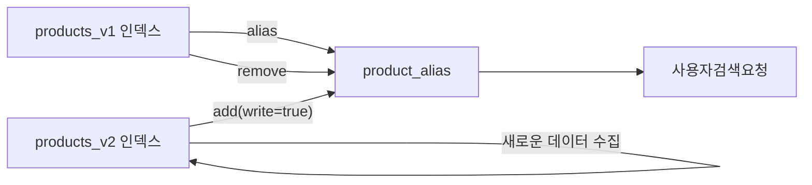
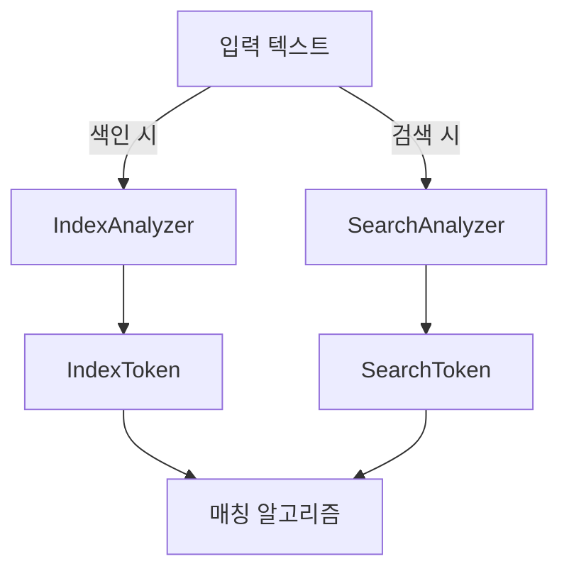
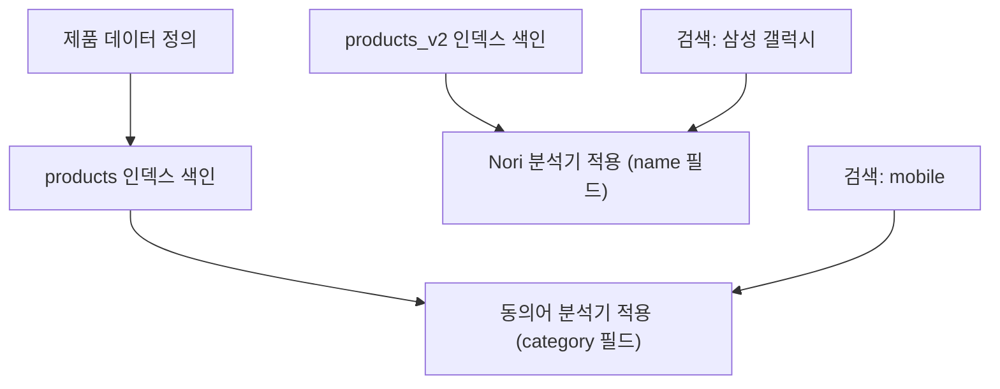

# Elasticsearch Analyzer & Mapping

>**📄 Abstract**      
>이 정리본은 Elasticsearch의 핵심 개념과 실무 적용 방식을 체계적으로 학습하고자 하는 비전공자 학습자를 위해 구성되었다. 문서 기반 데이터 모델의 이해부터 색인 구조(Inverted Index), 필드 매핑 설계, 다양한 문자열 필드 타입, 분석기(Analyzer) 구조와 동작 원리, 한국어 형태소 분석기(Nori), 그리고 동의어 및 불용어 처리 기법까지 단계적으로 설명함으로써, 검색 엔진의 내부 작동 원리를 명확히 파악할 수 있도록 돕는다.   
>또한, 전통적인 관계형 데이터베이스(RDB)와의 구조적 차이를 설명하고, Logstash를 통한 ETL 구성 및 실시간 동기화 전략까지 포함하여 Elasticsearch를 기존 시스템에 통합하는 실제 흐름을 제시하였다. 이 정리본은 검색 품질 향상, 데이터 구조 설계, 마이그레이션 전략에 이르기까지 폭넓은 주제를 포괄하며, 비전공자도 개념을 정확히 이해하고 실무 적용 가능성을 높이는 데 실질적인 도움을 준다.     

<br>

📘 1\. Elasticsearch와 데이터 구조 이해
===============================

1-1\. Elasticsearch 개요
----------------------

**Elasticsearch**는 Apache Lucene 기반의 분산형 검색 및 분석 엔진으로, 구조화되지 않은 비정형 데이터를 빠르게 색인하고 검색할 수 있도록 설계되었다. 로그 분석, 실시간 검색, 추천 시스템, 대시보드 구축 등 다양한 응용 분야에서 활용되며, 대표적인 NoSQL 계열의 검색 기반 데이터베이스로 분류된다.

### 관계형 데이터베이스(RDB)와의 주요 차이점

| 항목        | RDB                             | Elasticsearch                     |
| ----------- | ------------------------------- | --------------------------------- |
| 데이터 모델 | 테이블-행 기반                  | 문서 기반 (JSON 형식)             |
| 스키마      | 엄격하게 정의된 정규형 구조     | 유연한 스키마 (semi-structured)   |
| 검색        | SQL 기반의 정형 쿼리            | Full-text 기반 검색 (역색인 구조) |
| 확장성      | Scale-up 중심 (수직 확장)       | Scale-out 중심 (수평 확장)        |
| 사용 사례   | 트랜잭션 처리, 정형 데이터 저장 | 로그 분석, 문서 검색, 실시간 집계 |

Elasticsearch는 특히 비정형 데이터와 텍스트 중심의 대규모 데이터를 처리하는 데 적합하며, 대용량 데이터를 분산 노드 간에 자동으로 분할(shard)하여 저장하고 병렬 검색을 수행함으로써 고성능을 유지한다.

<br>

1-2\. Mapping과 필드 타입
--------------------

### 1-2-1\. Mapping이란?

Mapping은 Elasticsearch에서 각 문서(Document)의 필드(Field)에 대해 자료형(type)과 속성(property)을 정의하는 설정 정보이다. 이는 관계형 데이터베이스의 스키마(schema)와 유사한 개념으로, 색인된 데이터의 검색 성능과 처리 효율에 결정적인 영향을 미친다.

예를 들어 다음 JSON 문서가 있다고 가정하자:

```json
{
  "name": "홍길동",
  "age": 29,
  "join_date": "2023-01-01"
}
```

이때 `name`은 문자열(string), `age`는 정수(integer), `join_date`는 날짜(date)로 매핑되어야 한다. 적절한 Mapping이 없다면 Elasticsearch는 데이터 타입을 자동으로 추정(Dynamic Mapping)하게 되며, 이는 종종 예상치 못한 동작을 초래할 수 있다.

<br>

### 1-2-2\. 동적 매핑 (Dynamic Mapping)

Elasticsearch는 기본적으로 동적 매핑을 활성화하여, 미리 정의되지 않은 필드에 대해 자동으로 데이터 타입을 추정하여 Mapping을 생성한다. 예를 들어, 새로운 문서에서 `"age": 30`이라는 값이 들어오면 Elasticsearch는 이를 `integer`로 자동 설정한다.

**장점**

*   개발 초기 단계에서 빠른 적용 가능
    
*   유연한 스키마 구조 지원
    

**단점**

*   잘못된 타입 자동 할당 가능 (예: `"00123"`을 숫자로 인식하지 못하고 문자열 처리)
    
*   대량의 예외 필드 생성으로 클러스터 오염 가능
    

이러한 이유로, 실무에서는 동적 매핑보다 정적 매핑(static mapping)을 권장한다.

<br>

### 1-2-3\. 정적 매핑 (Static Mapping)

정적 매핑은 인덱스 생성 시점에 명시적으로 각 필드의 타입을 정의하는 방식이다. 사전에 명확하게 구조를 정의함으로써 잘못된 타입 추정이나 예외적인 필드 생성을 방지할 수 있다.

```json
PUT /user_index
{
  "mappings": {
    "properties": {
      "name": { "type": "text" },
      "age": { "type": "integer" },
      "join_date": { "type": "date" }
    }
  }
}
```

**주의사항:** 정적 매핑은 한 번 설정되면 이후 변경이 제한적이다. 특히 기존 필드의 타입을 변경하려면 인덱스를 재생성해야 하므로, 초기에 매핑 설계를 신중히 진행해야 한다.

<br>

### 1-2-4\. dynamic 파라미터 설정

`dynamic` 파라미터는 매핑에서 필드가 자동으로 생성되는 방식을 제어한다.

| 설정값          | 설명                                        |
| --------------- | ------------------------------------------- |
| `true` (기본값) | 새 필드를 자동으로 매핑                     |
| `false`         | 새 필드 무시 (색인되지 않음)                |
| `"strict"`      | 새 필드가 들어오면 오류 발생                |
| `"runtime"`     | 런타임에만 존재하며, 디스크에 저장되지 않음 |

예제:

```json
PUT /example_index
{
  "mappings": {
    "dynamic": "strict",
    "properties": {
      "title": { "type": "text" }
    }
  }
}
```

위 설정에서 `title` 외의 필드가 들어오면 색인 자체가 실패한다.

<br>

1-2-5\. 필드 데이터 타입 분류
--------------------

Elasticsearch는 다양한 데이터 타입을 지원하며, 이를 올바르게 선택하고 매핑하는 것이 성능 및 검색 정확도에 큰 영향을 미친다. 대표적으로 다음과 같은 범주로 분류된다.

### ① 일반 데이터 타입

*   **text**: 전문(full-text) 검색을 위한 문자열
    
*   **keyword**: 정렬, 집계, 필터링용 문자열
    
*   **numeric**: `integer`, `long`, `float`, `double` 등
    
*   **date**: ISO 형식 혹은 사용자 지정 포맷의 날짜
    
*   **boolean**: `true`, `false` 값
    

### ② 계층형 데이터 타입

*   **object**: JSON 객체로 저장
    
*   **nested**: 객체 내부의 배열을 독립 문서처럼 인덱싱
    

### ③ 지리 정보 데이터 타입

*   **geo\_point**: 위도/경도 좌표값 저장
    
*   **geo\_shape**: 다각형, 선분 등 복잡한 지리 공간 객체 표현
    

<br>

1-2-6\. 문자열 데이터 타입 상세 비교
------------------------

문자열은 Elasticsearch에서 가장 민감하게 처리해야 할 데이터 타입이다. 같은 문자열이라도 `text`와 `keyword`는 완전히 다른 용도와 동작 방식을 가진다.

### ✅ Text 필드 타입

*   색인 시, 내부적으로 분석기(analyzer)를 사용하여 토큰(token) 단위로 분해
    
*   \*\*전문 검색(full-text search)\*\*에 최적화됨
    
*   공백·대소문자·어미 분리 등의 처리를 통해 다양한 검색 가능
    
*   부분 일치, 유사 검색 등에 강함
    
*   **단점**: 정확한 일치 검색, 정렬, 집계에는 적합하지 않음
    

```json
PUT /example_index
{
  "mappings": {
    "properties": {
      "description": { "type": "text" }
    }
  }
}
```

이 경우 `"Elasticsearch is great"`이라는 문장은 `[ "elasticsearch", "is", "great" ]` 세 개의 토큰으로 분리되어 색인된다. `is` 하나만 검색해도 이 문서는 검색 결과로 노출된다.

<br>

### ✅ Keyword 필드 타입

*   분석기를 거치지 않고 **원문 그대로 저장**
    
*   **정확한 일치 검색**, **정렬**, **집계** 등에 적합
    
*   대소문자 및 공백 모두 구분
    
*   기본적으로 `doc_values`가 활성화되어 디스크 기반으로 작동 → 집계 성능이 우수함
    

```json
PUT /example_index
{
  "mappings": {
    "properties": {
      "user_id": { "type": "keyword" }
    }
  }
}
```

`"user_id": "kim01"`로 색인된 경우, `"kim"`이나 `"01"`로는 검색되지 않으며 `"kim01"` 전체 일치만 검색된다.

<br>

### 🔍 Text vs Keyword 요약 비교

| 항목        | `text`                | `keyword`                 |
| ----------- | --------------------- | ------------------------- |
| 분석기 사용 | O (토큰화)            | X                         |
| 검색 방식   | 부분 일치 / 유사 검색 | 정확한 일치               |
| 집계/정렬   | 불가능하거나 부적합   | 가능                      |
| 사용 예시   | 상품 설명, 뉴스 본문  | 사용자 ID, 태그, 카테고리 |

<br>

1-2-7\. 특수 문자열 필드 타입
--------------------

이제 기본적인 `text`, `keyword` 외에도 Elasticsearch가 제공하는 특수 문자열 필드 타입을 정리한다.

### 📌 match\_only\_text

*   `text` 타입과 유사하나, **검색 점수 계산(score)을 하지 않음**
    
*   `keyword`와 함께 구성할 필요 없이 로그 등 대량 텍스트 색인에 적합
    
*   **집계/정렬이 불필요한 경우에 사용**
    

```json
{ "type": "match_only_text" }
```


### 📌 search\_as\_you\_type

*   **자동 완성(autocomplete)** 검색 기능을 위해 사용
    
*   내부적으로 `edge_ngram`을 생성하여 전방(partial) 검색을 지원
    

예: `"elasticsearch"` → `"e"`, `"el"`, `"ela"` 등 자동 생성

```json
PUT /example_index
{
  "mappings": {
    "properties": {
      "title": {
        "type": "search_as_you_type"
      }
    }
  }
}
```


### 📌 wildcard

*   **패턴 기반 검색 (와일드카드, 정규표현식 등)** 을 위한 필드 타입
    
*   내부적으로 n-gram을 사용하여 전체 문자열을 색인함
    
*   **성능이 느리며**, 로그나 비정형 텍스트 등에서 제한적으로 사용
    

```json
{ "type": "wildcard" }
```


### 📌 constant\_keyword

*   **한 인덱스 내에서 값이 항상 고정된 필드에 적합**
    
*   색인 성능 최적화 및 저장 용량 감소
    
*   **값 변경이 불가능하며**, 주로 필터링 조건으로만 사용
    

```json
PUT /my_index
{
  "mappings": {
    "properties": {
      "type": {
        "type": "constant_keyword",
        "value": "log_event"
      }
    }
  }
}
```

<br>

1-3\. Index의 구조
---------------

### 1-3-1\. Forward Index와 Inverted Index

Elasticsearch는 검색을 빠르게 수행하기 위해 고도로 최적화된 색인(indexing) 구조를 사용하며, 그 핵심 개념은 "역색인(inverted index)"이다. 이를 이해하기 위해서는 먼저 "순방향 색인(forward index)" 개념을 함께 살펴볼 필요가 있다.


#### ✅ Forward Index (순방향 색인)

*   문서 단위로 어떤 단어들이 포함되어 있는지를 기록
    
*   전통적인 데이터베이스, 이메일 클라이언트, 파일 탐색기 등에서 사용
    
*   검색어가 포함된 문서를 찾기 위해 전체 문서를 순차적으로 탐색해야 하므로 검색 속도가 느림
    

📌 예시:

| 문서 ID | 내용                    | 색인 (forward)              |
| ------- | ----------------------- | --------------------------- |
| 1       | "I love Elasticsearch"  | \[I, love, Elasticsearch\]  |
| 2       | "Elasticsearch is fast" | \[Elasticsearch, is, fast\] |

<br>


#### ✅ Inverted Index (역색인)

*   단어를 기준으로 어떤 문서에 포함되어 있는지를 기록
    
*   **Elasticsearch의 기본 색인 구조**
    
*   특정 단어가 포함된 문서를 빠르게 찾을 수 있음 → 검색 성능 향상
    

📌 예시:

| 단어          | 포함된 문서 ID |
| ------------- | -------------- |
| Elasticsearch | 1, 2           |
| fast          | 2              |
| love          | 1              |

Elasticsearch는 텍스트 필드(`text`)를 색인할 때, 해당 내용을 분석기(analyzer)를 통해 토큰화하고 이 결과를 바탕으로 inverted index를 구축한다.

<br>

#### 🧩 보완 메커니즘: fielddata vs doc\_values

Elasticsearch는 `inverted index` 외에도, 특정 기능(정렬, 집계 등)을 위한 보조 구조를 제공한다.

| 구분         | 설명                                                                                                          |
| ------------ | ------------------------------------------------------------------------------------------------------------- |
| `fielddata`  | `text` 필드에서 정렬/집계를 가능하게 하지만, 모든 텍스트를 메모리에 적재 → **비효율적**                       |
| `doc_values` | `keyword`, `numeric`, `date` 필드 등에서 자동 생성되는 디스크 기반 컬럼 저장 구조 → **집계 및 정렬에 최적화** |

```json
"fielddata": true  // text 필드에서 집계를 강제로 사용
```

**주의**: 텍스트 필드에 fielddata를 사용할 경우, 메모리 사용량 급증으로 클러스터가 불안정해질 수 있으므로 실무에서는 keyword 필드를 별도로 지정하여 사용한다.

<br>

### 1-3-2\. 인덱스 엘리아스 (Index Alias)

**Alias**는 하나 이상의 인덱스를 가리키는 가상의 이름이다. 이는 운영 중인 시스템에서 무중단 인덱스 교체, 버전 관리, 접근 제어 등에 유용하게 활용된다.

#### 🔹 주요 기능

*   다수의 인덱스를 하나의 논리적 인덱스로 처리 가능
    
*   **읽기/쓰기 분리**: 읽기 전용 또는 쓰기 전용 alias 지정 가능
    
*   **무중단 인덱스 전환**: 신규 인덱스를 생성한 후 alias만 교체하여 서비스 중단 없이 전환 가능
    

```bash
# product_v1 인덱스를 product_alias 라는 이름으로 참조
POST /_aliases
{
  "actions": [
    {
      "add": {
        "index": "product_v1",
        "alias": "product_alias"
      }
    }
  ]
}
```

이후에는 `product_alias` 이름으로 검색이나 색인을 수행할 수 있으며, 인덱스를 교체할 경우 아래와 같이 처리한다.

<br>

### 1-3-3\. 무중단 인덱스 변경 (Zero-Downtime Reindexing)

서비스 운영 중에 기존 인덱스를 삭제하거나 변경하면 시스템 장애가 발생할 수 있다. 이를 방지하기 위해 **alias**를 활용한 무중단 전환 전략을 사용한다.

#### 📌 절차 예시:

1.  신규 인덱스 `product_v2` 생성
    
2.  `product_alias`를 `product_v2`에 연결
    
3.  기존 인덱스와 alias 연결 해제
    

```bash
POST /_aliases
{
  "actions": [
    { "remove": { "index": "product_v1", "alias": "product_alias" }},
    { "add":    { "index": "product_v2", "alias": "product_alias" }}
  ]
}
```

#### 🔐 추가 기능:

*   `is_write_index`: 어떤 인덱스에 데이터를 삽입할지 명시할 수 있음
    

```bash
"add": {
  "index": "product_v2",
  "alias": "product_alias",
  "is_write_index": true
}
```

<br>

🔄 **요약**:

*   `forward index`: 문서 중심 → 느림
    
*   `inverted index`: 단어 중심 → Elasticsearch의 핵심
    
*   `doc_values`: 숫자/키워드 필드의 정렬, 집계용 디스크 기반 컬럼 저장 구조
    
*   `alias`: 운영환경에서 무중단 인덱스 교체를 가능하게 하는 유연한 추상화 도구
    



<br>
<br>

📘 2\. Analyzer (분석기) 이해
========================

2-1\. Analyzer 개념과 동작 방식
------------------------

### 2-1-1\. Analyzer란?

Analyzer는 Elasticsearch에서 텍스트 데이터를 처리할 때, 즉 **문서를 색인하거나 질의를 검색할 때**, 입력된 문자열을 토큰(token)으로 분해하고, 이를 정규화(normalization)하는 과정을 수행하는 컴포넌트이다. 이 과정을 통해 문장이나 문서 전체를 단어 또는 의미 단위로 분해하여, 검색 엔진이 처리 가능한 형태로 전환한다.

📌 예: `"Elasticsearch is amazing!"`  
→ 기본 분석기(Standard Analyzer)는 이를 아래와 같이 토큰화함  
→ `[ "elasticsearch", "is", "amazing" ]`

Analyzer는 다음과 같은 순서로 구성된다:

```
Character Filter → Tokenizer → Token Filter
```

이 세 요소는 아래에서 자세히 설명된다.

<br>

### 2-1-2\. 색인 시와 검색 시의 Analyzer 차이

문서를 **색인할 때 사용되는 분석기**와, 사용자가 **검색어를 입력했을 때 사용되는 분석기**는 동일할 수도, 다를 수도 있다.

*   기본적으로는 같은 분석기를 사용하는 것이 검색 결과 일관성 유지에 유리하다.
    
*   그러나 다음과 같은 목적에서는 서로 다른 분석기를 적용하기도 한다:
    
    *   색인 시 동의어 확장을 통해 **검색 속도 최적화**
        
    *   검색 시 철자 교정, 유사어 처리 등을 통해 **검색 품질 개선**
        

예를 들어 다음과 같은 설정이 가능하다:

```json
PUT /example_index
{
  "settings": {
    "analysis": {
      "analyzer": {
        "index_analyzer": {
          "type": "standard"
        },
        "search_analyzer": {
          "type": "whitespace"
        }
      }
    }
  },
  "mappings": {
    "properties": {
      "title": {
        "type": "text",
        "analyzer": "index_analyzer",
        "search_analyzer": "search_analyzer"
      }
    }
  }
}
```

이 설정에서는 색인 시에는 문장을 일반적으로 분석하지만, 검색 시에는 공백 기준만으로 단순 토큰 분리를 수행한다.



<br>

2-2\. Analyzer 구성 요소
--------------------

### 2-2-1\. Character Filter

*   입력 문자열에서 특정 문자나 패턴을 변환하거나 제거하는 역할
    
*   예: HTML 태그 제거, `&` → `and`로 치환 등
    

```json
"char_filter": [
  {
    "type": "mapping",
    "mappings": [ "&=> and" ]
  }
]
```

<br>

### 2-2-2\. Tokenizer

*   텍스트를 단어 단위로 분할
    
*   **하나의 분석기에는 반드시 하나의 tokenizer만 존재**
    
*   기본 tokenizer:
    
    *   `standard`: 일반적인 단어 기준 분할
        
    *   `whitespace`: 공백 기준 분할
        
    *   `ngram`: 연속된 글자 묶음 생성 (e.g., "abc" → "a", "ab", "abc")
        

예: `The quick brown fox` → `["The", "quick", "brown", "fox"]`

<br>

### 2-2-3\. Token Filter

*   tokenizer가 생성한 토큰에 후처리를 적용
    
*   여러 개의 필터를 배열로 설정 가능
    
*   주요 예시:
    
    *   `lowercase`: 모든 문자를 소문자로 변환
        
    *   `stop`: 불용어(예: is, the, a 등) 제거
        
    *   `synonym`: 동의어 확장
        
    *   `stemmer`: 단어를 어간 형태로 축약
        

예:

```json
"filter": ["lowercase", "stop", "asciifolding"]
```

```mermaid
graph LR
A[입력 텍스트] --> B[Character Filter]
B --> C[Tokenizer]
C --> D[Token Filter]
D --> E[토큰 결과 (색인 또는 검색에 사용)]
```

<br>

2-3\. `_analyze` API를 통한 분석기 테스트
--------------------------------

Elasticsearch는 분석기의 동작을 시각적으로 확인할 수 있는 API를 제공한다.

```bash
POST /_analyze
{
  "analyzer": "standard",
  "text": "Elasticsearch is Awesome!"
}
```

응답 예시:

```json
{
  "tokens": [
    { "token": "elasticsearch", "start_offset": 0, "end_offset": 13, ... },
    { "token": "is", "start_offset": 14, "end_offset": 16, ... },
    { "token": "awesome", "start_offset": 17, "end_offset": 25, ... }
  ]
}
```

이 결과를 통해 해당 분석기가 어떻게 토큰을 생성하고 어떤 처리를 했는지 확인할 수 있다.

<br>

2-4\. Custom Analyzer 조합
------------------------

Elasticsearch는 사용자가 필요한 분석 로직에 맞게 custom analyzer를 직접 정의할 수 있도록 한다.

```json
"analysis": {
  "analyzer": {
    "my_custom_analyzer": {
      "type": "custom",
      "char_filter": ["html_strip"],
      "tokenizer": "standard",
      "filter": ["lowercase", "stop", "asciifolding"]
    }
  }
}
```

이 예시는 HTML 태그 제거 → 소문자 변환 → 불용어 제거 → ASCII 변환 순으로 텍스트를 정규화한다.

<br>

2-5\. 한국어 형태소 분석기: Nori Analyzer
--------------------------------

### 2-5-1\. 필요성

한국어는 어미 변화, 조사, 복합명사 등으로 인해 영어와 달리 **단순 띄어쓰기만으로는 정확한 의미 단위 분석이 어렵다**. 이를 해결하기 위해 형태소 분석 기반의 Nori Analyzer를 사용한다.

📌 예: `"서울대학교병원"` → `"서울", "대학교", "병원"`

<br>

### 2-5-2\. Nori 구성 요소

*   **Tokenizer**
    
    *   `nori_tokenizer`: 형태소 단위로 분해
        
*   **Token Filter**
    
    *   `nori_part_of_speech`: 품사 필터링
        
    *   `nori_readingform`: 발음 기반 표기 변환
        
    *   `nori_number`: 숫자 통합 처리
        

```json
"analyzer": {
  "korean_custom": {
    "type": "custom",
    "tokenizer": "nori_tokenizer",
    "filter": [ "lowercase", "nori_readingform", "nori_number" ]
  }
}
```

<br>

### 2-5-3\. 사용자 사전

*   기본 nori는 복합명사를 적절히 분해하지 못할 수 있음
    
*   이를 보완하기 위해 **사용자 정의 사전(user\_dictionary)** 을 활용 가능
    

```text
서울대학교병원,NNP
싸피과정,NNP
```

해당 사전은 `nori_tokenizer`의 설정에 `user_dictionary_path`로 등록해야 하며, 색인 시점에 적용된다.

<br>

📌 정리

| 구성 요소        | 설명                                 |
| ---------------- | ------------------------------------ |
| Character Filter | 원문 전처리 (e.g., 특수문자 제거)    |
| Tokenizer        | 단어 분리 (형태소 단위 포함)         |
| Token Filter     | 토큰 후처리 (불용어, 동의어 등)      |
| Nori Analyzer    | 한국어 특화 분석기, 형태소 기반 처리 |

<br>

📘 2-6\. 동의어(Synonym) 처리
------------------------

동의어 처리는 동일한 의미를 갖는 여러 표현을 통합하여 \*\*검색 recall(재현율)\*\*을 높이기 위한 핵심 전략이다. 사용자들이 다양한 표현을 통해 질의할 수 있기 때문에, 이를 사전에 정의해 일관된 검색 결과를 제공해야 한다.

<br>

### 2-6-1\. 처리 시점에 따른 구분

| 처리 시점 | 설명                                | 장점                     | 단점                |
| --------- | ----------------------------------- | ------------------------ | ------------------- |
| 색인 시   | 문서를 색인할 때 동의어를 함께 저장 | 검색 성능 최적화         | 재색인 필요         |
| 검색 시   | 질의(query) 시점에 동의어 확장      | 유연한 수정, 실시간 반영 | 검색 속도 저하 가능 |

<br>

#### ✅ 색인 시 동의어 처리

색인 시점에서 동의어를 확장하여 문서에 저장하는 방식이다. 예를 들어, `"AI"`라는 단어를 색인할 때 `"인공지능"`, `"머신러닝"`도 함께 색인한다면, 검색 시 별다른 확장 없이도 다양한 표현으로 검색이 가능하다.

```json
"filter": {
  "synonym_filter": {
    "type": "synonym",
    "synonyms": [
      "ai, 인공지능, 머신러닝"
    ]
  }
}
```

**단점**: 동의어를 수정하려면 이미 색인된 모든 문서를 **재색인(reindex)** 해야 한다는 운영상의 부담이 존재한다.

<br>

#### ✅ 검색 시 동의어 처리

검색 시점에 동의어를 확장하여 질의를 변형한다. 이 방식은 **동의어를 실시간으로 수정 가능**하다는 장점이 있으나, 검색 속도가 소폭 저하될 수 있다.

```json
"search_analyzer": "synonym_search_analyzer"
```

<br>

### 2-6-2\. 동의어 사전 구성 방식

동의어 필터에서 사용할 사전은 아래 두 가지 형식 중 하나로 구성된다.

*   **동등 관계 (equivalence)**: A, B, C → 서로 교환 가능
    
    ```text
    ai, 인공지능, 머신러닝
    ```
    
*   **치환 관계 (unidirectional)**: A → B 변환 (일방향 치환)
    
    ```text
    ml => 머신러닝
    ```
    

**주의**: 치환 관계는 색인 또는 검색 시에 어떤 방향으로 적용되느냐에 따라 결과가 달라지므로 용도에 따라 신중하게 선택해야 한다.

<br>

### 2-6-3\. 외부 동의어 파일 사용 및 API

동의어 규칙은 텍스트 파일로 저장하고 `synonyms_path`를 통해 등록할 수 있다.

```json
"filter": {
  "synonym_filter": {
    "type": "synonym",
    "synonyms_path": "analysis/synonyms.txt"
  }
}
```

또한, Elasticsearch 7.3 이상에서는 **reload API**를 통해 색인 중단 없이 동의어 파일을 다시 로드할 수 있다.

```bash
POST /_nodes/reload_secure_settings
```


<br>

📘 2-7\. 불용어(Stopword) 처리
-------------------------

불용어란 **검색의 의미적 기여도가 낮은 단어**로, 검색 성능 및 색인 공간 효율성을 위해 제거하는 것이 일반적이다.

*   예: 영어 → "is", "the", "a" / 한국어 → "이", "그", "저", "그리고", "하지만"
    

<br>

### 2-7-1\. 불용어 필터 구성

Elasticsearch는 기본 불용어 필터(`stop`)를 제공하며, 직접 커스텀 사전을 등록할 수도 있다.

```json
"filter": {
  "search_stop_filter": {
    "type": "stop",
    "stopwords": ["그리고", "하지만", "또는"]
  }
}
```

이를 분석기에 적용하려면 다음과 같이 구성한다.

```json
"analyzer": {
  "search_stop_analyzer": {
    "type": "custom",
    "tokenizer": "standard",
    "filter": ["lowercase", "search_stop_filter"]
  }
}
```

<br>

### 2-7-2\. 주의사항

*   불용어 제거는 \*\*검색 precision(정확도)\*\*에 영향을 줄 수 있으므로, 너무 공격적으로 적용하지 않도록 유의해야 한다.
    
*   특히 검색 질의에서 중요한 단어가 불용어로 지정되면 **검색 누락 현상**이 발생할 수 있다.
    

<br>

📘 2-8\. 사용자 사전 처리 (User Dictionary)
------------------------------------

한국어처럼 복합 명사 구조가 많은 언어에서는, 형태소 분석기(Nori 등)가 단어를 **부정확하게 분해**하는 경우가 발생한다. 이를 보완하기 위해 사용자 정의 사전을 등록할 수 있다.

<br>

### 2-8-1\. 사용자 사전 목적

*   **복합 명사를 한 덩어리로 유지**: `"싸피교육생"` → `"싸피교육생"` (기본 분석기에서는 `"싸피"`, `"교육생"`으로 분해될 수 있음)
    
*   **검색 품질 제어**: 검색 결과 일관성 유지
    

<br>

### 2-8-2\. 구성 예시

`userdict_ko.txt` 예시:

```text
싸피교육생,NNP
카프카플링크,NNP
```

해당 파일은 `nori_tokenizer`에 다음과 같이 적용된다:

```json
"tokenizer": {
  "type": "nori_tokenizer",
  "decompound_mode": "mixed",
  "user_dictionary": "userdict_ko.txt"
}
```

#### 주요 옵션

| 옵션                  | 설명                                          |
| --------------------- | --------------------------------------------- |
| `decompound_mode`     | 복합어 처리 방식 (`none`, `discard`, `mixed`) |
| `discard_punctuation` | 구두점 제거 여부 (기본값: true)               |

<br>

🔄 **정리**

| 처리 기법     | 목적                                 |
| ------------- | ------------------------------------ |
| 동의어 처리   | 다양한 표현 통합, 검색 recall 향상   |
| 불용어 필터링 | 의미 없는 단어 제거로 색인 효율 개선 |
| 사용자 사전   | 한국어 복합어 인식 정밀도 향상       |

<br>
<br>

📘 3\. 데이터 마이그레이션 (RDB → Elasticsearch)
=======================================

3-1\. 마이그레이션 개요
---------------

Elasticsearch는 비정형 또는 반정형 데이터에 대한 실시간 검색과 분석에 특화된 시스템이며, 기존에 정형 데이터를 저장하고 관리하던 관계형 데이터베이스(RDB)와는 목적과 구조가 다르다.

| 항목      | RDB                               | Elasticsearch                                    |
| --------- | --------------------------------- | ------------------------------------------------ |
| 목적      | 정형 데이터 저장 및 트랜잭션 처리 | 빠른 검색, 실시간 분석                           |
| 저장 구조 | 테이블 + 정규화                   | JSON 문서 + 비정규화                             |
| 관계 설정 | 외래 키(FK), JOIN 기반            | 명시적 JOIN 불가, nested나 denormalize 구조 사용 |
| 쿼리 방식 | SQL                               | DSL (Domain Specific Language)                   |
| 확장성    | 수직 확장 중심                    | 수평 확장 중심 (클러스터, 샤드 기반)             |

**실제 환경에서는 RDB와 Elasticsearch를 병행 활용하는 경우가 많으며**, 특히 RDB는 운영 데이터 저장, Elasticsearch는 검색 전용으로 역할을 분리하여 사용하는 방식이 일반적이다.

<br>

3-2\. 마이그레이션 전략
---------------

### 3-2-1\. 정규화 vs 비정규화 설계 이해

#### RDB 예시:

```sql
-- orders 테이블
id | user_id | total
---------------------
1  |    101  |  3000

-- users 테이블
id  | name
------------
101 | 홍길동
```

#### Elasticsearch 비정규화 예시:

```json
{
  "order_id": 1,
  "user": {
    "id": 101,
    "name": "홍길동"
  },
  "total": 3000
}
```

Elasticsearch는 JOIN을 지원하지 않기 때문에 데이터를 **1개의 문서 단위로 병합(denormalization)** 해서 색인해야 한다. 이는 문서 독립성을 높이는 대신, 데이터 중복을 초래할 수 있다.

<br>

### 3-2-2\. 마이그레이션 방법론

Elasticsearch로 데이터를 마이그레이션하기 위한 대표적인 도구는 **Logstash**이다.

<br>

3-3\. Logstash 기반 ETL 구성
------------------------

Logstash는 Elastic Stack의 구성 요소로, 다양한 데이터 소스를 수집(Input)하고, 변환(Filter)하고, Elasticsearch로 전송(Output)하는 ETL 파이프라인 도구이다.

### 기본 구조

```plaintext
[Input] → [Filter] → [Output]
```

### 구성 예시

```bash
input {
  jdbc {
    jdbc_connection_string => "jdbc:mysql://localhost:3306/test"
    jdbc_user => "user"
    jdbc_password => "pass"
    statement => "SELECT * FROM orders"
  }
}

filter {
  mutate {
    rename => { "id" => "order_id" }
  }
}

output {
  elasticsearch {
    hosts => ["localhost:9200"]
    index => "orders_index"
    document_id => "%{order_id}"
  }
}
```

이 설정은 MySQL에서 `orders` 테이블 데이터를 읽고, `order_id` 필드로 Elasticsearch 문서를 생성한다.


<br>

3-4\. 실시간 동기화 전략
----------------

기존 RDB에 저장되는 데이터가 **지속적으로 변경**되는 경우, Elasticsearch 인덱스와의 실시간 또는 준실시간 동기화가 필요하다. 다음은 대표적인 전략이다.

<br>

### 전략 ①: Change Data Capture (CDC)

*   DB의 binlog(변경 로그)를 활용하여 데이터 변경 사항을 감지
    
*   Kafka와 Debezium을 조합하여 실시간 데이터 스트리밍 가능
    
*   **장점**: 이벤트 기반으로 지연 시간이 매우 짧음
    
*   **단점**: 설정 복잡도 높음, DB 권한 이슈 존재 가능
    

<br>

### 전략 ②: Periodic Batch Update

*   일정 주기(예: 5분, 1시간)로 전체 데이터를 덤프하고 재색인
    
*   Airflow, Cron job 등을 활용해 주기적 스케줄링 구성
    
*   **장점**: 구현이 단순함
    
*   **단점**: 데이터 누락 발생 가능, 실시간성이 부족
    

<br>

3-5\. 실무 적용 시 고려사항
------------------

*   **데이터 품질**: JSON으로 변환 가능한 구조인지 사전 검증
    
*   **필드 매핑 설계**: Elasticsearch에서 적절한 필드 타입을 사전에 정의해야 성능 확보 가능
    
*   **에러 복구**: 색인 실패 시 로깅 및 오류 추적 체계 필요
    
*   **리소스 최적화**: 색인 주기, 배치 크기, 메모리 사용량 등을 테스트 기반으로 조정
    

<br>

🔄 **요약**

| 항목        | 내용                                             |
| ----------- | ------------------------------------------------ |
| 구조 차이   | RDB는 정규화, Elasticsearch는 비정규화 문서 기반 |
| 변환 도구   | Logstash를 통해 SQL 데이터 → JSON 문서 변환      |
| 동기화 전략 | CDC (실시간), 배치 (정기) 방식 선택 가능         |
| 핵심 이슈   | Join 불가, 필드 매핑 설계, 색인 실패 복구        |


<br>
<br>


📘 4. Elasticsearch 실습 코드 전문 해설
============================


1️⃣ Elasticsearch 클라이언트 연결 및 데이터 정의
-----------------------------------

```python
from elasticsearch import Elasticsearch, helpers

# Elasticsearch 인스턴스와 연결 (localhost = 내 컴퓨터)
es = Elasticsearch("http://localhost:9200")
```

🔍 **개념 설명**

*   `Elasticsearch`: Python에서 ES 서버와 연결하기 위한 객체입니다.
    
*   `"http://localhost:9200"`: 로컬 서버의 기본 주소입니다. (실습에서는 대부분 이걸 씁니다)
    

<br>

2️⃣ Bulk 데이터 정의 및 삽입
--------------------

```python
documents = [
    {"_id": 1, "name": "Samsung Galaxy S25", "brand": "Samsung", ... },
    ...
]

# Bulk 삽입용 구조로 변환
actions = [
    {
        "_index": "products",
        "_id": doc["_id"],
        "_source": {k: v for k, v in doc.items() if k != "_id"}
    }
    for doc in documents
]

helpers.bulk(es, actions)
print("Bulk insert completed.")
```

🔍 **기능 설명**

*   `documents`: 실제로 Elasticsearch에 저장할 데이터 리스트입니다.
    
*   `_index`: 이 문서를 저장할 인덱스 이름입니다 (예: `"products"`)
    
*   `_id`: 문서의 고유 식별자입니다.
    
*   `_source`: 실제로 저장될 필드 (name, brand, price 등)
    

💡 **왜 이렇게 작성했는가?**

*   `helpers.bulk()`는 수천 개 이상의 문서를 효율적으로 한꺼번에 저장할 수 있게 해줍니다. 실무에서는 단건 저장보다 훨씬 자주 사용됩니다.
    

<br>

3️⃣ 동의어 필터 기반 인덱스 생성
--------------------

```python
index_name = "products"
if es.indices.exists(index=index_name):
    es.indices.delete(index=index_name)

es.indices.create(
    index=index_name,
    body={
        "settings": {
            "analysis": {
                "filter": {
                    "synonym_filter": {
                        "type": "synonym",
                        "synonyms": [
                            "notebook, laptop",
                            "smartphone, mobile"
                        ]
                    }
                },
                "analyzer": {
                    "synonym_analyzer": {
                        "type": "custom",
                        "tokenizer": "standard",
                        "filter": ["lowercase", "synonym_filter"]
                    }
                }
            }
        },
        "mappings": {
            "properties": {
                "category": {
                    "type": "text",
                    "analyzer": "standard",  # 색인용 분석기
                    "search_analyzer": "synonym_analyzer"  # 검색 시 분석기
                },
                ...
            }
        }
    }
)
```

🔍 **기능 설명**

*   **동의어 필터(synonym\_filter)**: 예를 들어 사용자가 `"mobile"`이라고 검색해도 `"smartphone"`이 결과에 나오도록 도와줍니다.
    
*   `analyzer`와 `search_analyzer`: 색인할 때는 단순 분석기, 검색할 때만 동의어 분석기를 사용합니다.
    

💡 **이유**: 색인은 빠르게, 검색은 정확하게 하기 위해 분석기를 분리합니다.

<br>

4️⃣ Nori 형태소 분석기 + 사용자 사전 인덱스 생성
--------------------------------

```python
index_name = "products_v2"
if es.indices.exists(index=index_name):
    es.indices.delete(index=index_name)

es.indices.create(
    index=index_name,
    body={
        "settings": {
            "analysis": {
                "tokenizer": {
                    "nori_custom_tokenizer": {
                        "type": "nori_tokenizer",
                        "decompound_mode": "mixed",
                        "discard_punctuation": "false",
                        "user_dictionary": "dictionary/userdic_ko.txt"
                    }
                },
                "analyzer": {
                    "user_dic_analyzer": {
                        "type": "custom",
                        "tokenizer": "nori_custom_tokenizer"
                    }
                }
            }
        },
        "mappings": {
            "properties": {
                "name": {
                    "type": "text",
                    "analyzer": "user_dic_analyzer"
                },
                ...
            }
        }
    }
)
```

🔍 **개념 설명**

*   **Nori 분석기**: 한국어 전용 형태소 분석기입니다. 단어를 의미 단위로 쪼갭니다.
    
*   **사용자 사전(user\_dictionary)**: `"삼성갤럭시울트라"` 같은 복합어를 정확히 인식하게 만듭니다.
    

💡 **이유**: 한국어는 띄어쓰기만으로는 의미 파악이 어려워서 형태소 분석이 필요합니다.

<br>

5️⃣ 검색 쿼리 (동의어 필터 기반)
---------------------

```python
query = {
    "query": {
        "match": {
            "category": "mobile"
        }
    }
}
res = es.search(index="products", body=query)

for hit in res["hits"]["hits"]:
    print(f"- _id: {hit['_id']}, name: {hit['_source']['name']}")
```

🔍 **결과**

*   `"mobile"`로 검색했지만, 색인된 `"smartphone"` 카테고리 문서도 함께 조회됩니다.
    
*   이는 **search\_analyzer**에서 동의어 확장을 해주었기 때문입니다.
    

<br>

6️⃣ 검색 쿼리 (사용자 사전 기반 형태소 분석기 사용)
--------------------------------

```python
query = {
    "query": {
        "match": {
            "name": {
                "query": "삼성 갤럭시",
                "analyzer": "user_dic_analyzer",
                "operator": "and"
            }
        }
    }
}
res = es.search(index="products_v2", body=query)

for hit in res["hits"]["hits"]:
    print(f"- {hit['_id']}: {hit['_source']['name']}")
```

🔍 **결과**

*   `"삼성 갤럭시"`라는 두 단어가 사전에 `"삼성갤럭시"`로 등록돼 있었다면, 이를 하나의 단어로 인식하여 검색 성공.
    
*   `operator: "and"`는 모든 단어가 일치하는 문서만 검색함.
    

<br>

📊 요약 흐름도 (Mermaid)
-------------------



<br>

✅ 마무리 요약
--------

| 기능        | 설명                                           |
| ----------- | ---------------------------------------------- |
| 데이터 색인 | `helpers.bulk`를 사용하여 한 번에 색인         |
| 동의어 처리 | 검색 시 `"mobile"` → `"smartphone"` 자동 확장  |
| 한국어 분석 | Nori 분석기 + 사용자 사전으로 복합어 인식 향상 |
| 검색        | `match` 쿼리로 유사도 기반 검색 실행           |