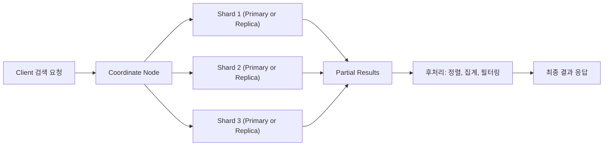
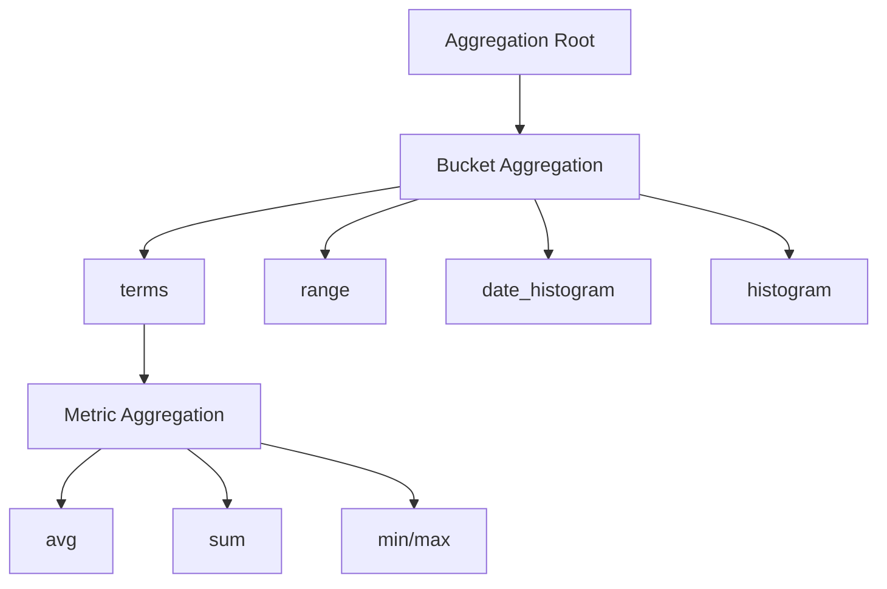

# Elasticsearch의 Search & Aggregation

>**📄 Abstract**    
>이 정리본은 Elasticsearch의 검색 및 집계 기능에 대한 핵심 개념과 사용법을 체계적으로 다루며, 특히 비전공자를 위한 실용적 이해에 중점을 두고 구성되었다. 검색 요청의 흐름, Query DSL의 문맥별 구분(Query vs Filter), 다양한 쿼리 유형(match, term, bool, nested 등), 정렬 및 페이징 방식, 그리고 실시간 데이터 분석을 위한 Aggregation 기능까지, Elasticsearch를 효과적으로 활용하기 위한 전 과정을 단계별로 설명한다.      
>이 정리본은 개념적 설명과 함께 JSON 예제, 오해 방지를 위한 주석, 실무 활용 팁 등을 포함하고 있어, 비전공자도 검색 엔진 및 데이터 분석 도구로서의 Elasticsearch를 이해하고 응용할 수 있는 기초 역량을 갖추는 데 도움을 준다. 정형 및 비정형 데이터를 대상으로 검색과 통계 분석을 병행하고자 하는 학습자에게 특히 유익하다.      

<br>

1\. Elasticsearch 검색 구조 이해
--------------------------

### 1.1 검색 요청 처리 흐름

Elasticsearch는 분산형 검색 엔진으로서, 데이터가 여러 노드와 샤드(Shard)에 분산되어 저장되어 있다. 이러한 구조는 데이터의 양이 많고 실시간 검색 요구가 높은 환경에서 확장성과 빠른 응답성을 보장하는 데 효과적이다.

클라이언트가 Elasticsearch에 검색 요청을 보내는 과정은 다음과 같은 순서로 이루어진다:

1.  **클라이언트 요청 전송**  
    클라이언트는 클러스터 내 임의의 노드에게 HTTP GET 또는 POST 요청을 보낸다. 이 요청은 특정 인덱스 또는 전체 인덱스를 대상으로 할 수 있으며, 검색 조건(Query DSL)이 포함된다.
    
2.  **Coordinate Node로 동작**  
    요청을 받은 노드는 자동으로 "Coordinate Node(조정 노드)" 역할을 수행한다. 이 노드는 쿼리를 이해하고, 이를 클러스터 내 검색 대상이 되는 모든 샤드(Primary 또는 Replica)에 전달하는 중계자 역할을 한다.
    
3.  **샤드별 검색 실행**  
    각 샤드는 로컬에 저장된 인덱스 조각에 대해 쿼리를 실행하고 결과를 생성한다. 이 과정은 병렬적으로 수행되므로, 검색 속도가 빠르게 유지된다.
    
4.  **검색 결과 취합 및 후처리**  
    Coordinate Node는 모든 샤드로부터 응답을 수신한 후, 이를 하나로 통합한다. 이때 정렬, 필터링, 페이지네이션, 스코어 정렬 등 후처리가 수행된다.
    
5.  **클라이언트에 최종 응답 전송**  
    최종적으로 후처리된 검색 결과가 클라이언트에게 반환된다.
    

📌 예시 흐름도:

```plaintext
Client → Node A (Coordinate Node)
      ├──> Shard 1 → Partial Result 1
      ├──> Shard 2 → Partial Result 2
      └──> Shard 3 → Partial Result 3
         ↓
     Aggregate, Sort, Filter at Node A
         ↓
       Final Result to Client
```

> 💡 **Coordinate Node는 특정 역할이 지정된 노드가 아니라, 요청을 받은 노드가 일시적으로 수행하는 역할이다.**

이러한 구조는 병렬 처리와 장애 대응 면에서 큰 이점을 제공한다. Replica Shard도 검색 요청에 활용될 수 있으므로, 일부 샤드에 장애가 발생해도 검색 서비스의 가용성이 유지된다.



<br>

### 1.2 멀티테넌시 검색 (Multi-tenancy)

Elasticsearch는 멀티테넌시를 지원하며, 이는 여러 서비스 또는 사용자 그룹이 동일한 클러스터 내에서 각기 다른 인덱스를 사용하는 구조를 의미한다. 다중 인덱스 검색은 아래와 같이 수행될 수 있다.

#### 예시:

```bash
GET /products,services/_search
{
  "query": {
    "match": {
      "name": "AI Speaker"
    }
  }
}
```

이 쿼리는 `products`와 `services`라는 두 인덱스에서 `"name"` 필드에 `"AI Speaker"`라는 텍스트가 포함된 문서를 검색한다.

> ⚠️ **주의점:** 멀티 인덱스 검색은 가능한 동일한 스키마를 사용하는 인덱스들 사이에서만 권장된다. 서로 다른 필드 구조를 가진 인덱스를 대상으로 검색할 경우, 필드 타입 충돌 또는 예기치 못한 검색 결과가 발생할 수 있다.

또한 `_source` 필드를 통해 검색 대상 필드를 제한할 수 있으며, 불필요한 필드를 제외함으로써 성능을 최적화할 수 있다.

#### 제한된 필드 검색 예시:

```json
"_source": ["name", "category"]
```

이와 같은 구조는 SaaS 환경이나 여러 부서가 공유하는 클러스터에서 유용하며, 하나의 시스템 내에서 효율적인 다중 사용자 검색을 가능하게 한다.

<br>
<br>

2\. 검색 방식 종류
------------

Elasticsearch에서는 두 가지 주요 검색 방식이 존재한다.  
하나는 간단한 요청 형태로 검색할 수 있는 \*\*URI 기반 검색(Query String Search)\*\*이고,  
다른 하나는 복잡한 조건이나 집계 등 고급 기능을 사용할 수 있는 \*\*Query DSL(JSON 기반 쿼리)\*\*이다.  
각 방식은 사용 목적, 유연성, 기능 범위 측면에서 차이를 가지므로 용도에 맞게 선택해야 한다.

<br>

### 2.1 URI 기반 검색 (Query String Search)

URI 검색은 RESTful API의 URL 경로 또는 쿼리 파라미터에 검색 조건을 문자열로 삽입하여 요청하는 방식이다. 단순하고 직관적이므로 테스트용이나 간단한 필터링 목적에 적합하다.

#### 예시 1: 검색어 `iPhone`이 포함된 문서를 검색

```bash
GET /products/_search?q=name:iPhone
```

#### 주요 특징

*   `GET` 방식으로 간단하게 검색이 가능함
    
*   파라미터를 통해 기본 필드 설정, 정렬, 페이지 조정 등이 가능
    
*   복잡한 논리 조합(AND, OR, 범위 등)에 한계가 있음
    
*   본문이 없는 요청이므로 검색 기능이 제한적임
    

#### 주요 파라미터

| 파라미터 | 설명 |
| --- | --- |
| `q` | 검색할 쿼리 조건 (`field:value`) |
| `df` | 기본 검색 필드 설정 (default field) |
| `analyzer` | 텍스트 분석기 설정 |
| `default_operator` | 여러 키워드 사이의 기본 논리 연산자 (AND / OR) |
| `_source` | 반환할 필드 설정 |
| `sort` | 정렬 기준 필드 지정 |
| `from`, `size` | 페이지네이션 설정 |

#### 예시 2: `category`가 `"smartphone"`이고, 가격이 높은 순 정렬

```bash
GET /products/_search?q=category:smartphone&sort=price:desc
```

> 💬 **주의:** URI 검색은 쿼리를 URL에 포함하므로 너무 긴 조건문은 HTTP 길이 제한에 걸릴 수 있다. 복잡한 쿼리에는 Query DSL을 사용하는 것이 권장된다.

<br>

### 2.2 Query DSL 기반 검색 (Domain Specific Language)

Query DSL은 Elasticsearch가 고안한 JSON 기반의 검색 언어로, 복잡하고 구조화된 조건을 자유롭게 기술할 수 있다. 거의 모든 Elasticsearch의 검색 기능은 이 DSL을 통해 수행된다.

#### 기본 구조 예시:

```json
GET /products/_search
{
  "query": {
    "match": {
      "name": "iPhone"
    }
  },
  "sort": [
    { "price": "desc" }
  ],
  "from": 0,
  "size": 10,
  "_source": ["name", "price"]
}
```

#### 핵심 필드 설명:

| 키워드 | 설명 |
| --- | --- |
| `query` | 검색 조건의 핵심 (match, term, bool 등으로 구성됨) |
| `from`, `size` | 검색 결과의 페이지 지정 |
| `sort` | 정렬 기준 지정 |
| `_source` | 응답에 포함할 필드 지정 |
| `aggs` | 집계 조건 지정 (Aggregation 항목에서 상세 설명) |
| `timeout` | 검색 제한 시간 설정 |

> 📝 **Tip:** Query DSL은 쿼리 문맥(Query Context)과 필터 문맥(Filter Context)을 명확히 구분하여 구성해야 하며, 이 구분은 검색 결과 스코어(score)에 영향을 미친다. 이후 항목에서 이를 더 자세히 설명할 예정이다.

#### 활용 예:

*   다양한 조건을 결합한 `bool query`
    
*   날짜나 가격 등의 `range query`
    
*   정규 표현식, 자동완성, 다중 필드 검색 등 고급 기능
    

<br>
<br>

3\. Query DSL 상세 쿼리 유형
----------------------

Elasticsearch의 Query DSL은 사용자의 검색 요구를 JSON 형식으로 표현하기 위한 도메인 특화 언어(Domain Specific Language)이다. Query DSL은 단순 텍스트 검색부터 복합적인 조건 결합, 필터링, 정렬, 페이징, 집계까지 다양한 기능을 모두 포괄한다.

DSL 쿼리는 크게 두 가지 문맥(Context)으로 나뉘는데, **Query Context**는 점수를 계산하는 검색용 쿼리이며, **Filter Context**는 조건에 해당하는지 여부만을 판단하는 필터링용 쿼리이다.

<br>

### 3.1 Query Context (검색 점수 기반 문맥)

Query Context는 쿼리 조건과 문서 간의 **유사도 점수(\_score)** 를 계산하여, 검색 결과를 **정렬하거나 중요도 순으로 나열**하는 데 사용된다. 텍스트 기반 검색이나 순위가 중요한 조건에는 반드시 이 문맥이 사용된다.

<br>

#### ① Match Query

Match Query는 가장 기본적인 전체 텍스트 검색 방식이다. 사용자가 입력한 텍스트를 해당 필드에 분석기를 적용하여 일치하는 문서를 찾는다.

```json
{
  "query": {
    "match": {
      "description": "wireless earphone"
    }
  }
}
```

*   텍스트는 분석(소문자화, 형태소 분리 등)을 거쳐 토큰화됨
    
*   `_score`는 토큰의 빈도, 희소성(TF-IDF), BM25에 따라 계산됨
    
*   필드의 `text` 타입과 함께 사용
    

<br>

#### ② Match Query with Operator

검색어가 여러 개일 경우 `operator`를 설정하여 AND 또는 OR 조건을 명시할 수 있다.

```json
{
  "query": {
    "match": {
      "description": {
        "query": "wireless earphone",
        "operator": "and"
      }
    }
  }
}
```

*   `"operator": "and"`는 두 단어가 모두 포함된 문서만 검색
    
*   `"operator": "or"`는 하나라도 포함되면 검색됨 (기본값)
    

<br>

#### ③ Match Phrase Query

입력한 문장이 **단어 순서까지 정확히 일치**해야 하는 경우 사용하는 쿼리이다.

```json
{
  "query": {
    "match_phrase": {
      "description": "wireless earphone"
    }
  }
}
```

*   "earphone wireless"는 일치하지 않음
    
*   자동완성이 아니라 순차적 연속 텍스트에 적합
    

<br>

#### ④ Match Phrase Prefix Query

**자동완성(Auto-Completion)** 형태의 검색에 활용되는 쿼리이다. 지정된 문장 접두사(prefix)에 일치하는 문서를 반환한다.

```json
{
  "query": {
    "match_phrase_prefix": {
      "description": "wireless ea"
    }
  }
}
```

*   `"wireless earphone"`, `"wireless earpiece"` 등으로 확장 가능
    
*   성능 이슈가 발생할 수 있으므로 제한적으로 사용 권장
    

<br>

#### ⑤ Multi Match Query

하나의 검색어를 여러 필드에 동시에 적용하고자 할 때 사용된다. 예를 들어 상품 이름, 설명, 제조사 등 복수 필드에서 검색하고 싶을 때 유용하다.

```json
{
  "query": {
    "multi_match": {
      "query": "Samsung",
      "fields": ["name", "brand", "description"]
    }
  }
}
```

**Multi Match Query 유형:**

| 유형 | 설명 |
| --- | --- |
| `best_fields` | 가장 높은 스코어 하나만 반영 (기본값) |
| `most_fields` | 모든 필드의 스코어 합산 |
| `cross_fields` | 여러 필드를 하나처럼 인식하여 토큰 일치 확인 |

```json
"multi_match": {
  "query": "Galaxy S24",
  "fields": ["name^2", "description"],
  "type": "cross_fields"
}
```

*   `^2`는 해당 필드의 중요도를 두 배로 부여함 (boosting)
    

<br>

#### ⑥ Query String Query

Lucene의 고급 쿼리 문법을 사용할 수 있는 방식으로, 하나의 문자열로 복잡한 조건을 조합할 수 있다.

```json
{
  "query": {
    "query_string": {
      "query": "brand:Samsung AND name:Galaxy*"
    }
  }
}
```

*   `*`는 와일드카드, `AND/OR/NOT` 논리 연산자 사용 가능
    
*   정규식, 범위, 필드 지정 검색도 가능하나, 구문 오류 위험이 있음
    

> ⚠️ **주의:** 사용자가 직접 입력하는 쿼리에 이 방식을 적용할 경우, 보안상 주의가 필요하다 (예: 쿼리 인젝션 가능성)

<br>

#### ⑦ Exists Query

특정 필드가 존재하는 문서만 검색할 때 사용한다. Elasticsearch는 문서마다 다른 필드를 가질 수 있기 때문에, 필드 존재 여부 자체가 중요한 조건이 될 수 있다.

```json
{
  "query": {
    "exists": {
      "field": "price"
    }
  }
}
```

<br>

#### ⑧ Boolean Query

여러 조건을 조합하여 복합적인 검색을 수행하는 가장 일반적인 방식이다.  
`must`, `must_not`, `should`, `filter` 등 다양한 조건 블록을 사용하여 쿼리를 구성한다.

```json
{
  "query": {
    "bool": {
      "must": [
        { "match": { "brand": "Samsung" }},
        { "range": { "price": { "lte": 1000 }}}
      ],
      "must_not": [
        { "match": { "name": "refurbished" }}
      ],
      "should": [
        { "match": { "description": "wireless" }}
      ]
    }
  }
}
```

*   `must`: 반드시 만족해야 할 조건 (AND)
    
*   `must_not`: 반드시 만족하지 않아야 할 조건 (NOT)
    
*   `should`: 만족 시 점수 상승 (OR-like)
    
*   `filter`: 점수 계산 없이 필터링 (Filter Context와 연결)
    

```mermaid
graph TD
    A[bool query]
    A --> B[must]
    A --> C[should]
    A --> D[must_not]
    A --> E[filter]

    B --> B1[조건 1: match]
    B --> B2[조건 2: range]
    
    C --> C1[조건 3: match (선택적)]
    D --> D1[조건 4: 제외할 match]
    E --> E1[조건 5: term (점수 계산 없음)]
```

<br>

3.2 Filter Context (조건 일치 기반 문맥)
--------------------------------

**Filter Context**는 문서가 특정 조건을 "만족하는지 여부"만 판단한다. 이때 각 문서의 유사도 점수(`_score`)는 계산되지 않는다. 따라서 **불필요한 점수 계산을 생략하여 성능을 높이는 데 매우 효과적**이다.

Filter Context는 다음과 같은 경우에 주로 사용된다:

*   날짜, 가격, 범위 등의 정렬/필터링 조건
    
*   권한이나 상태값, 태그 등 정확한 일치 여부 확인
    
*   Boolean Query의 `filter` 절 안에서 사용
    

> ⚠️ Filter는 `_score`를 계산하지 않으므로 정렬에 영향을 주지 않으며, 캐싱되어 반복 검색에서 매우 빠른 성능을 제공한다.

<br>

### ① Term Query

**정확한 값**을 기준으로 문서를 필터링한다. 검색 대상 텍스트는 분석되지 않으며, 색인된 형태 그대로 매칭이 이루어진다. SQL의 `WHERE field = value`와 유사한 역할이다.

```json
{
  "query": {
    "term": {
      "category.keyword": "smartphone"
    }
  }
}
```

*   `.keyword` 필드는 분석되지 않은 원형 텍스트 필드
    
*   주로 상태값, 코드, 태그, 고유값 등에 사용
    
*   점수 계산 없음 → 빠름
    

<br>

### ② Terms Query

`term` 쿼리의 확장형으로, **여러 개의 값 중 하나라도 일치하면** 문서를 반환한다. SQL의 `IN` 절과 동일하다.

```json
{
  "query": {
    "terms": {
      "brand.keyword": ["Samsung", "Apple", "LG"]
    }
  }
}
```

*   텍스트, 숫자 등 다양한 타입의 배열 입력 가능
    
*   자주 사용되는 조건이므로 캐싱 효과 높음
    

<br>

### ③ Range Query

범위 조건(이상, 이하, 초과, 미만 등)에 해당하는 값을 가지는 문서를 필터링한다. SQL의 `BETWEEN`, `>=`, `<=` 조건과 유사하다.

```json
{
  "query": {
    "range": {
      "price": {
        "gte": 500,
        "lte": 1000
      }
    }
  }
}
```

*   사용 가능한 연산자:
    
    *   `gte`: greater than or equal (≥)
        
    *   `lte`: less than or equal (≤)
        
    *   `gt`: greater than (>)
        
    *   `lt`: less than (<)
        
*   날짜 형식(`yyyy-MM-dd`)도 지원됨
    

```json
{
  "range": {
    "created_at": {
      "gte": "2024-01-01",
      "lt": "2024-04-01"
    }
  }
}
```

> 💡 성능 측면에서 범위 조건은 Term보다 느리지만, Filter Context 내에서 캐싱되어 효율적이다.

<br>

### ④ Nested Query

Elasticsearch는 문서를 색인할 때 내부의 중첩 구조(nested objects)를 평탄화(flatten)하여 저장한다. 이 때문에 **배열 내부의 객체들 간 필드 관계**가 끊어지는 문제가 발생한다.

이를 해결하기 위해 `nested` 타입과 `nested query`를 함께 사용하여, 배열 내부의 각 객체를 별도의 문서처럼 다루는 방식으로 검색 정확성을 유지할 수 있다.

#### 예시 데이터 구조:

```json
{
  "name": "Laptop X",
  "specs": [
    { "type": "RAM", "value": "16GB" },
    { "type": "SSD", "value": "512GB" }
  ]
}
```

#### 잘못된 일반 쿼리:

```json
{
  "query": {
    "bool": {
      "must": [
        { "match": { "specs.type": "RAM" }},
        { "match": { "specs.value": "512GB" }}
      ]
    }
  }
}
```

*   위 쿼리는 "RAM 512GB"라는 조합을 찾는 것이 아니라, `"RAM"`과 `"512GB"`가 **어떤 객체든 존재하면 OK**인 방식이다.
    

#### 올바른 Nested Query:

```json
{
  "query": {
    "nested": {
      "path": "specs",
      "query": {
        "bool": {
          "must": [
            { "match": { "specs.type": "RAM" }},
            { "match": { "specs.value": "16GB" }}
          ]
        }
      }
    }
  }
}
```

*   `path`는 nested 구조의 필드를 지정
    
*   해당 경로 내의 개별 객체 단위로 쿼리 조건을 매칭
    
*   관계 보존이 필요한 JSON 배열 구조에서 필수적으로 사용
    

<br>

### ⑤ Nested vs Object Query 차이점 요약

| 구분 | Object Field | Nested Field |
| --- | --- | --- |
| 저장 방식 | 평탄화(flatten) | 독립된 문서처럼 저장 |
| 필드 간 관계 | 깨짐 | 보존됨 |
| 정확한 매칭 | 어려움 | 가능함 |
| 성능 | 빠름 | 느릴 수 있음 |

> ✅ 정리: JSON 배열 내부의 각 객체 간 "필드 조합"을 정확히 검색해야 할 경우에는 반드시 `nested` 타입과 쿼리를 활용해야 한다.

<br>
<br>

4\. 검색 결과 제어
------------

Elasticsearch는 검색된 문서들의 결과를 단순히 반환하는 데 그치지 않고, 사용자의 목적에 따라 **정렬, 페이징, 필드 필터링** 등 다양한 방식으로 결과를 제어할 수 있도록 지원한다. 이 기능은 REST API 기반의 서비스나 검색 엔진 구축 시 필수적인 구성 요소로 간주된다.

<br>

### 4.1 정렬 (Sorting)

Elasticsearch는 기본적으로 **문서의 검색 점수(`_score`)** 를 기준으로 결과를 정렬한다. `_score`는 문서가 검색 조건과 얼마나 유사한지를 나타내는 점수로, BM25 또는 TF-IDF 등의 알고리즘을 기반으로 계산된다.

#### 기본 정렬: `_score` 기준

```json
{
  "query": {
    "match": { "description": "smartwatch" }
  }
}
```

*   `_score`가 높은 문서일수록 검색어와의 유사도가 높아 상위에 배치됨
    

#### 필드 기준 정렬 예시: `price` 오름차순

```json
{
  "query": {
    "match": { "category": "smartwatch" }
  },
  "sort": [
    { "price": "asc" }
  ]
}
```

#### 복수 기준 정렬

```json
"sort": [
  { "price": "asc" },
  { "created_at": "desc" }
]
```

*   가격이 낮은 순 정렬 후, 같은 가격끼리는 최근 생성일 순으로 정렬
    

> ⚠️ 문자열 필드를 기준으로 정렬할 경우에는 `.keyword`와 같은 정렬 가능한 타입으로 접근해야 한다. 예: `"brand.keyword"`.

<br>

### 4.2 페이징 처리 (Pagination)

Elasticsearch는 기본적으로 10개의 문서를 반환한다. 더 많은 결과를 페이지 단위로 조회하려면 `from`과 `size` 파라미터를 사용하여 페이징을 구현할 수 있다.

#### 예시: 2페이지(11~20번 문서) 조회

```json
{
  "query": {
    "match_all": {}
  },
  "from": 10,
  "size": 10
}
```

*   `from`: 시작 오프셋 (0부터 시작)
    
*   `size`: 가져올 문서 수
    

#### 페이징 고려사항

*   대규모 데이터셋에서 `from` 값이 너무 클 경우 성능 저하가 발생할 수 있음
    
*   스크롤(Scroll) 또는 `search_after`를 통한 커서 기반 페이지네이션이 대안
    

> 💡 실시간 검색에서 페이지 번호가 커질수록 정확한 정렬과 페이징이 어려워질 수 있다. 커서 기반 페이지네이션이 추천되는 이유이다.

<br>

### 4.3 결과 필드 제어: `_source`

Elasticsearch 문서에는 매우 많은 필드가 포함될 수 있으므로, 불필요한 데이터를 제거하고 특정 필드만 선택하여 응답 크기를 줄일 수 있다. 이를 위해 `_source` 필드를 이용한다.

#### 예시: `name`, `price` 필드만 반환

```json
{
  "_source": ["name", "price"],
  "query": {
    "match": { "category": "smartphone" }
  }
}
```

*   응답 결과는 지정한 필드만 포함하여 반환
    
*   대용량 시스템에서 응답 최적화에 매우 중요
    

<br>

정렬, 필드 필터링, 페이징은 사용자 인터페이스와 시스템 부하 모두에 영향을 미치는 요소로, 데이터 규모가 커질수록 더욱 정교하게 설계되어야 한다.

<br>
<br>

5\. Aggregation (집계)
--------------------

### 5.1 개요: Elasticsearch에서의 집계란?

**Aggregation**은 Elasticsearch에서 데이터를 집계하여 **통계 요약**, **그룹화**, **패턴 분석** 등을 수행하는 기능이다. SQL의 `GROUP BY`, `COUNT`, `SUM`, `AVG`와 유사한 역할을 하며, 검색 결과와 별도로 독립된 분석 결과를 반환할 수 있다.

Aggregation은 크게 다음 두 가지 유형으로 구분된다:

*   **Metric Aggregation**: 숫자 필드의 통계 값 계산
    
*   **Bucket Aggregation**: 문서 집합을 조건에 따라 그룹화
    

이 두 유형은 결합하여 **그룹별 통계**, **시간대별 평균값**, **조건별 최대값** 등의 다양한 복합 분석을 수행할 수 있다.



<br>

### 5.2 Metric Aggregation

Metric Aggregation은 수치형 필드에 대해 `합계`, `평균`, `최대`, `최소`, `통계 요약` 등을 계산하는 데 사용된다.

#### 예시 1: 전체 상품 가격 평균

```json
{
  "size": 0,
  "aggs": {
    "avg_price": {
      "avg": {
        "field": "price"
      }
    }
  }
}
```

*   `size: 0`은 검색 결과 문서를 반환하지 않고 **집계 결과만 조회**하겠다는 뜻
    
*   `avg`, `sum`, `min`, `max`, `value_count`, `stats` 등의 연산 지원
    

#### 예시 2: 복합 통계 요약(stats)

```json
{
  "aggs": {
    "price_stats": {
      "stats": {
        "field": "price"
      }
    }
  }
}
```

📌 출력값 예:

```json
{
  "count": 100,
  "min": 100.0,
  "max": 900.0,
  "avg": 455.2,
  "sum": 45520.0
}
```

<br>

### 5.3 Bucket Aggregation

Bucket Aggregation은 조건에 따라 문서를 여러 "버킷(bucket)"으로 나누는 기능으로, SQL의 `GROUP BY`와 가장 유사한 개념이다.

#### 유형 1: Terms Aggregation (카테고리 그룹화)

```json
{
  "aggs": {
    "by_category": {
      "terms": {
        "field": "category.keyword"
      }
    }
  }
}
```

*   결과: 각 카테고리별 문서 수 집계
    
*   `.keyword` 필드 사용 → 분석되지 않은 형태
    

#### 유형 2: Range Aggregation (범위 구간 집계)

```json
{
  "aggs": {
    "price_ranges": {
      "range": {
        "field": "price",
        "ranges": [
          { "to": 300 },
          { "from": 300, "to": 600 },
          { "from": 600 }
        ]
      }
    }
  }
}
```

*   결과: 가격대별 상품 수 집계
    
*   `to`, `from` 속성으로 범위 구간 지정
    

#### 유형 3: Histogram Aggregation (정수형 구간 집계)

```json
{
  "aggs": {
    "price_histogram": {
      "histogram": {
        "field": "price",
        "interval": 100
      }
    }
  }
}
```

*   `interval` 값마다 가격을 구간별로 나눠 집계
    
*   연속적인 수치 필드 분석에 적합
    

#### 유형 4: Date Histogram (날짜 기반 집계)

```json
{
  "aggs": {
    "sales_over_time": {
      "date_histogram": {
        "field": "created_at",
        "calendar_interval": "month"
      }
    }
  }
}
```

*   월별, 주별, 일별 등 시간 단위로 집계
    
*   시계열 분석, 트렌드 시각화에 자주 사용
    

<br>

### 5.4 집계와 필터의 결합

집계는 **검색 쿼리와 함께 실행**되어 특정 조건에 맞는 문서에 대해 수행할 수도 있고, `filter` 내부에 삽입하여 **조건별 집계**를 수행할 수도 있다.

#### 예시: 브랜드별 평균 가격 (Samsung에 한정)

```json
{
  "aggs": {
    "samsung_avg_price": {
      "filter": {
        "term": { "brand.keyword": "Samsung" }
      },
      "aggs": {
        "avg_price": {
          "avg": {
            "field": "price"
          }
        }
      }
    }
  }
}
```

*   외부 집계는 필터 역할, 내부 집계는 평균값 계산
    
*   `filter → aggs` 구조를 통해 조건별 분석 가능
    

<br>

### 5.5 Aggregation 활용 요약

| 기능 | DSL 키워드 | 사용 예 |
| --- | --- | --- |
| 평균 가격 계산 | `avg` | 상품 가격 분석 |
| 카테고리별 문서 수 | `terms` | 인기 상품군 분석 |
| 시간대별 판매 추이 | `date_histogram` | 트렌드 분석 |
| 가격대 구간별 개수 | `range` | 시장 세분화 분석 |
| 조건별 집계 | `filter + aggs` | 특정 브랜드만 분석 |

> 📊 **Aggregation은 Elasticsearch를 BI 도구처럼 사용할 수 있도록 만들어주는 핵심 기능**이다. Kibana와 함께 연계하여 대시보드 형태로 시각화되는 경우가 많다.


<br>
<br>

📘 코드 정리 ① : Elasticsearch 기본 Aggregation 쿼리
============================================

✅ \[1\] 브랜드별 문서 수 집계 (`terms` Bucket Aggregation)
-------------------------------------------------

```python
from elasticsearch import Elasticsearch

# Elasticsearch 서버에 연결
es = Elasticsearch("http://localhost:9200")

# 집계 쿼리: 브랜드별 문서 수를 계산
query = {
    "size": 0,  # 문서 자체는 출력하지 않고 집계 결과만 반환
    "aggs": {
        "by_brand": {
            "terms": {
                "field": "brand",  # 집계 기준 필드
                "size": 10         # 상위 10개의 브랜드만 반환
            }
        }
    }
}

response = es.search(index="products", body=query)

# 결과 출력
print("[브랜드별 문서 수]")
for bucket in response["aggregations"]["by_brand"]["buckets"]:
    print(f"- {bucket['key']}: {bucket['doc_count']}건")
```

### 🧠 설명

*   이 코드는 `brand` 필드를 기준으로 **상품이 몇 개씩 있는지 집계**하는 예제입니다.
    
*   `terms`는 SQL의 `GROUP BY`와 유사하며, **Bucket Aggregation**에 해당합니다.
    
*   `size: 0`은 “검색 결과 문서는 필요 없고, 집계 결과만 달라”는 의미입니다.
    

<br>

✅ \[2\] 가격 평균 계산 (`avg` Metric Aggregation)
-------------------------------------------

```python
query = {
    "size": 0,
    "aggs": {
        "average_price": {
            "avg": {
                "field": "price"  # 집계 대상: price 필드
            }
        }
    }
}

response = es.search(index="products", body=query)

avg_price = response["aggregations"]["average_price"]["value"]
print(f"[평균 가격] {avg_price:.2f}")
```

### 🧠 설명

*   이 쿼리는 전체 상품의 `price` 필드 값을 평균내는 **Metric Aggregation**입니다.
    
*   `avg` 키워드는 SQL의 `AVG(price)`와 같은 역할을 합니다.
    
*   결과는 `response["aggregations"]["average_price"]["value"]`에서 추출합니다.
    

<br>

✅ \[3\] 조건부 가격 통계 (`stats` + `term` 쿼리)
---------------------------------------

```python
query = {
    "size": 0,
    "query": {
        "term": {
            "brand": "Samsung"  # 삼성 제품만 필터링
        }
    },
    "aggs": {
        "price_stats": {
            "stats": {
                "field": "price"
            }
        }
    }
}

response = es.search(index="products", body=query)

stats = response["aggregations"]["price_stats"]
print("[Samsung 제품 가격 통계]")
print(f" - count : {stats['count']}")
print(f" - min   : {stats['min']}")
print(f" - max   : {stats['max']}")
print(f" - avg   : {stats['avg']:.2f}")
print(f" - sum   : {stats['sum']}")
```

### 🧠 설명

*   `"brand": "Samsung"` 조건을 만족하는 문서만 대상으로 가격 통계를 계산합니다.
    
*   `stats`는 한 번에 평균, 최솟값, 최댓값, 합계, 개수까지 계산해주는 **복합 집계 함수**입니다.
    
*   `term` 쿼리는 필터 역할을 하며, SQL에서 `WHERE brand = 'Samsung'`에 해당합니다.
    

<br>
<br>


📘 코드 정리 ② : 검색 조건(Query DSL)과 필터링
==================================

✅ \[4\] `bool.must`를 활용한 복합 검색
------------------------------

(브랜드가 Samsung이고 설명에 AI 포함)

```python
query = {
    "_source": ["name", "brand", "description"],
    "query": {
        "bool": {
            "must": [
                { "match": { "brand": "Samsung" } },
                { "match": { "description": "AI" } }
            ]
        }
    }
}

response = es.search(index="products", body=query)

print("[검색 결과] 브랜드가 'Samsung'이고 description에 'AI'가 포함된 문서:")
for hit in response["hits"]["hits"]:
    doc = hit["_source"]
    print(f"- {doc['name']} ({doc['brand']}) : {doc['description']}")
```

### 🧠 설명

*   `bool.must`는 AND 조건처럼 **모든 조건을 동시에 만족하는 문서**만 반환합니다.
    
*   `match`는 분석된 텍스트를 기준으로 유사한 단어도 검색됩니다.
    

<br>

✅ \[5\] `bool.must_not`을 활용한 제외 검색
----------------------------------

(Apple 브랜드가 아닌 문서 조회)

```python
query = {
    "_source": ["name", "brand", "description"],
    "query": {
        "bool": {
            "must_not": [
                { "match": { "brand": "Apple" } }
            ]
        }
    }
}

response = es.search(index="products", body=query)

print("[검색 결과] 브랜드가 'Apple'이 아닌 문서들:")
for i, hit in enumerate(response["hits"]["hits"]):
    doc = hit["_source"]
    print(f" [{i+1}]- {doc['name']} ({doc['brand']}) : {doc['description']}")
```

### 🧠 설명

*   `must_not`은 **주어진 조건을 만족하는 문서를 제외**합니다.
    
*   SQL의 `WHERE brand != 'Apple'`과 유사한 기능입니다.
    

<br>

✅ \[6\] `exists` 쿼리를 활용한 필드 존재 여부 필터
------------------------------------

(description 필드가 있는 문서만 반환)

```python
query = {
    "_source": ["name", "category"],
    "query": {
        "exists": {
            "field": "description"
        }
    }
}

response = es.search(index="products", body=query)

print("[검색 결과] description 필드가 존재하는 문서:")
for hit in response["hits"]["hits"]:
    print(hit["_source"])
```

### 🧠 설명

*   `exists`는 지정한 필드가 문서에 존재하는지를 확인합니다.
    
*   필드가 **누락된 문서(= 결측값)** 를 제외하고 검색할 때 사용합니다.
    

<br>

✅ \[7\] 단일 필드 검색 – `match` 쿼리 예시
--------------------------------

(brand가 Samsung인 문서 검색)

```python
query = {
    "query": {
        "match": {
            "brand": "Samsung"
        }
    }
}

res = es.search(index="products", body=query)

print("[검색 결과] brand가 'Samsung'인 문서:")
for hit in res["hits"]["hits"]:
    print(hit["_source"])
```

### 🧠 설명

*   `match`는 가장 일반적인 텍스트 검색 방식입니다.
    
*   대소문자 구분 없이 분석된 텍스트를 기반으로 유사 단어도 매칭합니다.
    

<br>

✅ \[8\] 다중 값 필터 – `terms` 쿼리
----------------------------

(브랜드가 Samsung 또는 Apple인 문서 검색)

```python
query = {
    "_source": ["name", "brand"],
    "query": {
        "terms": {
            "brand": ["Samsung", "Apple"]
        }
    }
}

res = es.search(index="products", body=query)

print("[검색 결과] Samsung 또는 Apple 브랜드:")
for hit in res["hits"]["hits"]:
    print(hit["_source"])
```

### 🧠 설명

*   `terms`는 SQL의 `IN` 조건처럼 여러 값을 동시에 조건으로 줄 수 있습니다.
    
*   빠른 필터링에 적합하며 `_score`는 계산되지 않습니다 (Filter Context).
    

<br>

✅ \[9\] `bool.must` + `terms` + `range` 복합 필터링
----------------------------------------------

(브랜드가 Samsung 또는 Sony이고 가격은 2000~3000 사이)

```python
query = {
    "_source": ["product_id", "name", "brand", "price"],
    "query": {
        "bool": {
            "must": [
                {
                    "terms": {
                        "brand": ["Samsung", "Sony"]
                    }
                },
                {
                    "range": {
                        "price": {
                            "gte": 2000,
                            "lte": 3000
                        }
                    }
                }
            ]
        }
    }
}

res = es.search(index="products", body=query)

print("[검색 결과] Samsung 또는 Sony 이면서 가격이 2000~3000 사이:")
for hit in res["hits"]["hits"]:
    print(hit["_source"])
```

### 🧠 설명

*   `range`는 숫자 필드에 대해 범위 검색을 수행합니다. (SQL의 `BETWEEN`)
    
*   `bool.must`로 두 조건을 AND 조합하며, 둘 다 만족해야 문서가 검색됩니다.
    

<br>
<br>


📘 코드 정리 ③ : 고급 검색 쿼리 (문장 검색, 다중 필드, 중첩 필드)
===========================================

✅ \[10\] `match` + `operator: "AND"`
------------------------------------

(모든 단어가 포함되어야 검색됨)

```python
query = {
    "_source": ["product_id", "name", "brand"],
    "query": {
        "match": {
            "name": {
                "query": "Samsung Neo",
                "operator": "AND"
            }
        }
    }
}
```

### 🧠 설명

*   `"Samsung"`과 `"Neo"` 두 단어 **모두** `name` 필드에 포함되어야 검색됩니다.
    
*   `operator: "OR"`(기본값)인 경우 하나만 포함되어도 검색됨.
    

<br>

✅ \[11\] `match_phrase`
-----------------------

(입력된 단어가 **순서대로 연속**되어야 검색됨)

```python
query = {
    "_source": ["product_id", "name", "brand"],
    "query": {
        "match_phrase": {
            "name": "Samsung Neo"
        }
    }
}
```

### 🧠 설명

*   `"Samsung Neo"`라는 **정확한 구문**이 문서 내에 있어야 검색됩니다.
    
*   `"Neo Samsung"`이나 `"Samsung Smart Neo"`는 제외됩니다.
    

<br>

✅ \[12\] `match_phrase_prefix`
------------------------------

(자동완성 형태의 **접두어 검색**)

```python
query = {
    "_source": ["product_id", "name", "brand"],
    "query": {
        "match_phrase_prefix": {
            "name": "Samsung N"
        }
    }
}
```

### 🧠 설명

*   `"Samsung Neo QLED"`처럼 `"Samsung N..."`으로 시작하는 구문을 검색.
    
*   검색창 자동완성 기능 구현 시 활용.
    

<br>

✅ \[13\] `multi_match` - `best_fields`
--------------------------------------

(여러 필드 중 가장 잘 맞는 하나의 필드만 기준)

```python
query = {
    "_source": ["product_id", "name", "brand", "description"],
    "query": {
        "multi_match": {
            "query": "Samsung",
            "fields": ["name", "description"],
            "type": "best_fields",
            "operator": "or"
        }
    }
}
```

### 🧠 설명

*   `name`, `description` 중 어느 필드든 `"Samsung"`이 잘 맞는 한 곳 기준으로 검색.
    
*   가장 유사한 하나의 필드를 기준으로 스코어를 산정.
    

<br>

✅ \[14\] `multi_match` - `most_fields`
--------------------------------------

(여러 필드에서 **일치한 횟수**를 합산하여 스코어 증가)

```python
"type": "most_fields"
```

### 🧠 설명

*   `"Samsung"`이 여러 필드에 동시에 나타날수록 스코어가 높아짐.
    
*   정보가 다수 필드에 중복될 때 가중치 증가 효과.
    

<br>

✅ \[15\] `multi_match` - `cross_fields`
---------------------------------------

(모든 필드를 하나처럼 묶어 문장처럼 검색)

```python
"type": "cross_fields", "operator": "and"
```

### 🧠 설명

*   `"Samsung Ultra"`처럼 한 단어는 `name`, 다른 단어는 `description`에 있어도 검색됨.
    
*   여러 필드를 하나의 통합 필드처럼 간주.
    

<br>

✅ \[16\] `nested` 쿼리 (단일 조건)
----------------------------

```python
"nested": {
    "path": "features",
    "query": {
        "term": {
            "features.feature_name": "Camera"
        }
    }
}
```

### 🧠 설명

*   `features` 배열 안에 `"feature_name": "Camera"`인 항목이 있는지를 검사.
    
*   중첩 객체 안에 특정 필드 존재 여부 확인.
    

<br>

✅ \[17\] `nested + bool.must` 복합 조건
-----------------------------------

```python
"must": [
    { "term": { "features.feature_name": "RAM" }},
    { "term": { "features.feature_value": "16GB" }}
]
```

### 🧠 설명

*   하나의 배열 객체 안에 `"RAM"`과 `"16GB"`라는 두 조건이 동시에 있는지 검사.
    
*   **동일 객체 안의 필드 관계를 보장**.
    

<br>

✅ \[18\] nested 없이 bool.must만 사용 시 문제
-------------------------------------

```python
"bool": {
    "must": [
        { "term": { "features.feature_name": "RAM" }},
        { "term": { "features.feature_value": "16GB" }}
    ]
}
```

### 🧠 설명

*   위 쿼리는 `"RAM"`과 `"16GB"`가 **다른 객체에 있어도 검색됨** (관계가 깨짐).
    
*   중첩 구조를 고려하지 않아 **정확하지 않은 결과**를 초래.
    

<br>

✅ \[19\] `sort` 쿼리
------------------

```python
"sort": [
    {
        "price": {
            "order": "desc"
        }
    }
]
```

### 🧠 설명

*   `price` 필드를 기준으로 내림차순 정렬.
    
*   SQL의 `ORDER BY price DESC`와 유사한 동작.
    

<br>

✅ \[20\] `query_string` 쿼리
--------------------------

```python
"query_string": {
    "query": "name:Apple"
}
```

### 🧠 설명

*   Lucene 문법을 활용해 `"name"` 필드에 `"Apple"`이 포함된 문서를 검색.
    
*   정규식, 범위, 논리 연산자 등 다양한 표현을 문자열로 사용 가능.
    

<br>
<br>

📘 코드 정리 ④ : 전체 요약
==================

| 기능           | 쿼리 종류             | 설명                     |
| -------------- | --------------------- | ------------------------ |
| 문서 수 집계   | terms agg             | 브랜드별 문서 개수       |
| 평균 계산      | avg agg               | 전체 평균 가격           |
| 조건 통계      | stats + filter        | 삼성 제품 가격 통계      |
| 다중 조건 검색 | bool.must             | 두 조건 모두 만족        |
| 조건 제외      | bool.must\_not        | Apple 제외               |
| 필드 존재 여부 | exists                | description 있는 문서만  |
| 텍스트 검색    | match                 | 텍스트 기반 유사 검색    |
| 다중 값 검색   | terms                 | 여러 값 중 일치하면 반환 |
| 범위 검색      | range                 | 가격 조건 필터링         |
| 정렬           | sort                  | 필드 기준 오름/내림차순  |
| 정밀 문장 검색 | match\_phrase         | 단어 순서와 거리 고려    |
| 자동완성 검색  | match\_phrase\_prefix | 접두사 검색              |
| 다중 필드 검색 | multi\_match          | 여러 필드 동시 검색      |
| 중첩 필드 검색 | nested                | 배열 내 객체 관계 유지   |
| 고급 쿼리      | query\_string         | Lucene 문법 기반         |