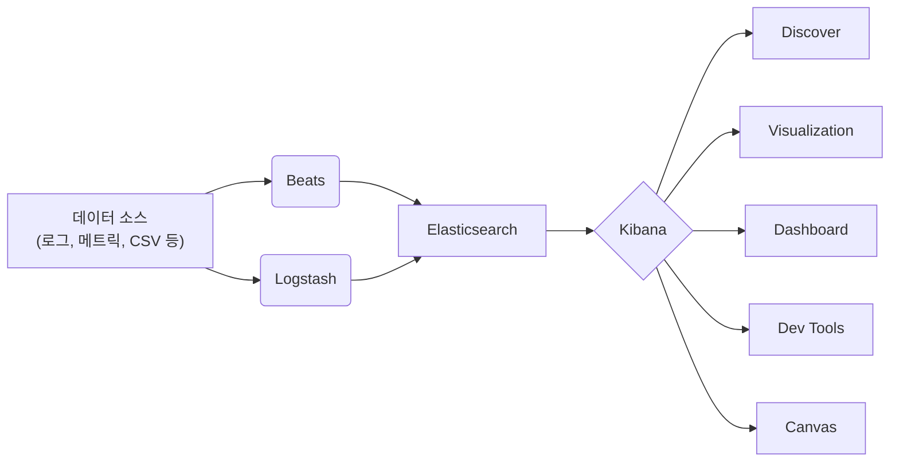
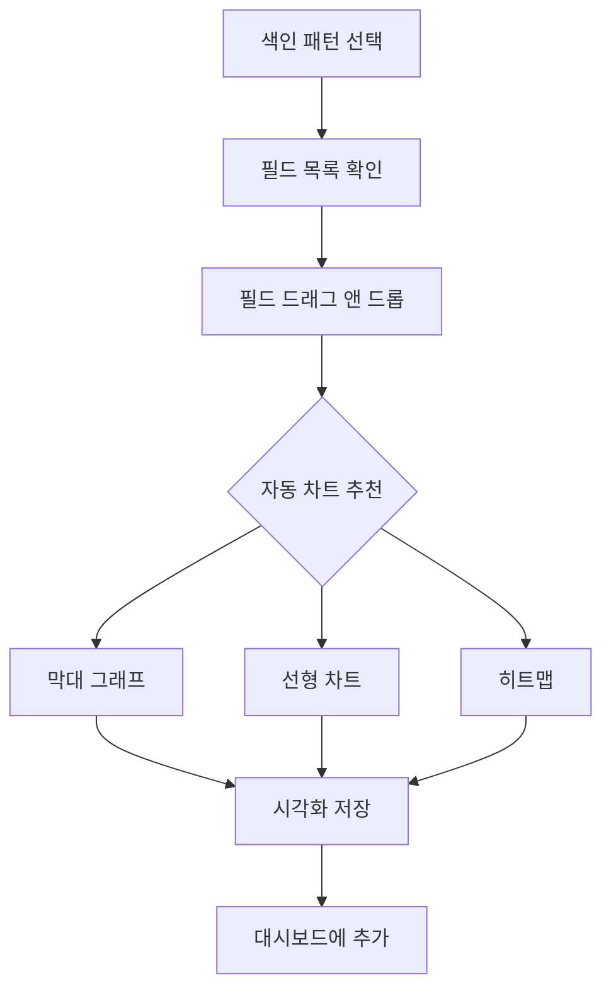
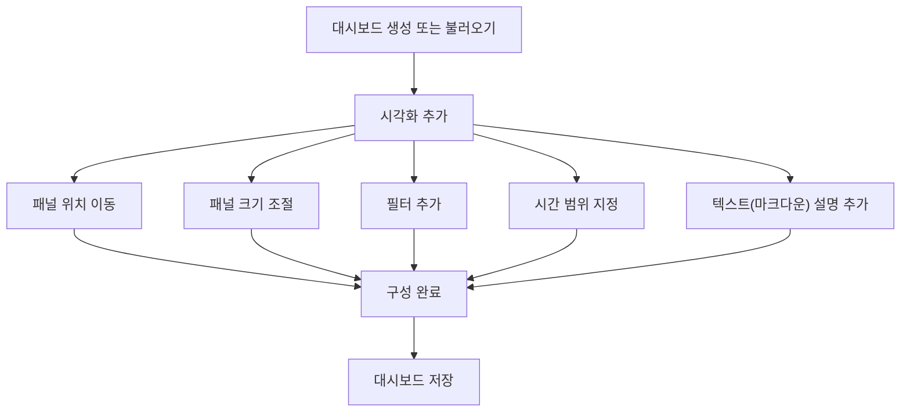
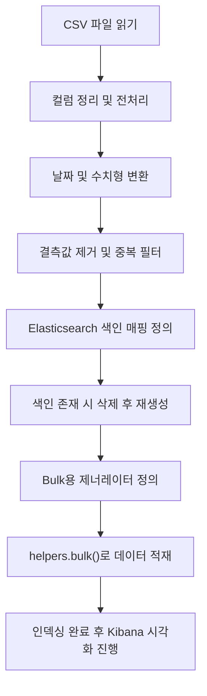

# Kibana를 통한 시각화와 모니터링

>**📄 Abstract**      

>이 정리본은 Kibana를 중심으로 Elastic Stack의 전체 구조와 데이터를 수집·저장·시각화하는 전 과정을 비전공자도 명확히 이해할 수 있도록 구성되었다. Elasticsearch, Logstash, Beats, Kibana 간의 역할 분담부터 Dev Tools 활용, KQL 질의 작성, 시각화 생성, 대시보드 구축, Canvas를 활용한 고급 표현까지 단계별로 실습 흐름에 맞춰 정리하였으며, 특히 CSV 데이터를 직접 적재하고 시각화하는 실습 예제를 통해 이론과 실제의 연계성을 강화하였다.     
>이 정리본은 데이터 분석이나 실시간 모니터링 업무에 입문하고자 하는 학습자에게 매우 유용하다. 복잡한 기술 개념을 단계별로 해설하고, 각 기능의 실질적 쓰임과 오해하기 쉬운 지점을 명확히 짚어줌으로써, 비전공자도 Elastic Stack 기반의 데이터 분석 환경을 직접 구성하고 응용할 수 있도록 돕는다.         

<br>

1\. Elastic Stack 개요와 Kibana의 역할
--------------------------------

### 1-1\. Elastic Stack이란?

Elastic Stack은 구조화되지 않은 대량의 로그, 이벤트, 메트릭 데이터를 실시간으로 수집하고, 저장하며, 분석하고 시각화할 수 있도록 구성된 오픈소스 기반의 데이터 플랫폼이다. 기존에는 ELK Stack(Elasticsearch, Logstash, Kibana)이라는 이름으로 널리 알려졌으나, 이후 Beats라는 데이터 수집 도구가 포함되며 Elastic Stack이라는 용어가 공식적으로 사용되고 있다.

#### 핵심 구성 요소:

*   **Elasticsearch**: 분산형 검색 및 분석 엔진으로, 수집된 데이터를 색인화하여 고속의 질의(query) 및 분석이 가능하게 한다. 단순 검색뿐 아니라 집계(aggregation), 필터링, 정렬 등 다양한 분석 기능을 제공한다.
    
*   **Logstash**: 수많은 소스에서 데이터를 수집한 후, 필터링 및 변환 과정을 거쳐 Elasticsearch에 전달하는 데이터 처리 파이프라인이다.
    
*   **Beats**: 로그, 시스템 지표, 네트워크 트래픽 등 다양한 데이터를 경량 클라이언트 형태로 수집하는 도구 모음이다. 대표적으로 Filebeat, Metricbeat 등이 있다.
    
*   **Kibana**: Elasticsearch에 저장된 데이터를 시각적으로 탐색하고 분석하며, 대시보드를 생성할 수 있는 웹 기반 인터페이스다.
    

> 📝 주석:  
> Elastic Stack은 전통적인 RDBMS와 달리 스키마리스(schema-less) 구조와 분산 저장 방식을 채택하여 대규모 데이터 처리에 강점을 가진다.



> *   `Beats`와 `Logstash`는 데이터 수집 도구로, 서로 다른 방식으로 Elasticsearch에 데이터를 전달합니다.
>     
> *   `Elasticsearch`는 저장과 분석을 담당하며, `Kibana`는 이 데이터를 사용자 친화적으로 표현합니다.
>     
> *   `Kibana` 내부 기능은 다양하지만 모두 Elasticsearch와 연결되어 동작합니다.


<br>

### 1-2\. Kibana 소개

Kibana는 Elastic Stack의 사용자 인터페이스(UI) 역할을 담당하는 웹 애플리케이션으로, Elasticsearch에 저장된 데이터를 조회, 분석, 시각화하는 데 최적화되어 있다. 단순한 차트 작성 도구를 넘어, 실시간 대시보드 구성, 사용자 정의 보고서 생성, 인터랙티브 시각화, 모니터링 기능까지 포함한다.

#### 주요 기능 개요:

*   **데이터 탐색**(Discover): Elasticsearch에 색인된(raw) 데이터를 테이블 및 필터 기반으로 탐색 가능
    
*   **시각화 생성**(Visualization): 다양한 형태(막대, 선, 파이, 테이블 등)의 그래프를 구성하여 시각화
    
*   **대시보드 구성**(Dashboard): 여러 시각화 결과를 한 화면에 배치해 통합 분석 가능
    
*   **개발자 도구**(Dev Tools): RESTful API 기반의 Elasticsearch 명령어를 직접 실행할 수 있는 콘솔
    
*   **캔버스(Canvas)**: 시각적 요소와 그래픽 디자인을 접목시킨 프레젠테이션 제작 기능
    

Kibana는 단순히 데이터를 시각화하는 도구가 아니라, 분석 과정 전체를 직관적으로 구성할 수 있도록 하는 **데이터 인터랙션 플랫폼**으로서 기능한다.

> 📌 예시:  
> 운영팀이 서버 로그를 실시간으로 모니터링하고자 할 때, Logstash 또는 Beats를 통해 수집된 로그 데이터를 Elasticsearch에 저장한 후, Kibana 대시보드를 통해 시간대별 에러 발생 패턴을 시각화함으로써 문제 지점을 신속히 식별할 수 있다.

<br>
<br>

2\. Kibana 기본 사용법 및 인터페이스 이해
----------------------------

### 2-1\. Kibana 홈 화면

Kibana를 처음 실행하면 접하게 되는 홈 화면은 사용자에게 다양한 기능에 대한 진입점을 제공한다. 이 화면에서는 샘플 데이터를 불러오거나, 새로운 데이터 소스를 연결하고, 기존에 구성한 대시보드나 시각화 항목에 접근할 수 있다.

#### 홈 화면 주요 구성:

*   **Add Data**: 외부 데이터 파일(CSV 등)이나 애플리케이션 로그를 Kibana에 연결하는 기능
    
*   **Sample Data**: 실습용으로 제공되는 샘플 데이터 세트를 이용해 시각화 기능을 테스트할 수 있음
    
*   **Recently viewed**: 최근에 접근한 대시보드, 시각화 등을 바로 복귀할 수 있는 섹션
    

> 📝 주석:  
> 처음 Kibana를 사용하는 사용자라면 샘플 데이터를 추가하여 전체 기능을 탐색하는 것이 학습에 효과적이다. Kibana는 기본적으로 Elasticsearch 색인(index) 정보를 기반으로 작동하므로, 데이터 연결 후 색인 설정이 선행되어야 한다.

<br>

### 2-2\. Dev Tools (개발자 도구)

Dev Tools는 Kibana 내에서 Elasticsearch의 REST API를 직접 테스트할 수 있는 콘솔 환경이다. JSON 기반의 쿼리를 직접 작성하고 즉시 응답을 받을 수 있으므로, 데이터 구조를 파악하거나 색인 상태를 점검하는 데 매우 유용하다.

#### 주요 기능:

*   **Console**: REST API를 직접 입력하고 결과를 확인
    
*   **Auto-complete**: 명령어 자동 완성 및 문법 하이라이팅 지원
    
*   **즉시 실행**: `GET`, `POST`, `PUT`, `DELETE` 등의 HTTP 메서드 사용 가능
    

#### 예제:

```http
GET /_cat/indices?v
```

→ 현재 존재하는 색인 목록과 상태를 출력함

```http
POST /products/_doc
{
  "name": "Wireless Keyboard",
  "price": 49.99
}
```

→ `products`라는 색인에 새 문서를 삽입하는 예시

> 📝 주석:  
> Console에서는 Kibana 인터페이스를 거치지 않고도 Elasticsearch와 직접 통신이 가능하므로, 고급 사용자나 관리자에게 특히 유용한 도구이다.

<br>

### 2-3\. KQL (Kibana Query Language)

KQL은 Kibana에서 제공하는 자체 쿼리 언어로, Elasticsearch에 저장된 문서들에 대해 조건 검색을 수행할 수 있도록 설계되어 있다. SQL과 유사하지만, 문법이 훨씬 간결하고 직관적이며 사용자 친화적인 검색 경험을 제공한다.

#### 주요 문법 요소:

*   **필드 검색**: `status:200` → `status` 필드가 `200`인 문서 검색
    
*   **Boolean 연산자**: `status:200 AND extension:"jpg"` → 두 조건을 모두 만족하는 문서 검색
    
*   **범위 검색**: `price >= 100 AND price <= 500`
    

#### 사용 예시:

```kql
category: "electronics" AND price > 100
```

→ 전자제품 범주 중 가격이 100을 초과하는 항목 검색

> 📌 개념 설명:  
> KQL은 Elasticsearch 쿼리 DSL보다 학습 난이도가 낮아, 비전공자도 쉽게 시도해볼 수 있는 질의 도구이다. 다만, 고급 집계(aggregation)나 스크립트 기반 조건에는 제한이 있다.

<br>
<br>


3\. Kibana 데이터 시각화 실습 흐름
------------------------

### 3-1\. 데이터 추가 및 확인

Kibana에서 시각화를 수행하려면 먼저 Elasticsearch에 색인된(indexed) 데이터가 존재해야 한다. 데이터는 다음과 같은 방법을 통해 추가할 수 있다:

#### 데이터 추가 방법:

*   **애플리케이션 연동**: Beats 또는 Logstash를 이용하여 서버 로그, 시스템 지표 등을 실시간 수집
    
*   **CSV 파일 업로드**: 웹 인터페이스를 통해 정적 데이터 파일 업로드 가능
    
*   **샘플 데이터 활용**: Kibana에서 제공하는 eCommerce, weblogs 등의 샘플 데이터로 실습 가능
    

데이터가 Elasticsearch에 저장되면 Kibana는 자동으로 색인 패턴(Index Pattern)을 생성하거나 사용자가 직접 패턴을 지정할 수 있다. 이 색인 패턴은 시각화의 데이터 스키마 역할을 하며, 필드 목록, 데이터 타입 등을 기반으로 분석이 가능하다.

> 📝 주석:  
> 색인 패턴 생성 시 날짜 기반 필드(timestamp 등)를 지정하면, 시간 필터링 기능이 활성화되어 시간 흐름 기반 시각화가 가능해진다.

<br>

### 3-2\. 데이터 탐색

데이터 탐색 기능은 Kibana의 ‘Discover’ 탭에서 제공된다. 이 기능은 데이터의 전체 구조를 확인하고, 쿼리를 통해 원하는 서브셋을 추출하며, 시각화 전 단계에서 유용한 탐색 도구로 활용된다.

#### 주요 기능:

*   필드별 데이터 목록 조회
    
*   실시간 검색 및 필터 적용
    
*   문서 상세 보기(JSON 포맷)
    
*   테이블 기반 결과 정렬 및 내보내기 (CSV)
    

#### 예시 사용 시나리오:

*   `status_code: 500` → 에러 응답을 반환한 요청만 필터링
    
*   `@timestamp >= "now-1d/d"` → 최근 1일간의 데이터만 조회
    

> 📌 오해 방지 설명:  
> Discover는 시각화 도구가 아니라 **탐색 도구**이며, 직접 그래프를 그리는 기능은 없다. 대신 데이터를 직관적으로 탐색하여 이후 시각화에 사용할 필드를 파악하는 데 적합하다.

<br>

### 3-3\. 시각화 구성 (Visualization)

시각화 기능은 Kibana의 가장 핵심적인 기능으로, Elasticsearch에 저장된 데이터를 차트, 그래프, 표 등 다양한 형태로 표현할 수 있도록 한다. Kibana는 시각화 방식에 따라 여러 편집기를 제공하며, 최근에는 사용성이 향상된 **Lens 인터페이스**가 기본 도구로 채택되고 있다.

#### Lens 인터페이스 주요 구성:

*   **색인 패턴 선택**: 분석 대상 데이터셋 선택
    
*   **필드 목록**: 좌측에 필드명이 나열되며, 각 필드의 데이터 타입(숫자, 키워드, 날짜 등)도 함께 표시
    
*   **드래그 앤 드롭**: 필드를 중심 패널로 끌어오면 자동으로 적절한 시각화가 생성됨
    
*   **레이어 추가**: 복수의 조건이나 기준을 병렬로 시각화 가능
    

#### 시각화 예시:

*   `x축: 날짜, y축: 판매량` → 선형 시계열 차트
    
*   `x축: 상품 분류, y축: 평균 판매가` → 막대 그래프
    

> 📝 주석:  
> Lens는 데이터에 따라 적절한 차트 형태를 자동 추천하지만, 사용자가 필요 시 직접 변경 가능하다. 이는 시각화의 유연성과 사용자 정의성을 동시에 확보한다.



> *   사용자는 데이터셋(Index pattern)을 선택한 후, 원하는 필드를 드래그하여 시각화를 구성합니다.
>     
> *   Kibana는 데이터 타입을 기반으로 적절한 시각화 유형을 추천하며, 사용자는 이를 저장하고 대시보드에 추가할 수 있습니다.

<br>
<br>

4\. Kibana 대시보드 구성 및 활용
-----------------------

### 4-1\. 대시보드 생성 및 저장

Kibana 대시보드는 여러 개의 시각화 결과를 하나의 인터페이스에 통합하여 표시할 수 있는 화면이다. 이를 통해 다양한 관점의 지표를 한눈에 확인할 수 있으며, 운영 상황의 실시간 모니터링이나 경영 지표 대시보드로 응용이 가능하다.

#### 대시보드 생성 절차:

1.  **Visualization 생성**: 먼저 Lens 또는 다른 시각화 도구를 이용하여 원하는 시각화를 만든다.
    
2.  **Save and return**: 생성한 시각화를 저장하고 대시보드로 복귀
    
3.  **Add to dashboard**: 새 시각화를 기존 대시보드에 추가하거나, 새로운 대시보드를 생성하여 추가 가능
    

#### 예시:

*   판매 현황, 사용자 수, 에러 발생률 등 다양한 시각화를 한 화면에 배치하여 모니터링
    

> 📝 주석:  
> 저장된 대시보드는 Kibana 내에서 이름과 설명을 붙여 관리되며, 필요 시 공유 링크를 통해 외부 사용자에게 제공할 수 있다.

<br>

### 4-2\. 대시보드 편집

대시보드는 고정된 구조가 아니라 사용자 정의에 따라 자유롭게 배치하고 수정할 수 있다. Kibana는 마우스 기반의 인터랙션을 제공하여 다음과 같은 편집 작업이 가능하다:

#### 주요 편집 기능:

*   **패널 이동 및 크기 조절**: 마우스로 드래그하여 위치 이동 및 가로/세로 크기 조절
    
*   **텍스트 블록 추가**: 마크다운(Markdown)을 지원하는 텍스트 편집기를 통해 설명, 제목, 주석 등을 삽입 가능
    
*   **필터 추가**: 특정 조건(예: 지역, 시간 범위, 제품군 등)에 따라 전체 시각화를 동적으로 필터링
    

> 📌 개념 보충:  
> 대시보드 내에 여러 시각화가 있더라도, **동일한 시간 범위 및 필터 조건**이 전체 패널에 일괄 적용되므로 실시간 상황 비교에 유용하다.




> *   대시보드 편집 과정은 반복적이며, 각 편집 작업은 독립적으로 수행 가능하므로 병렬 노드로 표현됩니다.
>     
> *   사용자는 자유롭게 패널을 배치하고, 다양한 구성 요소를 조합하여 대시보드를 완성한 뒤 저장합니다.

<br>

### 4-3\. 대시보드 재사용과 공유

Kibana에서는 시각화 결과와 대시보드를 효율적으로 재사용할 수 있는 여러 기능을 제공한다. 동일한 시각화를 다양한 대시보드에 공유하거나, 특정 대시보드 구성을 복제(clone)하여 다른 분석 목적에 맞게 수정할 수 있다.

#### 공유 및 재사용 방법:

*   **시각화 라이브러리 사용**: 개별 시각화 결과는 Kibana에 저장되며, 여러 대시보드에서 동일한 시각화를 불러올 수 있음
    
*   **대시보드 링크 공유**: 특정 시간 범위 및 필터 조건을 포함한 URL 생성 가능
    
*   **PDF 또는 PNG 내보내기**: 보고서용 정적 이미지로 대시보드 출력 가능
    

> 📝 주석:  
> 대시보드를 조직 내 협업 도구로 활용할 경우, 사용자별 권한 설정(읽기/쓰기)을 통해 데이터 보안 및 무결성을 유지할 수 있다.

<br>
<br>


5\. Kibana를 활용한 모니터링 실습
-----------------------

### 5-1\. 실시간 데이터 흐름 확인

Kibana는 단순한 정적 분석 도구가 아닌, 실시간 데이터 흐름을 모니터링할 수 있는 기능도 탑재하고 있다. 이를 통해 서버 상태, 사용자 활동, 트래픽 변화 등의 지표를 실시간으로 감지하고 대응할 수 있다.

#### 활용 예시:

*   시스템 관리자: 에러 로그의 실시간 발생 추이 확인
    
*   운영팀: 상품 주문 건수의 실시간 변화 감시
    
*   보안 담당자: 로그인 실패 기록의 급증 탐지
    

#### 핵심 기능:

*   **자동 새로고침(Refresh)**: 대시보드에서 일정 시간 간격(예: 5초, 1분 등)으로 데이터를 자동 갱신
    
*   **시간 필터(Time Picker)**: 최근 15분, 1시간, 오늘 등 다양한 시간 범위를 실시간으로 설정 가능
    
*   **필터 기반 추적**: 조건부 필터를 통해 관심 이벤트에 집중
    

> 📝 주석:  
> 실시간성을 보장하기 위해 Elasticsearch 색인은 timestamp 기반으로 구성되어야 하며, 색인 생성 시 날짜 필드를 반드시 명시해야 한다.

<br>

### 5-2\. Canvas를 활용한 프레젠테이션

Canvas는 Kibana에서 제공하는 고급 대시보드 기능으로, 시각적으로 정제된 프레젠테이션 화면을 구성할 수 있도록 설계되었다. 일반 대시보드가 표준화된 레이아웃을 따르는 반면, Canvas는 사용자가 픽셀 단위로 시각 요소를 배치할 수 있는 디자인 중심 도구이다.

#### Canvas 주요 특징:

*   **픽셀 기반 배치**: 패널, 텍스트, 이미지 등 구성 요소를 자유롭게 위치 조정
    
*   **라이브 데이터 연동**: 실시간 Elasticsearch 쿼리 결과를 기반으로 시각 요소에 자동 반영
    
*   **표현력 강화**: 배경, 아이콘, 색상, 애니메이션 등 시각적 표현 기능 제공
    
*   **Markdown 지원**: 텍스트 설명, 주석, 데이터 요약 등을 마크다운 형식으로 삽입 가능
    

#### 활용 시나리오:

*   마케팅 대시보드: 실시간 방문자 수, 전환율, 클릭률 등 주요 지표 시각화
    
*   운영 상태 보고서: 시스템 상태, 오류 발생 비율, 리소스 사용량 등을 하나의 슬라이드처럼 표현
    

> 📌 개념 정리:  
> Canvas는 분석 결과를 **보고서나 프레젠테이션 용도로 활용**할 때 유리하며, UI 자유도가 높아 사용자의 디자인 감각이 시각적 전달력을 크게 좌우한다.

```mermaid
flowchart TD
  A[Canvas 워크패드 생성] --> B[데이터 쿼리 작성]
  B --> C[텍스트 요소 추가]
  B --> D[차트 요소 추가]
  B --> E[이미지/아이콘 추가]
  C --> F[스타일링(폰트, 색상 등)]
  D --> F
  E --> F
  F --> G[슬라이드별 배치 조정]
  G --> H[Canvas 저장 및 공유]
```

> *   Canvas는 단일 대시보드가 아닌 “워크패드”라는 슬라이드 기반 구조를 가짐
>     
> *   시각 요소, 텍스트, 이미지 등을 조합하고 스타일을 조정하여 완성도 높은 리포트 화면을 만들 수 있음

<br>
<br>

6\. 실습 예제: CSV 파일을 통한 데이터 적재 및 시각화
----------------------------------

### 6-1\. CSV 데이터 Elasticsearch에 업로드

Kibana와 Elasticsearch를 활용한 데이터 분석의 첫 단계는 원시 데이터를 Elasticsearch에 적재하는 것이다. 이 실습에서는 일반적으로 사용되는 **CSV(Comma-Separated Values)** 파일을 활용하여 데이터를 색인화(indexing)한다.

#### 데이터 적재 방법:

1.  **CSV 파일 준비**: 컬럼은 헤더를 포함하고, 인코딩은 `UTF-8`로 저장할 것
    
2.  **Kibana 데이터 업로드 메뉴 활용**:
    
    *   Kibana 홈 화면의 “Add Data” → “Upload file” 선택
        
    *   CSV 파일을 드래그 앤 드롭하여 업로드
        
    *   Kibana가 CSV의 컬럼을 자동 인식하고, 각 필드의 데이터 타입을 추론함
        
3.  **색인 이름 지정**:
    
    *   예: `sales-data`, `transaction-logs`
        
4.  **타임 필드 선택 (선택사항)**:
    
    *   날짜 기반 컬럼이 있는 경우, 시간 필드를 지정해야 Discover 및 대시보드에서 시간 필터링이 가능
        

> 📝 주석:  
> CSV 데이터 업로드는 Kibana 내부적으로 `file_data_visualizer` 기능을 통해 실행되며, 분석 가능한 색인을 자동 생성한다. 단, 이 방식은 대용량에는 부적합하며, 대규모 데이터의 경우 Logstash 또는 Filebeat 활용을 권장한다.

<br>

### 6-2\. Kibana에서 색인 확인 및 시각화 진행

CSV 파일을 업로드한 후, Kibana의 Discover, Lens, Dashboard 기능을 이용하여 분석과 시각화를 진행할 수 있다.

#### 색인 확인 절차:

1.  **Management → Index Patterns** 메뉴로 이동
    
2.  자동 생성된 색인 확인 (`sales-data`, `product_data` 등)
    
3.  필드 목록에서 각 필드의 데이터 타입(문자열, 숫자, 날짜 등)을 검토
    

#### 데이터 탐색:

*   Discover 탭을 통해 업로드된 데이터가 정상적으로 수집되었는지 확인
    
*   필터 및 정렬 기능을 통해 데이터 이상 유무 점검
    

#### 시각화 실습 예시:

*   **분류별 판매량 비교 (막대 그래프)**:
    
    *   x축: `category`
        
    *   y축: `sales_amount`
        
    *   집계: `sum`
        
*   **시간 흐름에 따른 주문 수 (시계열 차트)**:
    
    *   x축: `order_date`
        
    *   y축: 문서 수(`count`)
        
*   **상품별 평균 가격 분포 (히스토그램)**:
    
    *   x축: `price`
        
    *   집계: 평균
        

> 📌 실습 팁:  
> 시각화 생성 시 시간 필드가 존재하지 않으면 Kibana가 “No results found” 오류를 반환할 수 있다. 이 경우 시간 필터(`last 15 minutes`)를 전체 시간 범위(`last 5 years` 등)로 확장하면 해결된다.

<br>

### 정리 및 응용 방향

이 실습을 통해 사용자는 다음과 같은 전 과정을 학습하게 된다:

*   정형 데이터(CSV)의 구조 분석
    
*   Kibana를 통한 데이터 적재 및 색인 생성
    
*   Discover에서의 필드 탐색 및 전처리 검토
    
*   Lens 기반 시각화 구성
    
*   대시보드를 통한 통합 보고 화면 작성
    

이는 비즈니스 인사이트 도출, 운영 모니터링, 로그 분석 등 실제 데이터 기반 업무에서 광범위하게 응용될 수 있다.

<br>
<br>

📘 코드 정리: 공공 데이터(CSV)를 Elasticsearch에 적재하는 전체 파이프라인
===================================================

✅ 이 코드는 무슨 일을 하는가?
------------------

**공공 대기질 데이터(Air Quality)를 CSV 파일로부터 읽어와 전처리한 후, Elasticsearch에 색인(indexing)하여 분석이 가능하도록 준비하는 자동화 코드**입니다.  
Kibana에서 시각화하고 탐색하기 위한 전처리 및 데이터 적재 전 과정을 포함합니다.

<br>

📦 주요 라이브러리 설명
--------------

```python
import pandas as pd
import numpy as np
from elasticsearch import Elasticsearch, helpers
```

| 라이브러리      | 설명                                                          |
| --------------- | ------------------------------------------------------------- |
| `pandas`        | CSV 데이터를 읽고 가공할 수 있는 데이터 분석 라이브러리       |
| `numpy`         | 수치 계산과 배열 처리를 위한 라이브러리                       |
| `elasticsearch` | Elasticsearch 서버와 통신하기 위한 공식 클라이언트 라이브러리 |
| `helpers`       | 대량의 데이터를 효율적으로 적재하기 위한 유틸리티 함수 포함   |

<br>

🧱 1단계: Elasticsearch 연결 및 색인 매핑 정의
-----------------------------------

```python
es = Elasticsearch("http://localhost:9200")
```

*   **Elasticsearch 인스턴스와 연결**합니다.
    
*   기본 포트 `9200`은 로컬에서 실행 중인 서버 주소입니다.
    

```python
index_name = "air_quality"
```

*   적재할 색인의 이름을 지정합니다. (예: “air\_quality”)
    

```python
mapping = {
  "mappings": {
    "properties": {
      ...
      "Start_Date": { "type": "date", "format": "MM/dd/yyyy" },
      "@timestamp": { "type": "date" }
    }
  }
}
```

*   Elasticsearch에서 필드의 데이터 타입을 미리 선언합니다.
    
    *   `keyword`: 필터 조건에 사용되는 짧은 텍스트 (ex. 지역명)
        
    *   `text`: 분석(검색) 가능한 텍스트 필드
        
    *   `date`: 날짜 형식 필드
        
    *   `float`: 소수점 숫자
        

> 📝 왜 필요한가?  
> Kibana에서 시각화하려면 필드 타입이 정확해야 차트, 시간축, 필터가 제대로 작동합니다.

<br>

🔄 2단계: 기존 인덱스 초기화 및 생성
-----------------------

```python
if es.indices.exists(index=index_name):
    es.indices.delete(index=index_name)
es.indices.create(index=index_name, body=mapping)
```

*   같은 이름의 색인이 존재하면 **삭제하고 새로 생성**하여 이전 데이터가 영향을 주지 않도록 함
    

<br>

📥 3단계: CSV 파일 읽고 컬럼 정리
-----------------------

```python
df = pd.read_csv("./data/Air_Quality.csv")
df.columns = [col.strip().replace(" ", "_") for col in df.columns]
```

*   `read_csv()`로 CSV를 pandas DataFrame으로 불러옴
    
*   컬럼명에 공백이 있으면 Elasticsearch에서 인식이 어려우므로 `_`로 변경
    

<br>

📆 4단계: 날짜 및 수치형 데이터 처리
-----------------------

```python
df["Start_Date"] = pd.to_datetime(df["Start_Date"], errors="coerce").dt.strftime("%m/%d/%Y")
df["@timestamp"] = pd.to_datetime(df["Start_Date"], format="%m/%d/%Y", errors="coerce")
df["Data_Value"] = pd.to_numeric(df["Data_Value"], errors="coerce")
```

*   `Start_Date`: 문자열을 날짜 형식으로 바꾸고 지정 포맷에 맞춤
    
*   `@timestamp`: Kibana 시간 필터 기능을 위해 별도로 생성
    
*   `Data_Value`: 수치형(소수) 값으로 변환
    

> ⚠️ `errors="coerce"`를 쓰면 변환 불가능한 값은 NaN 처리 → 이후 제거

<br>

🧹 5단계: 잘못된 행 제거
----------------

```python
df = df[df["Unique_ID"] != "Unique ID"]  # 헤더 중복 제거
df = df.dropna(subset=["Start_Date", "Data_Value"])  # 필수 필드 없는 행 제거
```

*   파일에 중복 헤더가 있는 경우 필터링
    
*   필수 필드가 비어 있으면 Elasticsearch 색인 실패를 방지하기 위해 제거
    

<br>

📦 6단계: Bulk 적재용 제너레이터 함수 정의
----------------------------

```python
def doc_generator(df):
    for _, row in df.iterrows():
        doc = row.dropna().to_dict()
        yield {
            "_index": index_name,
            "_source": doc
        }
```

*   Elasticsearch는 문서를 한 개씩 삽입하면 매우 비효율적이므로,
    
*   **Bulk API**를 사용하여 수천 건을 한꺼번에 삽입하는 구조로 변경
    
*   각 행을 JSON으로 바꾸어 `_source`로 넣음
    

<br>

📤 7단계: Bulk API로 Elasticsearch에 데이터 적재
---------------------------------------

```python
try:
    helpers.bulk(es, doc_generator(df))
    print(f"{len(df)}건 인덱싱 완료")
except helpers.BulkIndexError as e:
    ...
```

*   `helpers.bulk()` 함수는 제너레이터가 반환하는 모든 문서를 한꺼번에 전송
    
*   실패한 항목은 오류 메시지로 확인 가능
    

<br>

📊 전체 흐름 요약도
------------



<br>

✅ 이 코드를 통해 학습할 수 있는 핵심 역량
-------------------------

| 항목                   | 설명                                      |
| ---------------------- | ----------------------------------------- |
| 데이터 전처리          | 공공 데이터에 포함된 이상치, 결측값 처리  |
| 날짜 포맷 처리         | Elasticsearch 요구 형식에 맞게 변환       |
| 매핑 설계              | Kibana 시각화를 위한 필드 정의            |
| Bulk 적재              | 대량 데이터 적재 시의 효율적 방법         |
| Elasticsearch-CSV 연결 | Logstash 없이 Python만으로 수집·색인 가능 |
